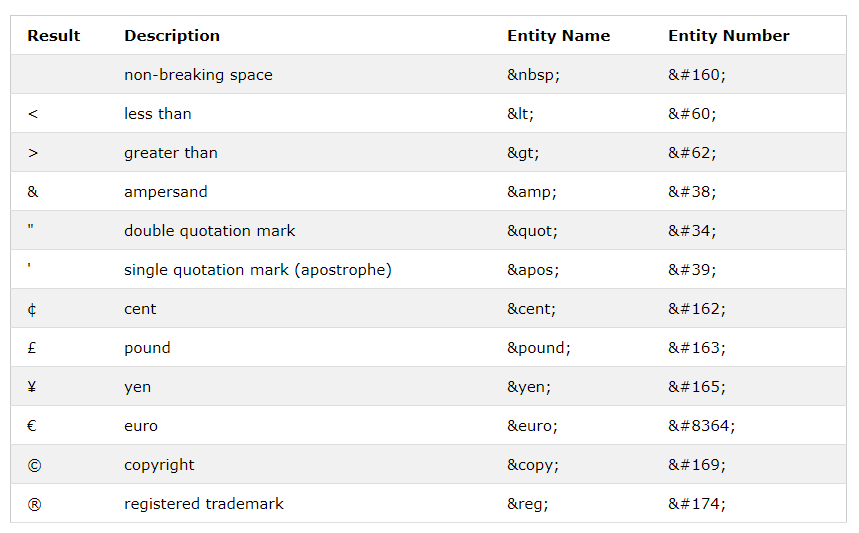

# HTML Entities escape/unescape하기

## 들어가며
HTML 코드가 들어가 있는 데이터를 문자열만 추출해야 할 상황이 생겼다. 정규식을 사용해서 어찌저찌 태그는 다 제거했는데 Html Entity로 표기된 특수문자는 그대로 남아있었다. 처음엔 `&nbsp;`만 공백으로 치환했다. 그런데 데이터를 더 확인해보니 자주 쓰이는 `&gt;`, `&lt;`, 그 외 `&숫자;`형식으로 된 처음 보는 Entity들이 가득했다. 일일히 replace하기를 포기하고... 구글링을 해본다. 

...역시 사람은 도구(?)를 사용해야 할 줄 안다고. 아파치와 스프링에서 관련 Util 클래스를 제공해주고 있었다.

## HTML Entity?
HTML에서 <는 태그의 시작을 의미한다. 만약 태그의 시작이 아닌 less then의 의미를 HTML에서 표현하려면 어떻게 해야 할까? `<`이 아니라 `&lt;`를 사용해야 한다. 

이렇듯 HTML 예약어를 기존에 사용하던 의미(<는 less then) 그대로 사용하기 위해 별도로 만든 문자셋을 Entity라고 한다. Entity의 형태는 `&엔티티이름;` 또는 `&엔티티숫자;`로 되어 있다.

아래는 자주 쓰이는 특수문자의 HTML Entity들이다.


### 1. 언제 사용하는가?
- 에디터가 Unicode를 지원하지 않을 때
- 키보드가 문자를 지원하지 않을 때
  - ex) copyright symbol(&copy;) , 오른쪽 화살표(&rarr;)
- `<`, `&`, `"`같은 HTML 관련 문자를 명시하기를 원할 때

### 2. 사용 시 장단점
- 장점 : Entity Name은 기억하기 쉽다. 
  - ex) `&nbsp;` : non-breaking space , `&lt;` : less than 
- 단점 : 브라우저가 모든 Entity Name을 지원하지는 않는다. Entity Number로는 지원해준다.

## StringEscapeUtils
- org.apache.commons.text
- escape/ unescape를 도와주는 유틸리티 클래스
  - HTML뿐만 아니라 Java, JavaScript, XML, CSV 등을 escape/unescape할 수 있다. 

> 참고 : [StringEscapeUtils](https://commons.apache.org/proper/commons-text/javadocs/api-release/org/apache/commons/text/StringEscapeUtils.html)


### 1. 의존성 추가

**build.gradle**
```java
dependencies {
	implementation group: 'org.apache.commons', name: 'commons-text', version: '1.9'
}
```
- 자바 유틸리티 클래스 패키지인 [Apache Commons Lang](https://mvnrepository.com/artifact/org.apache.commons/commons-lang3/3.11)을 추가해도 된다.

### 2. escapeHtml4(String) / unescapeHtml4(String) 예제
```java
class TestExample {
	
	@DisplayName("HTML Entity escape 👊")
	@Test
	void escape_test() {
		String example = "안녕하세요 저는 <홍길동>이라고 합니다. \"잘\" 부탁드립니다. © '";
		
		System.out.println("escape : " + StringEscapeUtils.escapeHtml4(example));
	}

	@DisplayName("HTML Entity unescape 👊")
	@Test
	void unescape_test() {
		String example = "TEST&amp;TEST : 안녕하세요 저는 &lt;홍길동&gt;이라고 합니다. &#34;잘&#34; 부탁드립니다. &copy; &#39; ";
		
		System.out.println("unescape : " + StringEscapeUtils.unescapeHtml4(example));
	}
}
```
**실행결과**
```
escape : 안녕하세요 저는 &lt;홍길동&gt;이라고 합니다. &quot;잘&quot; 부탁드립니다. &copy; '
unescape : TEST&TEST : 안녕하세요 저는 <홍길동>이라고 합니다. "잘" 부탁드립니다. © '
```

## HtmlUtils
- org.springframework.web.util
- HTML을 escape하기 위한 유틸리티 클래스
- Spring Framework에서 기본으로 제공해주는 util이기 때문에 별도로 의존성 추가를 안해줘도 된다.

> 참고 : [HtmlUtils](https://docs.spring.io/spring-framework/docs/current/javadoc-api/org/springframework/web/util/HtmlUtils.html)

## StringEscapeUtils와 HtmlUtils 비교
```java
class TestExample {

	@DisplayName("HTML Entity escape 👊")
	@Test
	void escape_test() {
		String example = "안녕하세요 저는 <홍길동>이라고 합니다. \"잘\" 부탁드립니다. © '";
		
		System.out.println("StringEscapeUtils : " + StringEscapeUtils.escapeHtml4(example));
		System.out.println("HtmlUtils : " + HtmlUtils.htmlEscape(example));
	
	}
	
	@DisplayName("HTML Entity unescape 👊")
	@Test
	void unescape_test() {
		String example = "TEST&amp;TEST : 안녕하세요 저는 &lt;홍길동&gt;이라고 합니다. &#34;잘&#34; 부탁드립니다. &copy; &#39; ";
		
		System.out.println("StringEscapeUtils : " + StringEscapeUtils.unescapeHtml4(example));
		
		System.out.println("HtmlUtils : " + HtmlUtils.htmlUnescape(example));
	}
}

```

```
StringEscapeUtils escape : 안녕하세요 저는 &lt;홍길동&gt;이라고 합니다. &quot;잘&quot; 부탁드립니다. &copy; '
HtmlUtils escape : 안녕하세요 저는 &lt;홍길동&gt;이라고 합니다. &quot;잘&quot; 부탁드립니다. &copy; &#39;

StringEscapeUtils unescape : TEST&TEST : 안녕하세요 저는 <홍길동>이라고 합니다. "잘" 부탁드립니다. © ' 
HtmlUtils unescape: TEST&TEST : 안녕하세요 저는 <홍길동>이라고 합니다. "잘" 부탁드립니다. © ' 
```

- `StringEscapeUtils`는 작은 따옴표(`'`)를 escape하지 못한다. `HtmlUtils`는 작은 따옴표(`'`)를 escape할 수 있다.
- Spring Framework를 쓰고 있고 단순히 HTML escape/unescape 용도면 바로 사용할 수 있는 `HtmlUtils`만으로도 충분하다고 생각한다.
- JavaScript, Java, XML 등등 다양한 escape/unescape 용도면 `StringEscapeUtils`를 사용한다.


# 참고자료
- [HTML Entities](https://www.w3schools.com/html/html_entities.asp)
- [StringEscapeUtils](https://commons.apache.org/proper/commons-text/javadocs/api-release/org/apache/commons/text/StringEscapeUtils.html)
- [HtmlUtils](https://docs.spring.io/spring-framework/docs/current/javadoc-api/org/springframework/web/util/HtmlUtils.html)
- [What are HTML entities?](https://www.educative.io/edpresso/what-are-html-entities)
