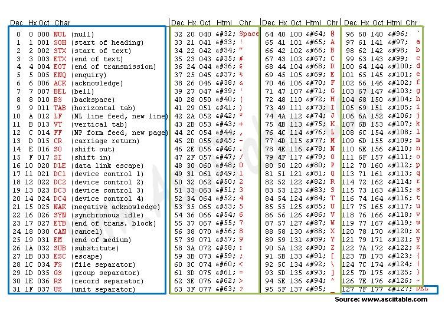
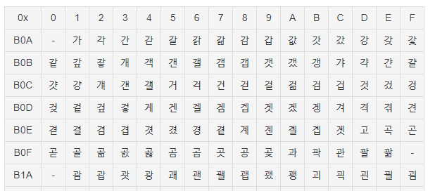
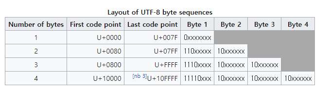

# 문자열 인코딩
- [문자열 인코딩](#문자열-인코딩)
  - [문자열 인코딩과 문자 집합](#문자열-인코딩과-문자-집합)
    - [정리](#정리)
  - [아스키코드(ASCII)](#아스키코드ascii)
    - [인코딩 순서](#인코딩-순서)
    - [숫자를 표현하는 방법](#숫자를-표현하는-방법)
  - [EUC-KR](#euc-kr)
    - [인코딩 순서](#인코딩-순서-1)
    - [완성형? 조합형?](#완성형-조합형)
  - [UTF-8](#utf-8)
    - [인코딩 순서](#인코딩-순서-2)
- [참고자료](#참고자료)

문자열 인코딩(character encoding)이란 **2진법을 사용하는 컴퓨터가 인간이 언어를 일정한 규칙에 따라 2진수로 변환하는 방식**을 말한다. 컴퓨터는 0과 1만 알기 때문에 '안녕하세요', 'Hello'라는 문자열을 이해할 수 없다 그래서 컴퓨터가 이해할 수 있는 2진수으로 해당 문자열을 변환하는 작업이 필요하다.  문자열 인코딩은 2진수와 문자가 일대일로 대응하는 규칙인 문자 집합(charset)을 통해 문자열을 2진수로 처리한다. 

## 문자열 인코딩과 문자 집합
UTF-8, UTF-16, EUC-KR, 유니코드, 아스키코드... 등등 여러가지 문자열 인코딩과 문자 집합이라는 개념을 쓰는데 이 두 개념이 헷갈릴 때가 많았다. 실제로도 이를 동의어 취급하기도 하고, 혼용해서 쓰는 경우가 많기에 더 구분이 애매했는데 정리하자면 다음과 같다.

- charset(문자 집합) : 사용할 수 있는 문자들의 집합
  - ex) 유니코드, ASCII. ISO-8899 등
- character encoding(문자열 인코딩) : 문자를 코드로 표현하는 방식
  - ex) UTF-8, UTF-16, EUC-KR 등

유니코드라는 charset을 표현하는 chracter encoding은 UTF-8, UTF-16, UTF-32가 있다.
EUC-KR(charcter encoding)은 KS X 1001과 KS X 1003라는 charset사용해서 문자를 인코딩한다.

> kS X 1001 : 한국 산업 규격으로 지정된 한국어 문자 집합.
> KS X 1003 : 한국 산업 규격으로 지정된 로마자 문자 집합. ASCII와 거의 동일하다.

### 정리
- 유니코드에 기반한 UTF-8 인코딩
- KS x 1001 코드에 기반한 EUC-KR 인코딩

## 아스키코드(ASCII)
ASCII(American Standard Code for Information Interchange)는 영문 알파벳을 사용하는 대표적인 문자열 인코딩 방식이다. 아스키코드는 33개 출력 불가능한 제어 문자들(파란 테두리)과 공백 포함 95개의 출력가능한 문자(녹색 테두리), 총 128개로 이루어진다. 대문자, 소문자, 아라비아 숫자, 공백 및 특수문자들이 포함되며 한글은 포함되지 않는다. 

### 인코딩 순서
아스키는 0 ~ 127까지 7비트 인코딩을 한다. 추가로 통신 에러 검출용인 패리티 비트, 1비트를 사용하여 한 문자를 표현하는데 총 1바이트(8비트)를 사용한다.

> [패리티 비트(Parity Bit)에 대한 설명](https://m.blog.naver.com/PostView.nhn?blogId=ansdbtls4067&logNo=220886661657&proxyReferer=https:%2F%2Fwww.google.com%2F)
> 참고: **패리티 비트는 현재 더 이상 쓰이지 않고 최상단 비트에 0을 붙인다.**

1. 코드표에서 문자 'A'는 10진수 `65`에 대응된다.
2. 65는 2진수로 `1000001`이다.
3. 최상단 비트에 0을 붙인다.
4. 문자 'A'의 인코딩 결과는 `0100 0001`이다. 
5. 따라서 아스키 코드는 문자 'A'를 표현하는데 1바이트를 사용한다.

### 숫자를 표현하는 방법
아스키코드에서 숫자 9은 10진수 9가 아닌 57에 대응된다. 컴퓨터는 숫자와 문자를 동시에 인식할 수 없기 때문이다. 

## EUC-KR
아스키코드의 단점은 영어 외의 다른 언어를 표현할 수 없다는 점이다. 각 나라에서 컴퓨터를 사용하기 시작했는데 언어를 컴퓨터가 이해하지 못하니, 독자적인 문자 집합과 인코딩 방식을 만들어 사용하기 시작했다. 한국의 경우 문자 집합은 KS(Korean Industrial Standard), 인코딩 방식은 EUC-KR을 사용해서 한글을 인코딩했다. 

EUC-KR은 **128보다 작은 바이트는 KS X 1003 문자 집합을 사용해서 인코딩**한다. KS x 1003은 KS로 지정된 로마자 문자 집합으로 ASCII에 기반한 7비트 문자 집합이다. 그래서 ASCII와 거의 동일하고 1바이트를 사용한다.

**128보다 큰 바이트는 KS X 1001의 문자집합을 사용해서 인코딩**한다. KS X 1001의 문자는 2바이트를 사용한다. 아래 코드표가 KS X 1001 문자집합이다.

 
### 인코딩 순서
가장 왼쪽에 있는 코드(B0A)를 기준으로 오른쪽으로 한 칸씩 이동할 때마다 1을 더한다.

1. 코드표에서 문자 '가'는 `B0A1`로 표현된다.
2. B0A1은 `0XB0`, `0XA1`으로 나뉜다.
3. 0XB0는 2진수로 `10110000`, 0XA1은 2진수로 `10100001`다. 
4. 따라서 EUC-KR은 문자 '가'를 표현하는데 2바이트(16비트)를 사용한다. 

### 완성형? 조합형?
EUC-KR은 완성형 인코딩 방식이다. KS X 1001 코드표를 보면 ㄱ,ㄴ,ㄷ가 아닌 가,각,간,갇 등 모든 글자가 완성된 형태로만 존재한다. 그렇다보니 초성, 중성, 종성을 조합해서 표현하는 한글을 모두 대응시킬 수가 없었다. (물론 이 단점은 마이크로소프트가 도입한 CP949으로 인해 해결되긴 했다.)

그래서 다음은 조합형 인코딩을 생각하게 되었다. 조합형은 자음과 모음을 초성, 중성, 종성으로 구분해 문자를 작성하는 방식을 말한다. 초성, 중성, 종성을 각각 코드표에 대응시키면 모든 한글을 표현할 수 있다. 하지만 이 방식은 인코딩, 디코딩하는 과정에서 처리 부담이 있다. 

유니코드는 조합형과 완성형 인코딩을 할 수 있는 문자집합을 제공한다. 초성, 중성, 종성을 표현하는 코드표(U+1100 - U+11FF)를 사용하면 조합형 인코딩을 할 수 있다. 하지만 유니코드가 2.0에 완성형 현대 한글 11,172자(U+AC00 ~ U+D7A3)을 수용한 이후, 한글 처리에는 이 범위에 배당된 문자가 사용된다. 즉, 현재는 완성형 인코딩 방식을 사용하며 조합형은 잘 사용하지 않는다고 한다.

> [CP949]((https://ko.wikipedia.org/wiki/%EC%BD%94%EB%93%9C_%ED%8E%98%EC%9D%B4%EC%A7%80_949)) : EUC-KR을 확장한 문자집합. 현대의 모든 한글을 표현할 수 있다.
> [한글 조합형 인코딩](https://ko.wikipedia.org/wiki/%ED%95%9C%EA%B8%80_%EC%A1%B0%ED%95%A9%ED%98%95_%EC%9D%B8%EC%BD%94%EB%94%A9) : 1980년대 초반부터 1990년대 중반까지 널리 사용되었다.
> [유니코드/UTF-8 변환 표](https://www.utf8-chartable.de/unicode-utf8-table.pl)

## UTF-8
EUC-KR과 같이 국가별로 독자적인 문자 집합과 인코딩 방식을 사용하면, 전 세계에서 볼 수 있는 웹 페이지를 만들 때 각 나라에 맞는 인코딩 방식을 사용해야 했다. 그래서 국제 표준화 기구(ISO)에서 동일한 규칙으로 모든 언어를 표현할 수 있는 유니코드라는 문자집합을 만들었다. 유니코드를 기반으로 한 인코딩 방식은 UTF-8, UTF-16. UTF-32가 있다. 

UTF-8은 Universal Coded Character Set + Transformation Format – 8-bit의 약자다. 유니코드 문자집합을 사용해서 8비트로 인코딩한다는 의미다. UTF-8 인코딩은 유니코드 한 문자를 나타내기 위해 1바이트에서 4바이트까지를 사용한다. 

- 바이트 수 행의 값은 문자를 표현하는데 사용하는 총 바이트를 뜻한다.
- 코드 포인트 범위에 따라 바이트 수가 달라진다.
- 'x'는 유니코드를 저장하는데 사용할 비트 영역이다.
### 인코딩 순서
1. 코드표에서 문자 '가'는 코드 포인트 `U+AC00`에 대응된다. 이는 바이트 수가 3인 코드 포인트 범위(U+0800 ~ U+FFFF)에 속한다.
2. 16진수 `AC00`을 2진수로 바꾸면 `1010110000000000`다. 
3. 위 비트들을 'x'자리에 차례로 넣는다. (1110xxxx 10xxxxxx 10xxxxxx) 
   1. 첫 번째 바이트에서 1110을 제외한 비트에 1010을 넣는다.
   2. 두 번째 바이트에서 10을 제외한 비트에 110000을 넣는다
   3. 세 번째 바이트에서 10을 제외한 비트에 000000을 넣는다.
4. `11101010 10110000 10000000`으로 인코딩된다.
5. 따라서 UTF-8은 문자 '가'를 표현하는데 3바이트를 사용한다.

# 참고자료
- [학교에서 알려주지 않는 17가지 실무 개발 기술](http://www.kyobobook.co.kr/product/detailViewKor.laf?mallGb=KOR&ejkGb=KOR&barcode=9791162242988)
- [아스키코드_나무위키](https://namu.wiki/w/%EC%95%84%EC%8A%A4%ED%82%A4%20%EC%BD%94%EB%93%9C)
- [아스키코드_위키피디아](https://ko.wikipedia.org/wiki/ASCII)
- [유니코드_나무위키](https://namu.wiki/w/%EC%9C%A0%EB%8B%88%EC%BD%94%EB%93%9C)
- [UTF-8_위키피디아](https://en.wikipedia.org/wiki/UTF-8)