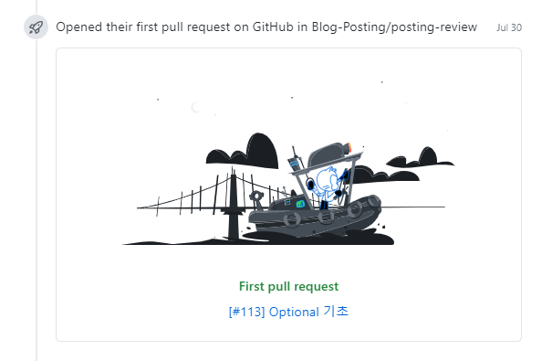
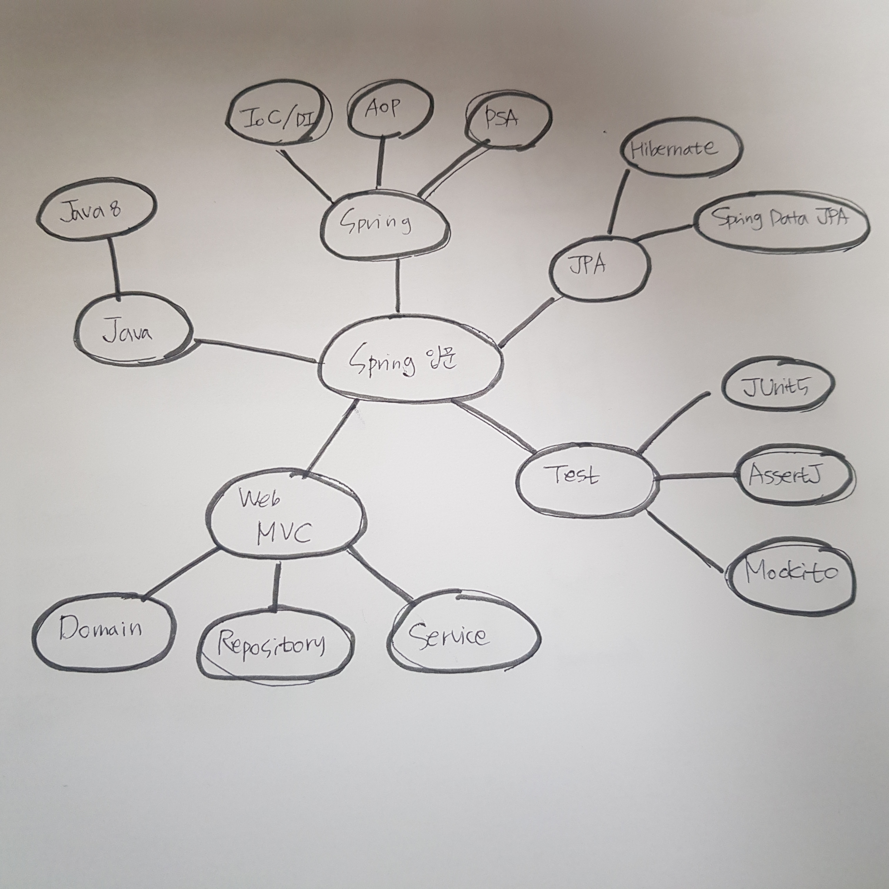

# 2020년 회고(를 가장한 일기)

회사에 입사한지 벌써 1년하고도 6개월이 지났다. 작년은 회사에 적응하기에 바빴다면, 올해는 부서이동을 하면서 앞으로 어떤 개발자가 되고 싶은가 탐색했던 한 해였다.

## 프론트엔드? 백엔드?
회사에서는 View는 jsp로 Controller와 Service는 Spring/Java로 개발했다. 하나의 기능이 있으면 화면부터 서버단까지 한 사람이 다 개발하는 방식이고, 요구사항이 변경되거나 추가되면 그 부분만 따로 개발했기 때문에 프론트엔드/백엔드의 담당이 따로 구분되어 있지 않았다. 

그러다 보니 어느 순간, 내 필살기(?)가 없다는 생각이 들었다. 얕은 지식만 늘어나는 느낌이랄까, js코드를 만지는데도 js를 아는걸까하는 불안감이 생겼다. 그래서 퇴근 후에도 책을 펼치게 되었다.

### js를 배워보자 : React.js, Node.js
당시 js코드를 많이 만졌기 때문에 javascript를 배워야겠다! 그럼, 프론트엔드쪽으로 가야지! 생각을 하고 배워보고 싶었던 React로 공부를 시작했다. 

- [ReactJS로 영화 웹 서비스 만들기](https://nomadcoders.co/react-fundamentals)
- [리액트를 다루는 기술](https://book.naver.com/bookdb/book_detail.nhn?bid=15372757)

코드를 따라치고 부족한 개념은 책을 보면서 공부했다. 공부 시간은 퇴근 후, 출근준비 1시간 전을 확보해서 만들었다. (당시 회사가 집에서 10분거리여서 가능했다) 

그렇게 나름대로 회사업무와 개인공부를 잘 분리하면서 생활하던 중, 드디어 첫 프로젝트에 투입되었다. 그리고 개인공부를 주말로 미뤘다(...) 코로나가 터진 후 그나마 하던 운동인 수영을 못하게 되었고, 1시간 출퇴근 거리와 업무 적응에 평일은 먹고 일하고 자고의 반복이였다. 당연히 개인공부는 뒷전이 되었고 체력은 바닥으로 떨어지고 있었다. 

그나마의 소득이라면 당시 풀스택을 개발하고 싶은 욕심에 들은 Node.js 강의 뿐이었다.

- [TDD로 배우는 Node.js API 서버](https://www.inflearn.com/course/%ED%85%8C%EC%8A%A4%ED%8A%B8%EC%A3%BC%EB%8F%84%EA%B0%9C%EB%B0%9C-tdd-nodejs-api)

### 상반기는 프론트와 함께
프로젝트에서 복귀하고 난 후, 상반기 마무리는 컨버팅 작업과 함께했다. UI가 개선되면서 기존에 쓰던 모듈의 CSS가 깨지고, jQuery 버전이 메이저 단위가 올라가면서 기존 패키지에서 쓰던 메서드를 못 쓰게 되었다. 이런 오류를 수정하면서...내가 생각보다 css를 모르는구나 알게 되었다. 아래 사이트를 참고하며 css에 대한 감을 익혔다.

- [poiemaweb](https://poiemaweb.com/)

### 두 번째 프로젝트
두 번째 프로젝트가 확정되었고, 바로 개발서버를 구축하라는..업무가 주어졌다. WAS, SVN, Jenkins를 쩔쩔매며 세팅했고 인프라도 공부해야겠구나..생각하게 되는 계기가 되었다. (일하면 할수록 공부할 것만 늘어나는 느낌) 그리고 이게 백엔드 개발자가 되기로 한 시작이 되었다.

원래 프로젝트에서 한 사람은 한 모듈을 담당함으로써 프론트엔드와 백엔드 구분 없이 다 개발한다. 하지만 나의 경우 데이터 이관이 주 업무가 되면서 화면단을 손 볼 일이 한 번도 없었다. 프로젝트 초반에는 퇴근 후 js를 짬짬이 봤지만 점차 java코드와 DB만 만지게 되면서 괴리감이 생겼다. 지금 하는 일도 100% 소화하지 못하는데 js는 봐서 뭐할까,라는 생각? 당연히 나에게 우선순위는 회사고, 그 다음이 개인공부다. 그래서 개인공부를 할지언정 업무와 너무 무관해서는 안되었다. 공부 방향을 java쪽으로 틀었다.

## 사람일은 아무도 모른다 : 백엔드 개발자의 길
두 번째 프로젝트를 들어가는 시점에 스터디를 들어갔다. 일주일 동안 공부한 내용을 마크다운으로 정리해서 발표하는 스터디였다. GitHub 레파지토리에 Issue로 주제를 등록하고 PR을 해야 제출완료인데... PR을 보내는 법을 몰랐다. 구글링을 해서 겨우 첫 포스팅을 올릴 수 있었다.

### Spring
스터디를 들어간 시기부터 Spring을 배우기 시작했다. 학원에서 Spring을 배웠을 때 복잡한 설정에 대한 기억 때문에 그 후에 따로 프로젝트를 만들지 않았다. 그런데 SpringBoot를 알고 난 후 정말 신세계를 본 거 같았다. 더 이상 Spring을 공부하지 않을 이유가 없었다. 

- [스프링 입문 - 코드로 배우는 스프링 부트, 웹 MVC, DB 접근 기술](https://www.inflearn.com/course/%EC%8A%A4%ED%94%84%EB%A7%81-%EC%9E%85%EB%AC%B8-%EC%8A%A4%ED%94%84%EB%A7%81%EB%B6%80%ED%8A%B8)

실습 위주의 강의기 때문에 스프링 초심자가 흥미를 잃지 않고 계속 공부할 수 있게 만드는 강의였다. 이 강의를 들은 후 생기는 궁금증을 정리해 공부 방향을 뻗어나갔다.

1. 일단 강의(또는 책)를 듣고 실습 코드를 모두 따라한다.
2. 모르는 개념은 강의 듣는 것에 지장을 안 줄 정도로만 이해한다.
3. 완강 후 모르는 개념에 대한 책, 강의, 레퍼런스를 찾아본다.
4. 3에서 강의를 듣는다면 또 모르는게 생긴다. 1번으로 돌아가 반복한다. 이 때는 완강해야 한다는 생각을 가지지 않는다.

Spring의 핵심기술인 IoC/DI, AOP, PSA를 익히는데 도움이 되었던 강의와 책이다.
- [예제로 배우는 스프링 입문(개정판)](https://www.inflearn.com/course/spring_revised_edition/dashboard)
- [토비의 스프링 3.1](https://book.naver.com/bookdb/book_detail.nhn?bid=7006516)

### JPA
스프링 입문 강의를 들은 후 더 확장된 웹을 개발하고 싶었다. 카페에서 공부하던 중 그 자리에서 김영한님의 웹 개발 1,2를 구입했다. 

- [실전! 스프링 부트와 JPA 활용1 - 웹 애플리케이션 개발](https://www.inflearn.com/course/%EC%8A%A4%ED%94%84%EB%A7%81%EB%B6%80%ED%8A%B8-JPA-%ED%99%9C%EC%9A%A9-1)
- [스프링 데이터 JPA](https://www.inflearn.com/course/%EC%8A%A4%ED%94%84%EB%A7%81-%EB%8D%B0%EC%9D%B4%ED%84%B0-jpa)
- [자바 ORM 표준 JPA 프로그래밍](https://book.naver.com/bookdb/book_detail.nhn?bid=9252528)

스프링 입문 강의에서 JPA를 입문한 나에게는 역시 강의를 따라가기엔 무리였다. 원래는 JPA를이 어느 정도 알아야 들을 수 있는 강의인데 일단 지르고 봤던 것이다. 당연히 JPA의 생명주기, 영속성 컨텍스트부터 추가 공부를 했다. 백기선님의 스프링 데이터 JPA(정작 스프링 데이터 JPA는 안듣고 JPA 개념을 설명해주시는 부분만 들었다), JPA하면 바이블처럼 가지고 있는 김영한님의 책을 읽었다. 강의 막판에 실습 코드 에러 + 테스트에 대한 관심 + 일 폭탄을 맞아서 중단되었는데 올 해가 끝나기 전에는 완강할 생각이다.

### Test
원래는 스프링 입문 - 스프링부트 + JPA 루트를 밟으려고 했는데 중간에 테스트 코드로 새버렸다. 프로젝트 팀에서는 거의 막내라 테스트(테스트코드 x)를 정말 많이 했다. 화면에서 이것 저것 눌러보면서 로그를 보고 검증하는데 그래도 사람인지라 한계가 있었다. 

> [설마 아직도 테스트 코드를 작성 안 하시나요?](https://medium.com/@ssowonny/%EC%84%A4%EB%A7%88-%EC%95%84%EC%A7%81%EB%8F%84-%ED%85%8C%EC%8A%A4%ED%8A%B8-%EC%BD%94%EB%93%9C%EB%A5%BC-%EC%9E%91%EC%84%B1-%EC%95%88-%ED%95%98%EC%8B%9C%EB%82%98%EC%9A%94-b54ec61ef91a)
> Re. 네. 그게 바로 저입니다.

테스트코드는 만들고 싶은데 만들지 못하는, 동경과 비슷한(선망하지만 될 수는 없는) 마음이었다. 많고 많은 Nodejs 강의 중에서 TDD로 배우는 Node.js 강의를 들었던 이유도 단순히 TDD라는 단어가 끌려서였다.

java에서 테스트 코드의 시작은 스프링 입문 강의였다. 간단한 로직이였지만...너무도 간단하게 테스트 코드를 짜는 모습을 보고 '어, 이거 나도 해볼 수 있겠다'라는 생각이 들었다. 내가 공부하고 싶은 내용은 두 가지였다.

- JUnit5
- AssertJ

JUnit5는 기본으로 알아야 할 거 같았고 AssertJ는 테스트코드 관련 영상을 찾아보면 가장 많이 보이는 라이브러리길래 관심을 가졌다. JUnit5는 백기선님의 테스트 강의를 들었고, AssertJ는 레퍼런스를 구글번역기로 해석하며 공부했다. 

- [더 자바, 애플리테이션을 테스트하는 다양한 방법](https://www.inflearn.com/course/the-java-application-test)
- [숫자야구](https://github.com/next-step/java-baseball)
- [문자열 계산기](http://www.yes24.com/Product/Goods/31869154)

숫자야구는 우아한테크캠프 프로의 프리코스 과제였다. 물론 결과는 광탈(;)했지만 예제 코드만 따라 치는게 아니라 내가 직접 테스트를 짜볼 수 있는 기회였기에 소득은 있었다고 위로(?)해본다. 아쉬운 건 이 시기가 프로젝트 오픈을 앞둔 시점이여서 프리코스에 더 많은 시간을 할애하지 못한 점이다. 

그래서일까, 도서관에서 박재성님이 쓰신 자바 웹 프로그래밍 Next Step을 보고 바로 빌려서 문자열 계산기를 구현했다. 지금 내 수준에 맞아서 재밌게 코딩할 수 있었다. 테스트코드를 더 활용해 보고 싶다.

## ...너무 길어서 이제 끝내보려 한다
회고를 쓰다보니 회고가 아닌 일기가 되버렸다. Java8을 입문(;)하게 된 일이나 웹 기본지식(HTTP, 보안) 등 일기를 쓴다면 더 써야할 일이 있지만 나만 보는게 아니니 마무리를 지어야겠다.

올해 한 게 별로 없다고 생각했는데 이렇게 정리해보니 뭘 많이 공부하기는 했구나 싶다. 백엔드로 방향을 정하고 나서는 Spring 개발자가 되기 위한 전반적인 사이클을 익히려고 노력했다. 하나의 웹 애플리케이션이 만들어지기까지 필요한 기술스택 (Spring Boot, JPA, JUnit 등)을 경험해보면서 내가 부족한 부분을 체크했다. 물론, 중간중간 샛길로 새는 경우가 있었지만 샛길도 결국엔 필요한 길이였다고 생각한다. 

### 가장 아쉬운 점 : 체력
코로나가 터지고 나서 유일한 운동이였던 수영을 못하게 되었다. 두번째 프로젝트는 야근이 잦아서 체력 관리가 더 안되었다. 침대만 누우면 곯아떨어지고 아침엔 늦잠자고, 이런 루틴이 반복되다보니 스터디 참여율도 떨어졌다. 오픈을 앞두고는 업무 부담감과 포스팅 부담감이 겹치면서 피곤한데 잠을 못자는 수면부족에 시달렸다. 스트레칭에 소홀해서인지 목 통증은 두통으로 번졌다. 아파서 모니터 앞에 앉기가 힘든걸 보면서 무조건 건강이 최고구나...를 절실히 느끼게 되었다. 코로나가 끝나면 필라테스를 등록해 굽어진 어깨와 거북목을 교정할 생각이다.

## 2021 상반기 목표
- RESTful한 API 구현 & AWS에 배포
- 스트레칭 생활화하기 & (가능하다면) 필라테스

2020년은 넓고 얕은 지식이였다면 2021은 지식의 깊이를 한 층 더 높이고 싶다. 그래서 REST API를 만들어 AWS에 배포하는 걸 우선순위로 하고 필요한 기술을 깊게 공부하는 방식으로 공부를 할 예정이다. 운동은 코로나가 끝날 때까지는 스트레칭이라도 잘하고, 엘리베이터보다 계단을 이용하는 습관을 들여야겠다. 코로나가 끝나면 물리치료든, 필라테스든 교정운동을 하고 싶다..

