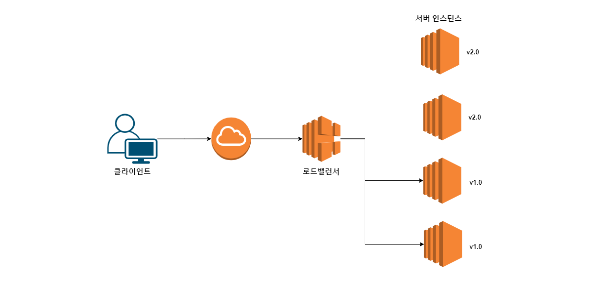
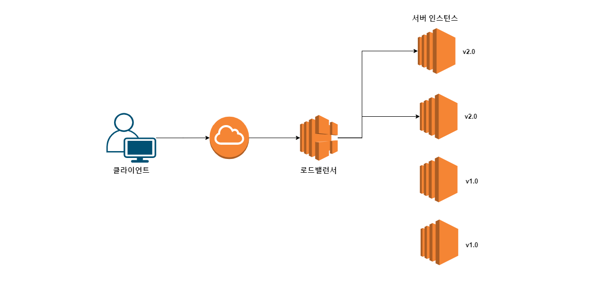
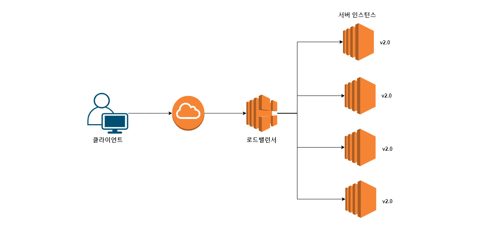
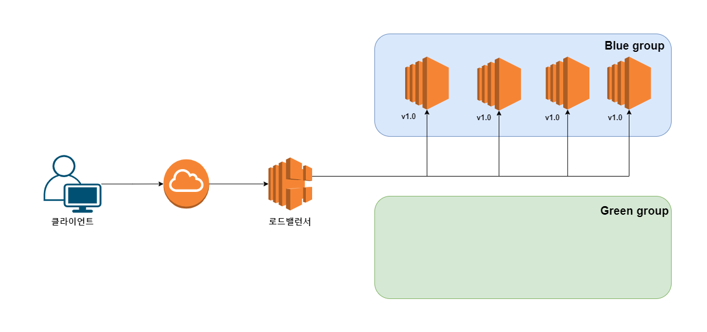
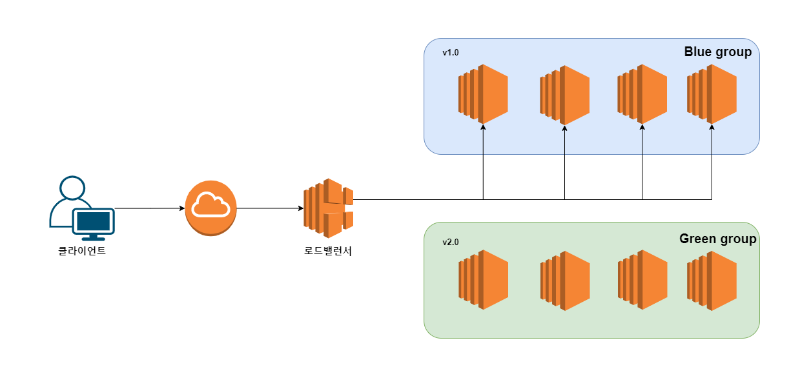
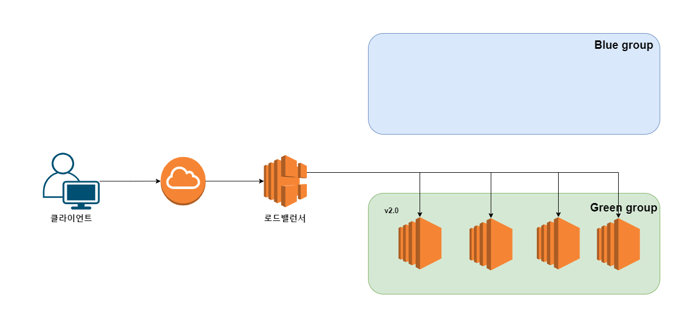

# 무중단 배포 기법을 알아보자.
- [무중단 배포 기법을 알아보자.](#무중단-배포-기법을-알아보자)
  - [무중단/중단 배포](#무중단중단-배포)
  - [현재 위치 배포(In-place deployment)](#현재-위치-배포in-place-deployment)
    - [과정](#과정)
    - [장단점](#장단점)
  - [블루/그린 배포 (Blue/Green deployment)](#블루그린-배포-bluegreen-deployment)
    - [과정](#과정-1)
    - [장단점](#장단점-1)
- [참고자료](#참고자료)

## 무중단/중단 배포
- 코드를 배포할 때 **서비스를 중단**할 것인지? -> `중단 배포`
- 코드를 배포할 때 **서비스를 중단하지 않을** 것인지? -> `무중단 배포`

무중단 배포는 배포를 진행하고 있음에도 사용자가 계속 서비스를 사용할 수 있다. 반면, 중단 배포는 배포 시간에 서비스를 내렸다 올려야 하기 때문에 이 시간동안에는 서비스를 사용할 수 있다. '서비스 점검 중' 이라는 공지로 게임을 못하고, 은행 서비스를 이용 못하는 등등 불편했던 경험은 한 번씩 있었을 것이다. 

그렇다면 무조건 무중단 배포를 해야 하지 않나 생각할 수 있는데, **무중단 배포시에는 구버전과 신버전이 잠시 동안 동시에 서비스된다. 이 때 애플리케이션 코드나 데이터베이스 스키마가 다를 경우 에러가 나고, 데이터 정합성이 깨질 위험이 있다.** 그래서 구버전과 신버전이 충돌이 일어날 가능성이 없는 업데이트인 경우 무중단 배포를 진행한다. 

## 현재 위치 배포(In-place deployment)

### 과정
로드 밸런서가 서버 인스턴스 네 대로 부하를 분산하고 있다. 모든 서버는 v1.0의 애플리케이션을 서비스하는 중이다. 메이저 버전이 올라가 v2.0의 애플리케이션을 배포해야 한다.

1. 4대의 인스턴스 중 일부 인스턴스를 로드 밸런서에서 제외한다. 여기서는 2대의 인스턴스를 제외했고 이제 로드밸런서는 이 인스턴스에게 요청을 보내지 않는다.

2. 2대의 인스턴스로 v1.0의 애플리케이션이 서비스가 되고 있다. 제외한 서버 인스턴스에 v2.0 코드를 배포한다. 

3. v2.0으로 배포가 완료되었으면 해당 서버를 다시 로드밸런서에 등록한다.
4. v1.0의 서버는 로드밸런서에서 제외한다.

5. 제외한 2대의 서버인스턴스에 v2.0 코드를 배포한다. 

6. v2.0으로 배포가 완료되었으면 해당 서버를 다시 로드밸런서에 등록한다. 이제 4대 서버 인스턴스 모두 v2.0으로 배포가 완료되었다. 배포가 진행되는 과정에서 서비스가 중단되는 일은 발생하지 않는다. 

### 장단점
- 장점 
  - 새로운 인스턴스를 생성할 필요가 없기 때문에 간단하고 빠른 배포가 가능하다.
- 단점 
  - 배포하는 동안 클라이언트의 요청을 처리할 수 있는 인스턴스의 수가 줄어든다. 그래서 요청량이 몰릴 경우 장애가 일어날 가능성이 있다. 
  - 배포한 버전에 문제가 있어 롤백해야 할 경우 이전 버전으로 배포를 다시 진행해야 하므로 대응하는 시간이 오래 걸린다.

## 블루/그린 배포 (Blue/Green deployment)
### 과정
현재 위치 배포의 예시와 같이 같이 서버 4대가 있고 v1.0의 애플리케이션을 서비스하는 중이다. 메이저 버전이 올라가 v2.0의 애플리케이션을 배포해야 한다.

 
1. 블루/그린 배포는 `블루 그룹`, `그린 그룹` 두 개의 그룹을 가지고 진행된다. v1.0의 코드를 가지고 있는 서버들은 블루 그룹에 존재한다.
> 참고 : 그룹은 대상 그룹이 될 수도 있고, Auto Scaling 그룹이 될 수도 있다.

2. 비어 있는 그린 그룹에 블루 그룹과 똑같은 수의 서버 인스턴스를 생성한다. 생성된 인스턴스에는 v2.0의 코드를 배포한다.

3. v2.0 배포가 완료되면 그린 그룹도 로드 밸런서에 등록한다. 

4. 블루 그룹은 로드 밸런서에서 제외한다. 이제 클라이언트의 모든 요청은 그린 그룹에서 처리하게 된다.

5. 블루 그룹의 인스턴스들을 종료한다. 배포가 진행되는 과정에서 서비스가 중단되는 일은 발생하지 않는다. 다음 버전을 배포할 때는 블루 그룹에 새로운 버전을 배포하고 그린 그룹의 인스턴스를 종료하면 된다.

### 장단점
- 장점
  - 구, 신버전이 동시에 떠 있는 시간을 짧게 처리할 수 있다. 신버전을 그룹에 모두 배포한 후 로드 밸런서에 등록하므로 구버전 그룹을 로드밸런서에서 빠르게 제외하면 된다.
  - 배포한 버전에 문제가 생겼을 경우 빠른 롤백이 가능하다. 블루 그룹의 인스턴스를 종료하기 전까지 이전 버전의 코드가 남아있다. 롤백해야 할 경우, 로드밸런서에 블루 그룹을 등록하고 그린 그룹을 해제하기만 하면 된다. 
  - 배포 과정에서 서비스되는 인스턴스의 수가 줄어들지 않기 때문에 요청량을 처리하는데 오는 장애의 부담이 적다.
- 단점
  - 인스턴스의 수를 두 배로 늘려야 하기 때문에 배포를 준비하는 시간이 현재 위치 배포 기법보다 오래 걸린다.

# 참고자료
- [서비스 운영이 쉬워지는 AWS 인프라 구축 가이드](http://www.yes24.com/Product/Goods/68799454)