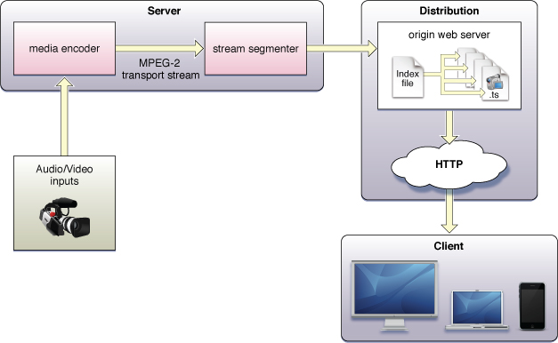
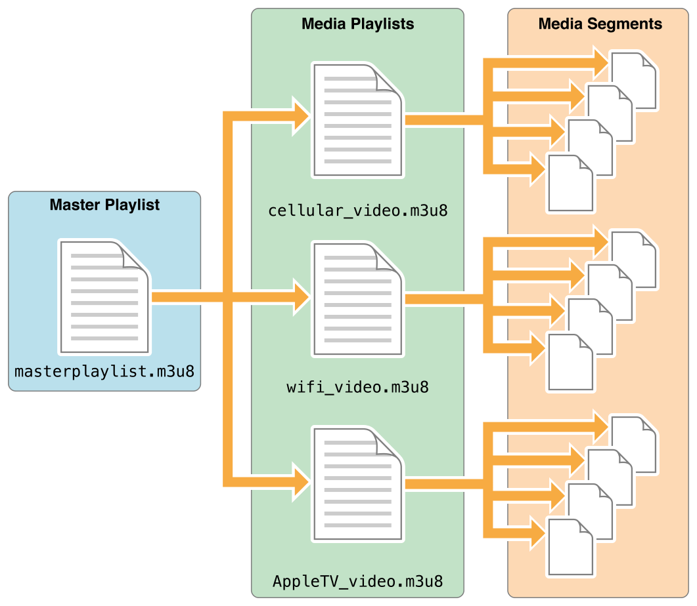
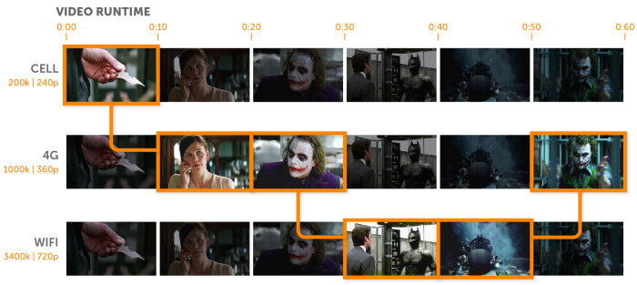

# HTTP Live Streaming(HLS)
- [HTTP Live Streaming(HLS)](#http-live-streaminghls)
  - [HLS?](#hls)
  - [동작 방식](#동작-방식)
  - [구조](#구조)
    - [(구) MPEG-2 transport stream](#구-mpeg-2-transport-stream)
    - [(신) fMP4](#신-fmp4)
    - [1. Server](#1-server)
    - [2. Distributor](#2-distributor)
    - [3. Client](#3-client)
  - [Master playlist](#master-playlist)
    - [Adaptive Bitrate Streaming](#adaptive-bitrate-streaming)
  - [특징](#특징)
  - [HLS 적용 : hls.js + HTML5 video + streaming server](#hls-적용--hlsjs--html5-video--streaming-server)
    - [1. 요청](#1-요청)
    - [2. 응답](#2-응답)
      - [master playlist : playlist.m3u8](#master-playlist--playlistm3u8)
      - [media playlist : chunklist_*.m3u8](#media-playlist--chunklist_m3u8)
    - [3. 재생](#3-재생)
- [참고자료](#참고자료)

## HLS?
- 2009년 애플에서 개발한 HTTP 기반 적응 비트레이트 스트리밍 통신 프로토콜
- 일반 웹 서버에서 HTTP를 통해 오디오와 비디오를 전송하여 웹 브라우저, 모바일 기기, 여러 미디어 플레이어, 스트리밍 서버 등 다양한 기기에서 재생할 수 있다. 
- 안전성을 위해 설계되었으며 네트워크 상황에 따라 동적으로 재생을 최적화한다.

## 동작 방식
**미디어 원본 > 인코더 > 스트림 세그멘터 > 웹 서버 > 플레이어**

1. 미디어(오디오, 비디오)를 Media encoder로 인코딩한다.
2. 인코딩된 파일은 MPEG-2 transport stream 컨테이너 혹은 fMP4 방식으로 처리되어 Stream segmenter로 전송된다.
   - HLS는 처음에 MPEG-2 Transport Stream(TS) 컨테이너 사용을 지정했다.
   - 2016년 애플이 fragmented MP4(fMP4) 포맷에 대한 지원을 발표하면서 fMP4로 바뀌었다. 
3. Stream segmenter가 작은 미디어 세그먼트 파일로 나누어 웹 서버에 저장한다.  
4. 클라이언트가 인덱스 파일의 URL을 웹 서버로 요청한다. 
5. 응답받은 인덱스 파일을 읽고, 미디어 세그먼트 파일 목록 순으로 플레이어가 재생한다. 

> fMP4는 최근 HTTP 기반 스트리밍에서 선호하는 포맷이다.

## 구조
2016년 이후 인코딩된 미디어 파일을 Stream segmenter로 전송할 때 규격이 바뀌었다. (MP#G-2 TS -> fMP4)
### (구) MPEG-2 transport stream


### (신) fMP4

(출처 : [HLS Architecture](https://developer.apple.com/documentation/http_live_streaming/understanding_the_http_live_streaming_architecture))

### 1. Server
미디어 파일을 인코딩하고, 스트림을 작은 미디어 세그먼트 파일 나눈다.

- `Media encoder`
  - 오디오 코덱 : AAC-LC, HE-AAC+ v1 & v2, xHE-AAC, Apple Lossless, FLAC
  - 비디오 코덱 : H.265, H.264
- `Stream segmenter`
  - 스트림을 작은 미디어 세그먼트 파일로 나눈다. 
  - 미디어 세그먼트 파일들의 목록이 포함된 인덱스 파일(플레이리스트)을 생성한다.
    - 인덱스 파일은 세그먼트의 순서가 기록되며, M3U 포맷의 확장인 `.m3u8`(M3U8 플레이리스트)로 저장된다. 
    - 480p, 720p, 1080p 등 다양한 품질로 여러 세트의 세그먼트를 복제한다.

### 2. Distributor
웹 서버 또는 CDN
- 인덱스 파일과 미디어 세그먼트 파일이 있다.
- 클라이언트가 스트리밍을 요청하면 HTTP를 경유해 클라이언트에게 인덱스 파일과 세그먼트 파일을 전송한다

### 3. Client
웹 브라우저, 모바일 기기 
- Distributor에 `.m3u8` 파일을 요청한다. 
- 인덱스 파일을 참조하여 미디어 세그먼트 파일을 순서대로 다운로드 받아 플레이어로 재생한다.
  - 네트워크 상황에 따라 적절한 품질의 비디오를 다운로드 받는다.
- 인덱스 파일의 `#EXT-X-ENDLIST` 태그를 만날 때까지 프로세스는 진행된다.

> `#EXT-X-ENDLIST` : 플레이리스트에서 재생할 콘텐츠가 더 이상 없음을 의미. 이 지시어가 표시된 줄 이후의 콘텐츠는 무시한다.


## Master playlist

(출처 : [Apple HLS - Playlist relationships](https://developer.apple.com/library/archive/referencelibrary/GettingStarted/AboutHTTPLiveStreaming/about/about.html) )

- 스트림의 media playlist들에 대한 주소를 제공한다.
- `대역폭`, `해상도`, `코덱` 등 세부 정보를 제공한다.
- 플레이어는 위 세부정보를 사용하여 장치에 가장 적합한 media playlist를 재생한다.
  - 휴대폰에서는 `cellular_video.m3u8`이 선택된다.
  - wifi를 사용하는 경우 `wifi_video.m3u8`이 선택된다.
  - AppleTV에서는 `AppleTV_video.m3u8`이 선택된다. 

### Adaptive Bitrate Streaming
네트워크 상황이 좋을 때는 고화질, 안 좋을 때는 저화질의 동영상을 재생함으로써 끊김 없는 동영상을 제공할 수 있다. 




## 특징
- HLS는 UDP가 아닌 **TCP 전송 프로토콜**을 사용한다. 
- UDP 기반 프로토콜(RTP)과 달리 표준 HTTP 트래픽을 통해 **방화벽이나 프록시 서버를 경유할 수 있다.** 
  - 전용 서버가 필요한 프로토콜보다 간단히 실행 가능
- **재생에 지장을 주지 않고 네트워크 상태에 따라 비디오 품질을 높이거나 낮출 수 있다.** (Adaptive Bitrate Streaming) 그래서 끊김 없는 비디오를 볼 수 있다. 
- HLS는 전통적으로 6~30초의 대기 시간을 제공한다. 하지만 HLS 확장인 Low-Latency HLS는 2초 미만의 대기 시간을 약속한다.


## HLS 적용 : hls.js + HTML5 video + streaming server
> MPEG-2 transport stream 방식을 사용했습니다.
- `hls.js` : HLS를 구현한 javascript 라이브러리
- `HTML5 video` : 플레이어
- `streaming server` : HLS를 지원하는 스트리밍 서버

### 1. 요청
```html
<script src="https://cdn.jsdelivr.net/npm/hls.js@latest"></script>
<video id="video"></video>
<script>
  var video = document.getElementById('video');
  var videoSrc = 'https://test-streams.mux.dev/x36xhzz/playlist.m3u8';
  if (Hls.isSupported()) {
    var hls = new Hls();
    hls.loadSource(videoSrc);
    hls.attachMedia(video);
  }
  else if (video.canPlayType('application/vnd.apple.mpegurl')) {
    video.src = videoSrc;
  }
</script>
```

- 웹 서버로 `playlist.m3u8`을 요청한다. MIME Type은 `vnd.apple.mpegurl`이다.

### 2. 응답
#### master playlist : playlist.m3u8
```
#EXTM3U
#EXT-X-VERSION:3
#EXT-X-STREAM-INF:BANDWIDTH=13527192,CODECS="avc1.4d4029,mp4a.40.2",RESOLUTION=1280x720
chunklist_w1148626004.m3u8
```
- `playlist.m3u8`은 master playlist다.
- 대역폭(BANDWIDTH), 코덱(CODECS), 해상도(RESOLUTION) 정보를 기반으로 `chunklist_w1148626004.m3u8`라는 media playlist가 선택되었다.

#### media playlist : chunklist_*.m3u8
```
#EXTM3U
#EXT-X-VERSION:3
#EXT-X-TARGETDURATION:11
#EXT-X-MEDIA-SEQUENCE:0
#EXTINF:9.743,
media_w1148626004_0.ts
#EXTINF:9.877,
media_w1148626004_1.ts
#EXTINF:10.043,
media_w1148626004_2.ts
#EXTINF:9.676,
media_w1148626004_3.ts
...
#EXTINF:10.377,
media_w1148626004_193.ts
#EXTINF:4.285,
media_w1148626004_194.ts
#EXT-X-ENDLIST
```

- `chunklist_w1148626004.m3u8`의 목록 순서대로 `.ts`파일을 다운로드 받는다.

### 3. 재생
플레이어에 `.ts` 파일(미디어 세그먼트 파일)을 순서대로, 연속적으로 재생한다. 

# 참고자료
- [Apple Document - Understanding the HTTP Live Streaming Architecture](https://developer.apple.com/documentation/http_live_streaming/understanding_the_http_live_streaming_architecture)
- [Apple Document - About HTTP Live Streaming](https://developer.apple.com/library/archive/referencelibrary/GettingStarted/AboutHTTPLiveStreaming/about/about.html)
- [위키백과 - HTTP 라이브 스트리밍](https://ko.wikipedia.org/wiki/HTTP_%EB%9D%BC%EC%9D%B4%EB%B8%8C_%EC%8A%A4%ED%8A%B8%EB%A6%AC%EB%B0%8D)
- [Wowza - What Is HLS (HTTP Live Streaming)](https://www.wowza.com/blog/hls-streaming-protocol)
- [Naver D2 - HTTP Live Streaming](https://d2.naver.com/helloworld/7122)
- [Naver D2 YouTube - HTTP Live Streaming (HLS)](https://www.youtube.com/watch?v=Z3eRwICG4OU)