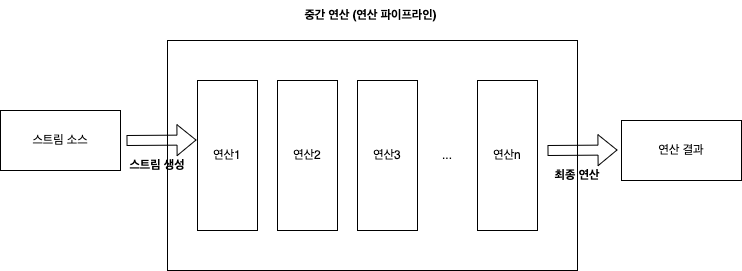

# 스트림(Stream) 기초

- 스트림(Stream)은 '작은 하천' 혹은 '시냇물'이라는 뜻의 단어이고 프로그래밍 언어에서는 주로 **어떤 데이터의 흐름**을 말한다. (데이터를 담고 있는 저장소(컬렉션) x)
- java.io의 Stream이 아니라, java8에 나온 java.util의 Stream API를 말한다.
- 스트림 API의 주된 목적은 **매우 복잡하고 어려운 데이터 처리 작업을 쉽게 조회하고 필터링하고 변환하고 처리**할 수 있도록 하는 것이다.

## 스트림 특징

- 스트림은 **불변 객체**다.
    - Stream 객체의 메서드 호출 결과로 리턴 받은 Stream 객체는 새로 생성한 데이터다.
    - 불변인 이유는 Stream은 중간 연산 작업과 함께 병렬 처리가 가능하기 때문에 데이터 정합성을 확보하기 위해서다.
- 중간 연산(Intermediate operation)
    - 리턴 타입이 Stream인 메서드들은 리턴 결과를 이용해서 데이터를 중간에 변형 혹은 필터링, 혹은 정렬한 후 다시 Stream 객체를 만들어서 결과를 리턴한다. 중간 연산은 반복적으로 수행할 수 있다.
- 최종 연산(Terminal opertaion)
    - 리턴 타입이 없는 void형 메서드들은 주로 Stream을 이용해서 데이터를 최종적으로 소비한다.
- 스트림은 한번 사용하고 나면 다시 사용할 수 없다.
    - Stream은 '데이터의 흐름'이고 한 번 흘러간 데이터는 다시 돌아오지 않는다.
- 스트림의 최종 연산 메서드를 호출하면 전체 스트림 데이터를 처리하기 때문에 데이터를 모두 소모하고 종료된다.
- 쉽게 병렬 처리할 수 있다.
    - `parallelStream()` : 병렬 처리가 가능한 스트림을 반환한다.

## 스트림 연산


- 스트림 객체가 생성되는 단계
    - 주로 Collection이나 Array의 `stream()` 을 호출해서 생성
    - `Stream.of()`로 직접 생성
- 중간 연산 단계
    - 변형(map), 필터링(filter), 정렬(sorted)
    - 결과는 Stream
- 최종 연산 단계
    - 스트림 객체의 데이터를 전부 소모하고 스트림을 종료

 

### 중간 연산

- 리턴 타입이 Stream

| 메서드명  | 설명 |
| --- | --- |
| concat(Stream<? extends T> a, Stream<? extends T> b) | 두 개의 스트림을 하나로 합친다. 내부적으로는 첫 번째 인자의 스트림을 처리한 후 두 번째 인자의 스트림을 처리하도록 연결하는 역할을 한다. |
| distinct() | 중복값을 제거한다. 중복값을 제거할 때 사용하는 비교 연산은 Object.equals(Obejct)다 |
| filter(Predicate<? super T> predicate) | Predicate 함수형 인터페이스를 입력받아서 해당 조건에 맞게 스트림 데이터를 필터링한다. |
| limit(long maxSize) | 파라미터로 전달받은 maxSize번째 데이터까지 스트림 객체를 생성하여 리턴하며 그 이후 데이터는 버린다. |
| map(Function<? super T, ? extends R> mapper) | Function 함수형 인터페이스를 입력받아서 해당 조건에 맞게 값을 변경한다. |
| sorted() | 스트림의 데이터를 정렬한다. 스트림 데이터 객체의 기본값을 이용해서 정렬한다. |
| sorted(Comparator<? supter T> comparator) | Comparator 인터페이스로 구현 받은 규칙을 기준으로 데이터를 정렬한다.  |

### 최종 연산

- 리턴 타입이 void 또는 List

| 메서드명 | 설명 |
| --- | --- |
| count() | 스트림에 포함된 데이터 개수를 리턴한다. |
| collect(Collector<? super T,A,R> collector) | 주어진 Collector 인터페이스를 기반으로 스트림 데이터를 변환한다. 주로 스트림을 컬렉션 객체로 변환할 때 사용한다. |
| forEach(Consumer<? super T> action) | 주어진 함수 레퍼런스 혹은 람다 표현식을 이용해서 스트림 내부에서 for 루프를 실행한다. |
| reduce(T identity, BinaryOperator<T> accumulator) | 초기값과 주어진 함수 레퍼런스 혹은 람다 표현식을 이용해서 리듀스 연산을 수행한다. |

> 리듀스 연산 : 데이터를 최종적으로 다 확인해서 결과값을 도출하는 최종연산


## 스트림 예제

```java
public class StreamExample {
    public static void main(String[] args) {
        List<Person> persons = new ArrayList<>();
        persons.add(new Person("lipj", 33);
        persons.add(new Person("monika", 35);
        persons.add(new Person("leejung", 23);

        List<Person> sortedPersons = persons.stream()
                .sorted()
                .forEach(System.out::println);

        List<String> names = persons.stream()
                .map(Person::getName)
                .collect(Collectors.toList());
    }
}
```

- `stream()` : 스트림 객체 생성
- `sorted()` : 오름차순 정렬. Person에 Comparable 인터페이스를 구현해야 정상적으로 동작한다.
- `forEach(System.out::println)` : 스트림의 데이터 모두 출력

- `map(Person::getName)` : Person 객체를 Person의 name으로 변환
- `collect(Collectors.toList())` : 스트림의 데이터를 List로 반환

```java
public class StreamStudy {
    public static long sumOverThreeAndDouble(List<Integer> numbers) {
        return numbers.stream()
                .filter(number -> number > 3)
                .map(number -> number * 2)
                .reduce(0, (x, y) -> x + y);
    }
}
```

- `stream()` : 스트림 객체 생성
- `filter(number → number > 3)` : 3보다 큰 정수 필터링
- `map(number -> number * 2)` : 해당 정수를 2배 곱해서 리턴(변형)
- `reduce(0, (x, y) -> x + y)` : 초기값 0. 나온 결과들을 모두 더한다. (최종연산)

```java
public class StreamStudyTest {
    private List<Integer> numbers;

    @Test
    public void sumOverThreeAndDouble() throws Exception {
        numbers = Arrays.asList(3, 1, 6, 2, 4, 8);
        long sum = StreamStudy.sumOverThreeAndDouble(numbers);
        assertThat(sum).isEqualTo(36);
    }
}
```

# 참고자료
- [Practical 모던 자바](http://www.yes24.com/Product/Goods/92529658)