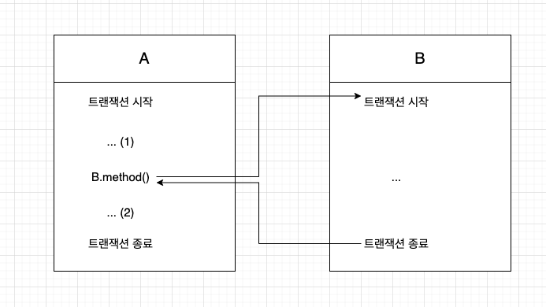
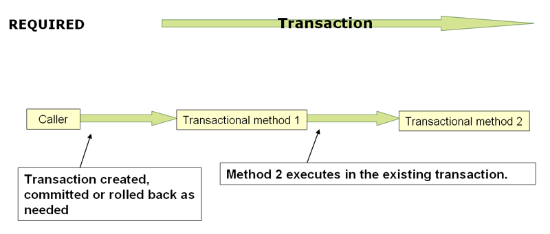
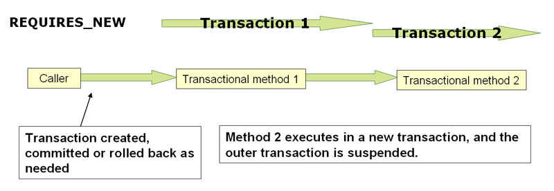

# 스프링 트랜잭션 전파(Transaction propagation)

## 트랜잭션 전파?

트랜잭션의 경계에서 이미 진행 중인 트랜잭션이 있을 때 또는 없을 때 어떻게 동작할 것인가를 결정하는 방식



- 각각의 독립적인 트랜잭션 경계를 가진 A와 B가 있다.
- A의 트랜잭션이 시작되고 아직 끝나지 않은 시점에서 B를 호출하면 B는 어떤 트랜잭션 안에서 동작해야 할까?
    1. A에서 트랜잭션이 시작되서 진행 중이니까 B는 새로운 트랜잭션을 만들지 않고 A의 트랜잭션에 참여한다.
    2. A에서 트랜잭션이 시작되서 진행 중이지만, B 호출시 독립적인 새 트랜잭션을 만든다. 

### 1. 진행된 트랜잭션과 같이 묶이는 경우

- A의 트랜잭션에 B가 참여한다. (하나의 트랜잭션으로 묶인다)
    - B가 `REQUIRED`
- `B.method()`가 호출되서 작업이 끝나고 **(2)에서 예외가 발생하는 경우**는 어떻게 될까?
    - A와 B에서 진행했던 모든 DB 작업이 다 취소된다.

### 2. 진행된 트랜잭션과 무관하게 독립적인 트랜잭션을 만드는 경우

- A의 트랜잭션과 무관하게 B는 새로운 트랜잭션을 만든다. (두 개의 독립적인 트랜잭션)
    - B가 `REQUIRES_NEW`인 경우
- `B.method()`가 호출되서 작업이 끝나고 **(2)에서 예외가 발생하는 경우**는 어떻게 될까?
    - B.method()가 끝나는 순간(=트랜잭션 경계를 빠져나오는 순간) B 트랜잭션이 커밋된다.
    - B 트랜잭션이 커밋되어도 A 트랜잭션은 영향을 받지 않는다.
    - A에서 진행했던 DB 작업이 취소된다.

## Spring @Transactinoal에 전파 속성 설정

```java
@Target({ElementType.TYPE, ElementType.METHOD})
@Retention(RetentionPolicy.RUNTIME)
@Inherited
@Documented
public @interface Transactional {
	
	// ...

	Propagation propagation() default Propagation.REQUIRED;

}
```

- `@Transactinal`에서 기본 전파 속성은 `REQUIRED`다.
- Propagation에는 `REQUIRED`, `SUPPORTS`, `MANDATORY`, `REQUIRES_NEW`, `NOT_SUPPORTED`, `NEVER`, `NESTED`가 있다.

```java
public enum Propagation {

	REQUIRED(TransactionDefinition.PROPAGATION_REQUIRED),

	SUPPORTS(TransactionDefinition.PROPAGATION_SUPPORTS),

	MANDATORY(TransactionDefinition.PROPAGATION_MANDATORY),

	REQUIRES_NEW(TransactionDefinition.PROPAGATION_REQUIRES_NEW),

	NOT_SUPPORTED(TransactionDefinition.PROPAGATION_NOT_SUPPORTED),

	NEVER(TransactionDefinition.PROPAGATION_NEVER),

	NESTED(TransactionDefinition.PROPAGATION_NESTED);

	private final int value;

	Propagation(int value) {
		this.value = value;
	}

	public int value() {
		return this.value;
	}

}
```

 

### REQUIRED



[출처 : 스프링 docs](https://docs.spring.io/spring-framework/docs/current/reference/html/data-access.html#spring-data-tier) 

- `@Transactional`
- 디폴트 속성. 가장 많이 사용되는 트랜잭션 전파 속성이다.
- 진행중인 트랜잭션이 없으면 새로 시작, 이미 시작된 트랜잭션이 있으면 이에 참여한다.


### REQUIRES_NEW



[출처 : 스프링 docs](https://docs.spring.io/spring-framework/docs/current/reference/html/data-access.html#spring-data-tier) 

- `@Transactional(propagation = Propagation.REQUIRES_NEW)`
- 항상 새로운 트랜잭션을 시작한다. (앞에서 시작된 트랜잭션이 있어도 새로 시작)
- 외부 트랜잭션이 내부 트랜잭션의 롤백 상태에 영향을 받지 않는다.
- 독립적인 트랜잭션이 보장되어야 하는 코드에 적용할 수 있다.


### NOT_SUPPORTED
- `@Transactional(propagation = Propagation.NOT_SUPPORTED)`
- 트랜잭션 없이 동작한다. 진행 중인 트랜잭션이 있어도 무시한다.


## 트랜잭션 전파 속성을 설정할 때 주의할 점

같은 오브젝트 내에서 메서드 호출이 일어나는 경우 트랜잭션 전파 속성이 의도한 대로 적용되지 않을 수 있다. 

```java
public class A {

	@Transactional
	public void delete(Object obj) {
		// 조회
		// 삭제
		update(obj);
		// 여기서 unchecked exception이 발생한다면?
	}

	@Transactional(propagation = Propagation.REQUIRES_NEW)
	public void update(Object obj) {
		// 갱신
	}
}
```

delete() 메서드 내부에는 update()를 호출하는 코드가 있다. update()가 호출되면 Propagation 속성에 따라 새 트랜잭션이 생길 것으로 예상할 수 있다. 독립적이기 때문에 delete에서 예외가 발생한다고 한들 update는 정상적으로 처리될 것으로 예상한다. 

하지만 이 경우 delete()의 Propagation 속성인 REQUIRED에 따라 하나의 트랜잭션으로 묶인다. 따라서 예외가 발생하면 update()도 롤백된다. 

### 왜 그러는 것일까?

> 프록시 방식 AOP에서 프록시를 통한 부가기능의 적용은 클라이언트로부터 호출이 일어날 때만 가능하다. 여기서 클라이언트는 인터페이스를 통해 타깃 오브젝트를 사용하는 다른 모든 오브젝트를 말한다. 반대로 타깃 오브젝트가 자기 자신의 메서드를 호출할 때는 프록시를 통한 부가기능의 적용이 일어나지 않는다.

# 참고자료
- [토비의 스프링](http://www.yes24.com/Product/Goods/7516911) 