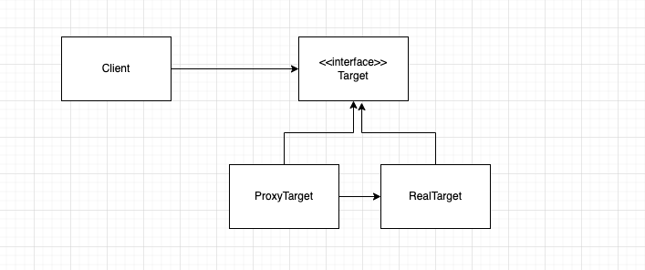
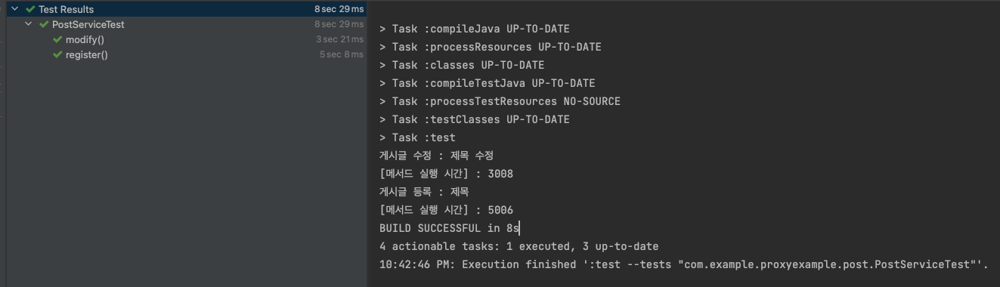
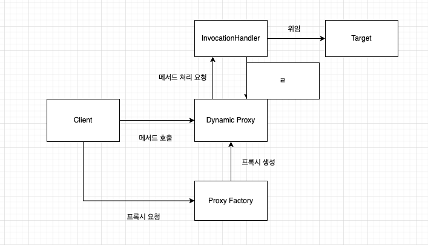
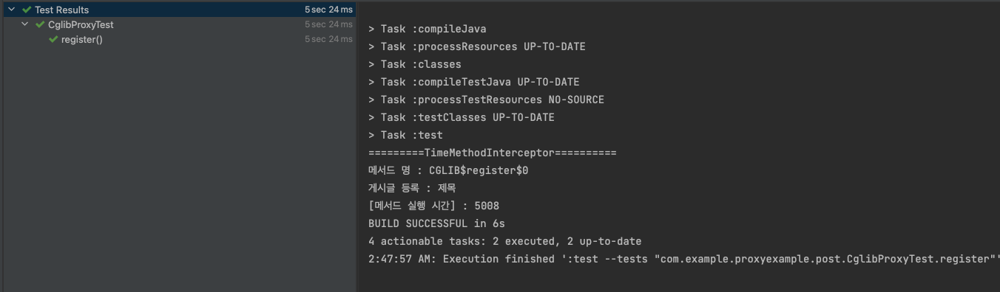

# JDK 다이나믹 프록시와 CGLIB 프록시

## 프록시 기반의 AOP

스프링에서 AOP를 학습할 때 **프록시** 기반의 AOP란 말을 한 번쯤은 들어봤을 것이다. 현재 스프링은 프록시 기반의 AOP를 구현할 때 CGLIB를 사용하는데, 핵심은 런타임시 프록시 객체를 생성하는 다이나믹 프록시다. 

도대체 프록시는 무엇이고, Java의 리플렉션을 사용한 JDK 다이나믹 프록시, CGLIB의 MethodProxy를 사용한 다이나믹 프록시가 어떤 차이가 있는지 알아보자. 

## 프록시 패턴

프록시(Proxy)는 '대리', '중계' 라는 의미다. 클라이언트는 타겟에게 요청을 보내지만 실제로는 프록시가 요청을 대신 받는다. 실제 요청을 수행하는 타겟의 기능은 프록시 손에 달렸다. 위임해서 기능을 수행할 수도 있고, 위임하지 않고 클라이언트에게 다른 응답을 줄 수도 있다. 실제 타겟은 오로지 자신이 해야 할 일만 수행할 뿐이다.



### 예제 : 게시글 등록, 수정(핵심 기능)  + 메서드 시간 측정(부가 기능)

기존에 게시글을 등록하고 수정하는 비즈니스 로직을 담은 Service가 있다고 하자. 만약 여기에 메서드 시간 측정 기능을 넣고 싶다면 어떻게 해야 할까?

가장 간단한 방법으로는 등록과 수정하는 로직에 메서드 시간 측정 로직을 넣는 것이다. 하지만 이렇게 되면 한 메서드에 여러 기능을 포함하게 된다. 더군다나 메서드 시간 측정은 `register()`라는 책임에 맞지 않다. register 관점에서 보면 게시글 등록이 핵심 기능이고, 메서드 시간 측정은 부가 기능이다. 이를 분리하기 위해 프록시 패턴을 활용해 볼 수 있다. 

```java
public interface PostService {

    void register(Post post);

    void modify(Post post);

}
```

### 핵심 기능 구현

```java
public class DefaultPostService implements PostService{

    @Override
    public void register(Post post) {
        try {
            Thread.sleep(5000);
            System.out.printf("게시글 등록 : %s\n", post.getTitle());
        } catch (InterruptedException e) {
            e.printStackTrace();
        }
    }

    @Override
    public void modify(Post post) {
        try {
            Thread.sleep(3000);
            System.out.printf("게시글 수정 : %s\n", post.getTitle());
        } catch (InterruptedException e) {
            e.printStackTrace();
        }
    }
}
``` 

`PostService`의 등록과 수정 기능을 구현한다. 이 클래스에는 메서드 시간을 측정하는 코드는 없고 오로지 각자의 핵심 기능에만 충실하다. 

### 부가 기능 구현 + 핵심 기능 위임

```java
public class ProxyPostService implements PostService{

    private PostService postService;

    public ProxyPostService(PostService postService) {
        this.postService = postService;
    }

    @Override
    public void register(Post post) {
        long begin = System.currentTimeMillis(); // 부가기능
        postService.register(post); // 위임
        long end = System.currentTimeMillis(); // 부가기능
        System.out.println("[메서드 실행 시간] : " + (end - begin));
    }

    @Override
    public void modify(Post post) {
        long begin = System.currentTimeMillis();
        postService.modify(post);
        long end = System.currentTimeMillis();
        System.out.println("[메서드 실행 시간] : " + (end - begin));

    }
}
```

똑같이 `PostService`를 구현한다. 하지만 핵심 기능을 구현하지 않는다. 

메서드 시간을 측정하는 부가기능을 구현하고 실제 핵심 기능을 수행하기 위해 핵심 기능을 구현한 클래스의 메서드를 호출한다. (타입을 `PostService`로 해야 추후 `DefaultPostService`가 아닌 다른 구현체로 변경하더라도 해당 클래스는 코드 변경을 하지 않아도 된다)

### 테스트

```java
class PostServiceTest {

    private PostService postService = new ProxyPostService(new DefaultPostService());

    @Test
    void register() {
        Post post = new Post("제목", "내용");
        postService.register(post);
    }

    @Test
    void modify() {
        Post post = new Post("제목 수정", "내용 수정");
        postService.modify(post);
    }

}
```

- 클라이언트가 게시글 등록 요청을 한다.
- 실제로 가장 먼저 수행되는 건 `ProxyPostService`의 `register()`다. 프록시는 메서드의 호출 시간 측정을 시작한 뒤, 실제 등록 기능을 하는 `DefaultPostService`의 `register()`를 호출한다.
- `DefaultPostService`에서 게시글이 등록된다.
- `ProxyPostService`의 메서드 호출 시간 측정을 종료한다. 메서드 호출 시간이 측정된다.



### 문제점

- 프록시 메서드들에서 부가 기능 코드가 중복된다.
- 매번 프록시 클래스를 작성해야 한다. → 프록시 클래스를 만드는 비용이 든다.
- 인터페이스에 구현해야 할 메서드가 많으면 프록시에서 모든 메서드를 일일히 구현해서 위임하는 코드를 넣어야 한다.


## JDK 다이나믹 프록시



다이나믹 프록시 역시 클라이언트의 요청을 프록시가 대신 받는다. 다른점은 ‘다이나믹'이 붙었다는 건데, 매번 프록시 클래스를 만들지 않아도 런타임시 타겟 인터페이스를 구현한 프록시 클래스를 만들어준다. 

여기에 `InvocationHandler`가 생겼는데 이는 부가기능을 invoke 안에 한 번만 구현하면 이 Handler를 거친 메서드들은 모두 해당 부가기능이 수행된다. 타겟 인터페이스에 100개가 넘는 메서드가 있어도 일일히 부가기능을 구현하지 않아도 된다. 


- Dynamic Proxy
    - Proxy Factory에 의해 런타임 시 다이나믹하게 만들어지는 오브젝트
    - Target과 같은 타입으로 만들어진다.
    - Client는 Dynamic Proxy 오브젝트를 Target 인터페이스를 통해 사용할 수 있다.
    - 프록시로서 필요한 부가기능 제공 코드는 직접 작성해야 한다.
        - 부가기능은 프록시 오브젝트와 독립적으로 `InvocationHandler`를 구현한 오브젝트에 담는다.

- Proxy Factory
    - Target 인터페이스 정보만 제공해주면 해당 인터페이스를 구현한 클래스의 오브젝트를 만들어준다.
    - `Proxy`의 `newProxyInstance()`

- InvocationHandler
    - `public Object invoke(Object proxy, Method method, Object[] args)`
    - Dynamic Proxy 오브젝트는 Client의 모든 요청을 리플렉션 정보로 변환해서 InvacationHandler 구현 오브젝트의 invoke() 메서드로 넘긴다.
        - Target 인터페이스의 모든 메서드 요청이 하나의 메서드로 집중된다. → 중복되는 기능을 효과적으로 제공할 수 있다.
        - Target 오브젝트의 메서드 요청을 어떻게 실행하는가?
            - Method와 파라미터 정보가 있으면 특정 오브젝트의 메서드를 실행할 수 있다.
            - InvocationHandler 구현 오브젝트가 Target 오브젝트 레퍼런스를 갖고 있다면 리플렉션을 이용해 간단히 위임 코드를 만들어 낼 수 있다.
        

### InvacationHandler  : 부가 기능 구현 + 핵심 기능 위임

```java
public class PostServiceTimeInvocationHandler implements InvocationHandler {

    // target
    private PostService postService;

    public PostServiceTimeInvocationHandler(PostService postService) {
        this.postService = postService;
    }

    @Override
    public Object invoke(Object proxy, Method method, Object[] args) throws Throwable {
        System.out.println("=========PostServiceTimeInvocationHandler==========");
        System.out.println("메서드 명 : " + method.getName());
        long begin = System.currentTimeMillis(); // 부가기능
        Object invoke = method.invoke(postService, args); // 위임
        long end = System.currentTimeMillis(); // 부가기능
        System.out.println("[메서드 실행 시간] : " + (end - begin));

        return invoke;
    }
}
```

 

### 테스트

```java
public class DynamicProxyTest {

    private PostService postService = (PostService) Proxy.newProxyInstance(
            getClass().getClassLoader(), // 클래스 로더
            new Class[]{PostService.class}, // 구현할 타겟 인터페이스
            new PostServiceTimeInvocationHandler(new DefaultPostService())); // 부가기능 + 위임코드를 담은 핸들러

    @Test
    void register() {
        Post post = new Post("제목", "내용");
        postService.register(post);
    }

    @Test
    void modify() {
        Post post = new Post("제목 수정", "내용 수정");
        postService.modify(post);
    }
}
```

- 클라이언트가 게시글 등록 요청을 한다.
- 구현할 타겟 인터페이스와 부가기능과 핵심 기능 위임을 담은 InvocationHandler 정보를 기반으로 동적으로 프록시 객체를 생성한다. (`Proxy.newProxyInstance()`)
- 프록시는 InvocationHandler에게 메서드 처리 요청을 한다.  메서드의 호출 시간 측정을 시작한 뒤, 실제 등록 기능을 하는 `DefaultPostService`의 `register()`를 호출한다.
- `DefaultPostService`에서 게시글이 등록된다.
- `InvocationHandler`에서 메서드 호출 시간 측정을 종료한다. 메서드 호출 시간이 측정된다.

### 문제점

- JDK 다이나믹 프록시는 구현할 타겟 인터페이스가 있어야 한다. 인터페이스가 아니라 클래스인 경우 프록시를 생성할 수 없다.


## CGLIB 프록시

CGLIB(Code Generation Library)는 바이트 코드 생성 라이브러리로서, 런타임에 동적으로 프록시를 생성하는 기능을 제공한다. 기존 JDK 다이나믹 프록시 방식은 타겟이 인터페이스여야 프록시를 생성할 수 있었는데 CGLIB는 타겟이 클래스여도 프록시를 생성할 수 있다. JDK 다이나믹 프록시보다 속도도 빠르다는 장점이 있다.

### MethodInterceptor : 부가 기능 구현 + 핵심 기능 위임

```java
public class TimeMethodInterceptor implements MethodInterceptor {

    @Override
    public Object intercept(Object object, Method method, Object[] args, MethodProxy methodProxy) throws Throwable {
        System.out.println("=========TimeMethodInterceptor==========");
        System.out.println("메서드 명 : " + methodProxy.getSuperName());

        long begin = System.currentTimeMillis(); // 부가기능
        Object invoke = methodProxy.invokeSuper(object, args);
        long end = System.currentTimeMillis(); // 부가기능
        System.out.println("[메서드 실행 시간] : " + (end - begin));

        return invoke;
    }
}
```

InvocationHandler와 유사한 역할을 한다고 보면 된다. 부가기능을 수행하고, 메서드를 위임할 수 있다. 


[이미지 출처 : CGLIB MethodInterceptor](https://frameworks.readthedocs.io/en/latest/spring/aop/cglib.html)


- `public Object intercept(Object object, Method method, Object[] args, MethodProxy methodProxy)`
    - object : 프록시 오브젝트
    - method : Target 오브젝트의 호출될 메서드를 나타내는 Method 객체
    - args : Target 오브젝트에 전달될 파라미터
    - methodProxy : cglib가 제공하는 Target 오브젝트의 메서드 프록시

> 참고 : intercept()는 Method도 가지고 있으므로 리플렉션을 사용해서(`method.invoke()`) 타겟 오브젝트의 메서드를 호출할 수 있다. 다만 리플렉션보다 MethodProxy 방식이 더 빠르기 때문에 MethodProxy를 사용하기를 권고한다.


```java
public class CglibProxyTest {

    private PostRegisterService postRegisterService = (PostRegisterService) Enhancer.create(
            PostRegisterService.class, // 상속할 클래스(superclass)
            new TimeMethodInterceptor()); // 콜백 -> 부가기능 + 위임 (callback)

    @Test
    void register() {
        Post post = new Post("제목", "내용");
        postRegisterService.register(post);
    }

}
```

`Enhancer` 는 인터페이스 타입이 아닌 타겟 클래스의 하위 클래스를 동적으로 생성한다.(프록시) 그리고 지정된 콜백으로 모든 메서드 요청을 가로챈다. 콜백으로는 보통 `Callback`을 상속받은 `MethodInterceptor`를 많이 사용한다. 



### 문제점

- 상속을 사용해서 프록시를 만들기 때문에 상속을 막으면 프록시를 생성할 수 없다
    - private 생성자만 있을 경우
    - final이 붙는 경우


# 참고자료
- [토비의 스프링 3.1](http://www.yes24.com/Product/Goods/7516911)
- [더 자바, 코드를 조작하는 다양한 방법](https://www.inflearn.com/course/the-java-code-manipulation/dashboard)
- [My Daily Java - cglib](http://mydailyjava.blogspot.com/2013/11/cglib-missing-manual.html)
- [CGLIB를 이용한 프록시 객체 만들기](https://javacan.tistory.com/entry/114)