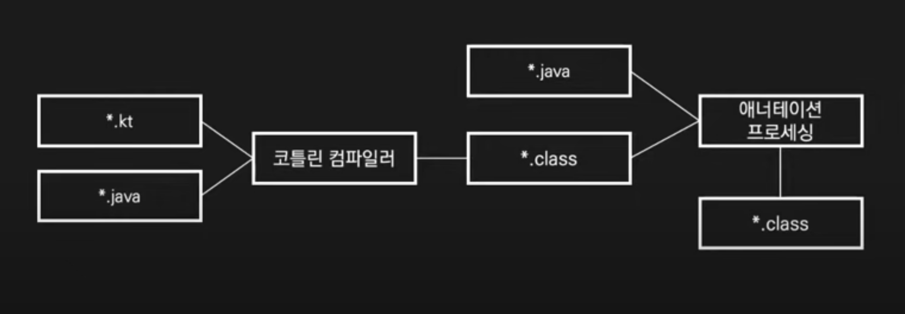

# 어디 가서 코프링 매우 알은 체하기 정리

> [어디 가서 코프링 매우 알은 체하기](https://www.youtube.com/watch?v=ewBri47JWII)를 보고 정리한 내용입니다.

## 코틀린

### 코틀린이란?

- JVM, 안드로이드, 자바스크립트 및 네이티브를 대상으로 하는 정적 타입 지정 언어
- 젯브레인즈에서 개발한 오픈 소스 (아파치 라이선스 2.0)
- OO 스타일과 FP 스타일 모두 사용할 수 있으며 두 요소를 혼합하여 사용할 수 있다.
- 간결하고 실용적이며 안전하고 기존 언어와의 상호 운용성을 중시한다. (+ 코루틴)

"코틀린은 단순히 JVM 언어가 아니라, 멀티플랫폼 언어다"          
=> 코틀린 코드로 잘 작성하면 JVM상에서도, 자바스크립트에서도, 네이티브에서도 동작시킬 수 있다.


[이미지 출처] : [https://kotlinlang.org/docs/multiplatform.html#how-kotlin-multiplatform-works](https://kotlinlang.org/docs/multiplatform.html#how-kotlin-multiplatform-works)


### 아이템1. 코틀린 표준 라이브러리를 익히고 사용하라.

- 코틀린 1.3부터 모든 플랫폼에서 사용할 수 있는 `kotlin.random.Random`이 도입되었다.
- 더 이상 Random을 사용할지 ThreadLocalRandom을 사용할지 고민할 필요가 없다.
- 자바와 관련된 import문을 제거할 수 있다.
- 표준 라이브러리를 사용하면 그 코드를 작성한 전문가의 지식과 여러분보다 앞서 사용한 다른 프로그래머들의 경험을 사용할 수 있다.

```kotlin
// AS-IS
import java.util.Random
import java.util.concurrent.ThreadLocalRandom

Random().nextInt()
ThreadLocalRandom.current().nextInt()

// To BE
import kotlin.random.Random

Random.nextInt() // 스레드 안전. 무엇을 사용할지 고민하지 않아도 된다.
```

```kotlin
// Random.kt
private val defaultRandom: Random = defaultPlatformRandom()

internal expect fun defaultPlatformRandom(): Random

// PlatformRandom.kr
@InlineOnly
internal actual inline fun defaultPlatformRandom(): Random = 
	IMPLEMENTATIONS.defaultPlatformRandom()

// JDK8PlatformImplementations.kt (ThreadLocalRandom in JDK 8+)
override fun defaultPlatformRandom(): Random = PlatformThreadLocalRandom()

// PlatformImplementations.kt (java.util.Random in JDK 6,7)
override open fun defaultPlatformRandom(): Random = FallbackThreadLocalRandom()
```

- JDK 6, 7이면 Random
- JDK 8 이상이면 ThreadLocalRandom

<br>

- 코틀린은 읽기 전용 컬렉션과 변경 가능한 컬렉션을 구별해 제공한다.
- 인터페이스를 만족하는 실제 컬렉션이 반환된다. 따라서 플랫폼별 컬렉션을 사용할 수 있다.

### 코틀린 / JVM

```kotlin
class Person(val name: String, val age: Int = 1) {
	var nickname: String? = null
}
```
- `val` : 읽기 전용 프로퍼티
- `var` : 변경 가능한 프로퍼티
- `val age: Int = 1` : 기본 인자
- `?` : 널이 될 수 있는 타입
- 세미콜론(`;`) 생략 가능


### 아이템 2. 자바로 역컴파일하는 습관을 들여라

- 코틀린 숙련도를 향상시키는 가장 좋은 방법 중 하나는 작성한 코드가 자바로 어떻게 표현되는지 확인하는 것이다.
- 역컴파일을 통해 예기치 않은 코드 생성을 방지할 수 있다.
- 기존 자바 라이브러리와 프레임워크를 사용하며 문제가 발생할 때 빠르게 확인할 수 있다.
- inteliJ IDEA에서 Tools > Kotlin > Show Kotlin Bytecode ⇒ Decompile

### 코틀린 컴파일



- 코틀린이 먼저 컴파일된 다음에 자바가 컴파일되는데 그 과정에서 애너테이션 프로세싱이 일어난다.
    - 애너테이션 프로세싱 -> 롬복


### 아이템 3. 롬복 대신 데이터 클래스를 사용하라

- 데이터를 저장하거나 전달하는 것이 주 목적인 클래스를 만드는 경우가 많다. 이러한 클래스의 일부 표준 및 유틸리티 함수는 데이터에서 기계적으로 파생된다.
- 자바에서는 롬복의 `@Data`를 사용하여 보일러플레이트 코드를 생성한다.
- 애너테이션 프로세서는 코틀린 컴파일 이후에 동작하기 때문에 롬복에서 생성된 자바 코드는 코틀린 코드에서 접근할 수 없다.
- 코틀린 코드보다 자바 코드를 먼저 컴파일하도록 빌드 순서를 조정하면 롬복 문제는 해결할 수 있다. 하지만 자바 코드에서 코틀린 코드를 호출할 수 없게 된다.

- 데이터 클래스를 사용하면 컴파일러가 `equals()`, `hashCode()`, `toString()`, `copy()` 등을 자동으로 생성해 준다.
- 주 생성자에는 하나 이상의 매개변수가 있어야 하며 모든 매개변수는 `val` 또는 `var`로 표시해야 한다.
- `copy()`를 적절히 사용하면 데이터 클래스를 불변으로 관리할 수 있다.
- 코드가 간단하기 때문에 한 코틀린 파일에 여러 관련 클래스를 담는 것도 좋은 방법이다.
- 코틀린 1.5부터 자바16의 레코드 클래스도 지원한다.

```kotlin
val javajigi = Person(name = "박재성", age = 49)
val jason = javajigi.copy(age = 30)

data class Person(val name: String, val age: Int)
```

```kotlin

// DTO
data class RecruitmentResponse {
	val id: String,
	val title: String,
	val term: TermResponse,
	val recruitable: Boolean,
	val hidden: Boolean,
	val startDateTime: LocalDateTime,
	val endDateTime: LocalDateTime,
	val status: RecruitmentStatus
} {
	constructor(recruitment: Recruitment, term: Term) : this {
		recruitment.id
		recruitment.title,
		TermResponse(term),
		recruitment.recruitable,
		recruitment.hidden,
		recruitment.startDateTime,
		recruitment.endDateTime,
		recruitment.status
	}
}

data class TermResponse(val id: Long, val name: String) {
    coonstructor(term: Term) : this(term.id, term.name)
}
```

```kotlin
// value object
@Embeddable
data class RecruitmentPeriod(
    @Column(nullable = false)
    val startDateTime: LocalDateTime,
    
    @Column(nullable = false)
    val endDateTime: LocalDateTime
) {
    init {
        require(endDateTiem >= startDateTime)
    }
    
    fun contains(value: LocalDateTime): Boolean = (startDateTime..endDateTime).contains(value)
}
```

## Spring Boot

### final 클래스

- `@SpringBootApplication` 은 `@Configuration`을 포함하고 스프링은 기본적으로 CGLIB를 사용하여 `@Configuration` 클래스에 대한 프록시를 생성한다.
- CGLIB는 대상 클래스를 상속하여 프록시를 만든다. `final` 클래스와 함수는 상속하거나 오버라이드할 수 없으므로 프록시를 만들 수 없다.
- 상속을 허용하고 오버라이드를 허용하려면 `open` 변경자를 추가해야 한다.
- 스프링 프레임워크 5.2부터 `@Configuration`의 `proxyBeanMethod` 옵션을 사용하여 프록시 생성을 비활성화할 수 있다.

### All-open 컴파일러 플러그인

- 코틀린은 다양한 컴파일러 플러그인을 제공하며 all-open 컴파일러 플러그인은 지정한 애너테이션이 있는 클래스와 모든 멤버에 open 변경자를 추가한다.
- 스프링을 사용하는 경우 all-open 컴파일러 플러그인을 래핑한 kotlin-spring 컴파일러 플러그인을 사용할 수 있다.
- `@Component`, `@Transactional`, `@Async` , `@Cacheable`, `@SpringBootTest`  가 기본적으로 지정된다.
- InteliJ IDEA에서는 File > Project Structure > Project Settings > Modules > Kotlin > Compiler Plugins에서 지정된 애너테이션을 확인할 수 있다.

### 아이템4. 필드 주입이 필요하면 지연 초기화를 사용 하라

- 생성자를 통해 의존성을 주입하는 것이 가장 좋지만 때로는 필드를 통해 주입해야 하는 경우도 있다.
- 뒷받침하는 필드(backing field)가 존재하는 프로퍼티는 인스턴스화가 될 때 초기화되어야 한다.
- 의존성이 주입될 필드를 널로 초기화할 수 있지만 널이 될 수 있는 타입은 많은 불편을 초래한다.
- 코틀린에서는 lateinit 변경자를 붙이면 프로퍼티를 나중에 초기화할 수 있다. 나중에 초기화하는 프로퍼티는 항상 var여야 한다.

```kotlin
@Autowired
private lateinit var objectMapper: ObjectMapper
```

### 잭슨 코틀린 모듈

- 잭슨은 기본적으로 역직렬화 과정을 위해 매개변수가 없는 생성자가 필요하다.
- 코틀린에서 매개변수가 없는 생성자를 만드려면 생성자의 모든 매개변수에 기본 인자를 넣어야 한다.
- 잭슨 코틀린 모듈은 매개변수가 없는 생성자가 없더라도 직렬화와 역직렬화를 지원한다.

```kotlin
val mapper1 = jacksonObjectMapper()
val mapper2 = ObjectMapper().registerKotilnModule()
```


> 잭슨 코틀린 모듈은 스프링 부트, 언어를 코틀린으로 프로젝트를 생성하면 기본적으로 포함되어 있다.


### 코틀린 애너테이션

```kotlin
data class CancelRequest(
    @param:JsonProperty("imp_uid")
    @get:JsonProperty("imp_uid")
    val impUid: String,
    
    @param:JsonProperty("merchant_uid")
    @get: JsonProperty("merchant_uid")
    val merchantUid: String,
    val amount: Long,
    val checksum: Long,
    val reason: String?
) {
    constructor(agencyUsageId: String, refund: Refund) : this(
        agencyUsageId,
        refund.paymentId,
        refund.amount,
        refund.checksum,
        refund.reason
    )
}
```

필드, 게터, 세터, 생성자의 파라미터 4가지의 역할을 한다.

- `@param:JsonProperty("merchant_uid")`
    - 생성자 파라미터에 해당 애너테이션이 붙는다.
- `@get: JsonProperty("merchant_uid")`
    - getter에 해당 애너테이션이 붙는다.
    

### 아이템 5. 변경 가능성을 제한하라

- 코틀린의 클래스와 멤버가 `final`인 것처럼 일단 `val`로 선언하고 필요할 때 `var`로 변경한다.
- 스프링 부트 2.2부터 스프링 프로퍼티 클래스에서 생성자 바인딩을 사용할 수 있다.
- 생성자 바인딩을 사용하려면 `@EnableConfigurationProperties` 또는 `@ConfigurationPropertiesScan` 을 사용하면 된다.

```kotlin
@ConfigurationProperties("application")
@ConstructorBinding
data class ApplicationProperties(val url: String)

@ConfigurationPropertiesScan
@SpringBootApplication
class Application
```

- 클래스에 개념적으로 동일하지만 하나는 공개된 API의 일부이고 다른 하나는 구현 세부 사항인 두 개의 프로퍼티가 있는 경우 private 프로퍼티 이름의 접두사로 밑줄을 사용한다. 이를 뒷받침하는 프로퍼티(backing property)라고 한다.
- JVM에서는 기본 getter 및 setter가 있는 private 프로퍼티에 대해 함수 호출 오버헤드를 방지하도록 최적화되어 있다.

```kotlin
@OneToMany(cascade = [CascadeType.PERSIST, CascadeType.MERGE], orphanRemoval = true)
@JoinColumn(name = "session_id", nullable = false)
private val _student: MutableSet<Student> = students.toMutableSet()
val students: Set<Student>
    get() = _student
```

## Persistence

### No-arg 컴파일러 플러그인

- JPA에서 엔티티 클래스를 생성하려면 매개변수가 없는 생성자가 필요하다.
- no-arg 컴파일러 플러그인은 지정한 애너테이션이 있는 클래스에 매개변수가 없는 생성자를 추가한다.
- 자바 또는 코틀린에서 직접 호출할 수 없지만 리플렉션을 사용하여 호출할 수 있다.
- kotlin-spring 컴파일러 플러그인과 마찬가지로 JPA를 사용하는 경우 no-arg 컴파일러 플러그인을 래핑한 kotlin-jpa 컴파일러 플러그인을 사용할 수 있다. (스프링 이니셜라이저로 생성된 프로젝트에 기본적으로 포함되어 있다)
- `@Entity` , `@Embeddable` , `@MappedSuperclass` 가 기본적으로 지정된다.

```kotlin
plugins {
	kotlin("plugin.spring") version "1.5.21"
	kotlin("plugin.jpa") version "1.5.21"
}

allOpen {
	annotation(”javax.persistence.Entity”)
	annotation(”javax.persistence.MappedSuperclass”)
}
```

> Entity와 MappedSuperclass를 open하는 이유는 기본이 final 클래스이기 때문이다. final이여서 CGLIB로 프록시 생성이 불가하다. 이는 JPA에서 지연 로딩이 불가능하다는 의미다. 그래서 해당 애너테이션이 붙은 클래스는 모두 open해줘야 한다.


### 엔티티에 데이터 클래스 사용을 피하라

- 롬복의 `@Data` 와 같은 맥락이다. 양방향 연관 관계의 경우 `toString()`, `hashCode()`를 호출될 때 무한 순환 참조가 발생한다.

### 아이템 7. 사용자 지정 getter를 사용하라

- JPA에 의해 인스턴스화될 때 초기화 블록이 호출되지 않기 때문에 영속화하는 필드는 초기화된 프로퍼티가 아닌 사용자 지정 getter를 사용해야 한다.
- 사용자 지정 getter를 정의하면 프로퍼티에 접근할 때마다 호출된다.
- 뒷받침하는 필드가 존재하지 않기 때문에 `AccessType.FIELD`이더라도 `@Transient`을 사용하지 않아도 된다.

```kotlin
// AS-IS
@Transient
val fixed: Boolean = 
    startDate.until(endDate).years < 1

// TO-BE
val fixed: Boolean
	get() = startData.until(endDate).years < 1
```

### 아이템 8. 널이 될 수 있는 타입은 빠르게 제거하라

- 널이 될 수 있는 타입을 사용하면 널 검사를 넣거나 `!!` 연산자를 써야 한다.
- 아이디를 0 또는 빈 문자열로 초기화하면 널이 될 수 있는 타입을 제거할 수 있다.
    - 0이면 영속화되지 않은 상태임을 판단하고 영속화하려고 한다.
- 확장 함수를 사용해 반복되는 널 검사를 제거할 수 있다.

```kotlin
interface ArticleRepository : CrudRepository<Article, Long> {
    fun findBySlug(slug: String): Article?
    fun findAllByOrderByAddedAtDesc(): Iterable<Article>
}

interface UserRepository : CrudRepository<User, Long> {
    fun findByLogin(login: String): User?
}
```

optional이 아닌 nullable한 타입을 사용하면 불필요한 자바 import문을 제거할 수 있다. 


```kotlin
fun TermRepository.getById(id: Long): Term {
    if (id == 0L) {
        return Term.SINGLE
    }
    return findByIdOrNull(id) ?: throw NoSuchElementException("기수가 존재하지 않습니다. id: $id")
}

interface TermRepository : JpaRepository<Term, Long>
```

## 코틀린을 공부하는 방법?

- 코틀린 공식 문서
- 구글에서 제공하는 코틀린 교육 프로그램
- 코틀린 인 액션
- 기존 프로젝트에 코틀린 도입? → 점진적으로. 단위테스트부터 코틀린 도입


## 참고자료
- [어디 가서 코프링 매우 알은 체하기](https://www.youtube.com/watch?v=ewBri47JWII)