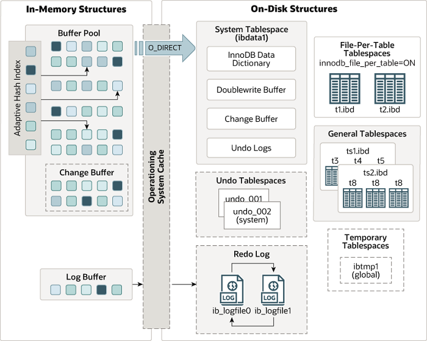
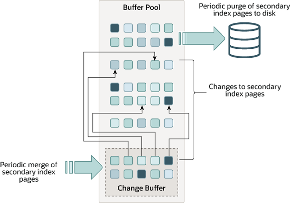

# InnoDB 스토리지 엔진의 구성요소 정리

## InnoDB 아키텍처



[이미지 출처](https://dev.mysql.com/doc/refman/5.7/en/innodb-architecture.html)

## InnoDB 버퍼 풀

InnoDB 스토리지 엔진에서 가장 핵심적인 부분

- 디스크의 데이터 파일이나 인덱스 정보를 **메모리에 캐시**해 두는 공간
    - 자주 사용하는 데이터를 메모리에서 직접 액세스할 수 있으므로 처리 속도가 빨라진다.
- 쓰기 작업을 지연시켜 일괄 작업으로 처리할 수 있게 해주는 **버퍼** 역할
    - 일반적인 애플리케이션에서 INSERT, UPDATE, DELETE와 같이 데이터를 변경하는 쿼리는 데이터 파일의 이곳저곳에 위치한 레코드를 변경하기 때문에 랜덤한 디스크 작업을 발생시킨다. 하지만 버퍼 풀이 이런 변경된 데이터를 모아서 처리(일괄처리)하게 되면 랜덤한 디스크 작업의 횟수를 줄일 수 있다.
- 데이터와 인덱스를 모두 캐시하고 쓰기 버퍼링의 역할까지 모두 처리. 그 밖에도 많은 백그라운드 작업의 기반이 되는 메모리 공간이다.
    - 때문에 **InnoDB 버퍼 풀의 크기(**`innodb_buffer_pool_size`**)는 신중하게 설정**하는 것이 좋다.
        - 운영체제와 각 클라이언트 스레드가 사용할 메모리를 충분히 고려해 설정해야 함
        - 일반적으로 전체 장착된 물리 메모리의 50~80% 수준으로 결정한다고 함
        - 설정하는 법(5.7) → [https://dev.mysql.com/doc/refman/5.7/en/innodb-buffer-pool-resize.html](https://dev.mysql.com/doc/refman/5.7/en/innodb-buffer-pool-resize.html)
- InnoDB 버퍼 풀은 **아직 디스크에 기록되지 않은 변경된 데이터를 가지고 있다 (Dirty page)**
    - 더티 페이지는 InnoDB에서 주기적으로 또는 어떤 조건이 되면 체크포인트 이벤트가 발생한다.
    - 이 때 write 스레드가 필요한 만큼의 더티 페이지만 디스크로 기록한다. 체크 포인트가 발생한다고 해서 버퍼 풀의 모든 더티 페이지를 디스크에 기록하는 건 아니다

## 언두(Undo) 로그

- 언두 영역은 UPDATE, DELETE같은 문장으로 데이터를 변경했을 때 **변경되기 전의 데이터를 보관하는 곳**

```java
UPDATE member SET name = '홍길동' WHERE member_id='1';
```

위 문장이 실행되면 트랜잭션을 커밋하지 않아도 실제 데이터 파일(데이터/인덱스 버퍼) 내용은 “홍길동"으로 변경된다. 변경되기 전의 값이 “벽계수"였다면 언두 영역에는 “벽계수"라는 값이 백업되는 것이다. 

- 이 상태에서 만약 커밋되면 현재 상태가 그대로 유지된다.
- 이 상태에서 만약 롤백되면 언두 영역의 백업된 데이터를 다시 데이터 파일(데이터/인데그 버퍼)로 복구한다.

- 언두의 데이터 용도
    - 트랜잭션의 롤백 대비용
    - 트랜잭션의 격리 수준을 유지하면서 높은 동시성을 제공하는데 사용

## 체인지 버퍼(Change Buffer)

RDBMS에서 레코드가 INSERT되거나 UPDATE될 때 데이터 파일을 변경하는 작업뿐 아니라 해당 테이블에 포함된 **인덱스를 업데이트하는 작업**도 필요하다. 그런데 인덱스를 업데이트하는 작업은 랜덤하게 디스크를 읽는 작업이 필요하므로 테이블에 인덱스가 많다면 이 작업은 많은 자원을 소모하게 된다. 

그래서 InnoDB는 변경해야 할 인덱스 페이지가 버퍼 풀에 있으면 바로 업데이트를 수행하지만, 그렇지 않고 디스크로부터 읽어와서 업데이트해야 한다면 이를 즉시 실행하지 않고 **임시 공간에 저장해두고 바로 사용자에게 결과를 반환**하는 형태로 성능을 향상시킨다. 이 때 사용하는 임시 메모리 공간을 체인지 버퍼 또는 인서트 버퍼라고 한다. 



[이미지 출처](https://dev.mysql.com/doc/refman/5.7/en/innodb-change-buffer.html)

- 유니크 인덱스는 체인지 버퍼를 사용할 수 없다 (사용자에게 결과를 전달하기 전에 중복 여부를 체크해야 하기 때문에)
- 체인지 버퍼에 임시로 저장되어 있는 인덱스 레코드 조각은 이후 백그라운드 스레드에 의해 병합된다.
- `innodb_change_buffering` 설정 파라미터를 통해 작업의 종류별로 체인지 버퍼를 활성화할 수 있다.
- 체인지 버퍼에 대한 질문 → [https://dev.mysql.com/doc/refman/5.7/en/faqs-innodb-change-buffer.html](https://dev.mysql.com/doc/refman/5.7/en/faqs-innodb-change-buffer.html)

## 리두(Redo) 로그 및 로그 버퍼

- 리두 로그 : **변경된 내용을 순차적으로 디스크에 기록하는 로그 파일.** 일반적으로 DBMS에서 로그라고 하면 이 리두 로그를 지칭하는 경우가 많다.
- 로그 버퍼 : 디스크의 로그 파일에 기록할 데이터를 보관(리두 로그 버퍼링)하는 메모리 영역
    - 로그 버퍼의 내용은 주기적으로 디스크에 플러시된다.
    - 로그 버퍼의 크기(`innodb_log_buffer_size`)의 기본 크기는 16MB.
        - 일반적으로 1~8MB 수준에서 설정하는 것이 적합하다고 함. 만약 BLOB이나 TEXT 같이 큰 데이터를 자주 변경하는 경우에는 더 크게 설정하는 것이 좋다.
    - `innodb_flush_log_at_trx_commit` : 로그 버퍼 내용이 디스크에 기록되고 플러시되는 방법을 제어
    - `innodb_flush_log_at_timeout` : 로그 플러시 빈도 제어
- 리두 로깅을 최적화 하는 방법 → [https://dev.mysql.com/doc/refman/5.7/en/optimizing-innodb-logging.html](https://dev.mysql.com/doc/refman/5.7/en/optimizing-innodb-logging.html)


## 참고자료

- Real MySQL
- [MySQL 5.7 레퍼런스](https://dev.mysql.com/doc/refman/5.7/en/innodb-storage-engine.html)