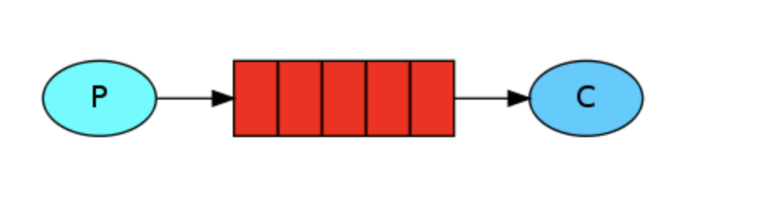
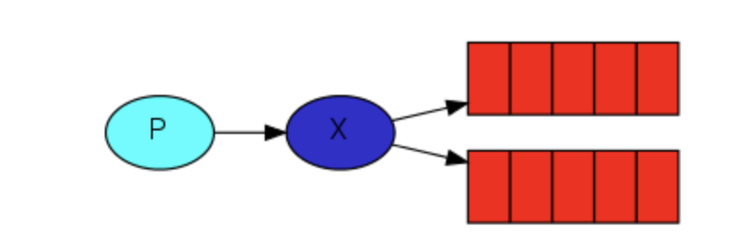
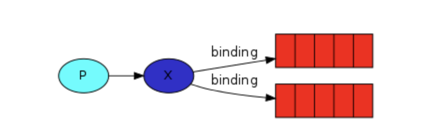
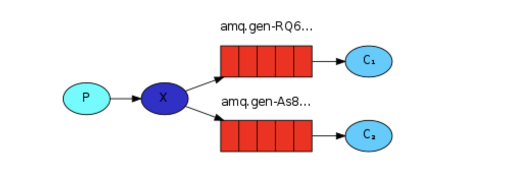
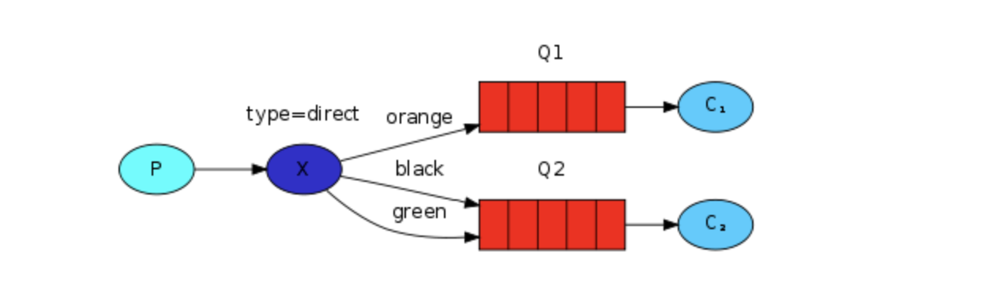

# RabbitMQ
## 비동기 메시징
- 애플리케이션 간 응답을 기다리지 않고 간접적으로 메시지를 전송하는 방법
- 통신하는 애플리케이션 간의 결합도를 낮추고 확장성을 높인다.
- 스프링에서 JMS, RabbitMQ, AMQP, Kafka 등을 제공한다.

## RabbitMQ?

- RabbitMQ는 **메시지 브로커**다.
    - 메시지를 수락하고 전달하는 역할 → `우체국`
        - 우편물을 우체국에 보내면 우편 배달부가 결국 우편물을 받는 사람에게 배달한다고 확신할 수 있다.
    - `Producer` : 메시지를 보내는 프로그램
    - `Queue` : 메시지를 저장하는 버퍼 (FIFO 방식)
    - `Consumer` : 메시지를 받는 프로그램

[https://www.rabbitmq.com/tutorials/tutorial-one-java.html](https://www.rabbitmq.com/tutorials/tutorial-one-java.html)

- RabbitMQ의 특징은 producer가 직접 큐로 메시지를 보내지 않는다는 점이다. **producer는 exchange에만 메시지를 보낼 수 있다.**
    - `exchange` : 한 쪽에서 producer로부터 메시지를 수신하고 다른 쪽에서는 큐로 푸시한다.
        - exchange는 수신한 메시지로 특정 큐에 추가해야 할지, 여러 큐에 추가할지, 폐기해야 할지는 exchange type에 따라 결정된다.

## Fanout 메시징 과정

[https://www.rabbitmq.com/tutorials/tutorial-three-java.html](https://www.rabbitmq.com/tutorials/tutorial-three-java.html)

1. Producer가 메시지를 보낸다. 메시지가 RabbitMQ 브로커에 도착하면 주소로 지정된 exchange로 들어간다. 

[https://www.rabbitmq.com/tutorials/tutorial-three-java.html](https://www.rabbitmq.com/tutorials/tutorial-three-java.html)

2. exchange의 메시지를 큐로 보낸다. exchage와 큐 사이의 관계를 바인딩(bindiing)이라고 한다. Fanout excahge는 모든 연결된 큐에 메시지를 보낸다.
    - 바인딩 키(`routeKey`) 값을 지정하면 메시지를 특정 큐로 보낼 수 있다. (Fanout은 모든 연결된 큐로 보내므로 무시됨)

[https://www.rabbitmq.com/tutorials/tutorial-three-java.html](https://www.rabbitmq.com/tutorials/tutorial-three-java.html)

 3. Consumer가 해당하는 큐로부터 메시지를 받는다.

## Exchange type

- `Default`
    - 브로커가 자동으로 생성하는 특별한 exchange
    - 해당 메시지의 라우팅 키와 이름이 같은 큐로 메시지를 전달한다.
    - 모든 큐는 자동으로 기본 exchange와 연결된다.
- `Direct`
    - **바인딩 키가 해당 메시지의 라우팅 키와 같은 큐에 메시지를 전달**한다.

[https://www.rabbitmq.com/tutorials/tutorial-four-java.html](https://www.rabbitmq.com/tutorials/tutorial-four-java.html)

- `Topic`
    - **바인딩 키가 해당 메시지의 라우팅 키와 일치하는 하나 이상의 큐에 메시지를 전달**한다.
- `Fanout`
    - 바인딩 키나 라우팅 키에 상관없이 **모든 연결된 큐에 메시지를 브로드캐스트**한다.
- `Headers`
    - Topic exchange와 유사하며, 라우팅 키 대신 메시지 헤더 값을 기반으로 한다는 것만 다르다.
- `Dead letter`
    - 전달 불가능한, 즉 정의된 어떤 exchange-queue 바인딩과도 일치하지 않는 모든 메시지를 보관하는 exchange

## 메시지 무손실성을 어떻게 보장할까?

메시지가 손실되지 않도록 하기 위해 RabbitMQ는 **메시지 승인(Message acknowledgment)**을 지원한다.

- Consumer는 특정 메시지가 수신 처리되었고, 이제 메시지를 삭제해도 된다는 ack를 RabbitMQ에게 보낸다.
- RabbitMQ가 Consumer로부터 ack를 받으면 메시지에 삭제 표시를 한다.

만약, Consumer가 ack를 보내지 않고 죽을 경우(ex. 채널이 닫히거나 TCP 연결이 끊어지거나)는 어떻게 될까? 

이 경우 RabbitMQ는 메시지가 완전히 처리되지 않았다고 판단해서 큐에 다시 메시지를 넣는다.(requeue 파라미터가 true) 죽지 않은 다른 Consumer가 있으면 그 Consumer에게 해당 메시지를 전달한다.(하지만 requeue 파라미터가 false로 설정되면 Dead Letter Exchange로 라우팅된다.)

## 참고자료

- [RabbitMQ Tutorials](https://www.rabbitmq.com/getstarted.html)
- [스프링 인 액션](http://www.yes24.com/Product/Goods/90180239)