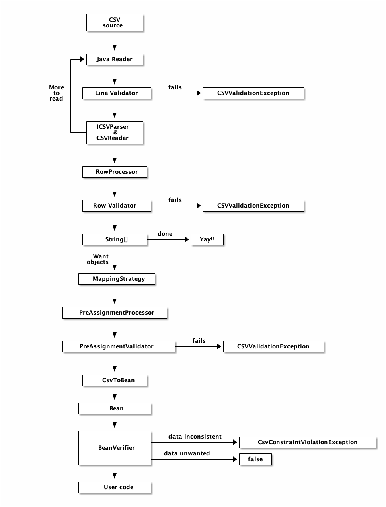

# OpenCSV를 사용해서 파일 읽기

## OpenCSV

### dependency 추가

```kotlin
implementation("com.opencsv:opencsv:5.8")
```

## CSVReader

### CSVReader를 사용하는 여러가지 방법

#### 기본으로 제공하는 생성자 사용 : CSVReader()

```kotlin
val reader = CSVReader(Files.newBufferedReader(csvFilePath))
reader.readAll()
```

#### 빌더 사용 : CSVReaderBuilder()

- 언제 사용?
    - CSVReader에서 제공하지 않는 구분자를 사용할 경우
        - ex. `.tsv` 파일은 기본 `CSVReader()`를 생성해서 읽을 수 없기 때문에 `CSVReaderBuilder`의 `withCSVParser`를 지정해서 `CSVReader`를 생성해야 한다.

```kotlin
val reader = CSVReaderBuilder(Files.newBufferedReader(tsvFilePath))
            .withCSVParser(CSVParserBuilder().withSeparator('\t').build())
            .build()
reader.readAll()
```

## CSVToBean

OpenCSV는 CSV 파일을 바로 빈(Bean) 목록으로 읽을 수 있다. 

### Bean Annotation

```csv
id,name,category,address,checkIn,checkOut,image1,image2,image3,facility
3000,A,HOTEL,주소1,15:00,11:00,3000 이미지1,이미지2,이미지3,수영장|피트니스 센터
3001,B,HOTEL,주소2,15:00,11:00,3001 이미지1,이미지2,이미지3,대형 회의실
3002,C,HOTEL,주소3,15:00,11:00,3002 이미지1,이미지2,이미지3,피트니스 센터|레스토랑
3003,D,PENSION,주소4,14:00,10:00,3003 이미지1,이미지2,이미지3,
```


#### 헤더가 있으면 : @CsvBindByName, @CsvCustomBindName

HeaderColumnNameMappingStrategy 을 선택한다.

```kotlin
@NoArg
data class HotelDto(
    @CsvBindByName(column = "id", required = true)
    val id: Long,

    @CsvBindByName(column = "name", required = true)
    val name: String,

    @CsvBindByName(column = "address")
    val address: String,

    @CsvBindByName(column = "checkIn")
    val checkIn: String,

    @CsvBindByName(column = "checkOut")
    val checkOut: String,

    @CsvBindAndJoinByName(column = "image[1-3]", elementType = String::class)
    val images: MultiValuedMap<String, String>,

    @CsvCustomBindByName(column = "facility", converter = ConvertSplitOnPipe::class)
    val facilities: List<String>,

    @CsvBindByName(column = "category")
    val category: HotelCategory,
)
```

- `@CsvBindByName`
    - 컬럼 명 기반으로 필드를 바인딩한다

```kotlin
    @CsvBindByName(column = "id", required = true)
    val id: Long,
```

- `@CsvBindAndJoinByName`
    - 여러 컬럼을 하나의 필드로 Join하고 싶을 때 사용
    - ex. image1, image2, image3 처럼 1,2,3의 규칙을 가진 여러 컬럼을 하나의 필드로 묶고 싶을 경우 column을 `image[1-3]` 으로 설정한다.

```kotlin
    @CsvBindAndJoinByName(column = "image[1-3]", elementType = String::class)
    val images: MultiValuedMap<String, String>,
```

- `@CsvCustomBindName`
    - 컬럼 값을 특정한 타입의 필드로 변환하고 싶을 때 사용
    - converter를 지정해야 한다. 해당 클래스는 `AbstractBeanField` 타입이어야 한다.
        - `AbstractBeanField` 를 상속 받아 구현하는데, `convert(String)` 을 오버라이딩해서 어떻게 커스텀하게 변환할 건지 기술한다.
    - ex. facility 컬럼에는 `수영장|피트니스 센터` 같이 `|` 문자로 구분했다. 이 경우 converter 클래스를 지정해 `|` 문자로 split해서 List<String> 으로 변환할 수 있다.

```kotlin
@CsvCustomBindByName(column = "facility", converter = ConvertSplitOnPipe::class)\
val facilities: List<String>
```

```kotlin
class ConvertSplitOnPipe: AbstractBeanField<String, String>() {

    override fun convert(value: String): List<String> {
        return value.split("|")
    }

}
```

#### 헤더가 없으면 : @CsvBindByPosition, @CsvCustomBindByPosition

ColumnPositionMappingStrategy 를 사용한다.

```kotlin
@NoArg
data class HotelNoHeaderDto(
    @CsvBindByPosition(position = 0)
    val id: Long,

    @CsvBindByPosition(position = 1)
    val name: String,

    @CsvBindByPosition(position = 3)
    val checkIn: String,

    @CsvBindByPosition(position = 4)
    val checkOut: String,

    @CsvBindAndJoinByPosition(position = "5-7", elementType = String::class)
    val images: MultiValuedMap<Integer, String>
)
```

- `@CsvBindByPosition`
    - 컬럼의 위치(position) 기반으로 필드를 바인딩한다. 순서가 명확하고, 헤더가 없는 경우 사용한다.`
- `@CsvBindAndJoinByPosition`
    - 여러 컬럼을 하나의 필드로 Join하고 싶을 때 사용
    - column이 아닌 position으로 묶는다.

### CsvToBeanBuilder 생성

```kotlin
CsvToBeanBuilder<HotelDto>(reader)
            .withType(HotelDto::class.java)
            .withIgnoreEmptyLine(true)
            .withVerifier(AvailableHotelVerifier())
            .withVerifier(OnlyHotelCategoryVerifier())
            .build() // CsvToBean<HotelDto>
```

- `withType` : 변환할 Bean 타입을 설정한다.
    - type 또는 mappingStrategy은 필수 지정해야 한다.

#### withIgnoreEmptyLine

- 기본은 `false`
- CSV 파일에 빈 라인이 있을 경우 에러가 발생한다.
    
    ```kotlin
    CsvRequiredFieldEmptyException: Number of data fields does not match number of headers.
    ...(생략)
    Error parsing CSV line: {line}. []
    ```
    
- 빈 라인은 무시하고 파일을 읽고 싶을 경우 `withIgnoreEmptyLine(true)` 로 설정한다.

#### withVerifier()

- 생성된 Bean을 검증할 수 있다.
- `BeanVerifier` 인터페이스를 구현해서 커스텀한 Verifier를 만든다.
    - 빈이 부정확할 경우 `CsvConstraintViolationException`을 발생시킨다.
    - 생성된 빈을 필터링할 경우 `false`를 리턴한다.

> 생성된 Bean을 확인하고 선택적으로 필터링합니다. 
생성된 Bean이 어떤 방식으로든 일관성이 없어 허용되지 않는 경우 이 메서드는 CsvConstraintViolationException 발생시킵니다. 
그러나 Bean이 본질적으로 정확하지만 어떤 논리적인 이유로 자동으로 필터링되어야 하는 경우 메소드는 false 반환해야 합니다.
> 

- ex.
    - 특정 호텔을 제외하고 수집하고 싶다.
    - 카테고리가 호텔인 것만 수집하고 싶다.

```kotlin
// 블랙리스트 호텔에 포함되지 않는지 확인
class AvailableHotelVerifier: BeanVerifier<HotelDto> {

    companion object {
        val BLACK_LIST_HOTEL_IDS = listOf(3000L)
    }

    override fun verifyBean(bean: HotelDto?): Boolean {
        return bean != null && BLACK_LIST_HOTEL_IDS.contains(bean.id).not()
    }
}

// 카테고리가 호텔인지 확인
class OnlyHotelCategoryVerifier: BeanVerifier<HotelDto> {

    override fun verifyBean(bean: HotelDto?): Boolean {
        return bean != null && bean.category == HotelCategory.HOTEL
    }
}
```

#### CsvToBean.parse(),  CsvToBean.stream()

- parse()
    - Bean 목록을 `List<T>` 로 반환한다.

```kotlin
val hotelList: List<HotelDto> = CsvToBeanBuilder<HotelDto>(reader)
            .withType(HotelDto::class.java)
            .withIgnoreEmptyLine(true)
            .build()
            .parse()
```

```java
public List<T> parse() throws IllegalStateException {
        return stream().collect(Collectors.toList());
}
```

- stream()
    - Bean 목록을 `Stream<T>`로 반환한다.
    - List에 결과를 중간에 저장하는 연산이 없기 때문에 parse() 에 비해 약간의 시간, 공간을 절약할 수 있다.

```kotlin
val hotelStream: Stream<HotelDto> = CsvToBeanBuilder<HotelDto>(reader)
            .withType(HotelDto::class.java)
            .withIgnoreEmptyLine(true)
            .build()
            .stream()
```

#### CsvToBean.iterator()

- iterator()
    - `CsvToBeanIterator` 가 반환된다.
        - 하나의 Line을 읽고 하나의 Bean을 반환한다.
```kotlin
        Files.newBufferedReader(csvFilePath).use {
            val hotelCsvToBean = CsvToBeanBuilder<HotelDto>(reader)
                .withType(HotelDto::class.java)
                .withIgnoreEmptyLine(true)
                .build()
                .iterator()

            while (hotelCsvToBean.hasNext()) {
                val hotel = hotelCsvToBean.next()
                println(hotel)
            }
        }
```

#### CSV → Bean 성능 이슈는 없을까?

기본으로 `CSVToBean`으로 읽을 때 멀티 스레드 기반으로 파일을 읽는다. 

1. Time vs Memory
    - 메모리가 문제가 되지 않는 경우 `CsvToBean.parse()` 또는 `CsvToBean.stream()`을 사용하여 한꺼번에 모든 빈을 읽을 수 있다. 읽을 때 멀티 스레드로 처리된다.
    - 메모리가 제한적인 경우 `CsvToBean.iterator()`를 사용하고 입력을 반복 처리한다. 한 번에 하나의 빈만 읽기 때문에 멀티 스레딩은 불가능하며 읽기가 느려지지만 한 번에 하나의 객체만 메모리에 있다.
2. Ordered vs Unordered
    - 기본적으로 OpenCSV는 주어진 데이터의 순서를 보존한다.
    - 병렬 프로그래밍을 사용할 때 순서를 유지하려면 추가 작업이 필요하다.
    - 순서가 중요하지 않다면 `CsvToBeanBuilder.withOrderedResults(false)` 를 사용하면 된다.


## OpenCSV에서 파일 읽는 과정
OpenCSV에서는 위에서 언급한 것 말고도 CSV source를 읽는 과정에서 여러 Validator와 Processor를 사용할 수 있도록 제공한다.



## 참고자료
- [OpenCSV Users Guide](https://opencsv.sourceforge.net/)

