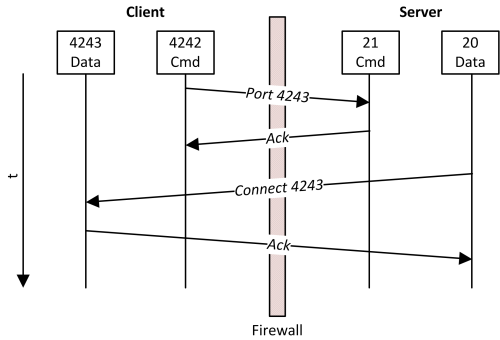
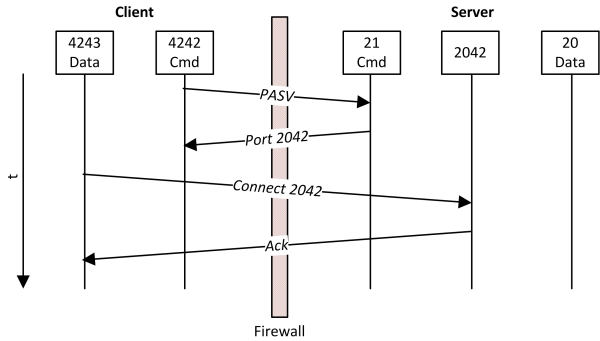

# FTP

## FTP?

- 파일 전송 프로토콜(File Transfer Protocol)
- TCP/IP 네트워크 상에서 컴퓨터들이 파일을 교환하기 위한 통신 규약
- 데이터를 평문으로 전송하여 보안이 취약하다는 단점
    - 이 단점을 개선한 SFTP(Secure File Transfer Protocol), FTPS(FTP over SSL/TLS)도 있다
- `http://` 가 아닌  `ftp://` 로 시작

## FTP 클라이언트에서 FTP 서버를 접속해 파일을 읽어보자

호랑이 담배 피던 시절(?) FileZilla 라는 FTP 클라이언트 프로그램에서 war 파일을 업로드 후 putty를 통해 커맨드로 배포했던 추억이 있다. 추억을 되살려 FTP 클라이언트 프로그램으로 계정 정보를 입력하니 서버에 있는 파일 목록들이 보인다. 다운로드도 당연히 잘 된다.

애플리케이션에 Apache Commons Net 이라는 FTP 라이브러리를 사용해서 파일을 읽어보는 건 식은 죽 먹기겠지.

chatGTP한테 물어봐서 빠르게 연동 코드를 작성 해본다.

```kotlin
dependencies {
    implementation("commons-net:commons-net:3.10.0")
}
```

```kotlin
import org.apache.commons.net.ftp.FTPClient
import org.apache.commons.net.ftp.FTPReply
import java.io.*

fun main() {
    val server = "ftp.example.com" // FTP 서버 주소
    val port = 21 // FTP 포트 (기본값은 21)
    val username = "your-username"
    val password = "your-password"
    val remoteFilePath = "/path/to/remote/file.txt" // 원격 파일 경로

    val ftpClient = FTPClient()

    try {
        ftpClient.connect(server, port)
        val reply = ftpClient.replyCode

        if (!FTPReply.isPositiveCompletion(reply)) {
            println("FTP 서버에 연결할 수 없습니다.")
            return
        }

        val loggedIn = ftpClient.login(username, password)

        if (!loggedIn) {
            println("로그인 실패")
            return
        }

        println("FTP 서버에 연결되었습니다.")

        // 파일 다운로드
        val localFilePath = "local-file.txt" // 로컬에 저장할 파일 경로
        val fileOutputStream = FileOutputStream(localFilePath)
        val success = ftpClient.retrieveFile(remoteFilePath, fileOutputStream)

        if (success) {
            println("파일 다운로드 완료: $localFilePath")
        } else {
            println("파일 다운로드 실패")
        }

        fileOutputStream.close()
        ftpClient.logout()
    } catch (e: Exception) {
        e.printStackTrace()
    } finally {
        if (ftpClient.isConnected) {
            try {
                ftpClient.disconnect()
            } catch (e: IOException) {
                e.printStackTrace()
            }
        }
    }
}
```

1. FTPClient를 생성한다.
2. FTP 서버에 연결(connect)하고 로그인(login) 한다.
3. 해당 path에 있는 파일을 다운로드 한다. 
    1. `ftpClient.retrieveFile(remoteFilePath, fileOutputStream)`
4. 로그아웃(logout) 후 커넥션을 닫는다.(disconnect)

chatGPT가 알려주는대로 해당 코드의 로그인 정보만 바꿔서 서버(클라이언트)를 실행했다.

원격 FTP 서버에 1번, 2번은 성공했다. 하지만 3번 `ftpClient.retrieveFile(remoteFilePath, fileOutputStream)` 라인에서 `Socket connection Timeout` 이 발생한다. 도대체 왜 그러는걸까?

### 연결은 된 거 같은데… 왜 파일은 못 읽나요?

어디까지 정상적으로 되고, 어느 부분에서 동작이 안되는지 확인해보니 아래와 같았다.

|  | 연결 | 로그인 | 디렉토리 이동 | 파일 목록 | 다운로드 |
| --- | --- | --- | --- | --- | --- |
| FTP 클라이언트 프로그램 (GUI) | O | O | O | O | O |
| FTP 클라이언트 애플리케이션 (Apache Commons Net) | O | O | O | X | X |

리스팅을 해봐도 감이 안 잡혀 이슈 공유를 했는데 어떤 분이 ‘데이터 포트 문제인가?’ 이런 말을 하셨다.

데이터 포트… 데이터를 보낼만한 파일 목록, 다운로드만 작동이 안된다? 냄새가 난다. 

관련해서 검색을 해보니 FTP에서는 **포트를 2개 사용**한다는 점, 그리고 **Active 모드와 Passive 모드**라는 두 가지 데이터 접속 방식을 제공한다는 걸 알게 되었다.

> FTP에서 데이터 전송을 위해서 20번 포트를 사용합니다. 이 경우 서버에서 클라이언트 쪽으로 연결을 하기 때문에 중간에 방화벽 또는 공유기등을 사용한다면, 정상작동하지 않을 수 있습니다. 이런 문제를 해결하기위해서 PASSIVE모드라는 것이 있고, 이 모드에서는 서버의 1024이후 포트를 사용합니다
> 

그동안 원격 FTP 서버를 제공해주는 측의 잘못이라고 원망(?)만 하고 있었는데, 이걸 보고 클라이언트 서버 측 문제 (= 내 잘못)일 거 같은 확신이 들었다. 

현재 FTPClient의 mode를 확인해보니 Active 모드였다. Apache Commons Net은 설정을 안 할 경우 기본으로 Active 모드로 세팅된다.

> Creates a new FTPClient instance with the data connection mode set to <code> ACTIVE_LOCAL_DATA_CONNECTION_MODE </code>
> 

```java
    public FTPClient() {
        initDefaults();
        dataTimeout = Duration.ofMillis(-1);
        remoteVerificationEnabled = true;
        parserFactory = new DefaultFTPFileEntryParserFactory();
        configuration = null;
        listHiddenFiles = false;
        useEPSVwithIPv4 = false;
        random = new Random();
        passiveLocalHost = null;
    }
```

```java
private void initDefaults() {
        dataConnectionMode = **ACTIVE_LOCAL_DATA_CONNECTION_MODE**;
				// ... 그 외 필드 세팅 생략
		}

 		/**
     * A constant indicating the FTP session is expecting all transfers to occur between the client (local) and server and that the server should connect to the
     * client's data port to initiate a data transfer. **This is the default data connection mode when and FTPClient instance is created.**
     */
    public static final int ACTIVE_LOCAL_DATA_CONNECTION_MODE = 0;
```

그렇게 기본 값으로 Active 모드로 세팅되고  `retrieveFile` 을 호출했을 때 내부에서는 아래 순서로 실행된다.

소켓 관련 에러니 `_openDataConnection_()` 메서드가 의심스럽다.

```java
protected boolean _retrieveFile(final String command, final String remote, final OutputStream local) throws IOException {
        **final Socket socket = _openDataConnection_(command, remote);**

        if (socket == null) {
            return false;
        }

        InputStream input = null;
        CSL csl = null;
        try {
						// 대충 파일 remote 파일 읽고 local 파일로 쓰는 코드
            return completePendingCommand();
        } finally {
            Util.closeQuietly(socket);
            if (csl != null) {
                cslDebug = csl.cleanUp(); // fetch any outstanding keepalive replies
            }
        }
    }
```

```java
protected Socket _openDataConnection_(final String command, final String arg) throws IOException {
        if (dataConnectionMode != ACTIVE_LOCAL_DATA_CONNECTION_MODE && dataConnectionMode != PASSIVE_LOCAL_DATA_CONNECTION_MODE) {
            return null;
        }

        final boolean isInet6Address = getRemoteAddress() instanceof Inet6Address;

        final Socket socket;

        final int soTimeoutMillis = DurationUtils.toMillisInt(dataTimeout);
				// Active 모드
        if (**dataConnectionMode == ACTIVE_LOCAL_DATA_CONNECTION_MODE**) {
            try (final ServerSocket server = _serverSocketFactory_.createServerSocket(getActivePort(), 1, getHostAddress())) {
                if (isInet6Address) {
                    if (!FTPReply.isPositiveCompletion(eprt(getReportHostAddress(), server.getLocalPort()))) {
                        return null;
                    }
                } else if (!FTPReply.isPositiveCompletion(port(getReportHostAddress(), server.getLocalPort()))) {
                    return null;
                }

                if (restartOffset > 0 && !restart(restartOffset)) {
                    return null;
                }

                if (!FTPReply.isPositivePreliminary(sendCommand(command, arg))) {
                    return null;
                }

                if (soTimeoutMillis >= 0) {
                    server.setSoTimeout(soTimeoutMillis);
                }
                socket = server.accept();

                if (soTimeoutMillis >= 0) {
                    socket.setSoTimeout(soTimeoutMillis);
                }
                if (receiveDataSocketBufferSize > 0) {
                    socket.setReceiveBufferSize(receiveDataSocketBufferSize);
                }
                if (sendDataSocketBufferSize > 0) {
                    socket.setSendBufferSize(sendDataSocketBufferSize);
                }
            }
        } else { // We must be in PASSIVE_LOCAL_DATA_CONNECTION_MODE (Passive 모드)

            // Try EPSV command first on IPv6 - and IPv4 if enabled.
            // When using IPv4 with NAT it has the advantage
            // to work with more rare configurations.
            // E.g. if FTP server has a static PASV address (external network)
            // and the client is coming from another internal network.
            // In that case the data connection after PASV command would fail,
            // while EPSV would make the client succeed by taking just the port.
            final boolean attemptEPSV = isUseEPSVwithIPv4() || isInet6Address;
            if (attemptEPSV && epsv() == FTPReply.ENTERING_EPSV_MODE) {
                _parseExtendedPassiveModeReply(_replyLines.get(0));
            } else {
                if (isInet6Address) {
                    return null; // Must use EPSV for IPV6
                }
                // If EPSV failed on IPV4, revert to PASV
                if (pasv() != FTPReply.ENTERING_PASSIVE_MODE) {
                    return null;
                }
                _parsePassiveModeReply(_replyLines.get(0));
            }

            socket = _socketFactory_.createSocket();
            if (receiveDataSocketBufferSize > 0) {
                socket.setReceiveBufferSize(receiveDataSocketBufferSize);
            }
            if (sendDataSocketBufferSize > 0) {
                socket.setSendBufferSize(sendDataSocketBufferSize);
            }
            if (passiveLocalHost != null) {
                socket.bind(new InetSocketAddress(passiveLocalHost, 0));
            }

            // For now, let's just use the data timeout value for waiting for
            // the data connection. It may be desirable to let this be a
            // separately configurable value. In any case, we really want
            // to allow preventing the accept from blocking indefinitely.
            if (soTimeoutMillis >= 0) {
                socket.setSoTimeout(soTimeoutMillis);
            }

            socket.connect(new InetSocketAddress(passiveHost, passivePort), connectTimeout);
            if (restartOffset > 0 && !restart(restartOffset)) {
                socket.close();
                return null;
            }

            if (!FTPReply.isPositivePreliminary(sendCommand(command, arg))) {
                socket.close();
                return null;
            }
        }

        if (remoteVerificationEnabled && !verifyRemote(socket)) {
            // Grab the host before we close the socket to avoid NET-663
            final InetAddress socketHost = socket.getInetAddress();

            socket.close();

            throw new IOException(
                    "Host attempting data connection " + socketHost.getHostAddress() + " is not same as server " + getRemoteAddress().getHostAddress());
        }

        return socket;
    }
```

### 원인

- Control Connection은 성공했지만 Data Connection에서 실패함
- Apache Commons Net는 기본 설정이 Active mode
- 클라이언트 서버는 방화벽 설정 또는 공유기가 있어 외부 접속이 불가능.

### 해결 방법

- Passive mode 로 설정한다.

```java
// 패시브 모드로 전환
ftpClient.enterLocalPassiveMode()
```

1. FTPClient를 생성한다.
2. FTP 서버에 연결(connect)하고 로그인(login) 한다.
3. Active → Passive 모드로 전환한다.
    1. `ftpClient.enterLocalPassiveMode()`
4. 해당 path에 있는 파일을 다운로드 한다. 
    1. `ftpClient.retrieveFile(remoteFilePath, fileOutputStream)`
5. 로그아웃(logout) 후 커넥션을 닫는다.(disconnect)

## FTP 데이터 통신

### Connection

FTP는 Control Connection, Data Connection 두 가지 포트를 연결해야 한다.

- Control Connection
    - 클라이언트와 서버 간의 연결을 제어
    - ID, 비밀번호, 원격 디렉토리 변경 등과 같은 제어 정보를 전송하기 위해 Control Connection을 사용한다.
    - Control Connection은 포트 21번을 사용한다.
- Data Connection
    - 클라이언트와 서버 간의 파일 데이터 전송
    - 실제 파일을 전송하기 위해 Data Connection 을 사용한다.
    - Data Connection은 포트 20번을 사용한다.

### Data Connection Mode

Data Connection을 맺을 때 FTP 세션은 Active Mode 또는 Passive Mode 중 하나의 방법을 선택해서 요청해야 한다.

- Active Mode
    - 클라이언트가 Command 채널을 통해 세션을 시작하면 서버는 Data Connection을 시작하고 클라이언트와 데이터 통신을 시작한다.
    - 클라이언트가 서버의 데이터 포트에 직접 연결을 시작하지 않는다. 대신 클라이언트는 자체 데이터 포트를 서버에 알리고, 서버가 응답이 오면 연결이 완료된다.
    - 때문에 클라이언트가 방화벽이나 NAT 장치 뒤에 있어 외부의 접속이 허용되지 않는 경우 데이터 채널 연결이 불가능할 수 있다. 연결하기 위해서는 방화벽 추가 구성이 필요하다.



- Passive Mode
    - 서버는 Command 채널을 통해 Data 채널을 시작하는데 필요한 정보를 클라이언트에 보낸다.
    - 클라이언트가 PASV 명령어를 전송하면 Passive Mode로 전환된다. 서버는 클라이언트에게 데이터 포트를 지정하고 클라이언트가 해당 포트로 연결을 수립한다.
    - Active 모드에서 발생하는 방화벽 및 네트워크 문제를 피할 수 있다.
    - 일반적으로 인터넷을 통해 FTP를 사용할 때 권장되는 모드



### 정리

1. 클라이언트는 포트 21번을 사용하여 서버에 대한 Control Connection을 설정한다.
2. 클라이언트는 사용자 이름과 비밀번호를 서버에 보낸다.
3. 서버에 Data Connection 모드(Active 또는 Passive)를 요청한다.
4. 클라이언트와 서버는 Active 모드일 경우 20번, Passive 모드일 경우 랜덤한 포트를 사용하여 데이터 연결을 설정한다.
5. 클라이언트는 Data Connection을 통해 서버와 파일을 전송하는 명령을 보낸다.
6. 클라이언트는 파일 전송이 완료된 후 Data Connection을 닫는다.
7. 클라이언트는 Control Connection을 종료하는 명령을 보낸다.

## 참고자료

[https://cafe24.zendesk.com/hc/ko/articles/5729931658649-FTP는-어떻게-사용하나요-](https://cafe24.zendesk.com/hc/ko/articles/5729931658649-FTP%EB%8A%94-%EC%96%B4%EB%96%BB%EA%B2%8C-%EC%82%AC%EC%9A%A9%ED%95%98%EB%82%98%EC%9A%94-)

[https://www.geeksforgeeks.org/file-transfer-protocol-ftp-in-application-layer/](https://www.geeksforgeeks.org/file-transfer-protocol-ftp-in-application-layer/)

[https://www.pynetlabs.com/ftp-file-transfer-protocol/](https://www.pynetlabs.com/ftp-file-transfer-protocol/)

[https://infosys.beckhoff.com/english.php?content=../content/1033/tf6300_tc3_ftp/82912779.html&id=](https://infosys.beckhoff.com/english.php?content=../content/1033/tf6300_tc3_ftp/82912779.html&id=)

[https://peemangit.tistory.com/66](https://peemangit.tistory.com/66)