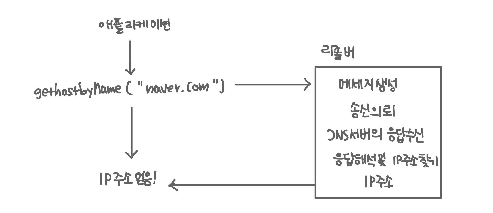
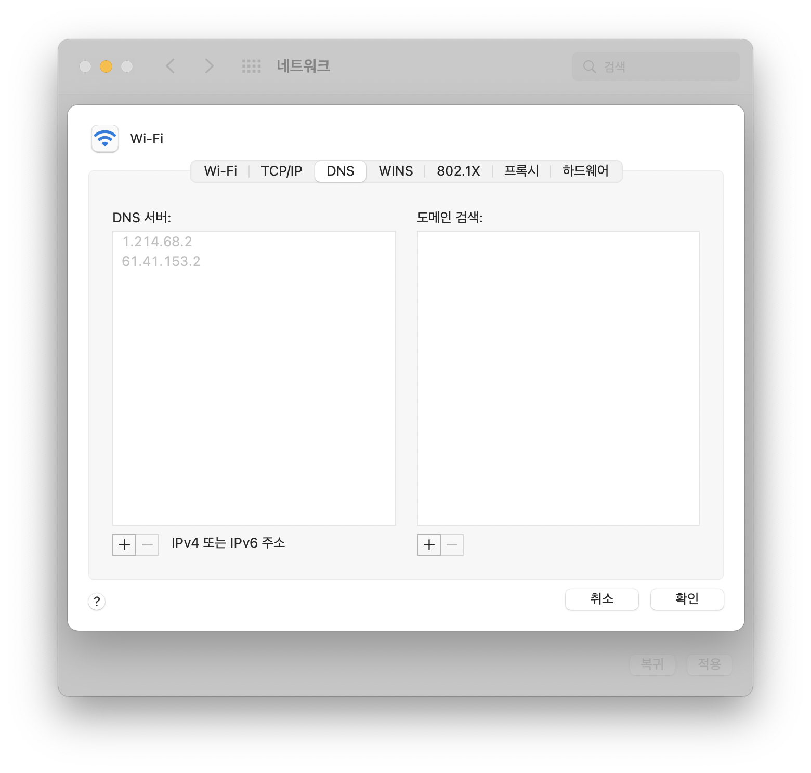
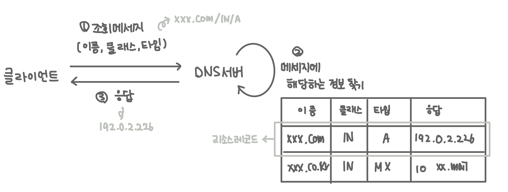
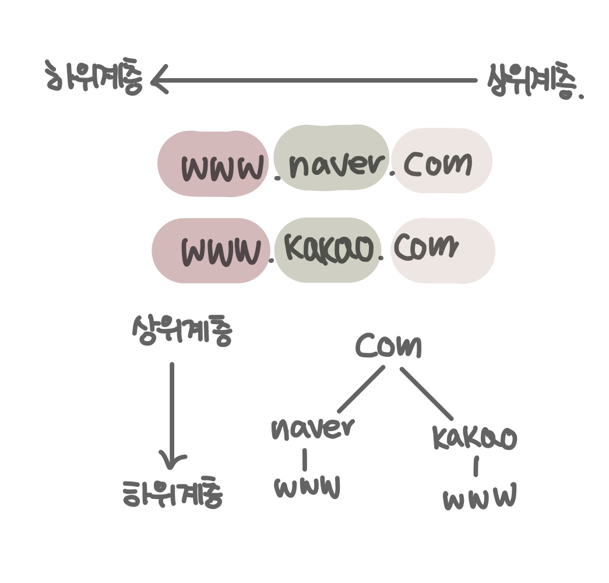
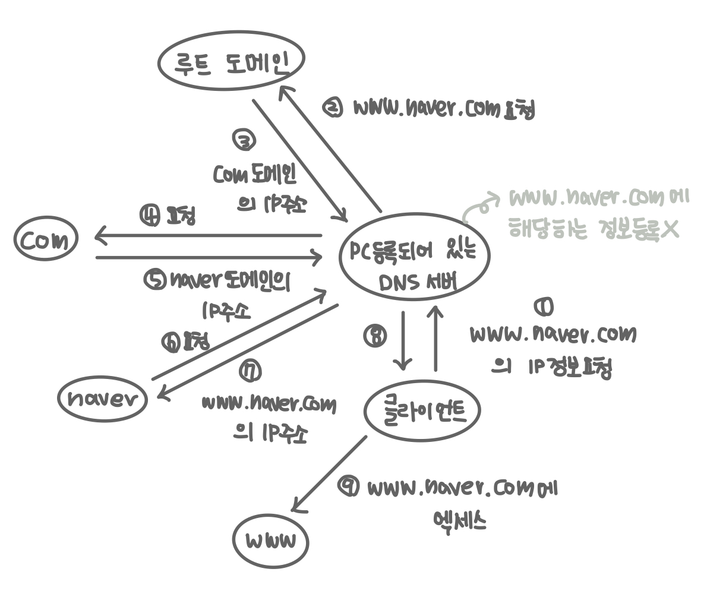
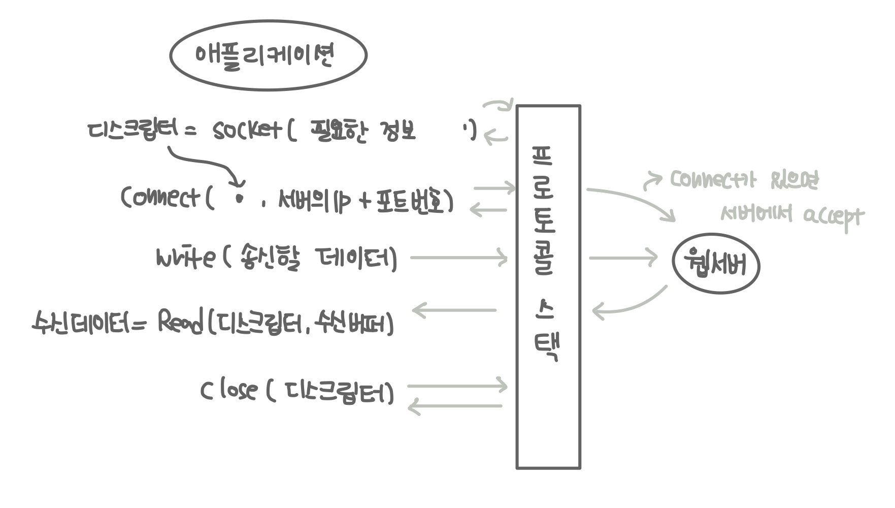

# 01. 웹브라우저가 메세지를 만든다.

### 웹브라우저 송,수신 프로세스

1. HTTP request message 작성

   - URL의 의미에 따라 request message 작성
   - 브라우저는 request message 에 따라 웹 서버에 무엇을 하려는지를 전달

2. 웹 서버의 IP 주소를 DNS 서버에 조회

   - 메세지를 OS 에 의뢰하여 웹 서버에 전송
   - 메세지를 넘기는 상대의 IP 주소를 OS에 통지해야 하는데, 이 때 DNS 서버에서 조회

3. 프로토콜 스택에 메세지 송신 의뢰

---

- DNS란 무엇인가?
- DNS는 왜 필요한가?
- DNS는 어떻게 동작하는가?
- 프로토콜 스택이란 무엇인가?

---

## DNS란 무엇인가요?

- Domain Name System
- 특정 컴퓨터의 주소를 찾기 위해, 사람이 이해하기 쉬운 도메인 이름을 숫자로 된 식별 번호(IP)로 변환해 줍니다.

<br>

## DNS는 왜 필요한가요?

### 도메인명과 IP주소를 구분하여 사용하는 이유

- 효율성을 따라서 IP주소를 사용하게 되었습니다.
- ip주소는 4바이트분의 수치만 취급하면 되지만, 도메인명을 사용하는 경우 수십 바이트에서 255바이트까지의 문자를 취급하여야 합니다.
- 처리해야 할 데이터의 양이 많아지기 때문에 라우터가 부하되어 데이터를 운반하는 동작에 더 많은 시간이 걸리게 되어 네트워크의 속도가 느려지게 됩니다.

### 사람은 이름을 사용하고, 라우터는 IP를 사용합니다.

- 때문에 DNS는 양쪽의 표현의 차이를 해소하기 위해 존재합니다.

<br>

## DNS는 어떻게 동작하나요?

### 브라우저는 어떻게 DNS에서 도메인에 해당하는 IP를 조회할 수 있을까요?

- DNS 리졸버
- 네임 리졸루션

<br>
  
 먼저 브라우저는 http메세지를 보낼 대상의 IP를 알기 위해서 DNS서버를 조사합니다. 
 NS서버를 조사하는 것은 가장 가까운 DNS서버에 입력한 도메인의 IP주소를 요청하는 것입니다. DNS서버에 조회 메세지를 보내고, 메세지에 대한 응답을 받아 도메인의 IP주소를 찾을 수 있습니다.

DNS서버에 대해서 클라이언트처럼 동작함으로 이 기능을 수행하는 것을 `DNS 리졸버(DNS resolver)`라고 하고, 도메인 리졸버를 통해 ip주소를 찾는 것을 `네임 리졸루션(name resolution)`이라고 합니다. resolver는 소켓 라이브러리의 부품화한 프로그램중의 하나입니다.

다음과 같은 메서드를 통해 리졸버를 호출하고, 리졸버가 dns에 ip주소 조회를 요청하고, 메서드의 리턴값을 통해 ip주소가 포함되어 있는 정보를 얻을 수 있습니다.
리졸버는 각 언어나 프레임워크에 따라 구현됩니다.)

```c#
   IPHostEntry hostInfo = Dns.GetHostByName(hostName);
```

- [c# getHostByName 예시](https://docs.microsoft.com/ko-kr/dotnet/api/system.net.dns.gethostbyname?view=net-6.0)

#### dns 서버로부터 ip주소를 얻는 과정

호출된 리졸버의 내부에서는 다음과 같은 과정을 거쳐 ip 주소를 dns 서버로부터 얻어내고 반환합니다.

- DNS 서버에 문의하기 위한 메세지 생성
- 생성한 메세지를 os 내부에 포함된 프로토콜 스택 호출하여 송신 의뢰
- 프로토콜 스택을 거쳐 DNS 서버에서 돌아온 응답 수신
- ip주소를 담은 정보를 찾고, 해당 정보를 애플리케이션에 반환



dns 서버에 메세지를 송신할 때도 dns서버의 ip주소가 필요한데 이는 미리 컴퓨터에 설정되어있습니다. 맥에서는 다음과 같이 설정되어 있습니다.



### DNS 서버에서 어떻게 도메인에 해당하는 IP를 찾을 수 있을까요?

dns 서버는 클라이언트로부터 다음 내용이 있는 메시지를 받습니다.

- **이름** : 서버나 메일 배송 목적지와 같은 이름입니다.
- **클래스** : 여러가지 네트워크 종류를 구분하기 위해 클래스 정보를 사용합니다. (현재는 인터넷 외의 네트워크는 소멸되었습니다.)
- **타입** : 이름에 어떤 종류의 정보가 지원되는지를 나타냅니다. (A = IP주소 지원, MX = 메일 배송 목적지 지원)

<br>

dns 서버에는 위의 세가지 항목에 대응하는 정보에 대해서 응답 내용을 미리 등록해 두어 클라이언트로부터 메시지가 올 때 세 가지 내용에 해당하는 정보를 찾고 등록해둔 응답 내용을 클라이언트에 보냅니다.



### DNS 서버는 많은 도메인 데이터를 어떻게 관리할까요?

dns은 많은 정보를 관리하기 위해 정보를 분산시켜 다수의 dns서버에 등록하고, 다수의 dns서버가 연대하여 어디에 정보가 등록되어 있는지 찾아 클라이언트의 요청에 응답합니다.

dns는 정보를 분산, 다수의 dns서버에 등록하기 위해서 도메인명을 통해 dns서버를 계층화합니다. 도메인명은 다음과 같은 계층으로 나눌 수 있습니다. 그리고 각 계층에 있는 요소를 도메인이라고 합니다. 하나의 도메인 서버에 도메인 한 대를 등록합니다.


가까운 dns서버에 찾고자 하는 정보가 없는 경우 dns는 계층 구조를 활용하여 필요한 정보를 탐색합니다. 계층 구조에서 자식 dns 서버의 IP주소를 부모 dns서버에 등록하고, 모든 dns서버에 루트 도메인의 dns서버를 모든 dns서버에 등록하여 모든 dns서버를 탐색할 수 있도록 합니다.

루트 도메인을 모든 dns 서버에 등록함으로써 클라이언트에서 dns 서버에서 정보를 찾고자 할 때 루트 도메인을 경유하여 원하는 정보를 찾을 수 있도록 합니다.

많은 dns서버에서 클라이언트가 원하는 정보를 찾는 과정은 다음 그림과 같습니다.



dns 서버는 한 번 조사한 정보를 캐시에 기록할 수 있기 때문에 dns가 위의 그림처럼 동작하지 않는 경우도 있습니다.

## 프로토콜 스택이란 무엇인가요?

http메세지를 생성하고, 보내고자 하는 목적지를 알아냈으면 실제로 메시지를 보내는 일을 수행해야 합니다. 그러나 브라우저나 다른 애플리케이션은 직접적으로 메세지를 송신할 수 없기 때문에 os의 내부에 있는 프로토콜 스택에 메세지 송신을 의뢰합니다.

프로토콜 스택이란 데이터 통신에 활용된느 프로토콜의 구조에 관한 개념으로 계층화된 구조로 모여있는 프로토콜의 집합입니다. 프로토콜 스택은 5개의 계층으로 이루어져 있습니다. 상위부터 application(http, smtp) - transport(tcp/udp) - network or internet (ip) - data link(ethernet, wifi) - physical(10base) 로 이루어져 있습니다.

브라우저 또는 다른 애플리케이션을 통해 메세지를 만들어 application 계층을 지나면 실제로 데이터가 전송되기 위해 나머지 계층(os 내부의 네트워크 제어용 소프트웨어(transport, network, data link layer))와 네트워크용 하드웨어(physical layer)을 통과해야 합니다.

os내부의 프로토콜 스택에 메세지 송신을 요청하기 위해서는 Socket라이브러리의 메소드를 다음과 같이 과정을 따라 사용합니다. 다음 과정은 모두 os내부의 프로토콜 스택에서 동작합니다.

1. 소켓 생성
2. 서버측의 소켓에 파이프 연결 (접속)
3. 데이터 송, 수신(송, 수신)
4. 파이프 분리 및 소켓 말소(연결 정리)



소켓은 네트워크 워크를 경유하는 프로세스 간 통신의 종착점입니다. 네트워크 통신을 위해서는 소켓을 생성하고, 연결해야 합니다.

먼저, 1번 소켓 생성을 통해서 소켓을 생성하면 `디스크립터`를 받습니다. 디스크립터는 컴퓨터 내부에 여러개의 소켓이 있는 경우 소켓을 하나하나 식별하기 위해 사용되는 것으로 소켓의 식별자 역할을 합니다.

소켓을 생성하고 얻은 디스크립터를 사용하여 웹 서버에 connect를 시도합니다. connect에 사용되는 정보는 디스크립터, ip주소, 포트번호인데 각 정보의 쓰임은 다음과 같습니다.

- **디스크립터** : 프로토콜 스택에 통지한 디스크립터를 통해 어느 소켓을 서버측의 소켓에 연결할지 판단합니다.
- **IP** : IP주소는 우편물을 전달할 곳의 주소와 같은 개념입니다.
- **포트번호** : 컴퓨터에는 복수의 소켓이 있습니다. ip주소로 지정할 수 있는 것은 어떤 컴퓨터까지 인데 어떤 곳에서 소켓의 메세지를 받아야할지는 ip주소를 통해 나타낼 수 없습니다. 그래서 필요한 것이 포트 번호입니다.

<br>
ip와 포트 번호를 우편물을 전송할 대상 주소로 비유하면 경기도 00시 00동 00아파트 000호가 ip주소가 되겠고, 수취인 000님이 포트 번호가 되겠습니다.

상대 소켓에 연결까지 되었다면, write를 사용하여 데이터를 전송합니다. write를 통해 전송할 메세지가 프로토콜 스택에 전달되고, 전달된 메세지를 프로토콜 스택에서 상대에게 송신합니다.

데이터를 송신하고, 상대로부터 응답이 있다면 read를 사용하여 메세지를 수신합니다. 메세지를 수신할 때는 응답 메세지를 저장하기 위한 메모리 영역을 지정하는데 이를 수신 버퍼라 합니다.

클라이언트와 서버의 데이터 송, 수신 과정이 끝났다면 close를 사용하여 두 컴퓨터 사이의 연결을 끊고 자원을 정리합니다.

## 참고

- [성공과 실패를 결정하는 1%의 네트워크 원리](http://www.kyobobook.co.kr/product/detailViewKor.laf?mallGb=KOR&ejkGb=KOR&barcode=9788931553482)
- https://joonfluence.tistory.com/97
