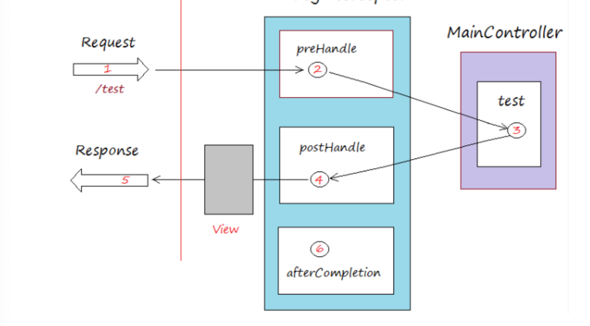

# 인터셉터



출처 : https://bgpark.tistory.com/72

```
HandlerInterceptor (인터페이스)
HandlerInterceptorAdaptor (추상 클래스)
```

- preHandle() : handler (컨트롤러)의 로직이 실행되기 이전에 요청을 가로채서 특정 작업이 가능
- postHandle() : handler (컨트롤러)의 로직이 실행된 이후, 응답을 가로채서 특정 작업이 가능

> postHandle 의 주석을 보면 `Called after HandlerAdapter actually invoked the handler` 라는 문구가 있다.
>
> 즉, 정상 처리가 된 이후에만 불린다는 것.
>
> 핸들러 처리 중 예외가 발생하면 처리를 하든 말든 postHandle() 은 실행되지 않는다.

- afterCompletion() : `응답이 나간 후`, 특정 작업이 가능

> 위 그림을 보면 view 의 랜더링 중 발생하는 예외는 컨트롤러를 벗어낫기 떄문에, afterCompleltion() 에서 예외를 잡아주면 된다.


인터페이스와 추상 클래스 모두 이 메서드를 오버라이딩할 수 있다.

인터페이스에는 이 메서드들이 default 메서드로 정의되어 있어서 추상 클래스처럼 골라쓸 수 있다.


### 필터와의 차이점

```java
package org.springframework.web.servlet;

DispatcherServlet 클래스의 doDispatch 메서드의 일부

	if (!mappedHandler.applyPreHandle(processedRequest, response)) {
		return;
	}

	// Actually invoke the handler.
	mv = ha.handle(processedRequest, response, mappedHandler.getHandler());

```

- 필터는 서블릿 컨테이너단에서 요청과 응답을 가로채는것에 비해,인터셉터는 위 코드와 같이 DispatcherServlet 단에서 실행된다.

    - 따라서, 예외처리 역시 Spring Container 내에서 이루어진다.
        - @ControllerAdivsor & @ExceptionHandler 로 처리 가능.
    - 반면 필터는 에러페이지를 만들어서 처리해야 한다.

- preHandle, postHandle, afterCompletion 메서드를 보면 handler 라는 인지가 들어온다.

    - 이는 Controller 에 @RequestMapping 으로 매핑된 메서드의 정보다.

    - AOP 에서 포인트컷으로 잡아와서 처리하는 것 처럼 메서드의 시그니처 등을 잡아온 작업을 할 수 있다.

    ```java
    val method = handler as HandlerMethod
    val myAnnotation = method.getMethodAnnotation(MyAnnotation::class.java)
    ```


### RequestBody, ResponseBody 는 한번만 읽을 수 있다.

http 요청, 응답을 자바 객체로 만들 때, 무엇을 사용할까.

직렬화, 역직렬화 즉 `InputStream`, `OutputStream` 일 것이다.


인터셉터에서 사용하는 `HttpServletRequest`, `HttpServletResponse` 도 마찬가지다.

내부에 스트림을 가지고 있으면서, 읽고 쓰는 작업을 한다.


아래는 `HttpServletRequest` 의 최상위 인터페이스 `ServletRequest` 의 일부이다.

```java
/** * Retrieves the body of the request as binary data using a * {@link ServletInputStream}. Either this method or {@link #getReader} may * be called to read the body, not both. * * 

@return a {@link ServletInputStream} object containing the body of the * request * 
@exception IllegalStateException * if the {@link #getReader} method has already been called * for this request * 
@exception IOException * if an input or output exception occurred */ 
public ServletInputStream getInputStream() throws IOException;
```

- 이 메서드는 InputStream 을 이용해서 requestBody 를 읽어 반환한다.
- getRead() 메서드도 같은 역할을 한다.
- getInputStream() / getRead() 중 하나라도 이미 실행되었다면 예외를 발생시킨다. (2번 실행될 수 없음.)


아래는 `HttpServletResponse` 의 최상위 인터페이스 `ServletResponse` 의 일부이다.

```java
/** * Returns a {@link ServletOutputStream} suitable for writing binary data in * the response. The servlet container does not encode the binary data. * <p> * Calling flush() on the ServletOutputStream commits the response. Either * this method or {@link #getWriter} may be called to write the body, not * both. * * 

@return a {@link ServletOutputStream} for writing binary data * 
@exception IllegalStateException * if the <code>getWriter</code> method has been called on * this response * 
@exception IOException * if an input or output exception occurred * 
@see #getWriter */ 
public ServletOutputStream getOutputStream() throws IOException;
```

>  이는 스프링의 제약이 아닌 톰켓 레벨의 제약이다.


이 스트림들은 ServletRequest, ServletResponse 객체 안에서 가져가기 때문에, 만약 인터셉터에서 이를 이용해 body 를 읽어버린다면 이후 Controller 단에서 읽을 수 없는 문제가 생긴다.


하지만 아래와 같은 요구사항은 충분히 생길 수 있다.

- 모든 요청에 대해 body 값에 대한 로그를 공통으로 남기고 싶을 때.
- 모든 요청의 body 의 특정 값에 대한 validation 처리를 공통으로 하고 싶을 때.
- 모든 요청에 대한 요청-응답이 끝났을 때, body 의 특정 값을 DB 에 저장하는 로직을 공통으로 처리하고 싶을 때.

요약하자면, 인터셉터에서 공통적으로 요청/응답을 가로채 body 값을 꺼내 사용하고 싶은데, 한번밖에 못 읽는다면 어떻게 해야할까~ 이다.


## 방법 1) Wrapping

스트림이 이미 읽혔다는게 문제라면, 한번 데이터를 읽어서 데이터는 캐시에 저장해두고, 스트림은 다시 초기화시켜놓으면 될 것이다.

body 값을 인터셉터에서 쓸 때는, 캐싱된 값을 꺼내 쓰면 될 일이다.


`HttpServletRequest` 를 Wrapping 한 클래스를 만들어서,

캐시역할을 하는 필드를 만들고, 스트림을 초기화해주는 메서드를 만들면 된다.


스프링은 친절하게도 이 역할을 하는 `ContentCachingRequestWrapper` 라는 클래스가 있다.


인터셉터의 preHandle() 에서 request 를 래핑해 사용한 뒤 넘겨주면 될까?

아니다. 위의 DispatcherServlet 코드를 다시 보자.


	if (!mappedHandler.applyPreHandle(processedRequest, response)) {
		return;
	} // preHandle 을 실행
	
	// Actually invoke the handler.
	mv = ha.handle(processedRequest, response, mappedHandler.getHandler());
	// 실제 핸들러 실행


processedRequest 를 받아서 preHandle() 을 처리한다.

내부에서 래핑을 하든 뭘 하든

아래의 핸들러 실행은 preHandle() 을 실행할 때의 processedRequest 를 다시 사용한다.

preHandle 에서 뭘 어떻게 반환하든 call-by-value 에 의해 그 값은 사라지고 없다.


따라서, DispatcherServlet 이전에, 그 앞단에서 HttpServletRequest 를 래핑할 필요가 있다.

이 때 필터를 쓰면 좋다.


```java
@Component
class CustomServletWrappingFilter : OncePerRequestFilter() {

    override fun doFilterInternal(request: HttpServletRequest, response: HttpServletResponse, filterChain: FilterChain) {
        val wrappingRequest = ContentCachingRequestWrapper(request)
        val wrappingResponse = ContentCachingResponseWrapper(response)
        filterChain.doFilter(wrappingRequest, wrappingResponse)
        wrappingResponse.copyBodyToResponse() // 값을 저장하고, 스트림을 초기화하는 메서드
    }
}
```

> GenericFilter : Filter 인터페이스를 구현한 추상 클래스. Spring 의 설정정보 (Environment 등) 을 얻어 올 수 있는 추가 정보를 제공.
>
>
>
> 서블릿의 기본 동작 구조는, 요청을 받으면 서블릿을 만들어 메모리에 저장한다.
>
> 같은 클라이언트에 대한 요청은 그 서블릿을 계속 사용하게 된다.
>
>
>
> 만약 한 요청에서 필터를 거치고 컨트롤러에서의 로직 처리가 다른 URL 로의 리다이렉트라면, 필터를 거쳐 컨트롤러에서 다시 처음으로 돌아가 필터를 거칠 것이다.
>
> 예를 들어 인가가 필요한 로직에서 필터를 거치고, 인가를 처리하고 원래 요청건의 리다이렉트를 할 때 필터가 또 동작하는 것이다.
>
> 그냥 FIlter, GenericFilter 는 이렇게 동작할 수 있다.
>
>
>
> 이런 상황에서 사용자의 요청 한번에 한번만 동작할 수 있도록 만들어 진 필터가 **OncePerRequestFilter 이다.**


```java
@Profile("my-data")
@Component
class MyDataCommonInterceptor(
    private val objectMapper: ObjectMapper
) : HandlerInterceptor {

    override fun afterCompletion(request: HttpServletRequest, response: HttpServletResponse, handler: Any, ex: Exception?) {

        val cachingRequest = request as ContentCachingRequestWrapper

        // 아래와 같이 값을 꺼내서 로깅을 하든 뭐든 등등의 처리
        val name = objectMapper.readTree(cachingRequest.contentAsByteArray).get("name")?.textValue()
      
        super.afterCompletion(request, response, handler, ex)
    }
}
```

> JsonNode 타입에는 _children 이라는 필드로 Map 타입의 json 데이터를 가진다.
>
> get() 메서드와 textValue(), longValue() 등을 사용하면 json 을 map 처럼 키 값으로 값을 조회할 수 있다.
>
> ```
> val jsonNode: JsonNode <- 이 변수에 아래모양의 json 이 있을 때
> {
> 	"name" : "tomas",
> 	"age" : 27
> }
> 
> // jsonNode.get("name").textValue() : tomas
> // jsonNode.get("age").longValue() : 27
> 	// jsonNode.get() 의 반환형은 JsonNode. 찾지 못하면 null 반환
> 	// jsonNode.path() 는 위와 다르게 찾지 못하면 missingNode 반환
> // jsonNode.elements() : name, age 키-벨류 쌍을 가진 Iterator<JsonNode>
> ```


## 방법 2) **RequestBodyAdviceAdapter**

위의 방법은 body 값을 캐싱한다.

body 는 이미지가 될 수 있고, 동영상이 될 수 있다.

즉 헤더와는 달리 크기가 무제한이다. 이를 캐싱해 두고 있다는 것은 메모리상 부하를 줄 수 있는 상황이 생길 수 있다는 것이다. (성능 이슈가 있을 수 있다.)


`RequestBodyAdviceAdapter` 를 사용하면 RequestBody 가 @RequestBody 가 붙은 객체로 맵핑될 때 따로 작업을 처리 할 수 있다.


```java
@RestControllerAdvice
class MyRequestAdvice : RequestBodyAdvice {
    override fun supports(methodParameter: MethodParameter, targetType: Type, converterType: Class<out HttpMessageConverter<*>>): Boolean {
        // 이 어드바이스를 탈 조건 제시. 이 메서드의 반환이 true 면 아래 메서드들을 실행한다.
      	// targetType 등등의 인자를 이용해서 조건을 만들 수 있다.
    }

    override fun beforeBodyRead(inputMessage: HttpInputMessage, parameter: MethodParameter, targetType: Type, converterType: Class<out HttpMessageConverter<*>>): HttpInputMessage {
				// 바디를 읽기 전에 하고싶은 로직
    }

    override fun afterBodyRead(body: Any, inputMessage: HttpInputMessage, parameter: MethodParameter, targetType: Type, converterType: Class<out HttpMessageConverter<*>>): Any {
				// 바디를 읽은 후에 하고싶은 로직
    }

    override fun handleEmptyBody(body: Any?, inputMessage: HttpInputMessage, parameter: MethodParameter, targetType: Type, converterType: Class<out HttpMessageConverter<*>>): Any? {
        // 바디가 비었을 때 실행하고 싶은 로직
    }
}
```


afterBodyRead() 메서드를 보면 인자로 body 객체가 있다.

이를 이용해서 로그를 남기든, Validation 처리를 하든 하면 좋을 것이다.


#### 참고) postHandle 에서 헤더 값을 설정할 수 없다.

모든 응답에 공통적인 헤더를 추가하고 싶은 요구사항이 있었다.

인터셉터의 postHandle 의 response 인자를 이용해서 setHeader 를 할 생각이었다.


하지만 재대로 적용이 되지 않았고, 이 해결 방법을 공유해본다.


```java
postHandle 의 인자 HttpServletResponse 의 구현체 ResponseFacade 의 메서드
  
    @Override
    public void setHeader(String name, String value) {

        if (isCommitted()) {
            return;
        }

        response.setHeader(name, value);

    }
```


위를 보면 isCommited() 를 검사하고 있다.


HttpServletResponse 의 경우 헤더가 작성이 될 때 commited 여부를 기록해 놓는다.

그래서 postHandle 에서 setHeader() 를 하려고 하면 동작이 되지 않는다.


이 떄는 위 RequestBodyAdviceAdapter 와 대응되는 `ResponseBodyAdvice` 를 사용하면 된다.


```java
@RestControllerAdvice
class MyDataResponseAdvice : ResponseBodyAdvice<Any?> {

    override fun supports(returnType: MethodParameter, converterType: Class<out HttpMessageConverter<*>>): Boolean =
        // 아래 메서드들이 실행될 조건

    override fun beforeBodyWrite(
        body: Any?,
        returnType: MethodParameter,
        selectedContentType: MediaType,
        selectedConverterType: Class<out HttpMessageConverter<*>>,
        request: ServerHttpRequest,
        response: ServerHttpResponse
    ): Any? {
        response.headers.add(헤더 키, 헤더 벨류)
        return body
    }
}

```


> 인터셉터 순서 정의
>
> ```java
> @Configuration
> class MyWebConfig(
>     private val interceptor1: MyCommonInterceptor,
>     private val interceptor2: MyCustomInterceptor
> ) : WebMvcConfigurer {
> 
>     override fun addInterceptors(registry: InterceptorRegistry) {
>         registry.addInterceptor(interceptor1)
>             .order(Ordered.HIGHEST_PRECEDENCE) // order(Int 형 숫자, 값이 클 수록 뒷 우선순위)
>         registry.addInterceptor(interceptor1)
>             .order(Ordered.LOWEST_PRECEDENCE)
>     }
> }
> ```
>
>

> request: HttpServletRequest 에서 경로를 가져오는 방법
>
> - **request.contextPath** = 프로젝트 Path (컨텍스트 path) 만
> - **request.requestURI** = 프로젝트 + 파일경로
> - **request.requestURL** = 전체 경로

