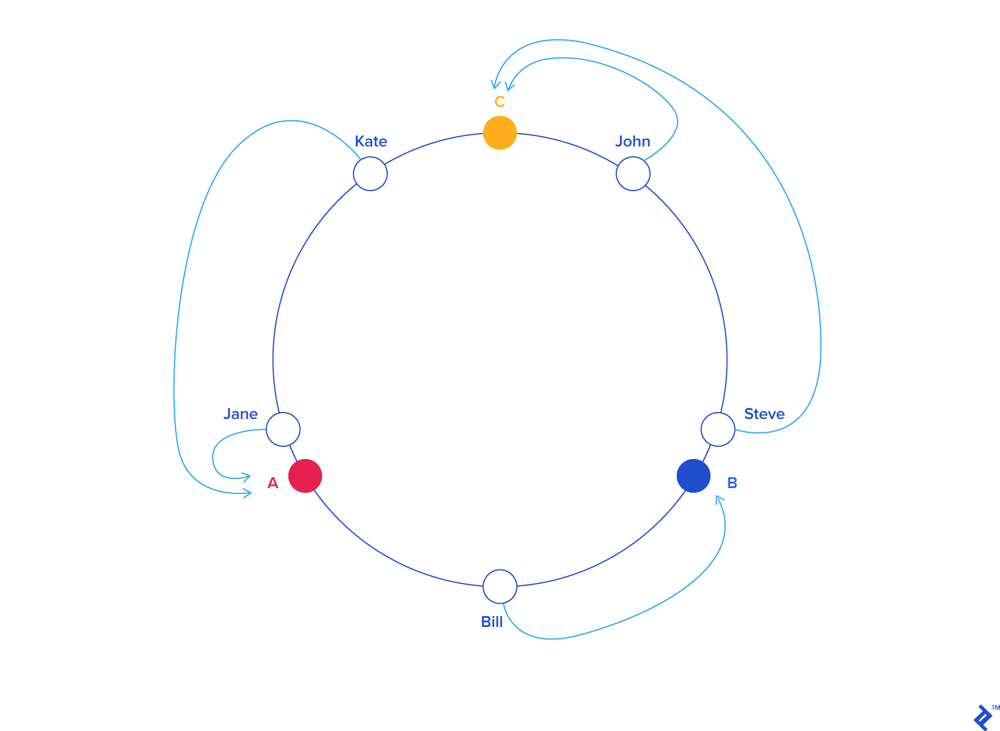
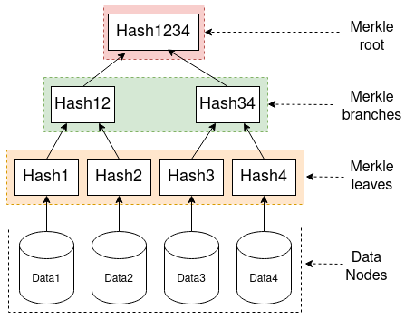

# Key-Value DB 설계하기
key-value 저장소는 Non Sql DB로 저장되는 모든 값은 고유 식별자를 키로 가지고 있습니다.  
널리 알려진 것으로 Redis, 아마존 다이나모 등이 있습니다.
## 문제 이해 및 설계 범위 확정
key-value 저장소를 설계시 기대하는 요구사항은 다음과 같습니다.
- 키-값 쌍의 크기는 10KB 이하
- 큰 데이터 저장 가능
- 높은 가용성, 장애가 있더라도 빠르게 응답
- 높은 규모 확장성, 트래픽 양에 따라 자동 서버 증설, 삭제
- 데이터 일관성 수준은 조정 가능해야함
- 응답 지연시간이 짧아야함

이러한 요구사항들을 만족시키기 위해 여러 기법과 기술들이 존재합니다.
## 단일 서버 키-값 저장소
가장 쉬운 방법은 키-값 쌍 전부를 메모리에 해시테이블로 저장하는 것입니다.  
메모리에서 관리하기에 작업을 빠르게 처리할 수 있습니다.     
하지만 용량 상 모든 데이터를 메모리에 넣는 것이 불가능할 수 있습니다.
### 개선책
- 데이터 압축
- 자주 쓰는 데이터만 메모리에, 나머지는 디스크에 저장

서비스의 규모가 크다면 단일 서버만으로 관리하기 어렵고, SPOF문제가 발생할 수 있습니다.     
따라서 분산된 키-값 저장소를 사용할 수 있습니다.
## 분산 서버 키-값 저장소
### CAP 정리
- *데이터 일관성 consistency*       
분산 시스템에 접속하는 모든 클라이언트는 어떤 노드에 접속해도 언제나 같은 데이터를 봐야한다
- *가용성 availability*    
  분산 시스템에 접속하는 클라이언트는 일부 노드에 장애가 발생해도 항상 응답을 받아야한다
- *파티션 감내 partition tolerance*      
  두 노드 사이 통신 장애(파티션)가 생기더라도 시스템은 계속 동작해야한다     

**Consistency, Availability, Partition tolerance를 동시에 만족하는 분산 시스템은 불가능하다**
### 실세계 분산 시스템
분산 시스템은 네트워크를 이용해 분산 서버간 통신을 합니다.       
이때 네트워크 통신 장애는 피할 수 없기때문에 모든 분산 시스템은 파티션 감내를 만족해야합니다.
파티션 문제가 발생하면 시스템은 일관성, 가용성 중 하나를 선택해야 합니다.
- 일관성을 선택   
데이터 불일치 문제를 피하기 위해, 다른 서버의 쓰기 연산을 중단합니다.    
때문에 가용성이 깨집니다. 주로 은행권 시스템에서 일관성을 선택합니다.
- 가용성을 선택    
낡은 데이터를 반환하더라도 다른 서버의 읽기 연산을 허용합니다.   
파티션 문제가 해결되면 새로운 데이터를 장애 서버에 전송합니다.
## 시스템 컴포넌트
다음으로 키-값 저장소 구현의 핵심 컴포넌트와 기술들을 살펴보겠습니다.
### 데이터 파티션
데이터를 작은 파티션으로 분할한 다음 여러 대의 서버에 저장합니다.   
파티션을 나눌 때는 다음 문제들을 고려해야 합니다.
- 데이터를 여러 서버에 고르게 분산할 수 있는가?
- 노드가 추가, 삭제될때 데이터 재배치를 최소화할 수 있는가?

이러한 문제들을 고려했을때 안정 해시가 적합합니다.
#### 안정 해시

기존 해시 함수를 사용해 키를 균등하게 서버에 보관할 시,   
서버가 추가, 삭제될때마다 대부분의 키가 모듈러 연산에 의해 재분배되어 대규모의 캐시 미스 장애가 발생할 수 있습니다.      

따라서 안정 해시는 해시 순환 링에 서버와 키 값을 배치합니다.     
특정 키 값에서 가장 가까운 서버에서 값을 조회하고,    
서버를 추가, 제거 시에도 해시 링에서 가까운 거리의 키-값 쌍들만 재배치합니다.
### 데이터 다중화
다시 돌아와서 높은 가용성, 안정성을 확보하기 위해서는 데이터를 N개의 여러 서버에 비동기적으로 다중화해야 합니다.    
이는 안정 해시의 해시 링으로 구현할 수 있습니다.
- 해시 링 위에 특정 키를 배치
- 시계 방향으로 링을 순회하며 만나는 첫 N개 서버에 데이터 사본 보관  

이때 N개의 노드 갯수가 실제 물리 서버 갯수보다 커서 물리 서버를 중복 선택하지 않도록 해야합니다.

### 데이터 일관성
앞서 보았듯이 여러 노드에 다중화된 데이터는 적절히 동기화를 해주어 데이터 일관성을 유지해야할 필요가 있습니다.
이때 정족수 합의 프로토콜을 사용하면 읽기/쓰기에 모두 일관성을 유지할 수 있습니다.
#### 정족수 합의 프로토콜
N = 사본 갯수, W = 쓰기 연산 갯수, R = 읽기 연산 정족수  
W, R이 커지면 일관성 수준이 향상되나 응답 속도가 느려집니다.
- R = 1 , W = N, 빠른 읽기 연산 최적화 시스템
- W = 1, R = N, 빠른 쓰기 연산 최적화 시스템
- W + R > N, 강한 일관성 보장
- W + R <= N, 강한 일관성 보장 X
#### 일관성 모델
- 강한 일관성 : 절대로 낡은 데이터 제공 X
- 약한 일관성 : 가장 최근에 갱신된 결과를 반환하지 못할 수 있음
- 최종 일관성 : 약한 일관성의 형태, 갱신 결과가 결국에는 모든 사본에 동기화되는 모델

### 일관성 기법
데이터의 다중화는 가용성을 높이지만 사본 간 일관성이 깨질 가능성이 높아집니다.    
따라서 이를 해소하기 위한 기법들이 존재합니다.
#### 버저닝
데이터를 변경할 때마다 해당 데이터의 새로운 버전 생성하고, 기존 버전은 무시합니다.
#### 벡터 시계
(서버, 버전)의 순서쌍을 데이터에 매달아 저장합니다.    
*(Si, vi)의 형태 - 이미 있으면 vi를 증가시킨다, 없으면 새 항목 (Si, 1)을 만든다*

D3({Sx, 2}, {Sy, 1}), D4({Sx, 2},{Sz, 1}) 같은 버전 데이터 충돌 시    
해당 데이터 읽은 클라이언트가 해소 후 서버에 기록 D5({Sx,3},{Sy,1},{Sz,1})

- D({s0, 1}, {{s1, 1}})은 D({s0, 1}, {s1, 2})의 이전 버전   
- D({s0, 1}, {s1, 2}), D({s0, 2}, {s1, 1})-> 충돌 발생

##### 벡터시계의 단점
1. 충돌 감지 및 해소 로직이 클라이언트에 들어가야합니다 -> 구현 복잡
2. {서버:버전}의 순서쌍 갯수가 빨리 늘어남 -> 임계치를 설정해 오래된 순서쌍을 제거   
   하지만 오래된 순서쌍을 제거하면 버전간 선후 관계가 정확하지 않아 충돌 해소 효율 감소  
   => 그러나 제거해도 아마존 실제 서비스에서 문제 없었음
### 장애 처리
장애는 분산 서버에서 아주 흔하게 발생합니다. 따라서 장애 감지 기법, 장애 해소 전략이 필요합니다.
#### 장애 감지
두 대 이상의 서버가 장애를 보고해야 실제 장애가 발생했다고 간주합니다.    
모든 노드를 그물망처럼 연결하는 멀티 캐스팅 채널을 구축하는 방법이 쉬우나, 서버가 많으면 비효율적입니다.
##### 가십 프로토콜
서버가 많을때는 가십 프로토콜같은 **분산형 장애 감지 솔루션**을 채택하는 편이 효율적입니다.
- 각 노드는 멤버십 목록을 유지, 각 멤버 ID와 heartbeat counter을 기록
- 각 노드는 주기적으로 박동 카운터를 증가
- 각 노드는 무작위로 선정된 노드들에게 주기적으로 박동 카운터 목록을 보낸다
- 박동 카운터 목록을 받은 노드는 멤버십 목록을 갱신
- 박동 카운터 값이 지정된 시간 동안 갱신되지 않으면 해당 멤버를 장애 상태로 간주
#### 일시적 장애 처리
장애 상태인 서버로 가는 요청은 다른 서버가 잠시 맡아 처리합니다.  
-> 해당 서버가 복구되었을때 일괄 반영하여 데이터 일관성 보존  
=> 이를 위해서 임시로 쓰기 연산을 처리한 서버에 단서(hint)를 남겨둔다  
-> **단서 후 임시 위탁 기법**
#### 영구 장애 처리
##### 반 엔트로피 프로토콜
영구적인 장애를 처리할때는 사본들을 비교하여 최신 버전으로 갱신하여 동기화해주어야 합니다.  
이때 머클트리를 사용하면 보안 상 안전하고 효과적으로 사본을 검증할 수 있습니다.

- 머클 트리 생성 과정
    1. 키 공간을 버킷으로 분할
    2. 버킷에 저장된 키에 균등 분포 해시 함수를 적용해 해시 값을 계산
    3. 버킷 별로 해시값을 계산해 해당 해시 값을 레이블로 갖는 노드를 생성
    4. 자식 노드로부터 새로운 해시 값을 계산하여, 이진 트리를 상향식으로 구성  
       루트 노드의 해시값을 비교하는 것으로 시작해 아래쪽으로 비교

즉 머클 트리를 사용하면 모든 데이터를 동기화할 필요 없이 차이가 존재하는 버킷만 동기화할 수 있습니다.
### 데이터 센터 장애 처리
정전, 네트워크 장애, 자연 재해 등으로 인해 데이터 센터도 장애가 발생할 수 있기 때문에   
데이터를 여러 데이터 센터에 다중화해야합니다.  
[카카오 데이터센터 화재 사례](https://www.kakaocorp.com/page/detail/9902)
### 시스템 동작 과정
#### 쓰기 경로
1. 쓰기 요청이 커밋 로그 파일에 기록
2. 데이터가 메모리(Memtable)에 기록
3. 메모리 캐시 임계치 도달 시 디스크의 SSTable에 기록
#### 읽기 경로
데이터가 메모리에 있다면 반환
데이터가 메모리에 없다면 디스크에서 가져와야함 -> Bloom filter 사용
1. 데이터가 메모리(Memtable)에 있는지 검사
2. 블룸 필터 검사
3. 블룸 필터로 어떤 SSTable에 키가 보관되어 있는지 찾는다
4. 해당 SSTable에서 데이터를 가져온다
5. 해당 데이터를 클라이언트에 반환

이 때 Memtable로 LSM Tree 구조를 많이 사용합니다.  
메모리의 특성상 장애  휘발될 수 있으므로 데이터 손실을 방지하고자 memtable 데이터는 디스크에 log file로 따로 저장합니다.

