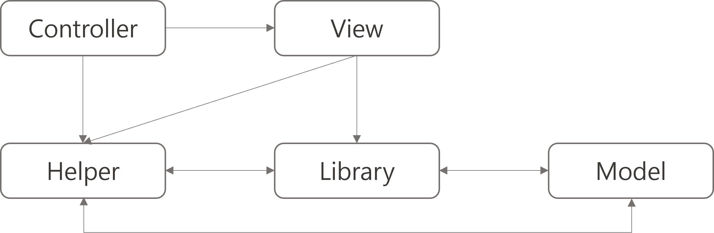
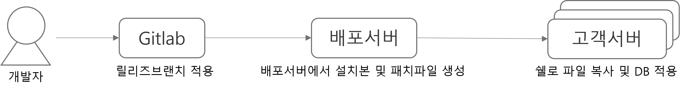
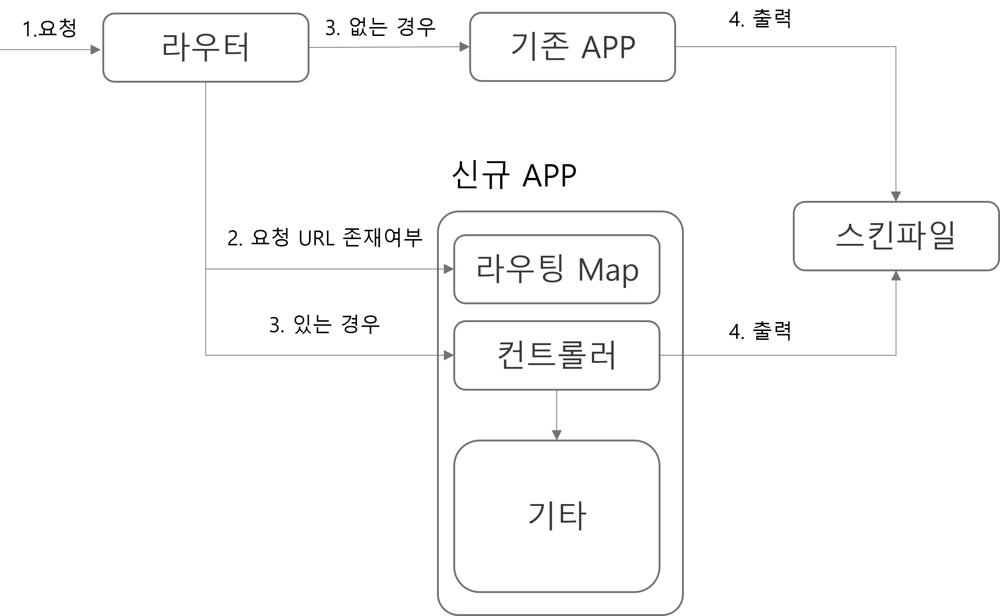
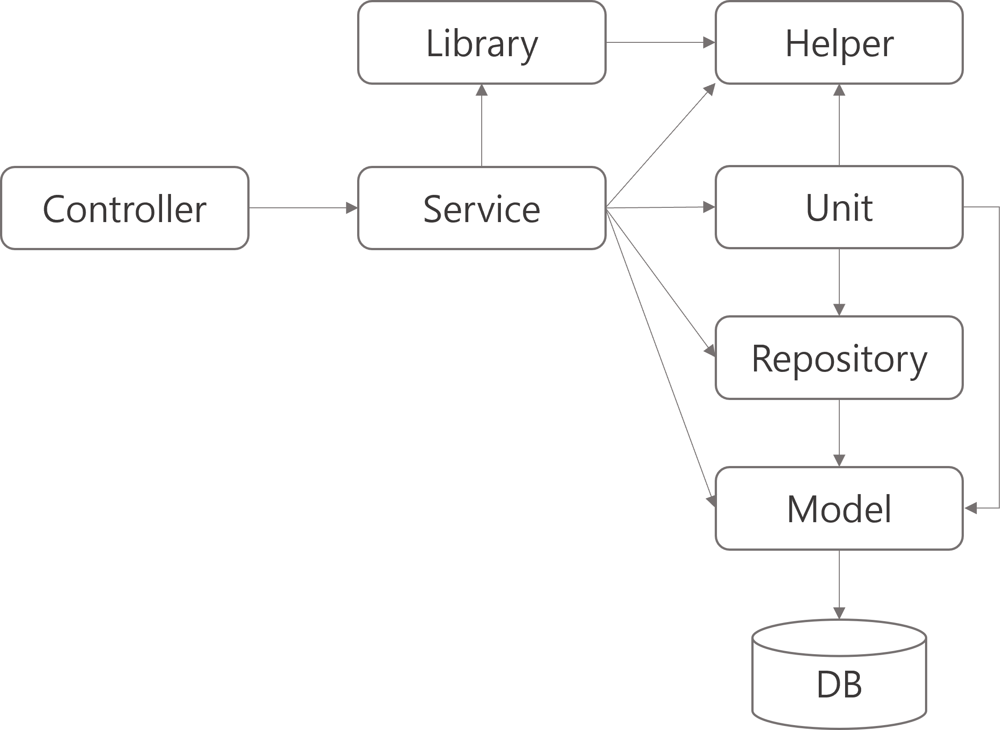

# 실전 아키텍처 - 3
>이 글은 개인의 경험을 기반으로 주관적인 의견을 상당히 포함하고 있습니다. 
>전문적인 소프트웨어 공학적인 글이 아닌 실무에서 혹은 공부할 때 도움이 될 만한 의견을 공유해보고자 합니다. 
>틀린 부분이 있을 수도 있어 지식의 목적보다는 많은 견해 중 하나 혹은 노하우 공유 정도로 참고해주시면 좋을 것 같습니다. 
>자바로 개발을 시작했기 때문에 자바진영에 관련된 얘기가 다소 포함되어 있습니다.  
>실질적인 전달 메시지에는 영향이 없으나 참고부탁드립니다. 

# 레거시는 왜 나쁠까
현재 회사에서 운영하는 서비스는 레거시가 엄청나다. 
10년이 넘는 기간동안 많은 개발자들의 손을 타면서 악습이 당연시되고 참고서가 되었다.  
물론 코딩컨벤션이나 이렇다할 문서도 없고 딱히 개선을 할만한 필요의식조차 없었다. 
레거시가 나쁜 이유야 이해가 잘 되지만, 직접 경험해본 사람이라면 더욱 공감할 것이다. 
실제로 내가 겪은 레거시의 나쁜 점을 나열했을 때 아래와 같다.  

- 생산성 저하 : 오류가 나거나 기능개발 시 기존 소스 분석이 매우 오래걸린다.
- 오류 발생률 높음 : 엄청난 결합도로 인해 한군데 수정 시 언제 어디서 문제가 생길지 모른다.
- 개선 방해요소 많음 : 설치형에 커스텀 고객 패치이슈로 인해 작은 개선작업도 영향도를 고려해야한다.

위 와같이 크게 3가지 정도 뽑을 수 있을 것 같다. 
모두 알지만 아무도 문제점을 깊게 들여다보지 않았다는 점과 눈 앞의 문제점만 해결하기 급급한 상황이 서비스를 이렇게 만들었다. 
그렇다면 저렇게 나쁜 점들이 왜 생겨났는지 아래와 같이 정리할 수 있다. 

- 설계문서가 하나도 없다.
- 프레임워크에서 제시하는 가이드는 있으나 부족하고, 심지어 따르지도 않았다.
- 중복쿼리, 소스가 엄청나게 많다.
- 각각의 레이어들의 결합도가 엄청났으며, 없어진 기능에 대해 지우지 않는다.
- 패치 시 반영되지 않는 즉, 고객이 수정가능한 소스들에 대한 패치전략이 미흡하다.

이 모든 문제를 해결하기 위한 제일 근본적인 해결책으로 나는 프로젝트 구조를 다시 설계하는 것이라고 생각했다. 
문서의 경우 다시 설계하면서 필요한 부분만 골라서 빠르게 적어내면 되고, 그만큼 쉽고 직관적인 구조라면 적어도 지금보다는 훨씬 나은 환경에서 개발할 수 있을 것이라 생각했다. 
우리의 서비스는 PHP, CodeIgniter로 되어있는데 아래와 같은 구조로 되어있었다. 

### 현재 레거시 구조

한눈에 봐도 말도 안되는 구조다. 
CodeIgniter가 단순한 웹사이트를 만드는데 특화되어 나왔다고는 하나 적어도 역할은 분리가 확실했다.  
그러나 각 레이어들은 역할 경계가 없게 되었고, 서로 강한 결합도를 가지고 있었다. 
여기서 제일 큰 문제는 이 방식을 마음에는 들지않지만 전통과도 같이 여겨졌다는 점이다. 

당연하게 느끼는 것과는 반대로 이 고통을 즐기는 사람은 한명도 없었다. 
그저 불만만 가진 채 너무 큰 불만이 윗 분들의 심기를 건드릴까 눈치를 보면서 불만적정선을 유지하기 바빴다. 
이 글에선 이런 문제를 해결하는 과정과 어떤 식으로 아키텍처를 구성해보았는지 간단하게 이야기 해보려한다. 

# 진짜 문제 파악하기
이 지경까지 온 과정에 대해서는 충분히 이해를 한다. 
이 문제는 단순히 기술부채나 팀원들의 개선의지, 트렌드에 대한 마인드 같은 문제가 아닌 더 근본적인 이유가 있다. 

- 우리의 제품이 기능이 부족하여 선택되지 않는다고 생각한다.
- 개발, 운영과 동시에 내부퀄리티를 당연히 높힐 수 있을 것이라고 생각한다.
- 내부 직원들의 생산성이나 실력향상에 대한 비용 투자는 아깝다고 생각한다.

이런 생각들이 계속 이어져왔고 아래와 같은 현상들이 발생했다. 
좀 더 정확히 표현하자면 그래왔다. 

- 매번 새로운 기능 추가에만 치중한다.
- 개발, 운영같은 기본적인 업무들도 현재 인원으로 아주 벅차지만 티내지 않는다.
- 불편한 개발환경, 커뮤니케이션 환경으로 생산성이 낮고, 의사소통이 원활하지 않다.

물론 윗 분들만의 잘못은 아니다. 우리 모두가 잘못하고 있었고, 그걸 현실적인 것이라고 회피했을 뿐이다. 
현실적으로 새로운 기능을 추가하는 것은 사업적인 측면에서 경쟁력을 늘리는 부분이 될 수있다. 
그렇기에 프로젝트 구조를 새로 설계하는 것이나 새로운 서비스를 만드는 것 등 큰 변화는 우려가 클 수 밖에 없다. 
하지만 결국 언젠가는 해야할 일이라고 굳게 믿고 있었다. 

그렇다고 갑작스레 몇 명의 인원을 뽑아 TF로 구성하여 프로젝트 구조를 갈아엎겠다고 할 수는 없다. 
게다가 구조를 갈아엎는다고 해서 당장의 오류발생률이나, 대응속도, 성능 등을 보장할수도 없다. 
그래서 판을 깔기 위해 내가 생각한 방법은 아래와 같다.  

- 점진적으로 기능, 운영 업무 시 문서작업하기
- IDE, 개발환경 바꾸기
- 개발스터디를 만들어 트렌드에 대한 관심도 높히기

약 4년이 지난 지금 이 방법들은 통했으며, 현재 프로젝트 전면 개편을 진행 중이다. 
SVN에서 Git으로, Editplus에서 VSCode로 레드마인, XWiki에서 Jira, Confluence로... 
개발환경이나 커뮤니케이션 도구도 바뀌고 작업자들의 마인드도 많이 바뀌었다. 

하지만 정작 우리가 가지고 있는 고질적인 문제 해결은 이제 시작일 뿐이고, 더 많은 고민이 남아있다. 

# 레거시를 위한 새로운 아키텍처 설계
준비가 다 끝나고 회사에서 공식적으로 업무가 주어진 지금 새로운 설계에 대해 생각해 볼 시간이 되었다. 
일단 개선안을 보기 전에 우리 솔루션의 배포방식을 보면서 왜 새로운 설계가 까다로운지를 알아야 한다. 

### 배포 구조

아주 간단하게 표현했지만 여기서 초점은 고객 호스팅에 직접 파일로 설치하고 업데이트 한다는 점이다. 
쉽게 말해 고객들 모두가 우리 솔루션 소스를 가지고 있는 것인데 이 방식은 아래와 같은 이유를 가지고있다. 

- 모든 고객(임대, 독립)은 스킨을 디자인모드, 소스단위로 수정할 수 있다. 
- 독립형 고객들은 스킨뿐만이 아닌 프로그램 소스도 수정하여 커스텀 할 수 있다. 

이렇다보니 스킨에 종속적일 수 밖에 없고, 독립형 고객들은 프로그램 소스마저 다르니 배포가 까다로운 것이다. 
그래서 개선 방향을 잡는 것부터가 굉장히 어려운 일이 되었는데 내가 생각했던 개선 방향은 아래와 같이 3가지로 나뉜다. 

1. 현재 코드에서 리팩토링 수행하기
2. 완전 새로운 구조를 만들어 스트랭글러 패턴으로 이전하기
3. 중앙 API를 만들어 내부 솔루션에서 바꿔치기

이 3가지 방안 중에서 2번 방식이 채택이 되었다.  
물론 3가지 모두 엄청난 모험이고 리스크가 존재하지만 2번 방식이 제일 리스크가 적고 커스텀 고객들에 대한 대응도 확실했기 때문에 채택되었다. 
이 글을 읽는 분들이 이 구조를 참고하기엔 무리가 있을 수 있으나, 설계를 잡는 과정과 이유에 대해 초점을 두고 읽어 주기를 바란다. 
채택된 방식은 아래와 같은 구조와 시나리오를 가지고 있다. 

### 새로운 요청구조

기준을 요청 URL로 잡아서 하나의 컨트롤러가 옮겨지면 라우팅 Map에 명시하고, 명시된 주소는 새로운 APP을 바라보게 하였다. 
이 방식이라면 임대 고객들은 점진적으로 신규 APP을 사용하게 되고, 추후엔 완전히 기존 APP을 폐기처리 할 수 있게 된다. 
만약 신규 APP에서 치명적인 오류가 발생하면 기존 APP이 유지 되기 때문에 라우팅 Map만 수정하여 배포하면 되기 때문에 
이상적이진 않지만 리스크가 그나마 제일 적은 방식이다. 
기존 스킨의 호환성을 맞추기 위해 스킨은 공유하는 형태이다. 

요청에 대한 분기는 위 와같이 해결하였지만 이제 신규 APP의 구조를 설계해야 한다. 
설계를 하면서 구조적으로 평소 개발팀에서의 불편한 점을 해결하는데에 초점을 두었다. 

- 호출 구조는 되도록 단방향으로 한다.
- 각 레이어는 제시된 역할만 수행한다.
- 상태를 가지는 객체는 따로 구분한다.
- 호출되는 함수들은 모두 어디에 있는지 직관적이어야 한다.

이렇게 나온 구조가 아래와 같은데 기존 구조보다는 좀 더 세분화 되어있으나 부족한 점이 많다. 
통상적으로 다른 프레임워크에서 사용되는 명칭과 용도가 다르지만 현재로선 최선이었다. 
아래 구조와 100% 일치하게끔은 옮기기 어렵지만 최대한 맞추면서 하고 있고, 구조는 계속 발전할 것이다. 

### 신규 APP 구조 1차

각 레이어들의 역할은 아래와 같다.  

- Controller : 요청, 응답, 스킨처리
- Service : 각 요청에 맞는 비즈니스 로직 수행
- Unit : 데이터를 가공하는 작은 작업 단위
- Repository : Model 들의 조합 (Join 대응)
- Model : DB 테이블과 1:1 대응되는 클래스
- Helper : 유틸 클래스 집합 (내부 함수들은 모두 static)
- Library : 상태를 가지는 객체

이런 구조가 나온 이유는 기존 APP이 굉장히 복잡하기 때문에 적어도 역할 분리만큼은 명확히 하기 위해서였다. 
포팅작업을 하면서 느꼈던 점은 프로그램 구조가 얼마나 복잡하고, 어떤 기능들이 있는지 이제서야 파악이 되기 시작했다는 점이다. 
얼마나 복잡하고 많은 기능들이 있는지 단적인 예로 상품리스트를 가져오는 컨트롤러를 포팅하면서 생겨난 모델이 약 50개 이상이다. 
컨트롤러를 제외한 나머지 레이어에 대해서 좀 더 자세한 이유를 설명한다. 
아래 설명되는 레이어들은 명확한 책임 순위로 나열했다. 

## 모델 (Model)
가장 명확한 레이어는 Model 레이어인데 우리 솔루션은 ORM을 사용하지 않는다. 
기존 모델은 기준이 명확하지 않으며, 쿼리의 중복도 굉장히 많았다. 
날쿼리로 작성된 쿼리도 많다보니 쿼리오류도 빈번하게 일어났다. 
그래서 Model은 그저 DB 테이블과 1:1 대응하기만 하고 내부 함수들은 쿼리빌더 형식으로 구성하게끔 정책을 정했다. 
가장 Raw한 레이어에 속하며, 어떤 레이어도 참조하지 않는다. 

## 리포지토리 (Repository)
이 레이어는 쉽게 설명하면 Join 쿼리들에 대응하는 클래스들의 집합이다. 
각 모델들은 테이블과 1:1 대응인데 기존 APP에서 DB 관련 최대 문제점은 각 테이블의 조합에 대한 관리 어려움이었다. 
아마 JPA를 사용하는 사람들이라면 이 이름이 이상하다고 생각될 수 있다. 
애초에는 ORM의 도입을 목적으로 Model과 Repository를 만들었으나, 작업이 너무 크다고 판단하여 Join에 대응하게끔만 정했다. 
추후에 명칭은 바뀔 수 있겠으나 중요한 점은 조합에 대한 처리를 따로 레이어로 분리했다는 점이다. 

## 유닛 (Unit)
모델이나 리포지토리에서 DB 데이터를 읽은 후 가공하는 작업은 무수히 많다. 
잘 뜯어보면 다른 비즈니스 로직들에서 가공되는 형태를 보면 공통으로 빠질 요소들이 많다. 
그래서 비즈니스로직마다 중복을 두는 방식보다는 아주 작은 단위의 필수 가공처리만을 가진다.  

## 서비스 (Service)
서비스는 유스케이스 기준으로 나뉘며, 비즈니스 로직의 핵심이라고 볼 수 있다. 
정보를 가져와서 해당 비즈니스 로직에 맞게 가공하고 처리하는 과정을 수행한다. 
정보를 가져올 때 가공된 정보, 조합된 정보, Raw한 정보 이렇게 다양하게 가져올 수 있어 모델, 리포지토리, 유닛 모두를 참조한다. 
서비스의 경우 일급클래스로 컨트롤러의 하나의 함수에 대응한다. 

## 헬퍼 (Helper)
유틸성 클래스들의 집합으로 각 헬퍼들은 용도에 맞게 클래스로 나뉘어져 있다. 
어떤 레이어도 참조하지 않는다. 

## 라이브러리 (Library)
어떤 작업을 할 때 상태를 가져야 하는 경우 라이브러리로 정의한다. (서드파티도 포함될 수 있다) 
예를 들어 상품정보를 가져올 때 할인 이벤트나, 회원 등급에 따른 할인정책 등에 라이브러리를 활용 할 수 있다. 
어떤 레이어도 참조하지 않는다. 

## 설계 회고
이렇게 실제 업무에서 설계한 구조를 설명했는데, 부족한 점이 많지만 전보다는 명확한 책임으로 불편함이 조금은 덜어졌다. 
원래 초반에 설계 아이디어에서는 굉장히 많은 컨셉과 복잡한 구조를 생각했으나,  
차라리 라라벨을 사용하는게 더 나을 정도로 러닝커브가 높아질 것을 우려하여 팀원들과 의견을 주고 받으면서 나온 구조다. 

설계를 진행하면서 새로운 프로젝트보다 레거시를 새로 설계하는 것이 훨씬 더 어려운 일이라는 것을 느꼈고 
마음에는 들지않지만 모두가 사용한다는 점에서 편리함과 단순함을 우선해야한다는 점을 배웠다. 

# 마치며
항상 버릇처럼 말하는 것이지만 아키텍처에 대해 전문가도 아니고, 대단한 지식을 가지고 있는 것도 아니다. 
또한 이런 큰 프로젝트나 회사 서비스를 총괄하는 경험도 거의 없다. 
단지 누군가는 나와 같은 상황을 겪어본 적있고, 겪는 중이라면 이 글이 도움이 될 것이라 생각하면서 글을 써본다. 
우리가 배우고 써먹는 소프트웨어 공학은 문제를 해결하기 위한 학문이지 뭔가 대단한 진리를 쫒는 것이 아니기에 
글을 읽는 나와같은 평범한 개발자들에게 위안이나 자신감을 주길 바라는 마음으로 글을 마친다. 

