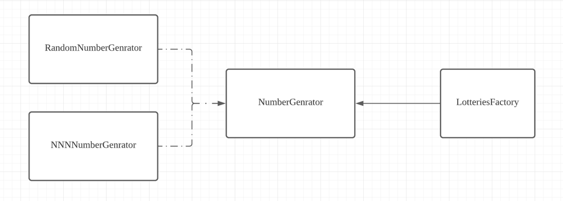
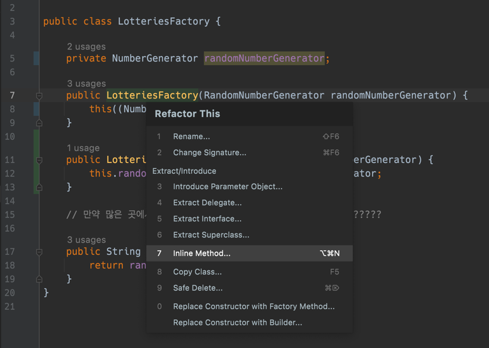

# 안전하게 리팩토링하기

SOLID 원칙 중 DIP가 있다.

어떻게 하면 쉽게 리팩토링 할 수 있는지 간단하면서도 강력한 방법을 이야기해볼까 한다.


이것을 아래와 같이 변경한다고 해보자.




```java

public class LotteriesFactory {

    private final RandomNumberGenerator randomNumberGenerator;

    public LotteriesFactory(RandomNumberGenerator randomNumberGenerator) {
        this.randomNumberGenerator = randomNumberGenerator;
    }

    // 만약 많은 곳에서 해당 코드를 사용하고 있다면 어찌하겠는가 ????????

    public String createNumber(){
        return randomNumberGenerator.create();
    }
}

```

이것을 아래와 같이 변경한다면 어떻게 안전하게 변경할 수 있을까?

```java

public class LotteriesFactory {

    private NumberGenerator randomNumberGenerator;

    public LotteriesFactory(NumberGenerator randomNumberGenerator) {
        this.randomNumberGenerator = randomNumberGenerator;
    }

    // 만약 많은 곳에서 해당 코드를 사용하고 있다면 어찌하겠는가 ????????

    public String createNumber() {
        return randomNumberGenerator.create();
    }
}

public class RandomNumberGenerator implements NumberGenerator {
    @Override
    public String create() {
        return "123456";
    }
}


```

혹시 여러분은 IDE 에서 어떻게 이것을 안전하게 변경할 수 있나요?

저는 이것을 안전하게 변경하기 위해서 IntelliJ 의 Refactor 기능을 적극적으로 활용할 것입니다.

.
.
.
.
.
.
.
.
.
.
.
.
 어떻게 하고 계신가요? 혹시 Rename 으로 하고 있나요? 아니면 이미 한땀한땀 고치고 계신건 아닌가요?

`RandomNumberGenerator randomNumberGenerator` 에서 어떻게 `NumberGenerator numberGenerator` 로 변경했나요?

저라면 RandomNumberGenerator 여기에서부터 시작합니다.

` implements NumberGenerator` 와 `@Override` 를 활용해 아무런 비즈니스의 문제없이 `NumberGenerator` 를 만들어 냅니다.  

```java
public class RandomNumberGenerator implements NumberGenerator {
    @Override
    public String create() {
        return "123456";
    }
}
```


이후에는 어떻게 할까요? 

아마도 LotteriesFactory 를 고치려 할 것 입니다.
```java

public class LotteriesFactory {

    private final RandomNumberGenerator randomNumberGenerator;

    public LotteriesFactory(RandomNumberGenerator randomNumberGenerator) {
        this.randomNumberGenerator = randomNumberGenerator;
    }

    public String createNumber(){
        return randomNumberGenerator.create();
    }
}

```

어떻게 하면 기존 로직에 영향없이 코드를 변경할 수 있을까요?

```java

public class LotteriesFactory {

    private NumberGenerator randomNumberGenerator;

    public LotteriesFactory(RandomNumberGenerator randomNumberGenerator) {
        this((NumberGenerator) randomNumberGenerator);
    }

    public LotteriesFactory(NumberGenerator randomNumberGenerator) {
        this.randomNumberGenerator = randomNumberGenerator;
    }

    public String createNumber(){
        return randomNumberGenerator.create();
    }
}

```



Refactor > Inline method 를 하게 되면 아래와 같이 변경됩니다.

```java
public class LotteriesFactory {

    private NumberGenerator randomNumberGenerator;

    public LotteriesFactory(NumberGenerator randomNumberGenerator) {
        this.randomNumberGenerator = randomNumberGenerator;
    }

    public String createNumber(){
        return randomNumberGenerator.create();
    }
}

```

이렇게 함으로써 안전하게 코드를 리팩토링하게 됩니다.
