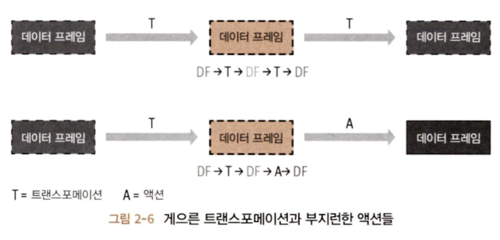

# 1. transformation

Spark의 RDD(Resilient Distributed Dataset)는 불변성(immutability)을 가지고 있다. 불변성은 한 번 생성되면 변경할 수 없는 것을 의미한다. 이로 인해, 데이터를 변경하고 싶을 때 기존의 데이터를 수정하는 것이 아니라 변경된 내용을 가진 새로운 RDD를 생성하게 된다. 이 과정을 transformation이라고 한다.

모든 transformation은 뒤늦게 평가되는데 이를 lazy evaluation이라고 한다. 즉, transformation은 즉시 계산되지 않고 lineage라 불리는 형태로 기록된다. 기록된 lineage는 실행 계획에서 후반쯤에spark가 확실한 transformation들끼리 재배열하거나 합치거나 해서 더 효율적으로 실행할 수 있도록 최적화한다.

### A. narrow transformation

> 하나의 입력 파티션을 연산하여 하나의 결과 파티션을 내놓는 transformation이다.

모든 필요한 데이터가 하나의 파티션에 이미 있을 때 수행할 수 있는 transformation이다. 이 연산은 다른 파티션의 데이터를 필요로 하지 않기 때문에 각 파티션은 독립적으로 연산을 수행할 수 있다.

예를 들어 `map()`, `filter()` 같은 연산이 여기에 해당한다. 이 연산들은 각각의 입력 요소가 독립적으로 처리되며, 결과적으로 네트워크를 통한 데이터의 shuffle이 필요하지 않다.
### B. wide transformation

> 다른 파티션으로부터 데이터를 읽어 들여서 합치고 디스크에 쓰는 등의 일을 하는 transformation이다.

여러 파티션에 걸쳐 있는 데이터가 필요할 때 수행하는 transformation이다. 이 transformation은 종종 shuffle을 발생시키는데, 이는 다른 파티션에 있는 데이터를 재분배하는 과정을 말한다. 데이터를 재분배하는 wide transformation은 narrow transformation에 비해 더 많은 자원을 사용하고 시간이 오래 걸린다.

`groupBy()`, `reduceByKey()`같은 연산이 wide transformation에 해당한다.

# 2. action

하나의 action은 모든 기록된 transformation의 lazy evaluation을 발동시킨다.

Spark 연산 중 transformation 연산은 orderBy(), groupBy(), filter(), select(), join()이 있다. action 연산은 show(), take(), count(), collect(), save()가 있다.

각 연산들이 직관적이라 어떤 동작을 할 것인지 명확해보인다. 그래도 설명을 추가해보면..

### A. transformation 연산

- `orderBy()`: 데이터를 특정 컬럼의 값에 따라 오름차순 또는 내림차순으로 정렬한다. 이 연산은 wide transformation에 속하며, 데이터의 shuffle을 일으킬 수 있다.
- `groupBy()`: 지정된 컬럼의 값에 기반하여 데이터를 그룹화한다. 그룹화된 결과에 집계 함수를 적용할 수 있다. wide transformation이며 shuffle을 발생시킬 수 있다.
- `filter()`: 데이터셋에서 특정 조건을 만족하는 요소만을 선택하여 새로운 데이터셋을 생성한다. narrow transformation이다.
- `select()`: 특정 컬럼만을 선택하여 새로운 데이터프레임을 생성한다. 컬럼을 변형하거나 새로운 칼럼을 만들 때도 사용된다. narrow transformation이다.
- `join()`: 두 데이터셋을 특정 키를 기준으로 결합한다. `inner`, `outer`, `left`, `right` 등의 다양한 타입의 조인을 지원한다. wide transformation이다.

### B. action 연산

- `show()`: 데이터프레임의 상위 몇 줄을 출력하여 콘솔에서 확인할 수 있게 한다. 주로 디버깅이나 데이터의 미리보기에 사용된다.
- `take()`: 데이터셋에서 지정된 수의 로우를 반환한다. 결과는 드라이버 프로그램으로 가져오기 때문에 대용량 데이터셋에 이 연산을 사용할 때는 주의가 필요하다.
- `count()`: 데이터셋에 있는 요소의 수를 반환한다. 전체 데이터셋에 대한 간단한 집계 연산을 수행한다.
- `collect()`: 전체 데이터셋을 드라이버 프로그램으로 가져와서 배열 등의 자료구조에 저장한다. 이 역시 매우 큰 데이터셋에 대해서는 메모리 문제를 일으킬 수 있으므로 주의해야 한다.
- `save()`: 데이터셋을 파일 시스템, 데이터베이스 등에 저장한다. 텍스트, CSV, JSON, Parquet 등 다양한 포맷으로 저장할 수 있습니다.

# 3. Lazy Evaluation

> Lazy Evaluation은 쿼리 최적화를 가능하게 하고 lineage와 immutability은 장애에 대한 데이터 내구성을 제공한다.

Spark의 Lazy Evaluation은 Spark가 Transformation 연산을 즉시 수행하지 않고, 실제로 필요한 Action 연산이 호출될 때까지 연산을 지연시키는 처리 방식이다. 이 방식은 전체 데이터 처리 파이프라인을 통째로 최적화할 수 있는 여지를 제공한다.

Lazy Evaluation의 주요 장점은 효율성, 최적화, 고비용 연산의 최소화가 있다.

1. 모든 Transformation을 즉시 수행하지 않고 필요한 최종 결과를 얻기 위해 실제로 필요한 연산만 수행하여 불필요한 데이터 처리를 줄여주고 자원 사용을 최적화한다.
2. 전체 작업을 논리적 실행 계획으로 구성하고, 실행 전에 그 계획을 분석하여 더 효율적인 물리적 실행 계획으로 변환한다.
3. Shuffle과 같이 네트워크를 통한 데이터 이동이 필요한 비싼 연산의 수를 줄이거나 피하여 실행 계획을 조정한다.