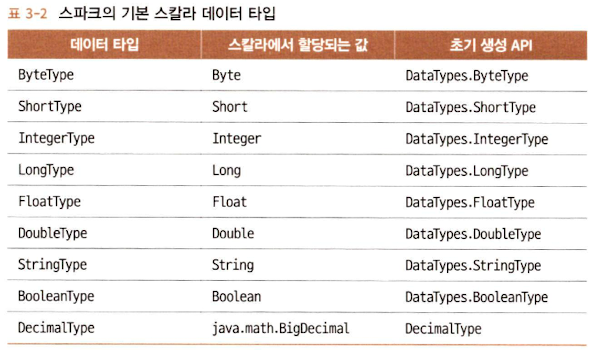
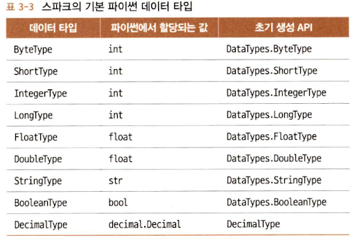
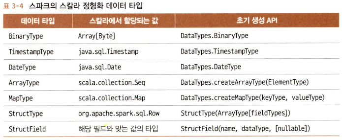
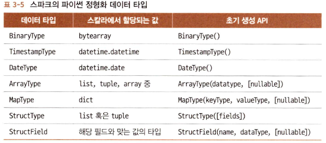
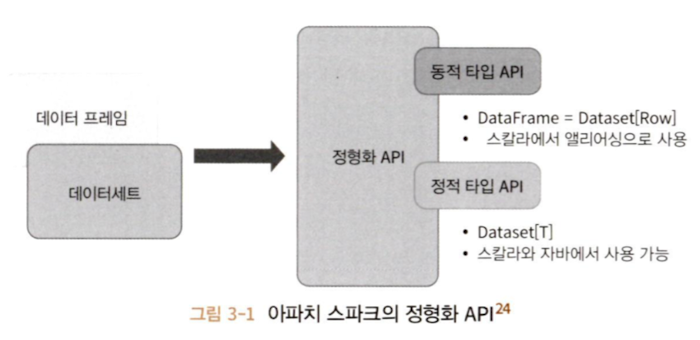
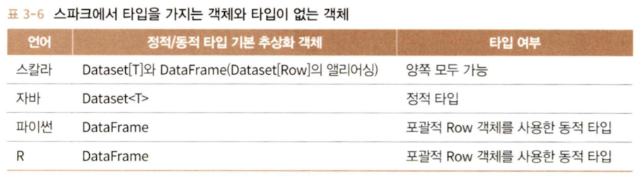
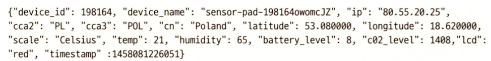
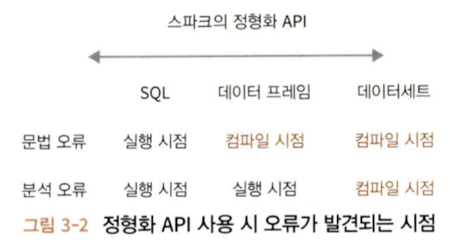

# 1. RDD란?

RDD(Resilient Distributed Dataset, 탄력적 분산 데이터셋)는 Apache Spark의 핵심 개념 중 하나로, 분산 환경에서 병렬로 처리될 수 있는 불변의 데이터 컬렉션이다. RDD는 Spark의 데이터 처리와 트랜스포메이션을 수행하는 데 사용되는 기본적인 데이터 구조이다.

RDD는 Spark의 초기 데이터 추상화 모델이며, 후에 DataFrame과 Dataset과 같은 고수준의 추상화가 도입되었다. DataFrame과 Dataset은 RDD에 비해 더 효율적인 실행 계획을 생성하고 다양한 최적화를 제공하지만, RDD는 저수준 API로서 유용성을 가지고 있다.

### A. RDD의 주요 특징

- 불변성 (Immutability)
    - 한 번 생성된 RDD는 변경될 수 없다. 데이터를 변형하려면, 새로운 RDD를 생성하는 transformation 연산을 수행해야 한다.
- 탄력성 (Resilience)
    - 노드 장애가 발생하더라도 RDD의 lineage 정보는 통해 어떻게 변형되어 왔는지에 대한 정보를 가지고 있어서 필요한 경우 원본 데이터로부터 RDD를 재구성할 수 있다.
- 분산 처리 (Distributed)
    - 데이터는 클러스터 내 여러 노드에 걸쳐 분산되어 저장된다. 이를 통해 대규모 데이터셋을 효율적으로 처리할 수 있다.

RDD는 transformation과 action을 사용하여 작업을 수행한다. Transformation은 새로운 RDD를 생성하지만, 실제 계산은 action이 호출될 때까지 지연된다. (Lazy evaluation)

### B. RDD의 내부적인 특성

- 의존성 (Dependency)
    - RDD는 다른 RDD로부터 파생될 수 있으며, 이런 관계를 의존성이라고 한다.
    - Narrow Dependency는 각 자식 RDD 파티션이 단일 부모 RDD 파티션에만 의존한다. (데이터 셔플링이 필요 없는 경우)
    - Wide Dependency는 자식 RDD 파티션이 여러 부모 RDD 파티션에 의존할 수 있다. (데이터 셔플링이 필요하다.)
- 파티션 (Partition)
    - RDD 데이터의 물리적 분할을 나타낸다.
    - 각 파티션은 클러스터의 다른 노드에서 독립적으로 처리될 수 있으며, 이를 통해 병렬 처리가 가능해진다.
- 연산 함수 (compute function)
    - RDD에 저장되는 데이터를 Iterator[T] 형태로 만들어주는 compute() 함수이다.
    - RDD의 compute() 함수는 RDD의 내부 구현의 일부이며 사용자가 직접적으로 이 함수를 호출할 일은 거의 없다.

### C. RDD의 문제

> 아래 문제점들은 Spark의 후속 버전에서 DataFrame과 Dataset과 같은 새로운 데이터 추상화 모델을 도입하게 된 배경이 된다.

- 사용자가 연산 함수 안에서 무엇을 하는지 스파크가 알 수 없었다.
    - Spark는 사용자 정의 함수의 내부 로직을 파악할 수 없었고, 이러한 함수에 대한 최적화를 수행하기 어려웠다.
- Iterator[T] 데이터 타입이 파이썬 RDD에서 불투명했다.
    - Spark가 데이터의 구조나 타입에 대한 정확한 정보 없이 작업을 수행해야 함을 의미한다.
    - 동적 타입 언어에서 이 문제가 두드러졌다.
- 스파크는 위에서 T로 표시한 타입에 대한 정보가 전혀 없었다.
    - RDD의 데이터는 구조화되지 않은 형태로 취급되어서 데이터 압축 기술을 효과적으로 적용하기 어려웠다.
    - 정체를 알 수 없는 객체를 바이트 뭉치로 직렬화해 사용하는 수 밖에 없었다.

# 2. Spark의 구조 확립

### A. 구조 확립을 위한 핵심 개념들

##### a. 일상적인 패턴들을 사용하여 연산을 표현

- 일상적인 패턴들을 써서 연산을 표현
- 필터링, 선택, 집합연산, 집계, 평균, 그룹화 같은 고수준 연산으로 표현되었다.

-> 명료함과 단순함

##### b. 지원 언어에서의 API 사용

- 지원 언어에서의 API 사용이 가능해졌다.
- 연산자들은 스파크에게 데이터로 **무엇을** 작업하고 싶은지, 결과로 무엇을 원하는지 알려준다.

-> 실행을 위한 효율적인 플랜 작성이 가능

##### c. 데이터를 표 형태로 구성

- 정형화 타입을 써서 데이터를 표 형태로 구성할 수 있다.

### B. 핵심적인 장점과 이득

구조를 갖추면 스파크 컴포넌트를 통틀어 더 나은 성능과 공간 효율성 등 많은 이득을 얻을 수 있다.

##### a. 저수준의 RDD API 패턴

```python
# (name, age) 형태의 튜플로 된 RDD를 생성
dataRDD = sc.parallelize([("Brooke", 20), ("Denny", 31), ("Jules", 30)])
# 집계와 평균을 위한 람다 표현식과 함께 map, reduceByKey 트랜스포메이션을 사용
agesRDD = (dataRDD
	  .map(lambda x: (x[0], (x[1], 1)))
	  .reduceByKey(lambda x, y: (x[0] + y[0], x[1] + y[1]))
	  .map(lambda x: (x[0], x[1][0]/x[1][1]))
)
```

스파크에게 **어떻게** 키를 집계하고 평균 계산을 하는지 작성되었다.

-> 스파크에게 쿼리를 계산하는 과정을 직접적으로 지시하고 있다.

##### b. 고수준 DSL 연산자들과 데이터 프레임 API

```python
from pyspark.sql import SparkSession
from pyspark.sql.functions import avg

# SparkSession으로부터 데이터 프레임을 만든다.
spark = (SparkSession
	.builder
	.appName("AuthorsAges")
	.getOrCreate()
)

# 데이터 프레임 생성
data_df = spark.createDataFrame([("Brooke", 20), ("Denny", 31), ("Jules", 30)], ["name", "age"])
# 동일한 이름으로 그룹화하여 나이별로 계산해 평균
avg_df = data_df.groupBy("name").agg(avg("age"))
avg_df.show()
```

고수준 DSL 연산자들과 데이터 프레임 API를 써서 스파크에게 **무엇을** 할지 알려준다.

스파크는 이런 쿼리를 파악해서 사용자의 의도를 이해할 수 있기 때문에 효과적인 실행을 위해 연산들을 최적화하거나 적절하게 재배열할 수 있다.

스파크의 상위 수준 API는 컴포넌트들과 언어를 통틀어 일관성을 갖고 있다.

```scala
...

val spark = SparkSession
	.builder
	.appName("AuthorsAges")
	.getOrCreate()
val dataDF = spark.createDataFrame(Seq(("Brooke", 20), ("Denny", 31))).toDF("name", "age")
val avgDF = dataDF.groupBy("name").agg(avg("age"))
acgDF.show()
```

이런 단순성이나 표현력은 상위 수준 구조화 API 위에 구축된 스파크 SQL 엔진 덕분에 가능한 것이다.

# 3. DataFrame API

Spark DataFrame은 이름 있는 컬럼과 스키마를 가진 분산 인메모리 테이블처럼 동작하며, 각 컬럼은 특정한 데이터 타입을 가질 수 있다.

### A. 스파크의 기본 데이터 타입




### B. 스파크의 정형화 타입과 복합 타입




### C. 스키마와 데이터 프레임 만들기

Schema는 데이터 프레임을 위해 칼럼 이름과 연관된 데이터 타입을 정의한 것이다. 스키마는 외부 데이터 소스에서 구조화된 데이터를 읽어 들일 때 쓰이게 된다.

##### a. 스키마를 미리 정의하는 것의 장점

- 스파크가 데이터 타입을 추측해야 하는 책임을 덜어 준다.
- 스파크가 스키마를 확정하기 위해 파일의 많은 부분을 읽어들이려고 별도의 job을 만드는 것을 방지한다.
    - 데이터 파일이 큰 경우, 이는 시간과 비용이 많이 드는 작업이다.
- 데이터가 스키마와 맞지 않는 경우, 조기에 문제를 발견할 수 있다.

##### b. 스키마를 정의하는 두 가지 방법

스파크는 1. 프로그래밍 스타일, 2. DDL(data definition language)을 사용하여 스키마를 정의한다.

```python
# 프로그래밍 스타일

from pyspark.sql.types import *

schema = StructType([
	StructField("author", StringType(), False),
	StructField("title", StringType(), False),
	StructField("pages", IntegerType(), False)
])
```

```python
# DDL

schema = "author STRING, title STRING, pages INT"
```

### D. 칼럼과 표현식

스파크가 지원하는 언어들에서 칼럼은 public 메소드를 가진 객체로 표현된다.

논리식이나 수학 표현식을 칼럼에 사용할 수도 있다.

스칼라, 자바, 파이썬은 모두 칼럼과 연관된 공개 메서드[1]들을 갖고 있다.

```scala
blogDF.select(expr("Hits * 2")).show(2)
blogDF.select(col("Hits") * 2).show(2)
blogsDF.withColumn("AuthorsId", (concat(expr("First"), expr("Last"), expr("Id"))))
	.select(col("AuthorsId"))
	.show(4)
```

### E. Row

Row는 스파크의 객체이고 순서가 있는 필드 집합 객체이므로 각 필드를 0부터 시작하는 인덱스로 접근한다.

```python
from pyspark.sql import Row

blog_row = Row(6, "Reynold", "Xin", "https://tinyurl.6", 255568, "3/2/2015")
blog_row[1]
```

Row 객체들은 빠른 탐색을 위해 데이터 프레임으로 만들어 사용하기도 한다.

대부분의 경우 파일들은 규모가 크기 때문에 스키마를 미리 지정해 사용하는 것이 훨씬 더 빠르고 효율적인 방법이다.

### F. 자주 쓰이는 DataFrame 작업들

##### a. DataFrameReader

스파크는 데이터 소스에서 데이터 프레임으로 로드하기 위해 DataFrameReader라는 이름의 인터페이스를 제공하며 이는 JSON, CSV, Parquet, Text, AVRO, ORC 포멧을 지원한다.

```python  
from pyspark.sql.types import *  
from pyspark.sql.functions import *

fire_schema = StructType([StructField('CallNumber', IntegerType(), True),  
                     StructField('UnitID', StringType(), True),  
                     StructField('IncidentNumber', IntegerType(), True),  
					 ...         
                     StructField('ALSUnit', BooleanType(), True),         
                     StructField('CallTypeGroup', StringType(), True),  
                     StructField('NumAlarms', IntegerType(), True),  
                     StructField('UnitType', StringType(), True),  
                     StructField('UnitSequenceInCallDispatch', IntegerType(), True),  
                     StructField('FirePreventionDistrict', StringType(), True),  
                     StructField('SupervisorDistrict', StringType(), True),  
                     StructField('Neighborhood', StringType(), True),  
                     StructField('Location', StringType(), True),  
                     StructField('RowID', StringType(), True),  
                     StructField('Delay', FloatType(), True)])

sf_fire_file = "/Users/mildsalmon/Downloads/LearningSparkV2/databricks-datasets/learning-spark-v2/sf-fire/sf-fire-calls.csv"
fire_df = spark.read.csv(sf_fire_file, header=True, schema=fire_schema)
```

##### b. DataFrameWriter

특정 포맷의 데이터 소스에 데이터 프레임의 데이터를 써서 내보내기 위해서는 DataFrameWriter를 쓴다.

DataFrameWriter도 다양한 데이터 소스[2]를 지원한다. 만약 데이터프레임이 parquet로 쓰여졌다면 스키마는 parquet 메타데이터의 일부로 보존될 수 있다. 이 경우 데이터 프레임으로 읽을 때 수동으로 스키마를 적용할 필요가 없다.

```python
# 데이터를 탐색하고 변환한 후 파케이 포맷이나 SQL 테이블로 데이터를 저장한다.

parquet_path = ...
fire_df.write.format("parquet").save(parquet_path)
```

```python
# 하이브 메타스토어에 메타데이터로 등록되는 테이블로 저장할 수 있다.

parquet_table = ...
fire_df.write.format("parquet").saveAsTable(parquet_table)
```

##### c. transformation과 action

[Spark 맛보기 - 3. transformation, action, lazy evaluation](https://blex.me/@mildsalmon/spark-%EB%A7%9B%EB%B3%B4%EA%B8%B0-3-transformation-action-lazy-evalu)

##### d. projection과 filter

spark에서 projection은 `select()`로 수행된다. 조건에 맞는 컬럼을 추출한다.

filter는 `filter(), where()`로 표현된다. 조건에 맞는 행을 추출한다.

```python
few_fire_df = (
	   fire_df
	   .select("IncidentNumber", "AvailableDtTm", "CallType")
	   .where(col("CallType") != "Medical Incident")
)
few_fire_df.show(5, truncate=False)

(
 fire_df
 .select("CallType")
 .where(col("CallType").isNotNull())
 .agg(countDistinct("CallType").alias("DistinctCallTypes"))
 .show()
)

(
 fire_df
 .select("CallType")
 .where(col("CallType").isNotNull())
 .distinct()
 .show(10, False)
)
```

##### e. 칼럼의 이름 변경 및 추가 삭제

parquet 파일 포맷은 칼럼 이름에 공백이 포함된 것을 금지한다.

1. StructField를 써서 스키마 내에서 원하는 칼럼 이름들을 지정한다.

데이터 소스의 칼럼 이름을 무시하고 원하는 이름으로 읽어오는 경우.

```python
fire_schema = StructType([StructField('CallNumber', IntegerType(), True),  
                     StructField('UnitID', StringType(), True),  
			 ])
```

2. withColumnRenamed() 함수를 써서 원하는 이름으로 변경한다.

데이터 프레임은 변경 불가 방식으로 동작한다. 따라서 withColumnRenamed()는 원본을 유지한 채로 칼럼 이름이 변경된 새로운 데이터 프레임을 받아 오게 된다.

```python
new_fire_df = fire_df.withColumnRenamed("Delay", "ResponseDelayedinMins")
(
 new_fire_df
 .select("ResponseDelayedinMins")
 .where(col("ResponseDelayedinMins") > 5)
 .show(5, False)
)
```

##### f. 집계연산

자주 혹은 반복적으로 질의할 필요가 있는 규모가 큰 데이터 프레임에서는 캐싱을 해서 이득을 얻을 수도 있다.

```python
(
 fire_ts_df
 .select("CallType")
 .where(col("CallType").isNotNull())
 .groupBy("CallType")
 .count()
 .orderBy("count", ascending=False)
 .show(n=10, truncate=False)
)
```

##### g. 그 외 일반적인 데이터 프레임 연산들

데이터 프레임 API는 `min(), max(), sum(), avg()` 등 통계 함수들을 지원한다.

```python
import pyspark.sql.functions as F

(
 fire_ts_df
 .select(
	 F.sum("NumAlarms"),
	 F.avg("ResponseDelayedinMins"),
	 F.min("ResponseDelayedinMins"),
	 F.max("ResponseDelayedinMins")
 ).show()
)
```

좀 더 고수준의 요구사항을 만족하려면 `stat(), describe(), correlation(), covariance(), sampleBy(), approxQuantile(), frequentItems()`이 있다.

데이터 프레임의 고차원 API와 DSL 연산자들을 쓰면 쉽게 표현력이 우수한 질의를 구성하고 연결할 수 있다.

# 4. DataSet API

데이터 프레임과 데이터세트 API를 유사한 인터페이스를 갖도록 정형화 API로 일원화했다.



DataSet는 정적 타입(typed) API와 동적 타입(untyped) API의 특성을 모두 가진다.

스칼라의 DataFrame은 공용 객체의 모음인 Dataset[Row]의 다른 이름이라고 생각할 수 있으며, Row는 서로 다른 타입의 값을 저장할 수 있는 포괄적 JVM 객체라고 보면 된다.

DataSet은 스칼라에서 엄격하게 타입이 정해진 JVM 객체의 집합이며, 이 객체는 자바에서는 클래스라고 볼 수 있다.

### A. 정적 타입 객체, 동적 타입 객체, 포괄적인 Row

DataSet는 자바와 스칼라에서 통용되고 파이썬과 R에서는 DataFrame만 사용 가능하다. 이는 파이썬과 R이 컴파일 시 타입의 safe를 보장하는 언어가 아니기 때문이다.



Row는 스파크의 포괄적 객체 타입이며 인덱스를 사용하여 접근할 수 있으며 다양한 타입의 값들을 담을 수 있다.

```python
from pyspark.sql import Row
row = Row(350, True, "Learning Spark 2E", None)

>>> row
<Row(350, True, 'Learning Spark 2E', None)>
>>> row[0]
350
>>> row[1]
True
>>> row[2]
'Learning Spark 2E'
>>> row[3]
```

정적 객체들은 JVM에서 실제 자바 클래스나 스칼라 클래스가 된다. 그러므로 데이터세트의 각 아이템들은 곧바로 하나의 JVM 객체가 되어 쓸 수 있다.

### B. 데이터세트 생성

스칼라에서 DataSet를 만들 때 결과 DataSet가 쓸 스키마를 지정하는 가장 쉬운 방법은 스칼라의 case class를 사용하는 것이다. 자바는 JavaBean 클래스를 쓸 수 있다.

##### a. 스칼라: 케이스 클래스



```scala
case class DeviceIoTData (battery_level: Long, c02_level: Long,   
    cca2: String, cca3: String, cn: String, device_id: Long,   
    device_name: String, humidity: Long, ip: String, latitude: Double,  
    lcd: String, longitude: Double, scale:String, temp: Long, timestamp: Long)
```

케이스 클래스를 정의한 이후에 Dataset[Row]를 Dataset[DeviceIoTData]로 바꾸는 데 사용 가능하다.

```scala
val ds = spark.read
	.json("/databricks-datasets/learning-spark-v2/iot-devices/iot_devices.json")
	.as[DeviceIoTData]
ds: org.apache.spark.sql.Dataset[DeviceIoTData] = [battery_level...]
ds.show(5, false)
```

### C. 데이터세트에서 가능한 작업들

트랜스포메이션이나 액션들을 수행할 수 있다.

```scala
val filterTempDS = ds.filter(d => d.temp > 30 && d.humidity > 70)
filterTempDS: org.apache.spark.sql.Dataset[DeviceIoTData] = [battery_level...]
filterTempDS.show(5, false)
```

DataSet의 함수인 filter()에 인자로 함수를 사용하였다. 시그니처는 filter(func: (T) > Boolean): Dataset[T]이고, 인자로 람다 함수 func: (T) > Boolean을 받는다.

람다 함수의 인자는 DeviceIoTData의 JVM 객체다.

```scala
case class DeviceTempByCountry(temp: Long, device_name: String, device_id: Long, cca3: String)

val dsTemp = ds  
  .filter(d => {d.temp > 25}).map(d => (d.temp, d.device_name, d.device_id, d.cca3))  
  .withColumnRenamed("_1", "temp")  
  .withColumnRenamed("_2", "device_name")  
  .withColumnRenamed("_3", "device_id")  
  .withColumnRenamed("_4", "cca3").as[DeviceTempByCountry]
```

```scala
val dsTemp2 = ds
	.select($"temp", $"device_name", $"device_id", $"device_id", $"cca3")
	.where("temp > 25")
	.as[DeviceTempByCountry]
```

데이터세트에서 `filter(), map(), groupBy(), select(), take()`등을 사용할 수 있다. DataSet는 함수들의 형태다 컴파일 타임 안전성을 보장한다는 점에서 RDD와 유사하지만 훨씬 읽기 쉬우며 객체지향 프로그래밍 인터페이스를 갖고 있다.

DataSet가 사용되는 동안은 하부의 스파크 SQL 엔진이 JVM 객체의 생성, 변환, 직렬화, 역직렬화를 담당한다. DataSet 인코더의 도움을 받아 자바의 오프힙 메모리 관리 또한 하게 된다.

# 5. 데이터 프레임 vs 데이터세트

- RDD
    - 어떻게 하는지
- DataFrame, DataSet
    - 무엇을 해야 하는지
    - 풍부한 표현과 높은 수준의 추상화 및 DSL 연산
    - 높은 수준의 표현력, 필터, 맵, 집계, 평균, SQL 질의, 칼럼 지향 접근, 반정형화된 데이터에 대한 관계형 연산 등이 필요
- DataSet
    - 컴파일 타임에 엄격한 타입 체크를 원하면
    - Encoder를 써서 프로젝트 텅스텐의 직렬화 능력을 통한 이득을 보고 싶은 경우[^9]
- DataFrame
    - SQL과 유사한 질의를 쓰는 관계형 연산
    - 일원화, 코드 최적화, 스파크 컴포넌트들 사이에서의 API 단순화를 원하면
    - R 사용자
    - 파이썬 사용자 (제어권을 좀 더 갖고 싶다면 RDD를 사용)
    - 공간/속도 효율성을 원하면



## A. 언제 RDD를 사용하는가

- RDD를 사용하도록 작성된 서드파티 패키지를 사용
- 코드 최적화, 효과적인 공간 사용, 퍼포먼스를 포기할 수 있다
- 어떻게 질의를 수행할지 정확하게 지정해 주고 싶다.

데이터세트나 데이터 프레임에서 RDD로 가기 위해서는 API 함수인 df.rdd만 호출하면 된다. DataFrame과 DataSet은 RDD에 기반해서 만들어졌고 전체 단계 코드 생성 중에 최소화된 RDD 코드로 분해된다.

# 99. 참고 자료

[1] https://spark.apache.org/docs/latest/api/python/reference/pyspark.sql/api/pyspark.sql.Column.html?highlight=column#pyspark.sql.Column
[2] https://spark.apache.org/docs/latest/api/python/reference/pyspark.sql/api/pyspark.sql.DataFrameWriter.parquet.html?highlight=dataframewriter
