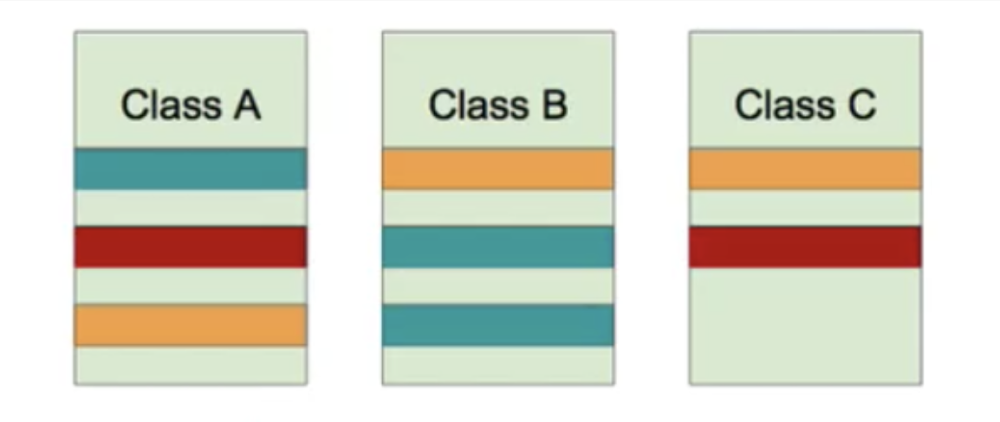
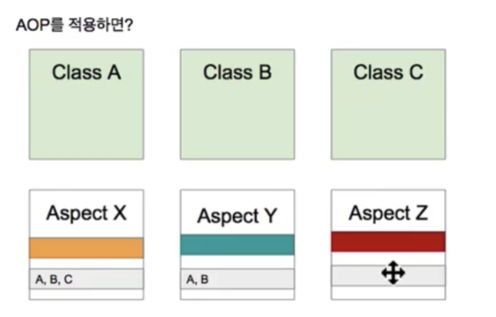
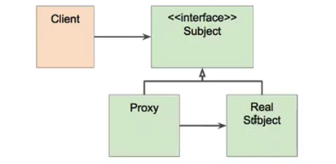
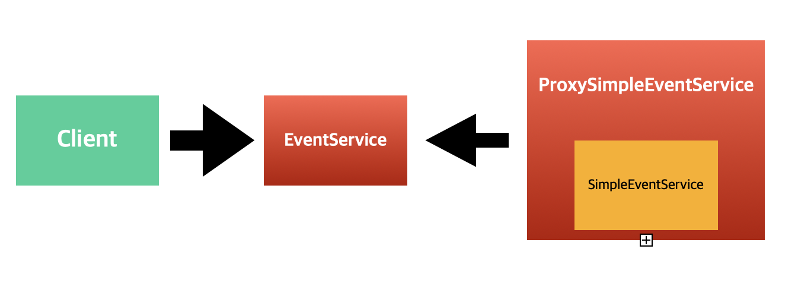

---
이번글에서는.. AOP 에 대해 **'간단히'** 살펴보도록 하겠습니다.

---

## 1.  AOP (관점 지향 프로그래밍) 란?
> Aspect-Oriented Programming (AOP) 는 OOP를 보완하는 수단으로, 흩어진 Aspect(관심사)를 모듈화 할 수 있는 프로그래밍 기법을 의미합니다.

* 흩어진 관심사 (Crosscutting Concerns)



- 동일한 색깔 : 동일한 Concerns(관심사)
- 이때 각각의 Concerns(관심사)은 여러 클래스.. 혹은 여러 메서드들에 동일하게 나타나는 동일한 코드들을 의미합니다. 

가장 대표적인 예는 트랜잭션으로. 

트랜잭션을 사용하는 경우 다음과 같은.. 공통적인 일련의 흐름을 메서드 내에서 처리하게 되는데..

    1. set auto commit 을 false 로 만들고
    2. 비즈니스 로직에 해당하는 query 를 수행하고
    3. commit 하거나 rollback 한다.

위와 같은 흐름을 처리하는 코드를.. 각각의 클래스 내부에 작성했다고 했을 때..

이때 만약 전체적으로 트랜잭션 처리에 대한 변경이 필요한 경우..?

예를 들어 1번과 2번사이에 1.5번이 새로 생긴다던지.. 4번이 신규로 추가된다던지.. 한다면? 

무수히 많은.. 클래스 파일을 열어서.. 관련 소스를 수정해야 되는 불상사가 생기게 됩니다.. (유지보수가 쉽지 않다)

## 2. Aspect

> 위와 같은 문제애 대한 해결책으로.. AOP는 'Aspect' 를 사용해서.. 각각의 클래스에 흩어져있던 공통의 관심사를 한곳에 모아 관리하게 됩니다.



각 Aspect 는 기존 각각 클래스에 흩어져있던 공통의 Concerns(관심사)를 모아 독립적으로 관리하고,

동시에 해당 기능이 어디에 적용되어야 하는지에 대한 정보를 Aspect 에 직접 명시해서 사용하게 됩니다. (주황색은 a,b에 적용해야돼!..)

결론적으로 기존 각각의 클래스에 흩어져있던 기능들을 한곳에 모아 관리함으로써.. 좋습니다..

## 3. 주요 용어
    
    1. Advice : 해야할 일들 (ex 트랜잭션..)
    2. Target : aspect 를 적용해야되는 대상 (클래스 A, B, C) 
    3. Join Point : 메서드 실행시점 / 생성자 호출하기 전 / 필드에 접근했을 때.. 등등 advice 를 적용 가능한 지점들의 묶음
    4. Point Cut : 어디에 적용해야 되는지.. (Join Point 의 subset..)

## 4. 스프링 AOP

> AOP 를 적용하고자 하는 대상이 있을 경우, 해당 bean 의 proxy 객체를 run time 시점에 생성해 사용합니다. 

#### # 프록시 패턴이란 ?



- Client 는 'Real Subject(구현체)' 가 아닌 'Interface(인터페이스)' 를 호출하고
- 'Proxy(프록시)' 객체는 'Real Subject(구현체)'을 감싸서 Client 요청을 처리하게 된다.

무슨말 일까..? 아래의 예제를 통해 살펴보자. 

1. 이벤트를 생성할 때 
2. 해당 이벤트가 걸린 시간을 측정하는 기능을 
3. 프록시 기반의 AOP 로 구현할 경우 다음과 같이 작성할 수 있다. 

#### # Interface (인터페이스) : EventService
```
public static interface EventService {

    public void createEvent()
}
```

#### # Real Subject (구현체) : SimpleEventService
```
@Serivce
public class SimpleEventService implements EventService {

    @Override
    public void createEvent() {

            // 이벤트 생성
            System.out.println("Create Event ...")
    }
} 

```
#### # Proxy (프록시) : ProxySimpleEventService 

```
@Primiary
@RequiredArgsConstructor
@Serivce
public class SimpleEventService implements EventService {

    private final SimpleEventService simpleEventService; // real subject 를 주입받는다.

    @Override
    public void createEvent() {

            // 시간 측정 시작
            long begin = System.currentTimeMillis();

            // 프록시 객체가 내부적으로.. real subject 호출
            simpleEventService.createEvent();

            // 시간 측정 끝
            System.out.println(Sytstem.currentTimeMillis() - begin);
    }
} 
```

#### # Client (클라이언트) : EventService 호출시 실제로는 프록시인 ProxySimpleEventService 를 사용



> 만약.. '시간 측정' 이라는 Aspect 를 여러 클래스에 적용하고 싶을 경우..  매번 위와 같은 프록시 객체를 만들어야 할까요?

그렇지 않습니다. 스프링 AOP 를 사용하면 aspect 를 적용하고자 하는 대상의.. proxy 객체를 run time 시점에 동적으로 생성해줍니다. 


```
@Component
@Aspect
public class SimpleAspect {

    @Around("execution("com.minholee93..*.EventService.*"))
    public Object calculate(ProceedingJoinPoint pjp) throws Throwable {
        
        // 시간 측정 시작
        long begin = System.currentTimeMillis();

        // real subject call
        Object retVal = pjp.proceed();

        // 시간 측정 끝
        System.out.println(Sytstem.currentTimeMillis() - begin);
    }
}

```

예를 들어.. 위과 같이 Aspect 를 생성하고 @Around 를 사용해 Target 과 PointCut 을 지정해준다면.. 

위의 Aspect를.. 프록시 패턴으로 실행해주는 프록시 bean 객체를 스프링이 동적으로 생성하고.

실제 Real Subject 에 대한 Client 요청이 발생한 경우 스프링은 Proxy Bean 호출해 해당 요청을 처리합니다.

---

참고 : https://www.inflearn.com/course/spring-framework_core