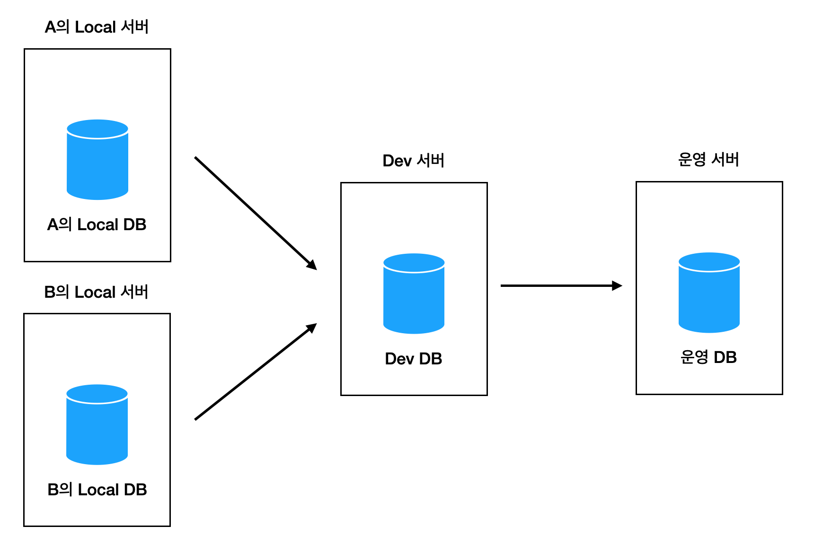
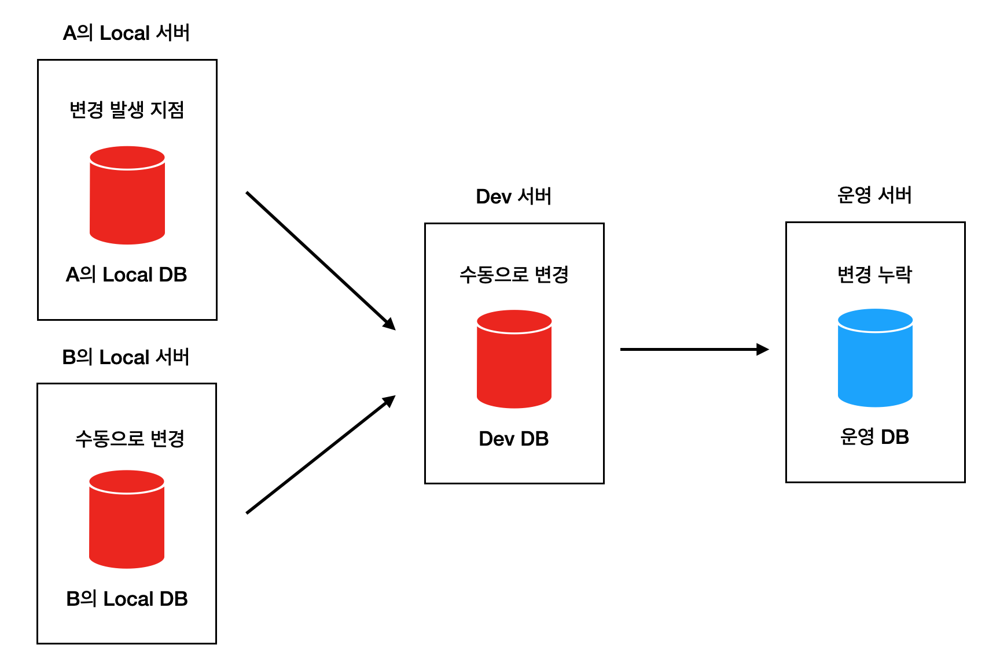
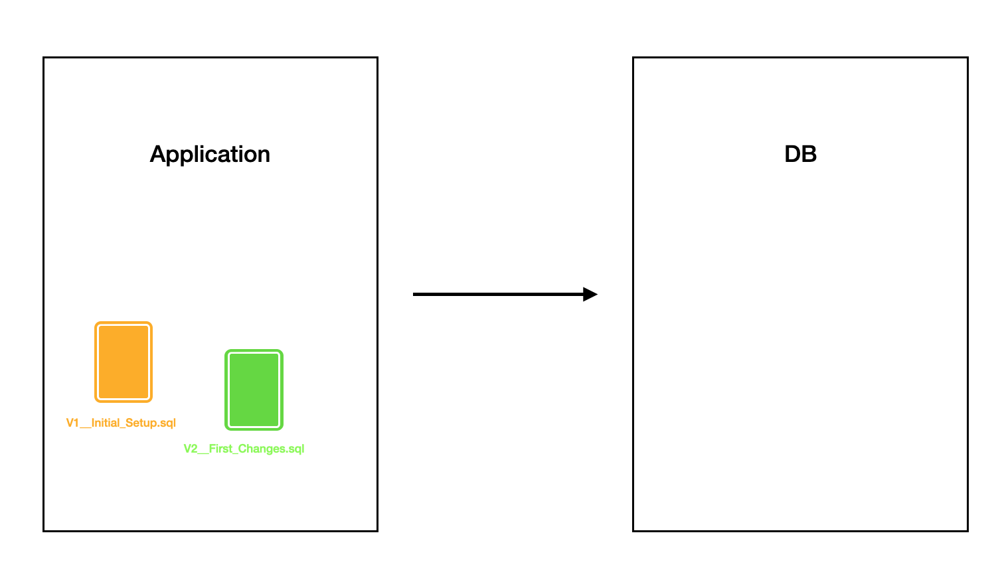
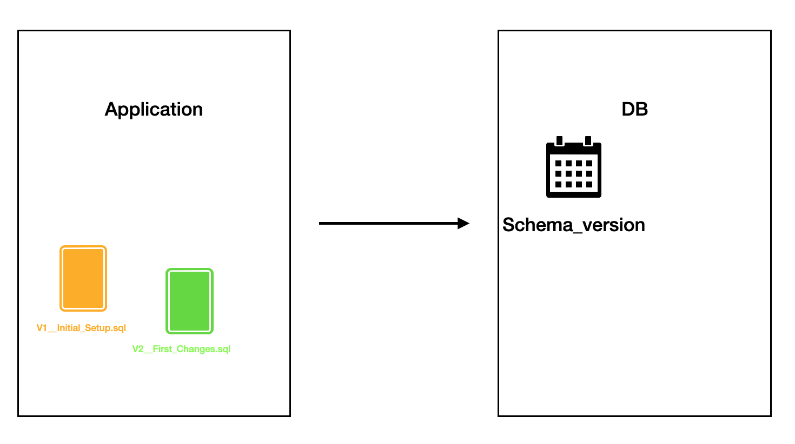
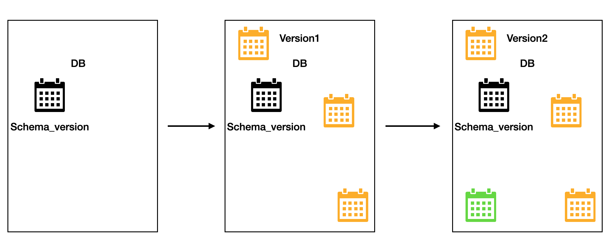
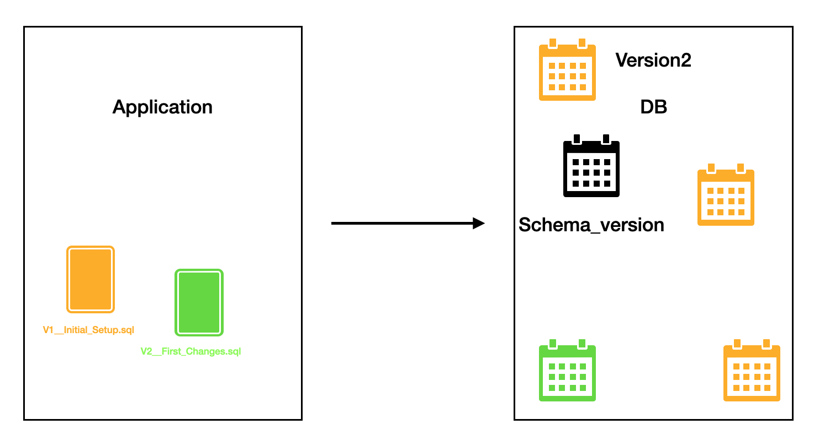
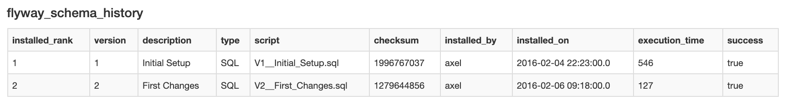
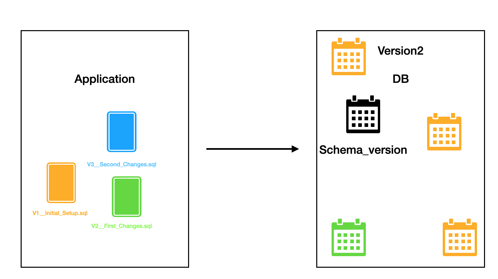
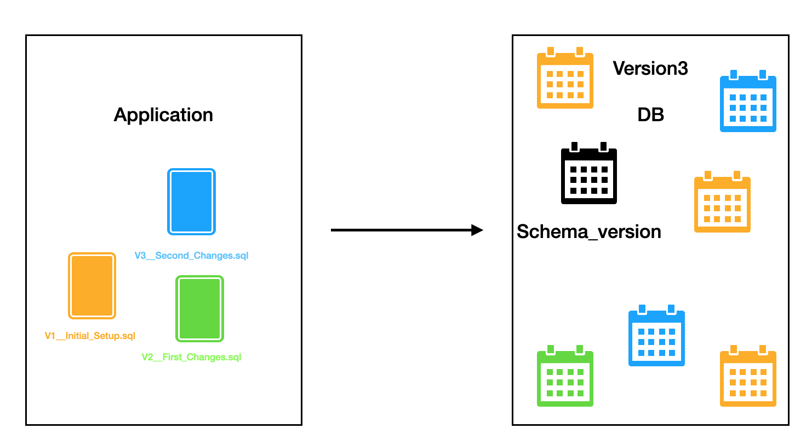
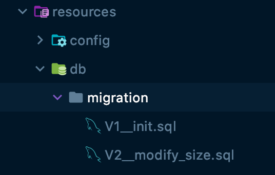

# Flyway를 활용한 데이터베이스 마이그레이션

토이프로젝트를 하면서 DB환경별 스키마 버전 관리, 자동 마이그레이션을 지원해주는 Flyway라는 매력적인 기술을 알게되어 이를 적용하고 알게 된 내용을 미약하게 정리한 내용입니다! 


## 왜 필요할까?

### 실수와 불확실성

수행하는 프로젝트에 따라 다르겠지만, 대부분 프로젝트는 다수의 배포를 수행하는 멀티 서버 환경으로 이뤄져 있습니다. 제가 현재 진행중인 프로젝트는 아래 그림과 같은 구조로 서버들을 구성되어있습니다.





수동으로 각 환경의 DB를 동기화 해야 하는 경우, 스키마의 변경이 발생할 때 마다 각 DB 서버의 스키마 변경을 수동으로 해야 했습니다. 프로젝트가 진행되면서, 서버 환경 변경에 따라 새로운 서버 인스턴스의 추가, 잦은 DB 마이그레이션으로 변경내역이 누적 될수도 있습니다.  

마이그레이선 수행 중, 현재 데이터베이스의 상태, 즉 버전을 파악하기 어려워 지고, 여러 환경에 마이그레이션 하는 중, 일부 서버에는 DB 내역 변경 누락이 발생 할 수 있습니다. 





이러한 누락으로 인해 애플리케이션의 정상적인 동작의 기대가 점점 어려워 질 것입니다. 설령 누락이 없더라도, 각 환경의 DB 상태를 신뢰성있게 추적하기 어려울 것입니다. 이 같은 Human Fault와 불확실성의 문제에서 벗어나기 위해, 자동으로 DB 변경을 관리할 필요성이 있습니다.


## Flyway

위 같은 문제 해결을 위해 DB 자동 마이그레이션을 지원하는 툴들이 등장하기 시작했습니다. 현재 Java 진영에서는 대표적으로 [Flyway](https://flywaydb.org/), [Liquibase](https://www.liquibase.org/)이 있습니다. 그 중 Flyway에 대해 알아보겠습니다. 

Flyway는 [redgate](https://www.red-gate.com/)에서 개발한 DB 마이그레이션 툴입니다. 

우선 마이그레이션 이란 무엇일까요? 

Flyway 공식 홈페이지에서는 데이터베이스에 대한 모든 변경 사항을 마이그레이션이라 정의하고 있습니다. 즉, Flyway는 테이블 생성, 변경, 데이터 CRUD 등 모든 변경 사항을 자동으로 수행, 관리해주는 프로그램으로 이해하시면 되겠습니다. 


### Flyway 동작 원리

플라이웨이는 마이그레이션 대상 DB에서  `schema history table` 라는 별도의 테이블 하나를 새로 생성, 관리합니다. 이 테이블은 DB의 상태를 추적, 관리하는데 사용됩니다. 그동안의 마이그레이션 수행 이력을 저장하는 메타테이블로 이해하시면 되겠습니다.


Flyway의 마이그레이션 방식을 **flyway가 빈 데이터베이스를 바라보고 있는 상태**에서 살펴보겠습니다. 빈 DB에 `V1__Initial_Setup.sql`,`V2__First_Changes.sql` 파일을 마이그레이션 하려는 상황입니다




마이그레이션 시, Flyway는 연결되어있는 DB에서  `schema history table`를 먼저 찾습니다. 데이터베이스가 비어있기 때문에, Flyway는 해당하는 테이블을 못 찾고,  ``schema history table`` 테이블을 새로 생성합니다.



그 직후 Flyway는 마이그레이션을 위해 마이그레이션 파일을 검색 합니다. 
마이그레이션 파일은 버전 번호 오름차순으로 적용됩니다. 위 이미지의 경우, `V1__initial_Setup.sql`,  `V2__First_Changes.sql`를 찾아 순서대로 마이그레이션을 수행할 것입니다. 





결과적으로 아래처럼 버전별 마이그레이션이 적용됩니다. 




각 마이그레이션이 적용될 때마다 적용 내역은 조금전에 생성했던 schema_history_table에 아래와 같이 기록됩니다.





과정을 다시 요약하면 아래와 같습니다. 

- flyway_schema_history라는 테이블이 새로 생성된 후, 
- 각 버전별 SQL문의 마이그레이션 수행 후
- 성공적으로 마이그레이션이 실행 됐음을, flyway_schema_history 테이블에 저장합니다. 
- 위 2-3 단계를 마이그레이션 파일 별로 반복 수행합니다. 

flyway_schema_history 테이블에 마이그레이션 이력을 통해 현재 DB에서 수행된 마이그레이션의 내역을 확인할 수 있습니다.

이상 비어있는 DB에 두개의 SQL 스크립트 마이그레이션 수행 과정에 대해 살펴 봤습니다. 


그렇다면, 해당 DB에 추가적인 마이그레이션을 해야 하는 경우에는 어떻게 해야 할까요? 

결론부터 말씀 드리면, 기존의 스크립트문은 그대로 두고, 새로운 SQL 스크립트문 추가 후 마이그레이션을 수행하면 됩니다. Flyway는 이전에 수행했던 스크립트문은 실행하지 않고, 새로 추가한 스크립트문만 실행하도록 도와줍니다.  

이는 메타테이블 flyway_schema_history에서 마이그레이션 이력을 버전 기반으로 관리하고 있기 때문인데요, 스크립트 문들은 버전 넘버링을 통해 파일을 관리하고 있습니다. ( V1__XXX, V2_XXX 처럼요!)  스크립트문들은 최근 마이그레이션 한 버전 번호를 기준으로  자신의 버전이 낮거나, 같으면 마이그레이션이 일어나지 않습니다. 

예를 들어보겠습니다. 



앞서 예제에 이어 가보도록 하겠습니다. 기존에 2개의 스크립트문을 마이그레이션 한 상황에서, DB 에 추가적인 마이그레이션이 필요하여 `V3__Second_Changes.sql` 스트립트문을 추가했습니다. 그리고 마이그레이션을 실행한다면, 아래처럼 3번째 버전에 해당하는 스크립트문만 추가적으로 마이그레이션이 수행됩니다. 이는 `Schema_version` 테이블에서 관리하는 실행내역을 조회 후, 최근에 실행했던 마이그레이션 문의버전이 2임을 확인하고, 2 이하의 스크립트문은 실행하지 않았기 때문입니다. 




V3의 스크립트 문 마이그레이션 후, `Scheme_version` 테이블에는 3버전의 스크립트문이 수행되었음을 기록함으로써, 해당 DB의 버전관리를 계속 수행해 나갈 것입니다! 


## 사용법

Flyway는 여러가지 방법을 통한 사용법을 제공하고 있습니다. 

CLI, Java API, Maven, Gradle 플러그인 등을 통한 다양한 방법을 통해 사용할 수 있는데요, 저는 Spring Boot를 활용해서 사용했습니다. 

Java 진영에서 주로 사용하는 Liquibase 와 Flyway 모두 [SpringBoot ](https://docs.spring.io/spring-boot/docs/current/reference/html/howto.html#howto-use-a-higher-level-database-migration-tool)에서 공식적으로 연동을 지원 하기 때문에 Spring boot 프로젝트에서 

 ```groovy
implementation 'org.flywaydb:flyway-core'
 ```

위 의존성을 추가만 하시면 손쉽게 Flyway를 사용할 수 있습니다. 

```yaml
spring:
  datasource:
    url: database url
    username: 사용자이름
    password: pw
  flyway:
    enable: true # 애플리케이션 시작시 마이그레이션을 시작할지 여부를 설정하는 속성/값으로 기본값은 true 입니다. 
```

application.properties (혹은 yml) 파일에서 프로젝트와 연결할 db만 위처럼 설정해 주시면, 애플리케이션을 작동할때마다 flyway에서 자동으로 마이그레이션을 실시합니다. 



마이그레이션을 위한  SQL 스크립트문은 그림처럼 기본적으로 **resources/db/migration/** 이하에 위치시키면 됩니다. properties 파일에서 스크립트문을 읽어올 경로를 커스텀으로 설정할 수 있습니다!


### 이름 규칙

Flyway에서 마이그레이션할 파일의 이름 규칙이 정해져있습니다. 

- prefix:  **V** 는 버전 마이그레이션, **R**은 반복 마이그레이션용 접두사입니다. 반드시 파일은  V나 R로 시작해야 합니다.
  - 참고로 이 포스팅에서는 V에 해당하는 버전 마이그레이션만 사용했고 이에대해서만 설명 되어있어요. 그래서 V만 사용했어요! 
- version: version은 버전 마이레이션에서만 사용되며 숫자와 점(.)이나 언더바(_) 조합으로 구성해야합니다. 
- separator: description을 구분하기 위한 구분자로 **반드시 undersocre(언더바)를  2개( __  ) 써야합니다.**
- description: 이 부분은 schema_version테이블에 저장시 설명으로 사용하는 부분입니다. 
- suffix: 확장자로 기본은 **.sql**입니다.

위 규칙에 따라  V1__init.sql 을 분석하면 

`V(prefix), 1(version), __(separator), init(description), .sql(suffix)`로 구성되어있음을 확인 할 수 있습니다.

참고로 위 그림을 통한 원리 부분에서도 마이그레이션 파일의 이름 또한 규칙에 따라 명명 되어있어요! 


## 마무리

Flyway의 마이그레이션 원리와, Spring boot 에서 사용법에 대해 간단하게 알아보았습니다. 
Flyway를 통해 마이그레이션에 필요한 스크립트문을 버전 넘버링을 통해 관리만 해주면, DB상에서 메타 테이블을 통해 DB의 현재 버전을 알 수 있으며, DB 에 적용하지 않았던 스크립트문을 최신 버전까지 자동으로 마이그레이션 을 할 수 있음을 암시 할 수 있습니다! 

따라서 각 로컬환경, 개발환경, 테스트환경, 스테이징 환경 등에서 각 DB의 상태관리 및 자동 마이그레이션을 가능하게 해주기 때문에, 일부 스크립트문 누락 등의 실수를 예방 할 수 있으며, DB들의 현재 적용 스키마 내역을 쉽게 추적할 수 있다는 이점이 있습니다. 


위 글은 토이프로젝트에 Flyway를 새로 학습 하고 적용하면서 알게 된 부분을 정리한 내용입니다. 따라서 부족한 부분과 잘못된 내용이 기재되어있을 수도 있어요! 그런 부분에 대해 피드백 주시면 정말 감사한 마음으로 받고 개선하겠습니다! 

