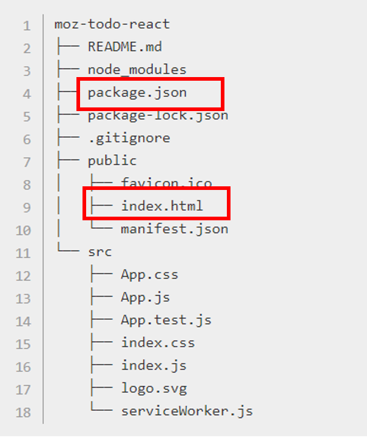

# 리액트의 주요개념과 기본 사용법

1. 리액트를 사용하는 이유

- UI를 생성하는데 있어 버그를 최소화하기 위함
- UI의 구성요소를 component 요소로 쪼개어 각각이 논리적 역할을 하여 UI 디자인에 더 집중할 수 있게 함

2. 주요개념 : Components and Props

#### Components는 UI를 독립적이고, 재사용가능한 요소로 쪼갠 것

component는 import, export를 통해 연결

**Class component**

- (js 내용 참고) Function은 호이스팅이 되지만 Class는 호이스팅이 되지 않음
- 렌더할 내용을 render(){ ... } 내부 메서드를 통해 return 해줌
- state, lifeCycle 관련 사용가능
- this.props, this.state 등 this를 붙여 사용
- constructor 내부에 super(props)를 하여 프로퍼티를 받아줌

```javascript
constructor(props){
  super(props)
}
```

**Function component**

- 렌더할 내용을 return해줌
- state, lifeCycle 관련 사용 불가하였으나 Hook을 통해 해결됨

#### Props는 리액트 컴포넌트로 들어온 모든 데이터를 지칭

일방향성을 가지고 있으며, 부모에서 자식 컴포넌트로만 이동됨 (read-only)

3. 리액트 기본사용법

#### 폴더 및 파일 기본 구조



- public 폴더 : 브라우저에서 읽힐 파일들이 들어있음
- index.html : public 폴더 내 가장 중요함. 리액트에서 사용한 코드들이 브라우저에 이 html파일을 통해 실행됨.
  (src/index.js 파일(실질적 리액트코드들)이 public/index.html의 #root로 들어오게 됨)

```javascript
ReactDOM.render(<App />, document.getElementById("root"));
```

local json파일로 데이터를 작성하였을때, 이미지 상대경로 설정 때문에 헤맸던 적이 있는데, public내 image 폴더 생성후 넣어주고, ./image/이미지.jpg로 설정해주면 이미지 들어옵니다!
브라우져에 렌더될 때, public 폴더 기준으로 렌더가 되어서 그런 듯 싶어요.

- package.json : 프로젝트에서 사용된 모듈이나 라이브러리등 정보를 포함
- 리액트에서 렌더될 내 모든 파일 : import 리액트 모듈 필수

```javascript
import React from "react";
```

#### JSX사용

- curly braces {} 를 사용하여 사용가능
- camelCase 프로퍼티 사용 (예시 : class 대신 className 사용)

#### 리액트의 데이터

- props : 부모 컴포넌트가 자식 컴포넌트에게 넘겨주는 데이터. 직접수정 불가 (read-only)
- state : 컴포넌트 내부에서 선언하며 값이 변경가능함

#### 이벤트 핸들링

```javascript
function ActionLink() {
  function handleClick(e) {
    e.preventDefault();
    console.log("The link was clicked.");
  }

  return (
    <a href="#" onClick={handleClick}>
      Click me
    </a>
  );
}
```

- 함수로 이번트 핸들러 전달
- 기본기능을 방지하기 위해서는 preventDefault()를 호출해 주어야함 (return False를 해도 기본기능 방지되지 않음)
- 위와 같이 onClick={함수}의 처리가 아닌 addEventListener를 사용할 경우 lifeCycle에서 생성, 삭제를 해주어야함

#### list key 설정

- 리스트 작성시 고유한 key를 넣어주어야 함. (대부분의 경우 id값을 사용)
- 변경, 추가, 삭제시 안정적인 고유성을 부여하기 위함
