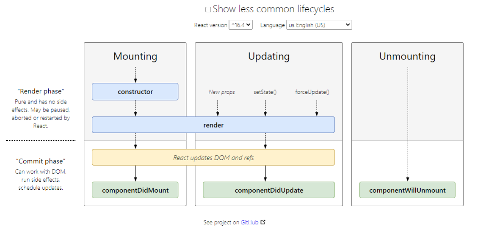
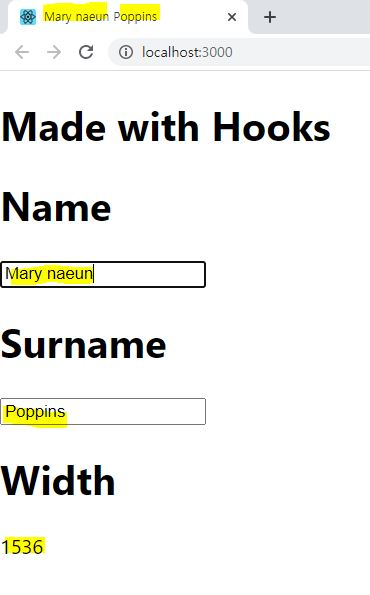
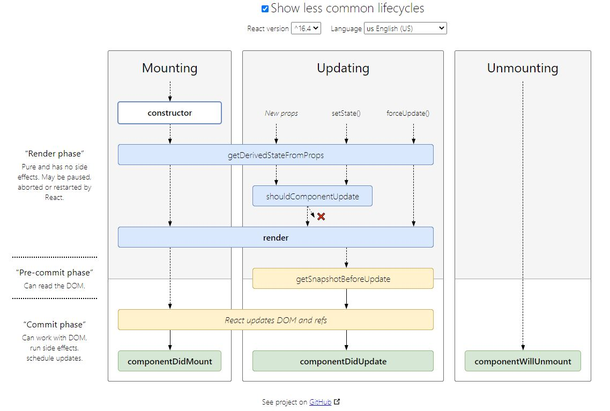

# React - LifeCycle and Hooks

## 1. LifeCycle

- 리액트에서는 컴포넌트가 처음 나타날때 및 변경될 때마다, render를 다시 한다. render 되는 과정을 나타내는 것이 lifecycle이다.



- 가장 많이 사용하는 lifecycle의 단계

1. componentDidMount  
   : 컴포넌트의 인스턴스(데이터)가 생성되어 DOM 상에 삽입되어 렌더링 된 후
   : fetching, animation, subscribing(구독)
2. componentDidUpdate  
   : props 또는 state가 변경되어 다시 렌더링 된 후  
   : condition을 넣어주지 않으면 무한반복됨
3. componentWillUnmount :컴포넌트가 DOM 상에서 제거될 때  
   : unsubscribing(구독해제)

- lifecycle에서 clean-up이 필요할 때

외부 데이터를 subscribe(구독)한 것은 componentWillUnmount에서 해제를 한다.  
: 메모리 누수가 발생하지 않도록 하기 위함

## 2. Hooks

- 기존에는 class 사용할 때만 Lifecycle을 사용하여 state의 값을 업데이트하고 변경하는 것이 가능했다.  
  하지만, Hook이 등장하면서 함수에서도 state 값을 변경하는 것이 가능해졌다.

- Hook의 장점 (왜 만들어졌는가?)

1. class는 사용하기 어렵다ㅠㅠ  
   : this를 사용 해야하는 것, 바인딩을 해줘야 하는 것, lifeCycle 단계에 따라 설정해 줘야 하는 것 등
2. 기능별로 나눠 재사용가능하며, 가독성을 높힐 수 있다  
   : 리액트의 개념에 부합하는 것!! 기능별로 더 잘게 나눠 각각의 기능을 조작이 가능하다.
3. 리액트의 기존 기능들과 100% 호환가능하다.

- 가장 많이 사용되는 Hooks

  1. useState : class에서 state를 초기지정하고, setState를 통해 업데이트 해주는데, 그 역할을 담당
  2. useEffect : lifecycle에서 componentDidMount, componentDidUpdate, componentWillUnmount를 합쳐 놓은 것.

## 3. Comparison - LifeCycle and Hooks

사용예시 : 입력값에 따라 bar title을 업데이트, 윈도우 사이즈에 따라 너비 표시


#### LifeCycle in Class

```javascript
class LifeCycle extends React.Component {
  constructor(props) {
    super(props);
    // this.state 값 초기화
    this.state = {
      name: "Mary",
      surname: "Poppins",
      width: window.innerWidth,
    };
    //각 함수를 바인딩
    this.handleNameChange = this.handleNameChange.bind(this);
    this.handleSurnameChange = this.handleSurnameChange.bind(this);
    this.handleResize = this.handleResize.bind(this);
  }

  componentDidMount() {
    //처음에 렌더링 될때 bar의 title 설정
    document.title = this.state.name + " " + this.state.surname;
    //EventListner구독
    window.addEventListener("resize", this.handleResize);
  }
  componentDidUpdate() {
    //업데이트 될때마다 bar의 title 실시간 업데이트
    document.title = this.state.name + " " + this.state.surname;
  }
  componentWillUnmount() {
    //EventListner구독해제
    window.removeEventListener("resize", this.handleResize);
  }

  //resize callback
  handleResize() {
    this.setState({
      width: window.innerWidth,
    });
  }
  //이름 변경을 state값 변경
  handleNameChange(e) {
    this.setState({
      name: e.target.value,
    });
  }

  handleSurnameChange(e) {
    this.setState({
      surname: e.target.value,
    });
  }
  render() {
    return (
      <>
        <h1>Made with LifeCyle in Class</h1>
        <h1>Name</h1>
        <input value={this.state.name} onChange={this.handleNameChange} />
        <h1>Surname</h1>
        <input value={this.state.surname} onChange={this.handleSurnameChange} />
        <h1>Width</h1>
        <span>{this.state.width}</span>
      </>
    );
  }
}

export default LifeCycle;
```

#### Hooks in Function

```javascript
import React, { useState, useEffect } from "react";

function Hooks(props) {
  //(class : this.state로 초기화 하고, setState로 업데이트) 대신 useState를 사용하여 초기화 및 값을 업데이트
  const [name, setName] = useState("Mary");
  const [surname, setSurname] = useState("Poppins");
  const [width, setWidth] = useState(window.innerWidth);

  //아래와 같은 예시들로 기능별로 관련된 코드들이 나눠져 있는 것이 아니라 각 기능별로 함수를 묶어 모듈화 하는 것이 가능하다.
  //각각의 기능을 가진 함수는 customize hooks로 따로 추출하여 관리 및 재사용이 가능하다.

  //(class : componentDidMount와 componentDidUpdate에서 값을 업데이트) 대신 useEffect로 한번에
  useEffect(() => {
    document.title = name + " " + surname;
  });

  //(class에서 window 관련 이벤트들이 componentDidMount, componentWillUnmount등에 나누어져 있었다면)
  //useEffect내부에서 window 관련 이벤트를 정리가능
  useEffect(() => {
    //callback함수 정의하고 setWidth로 값을 업데이트
    const handleResize = () => {
      setWidth(window.innerWidth);
    };
    //EventListener 구독
    window.addEventListener("resize", handleResize);
    //구독 해제
    return () => {
      window.removeEventListener("resize", handleResize);
    };
  });

  function handleNameChange(e) {
    setName(e.target.value);
  }
  function handleSurnameChange(e) {
    setSurname(e.target.value);
  }

  return (
    <>
      <h1>Made with Hooks</h1>
      <h1>Name</h1>
      <input value={name} onChange={handleNameChange} />
      <h1>Surname</h1>
      <input value={surname} onChange={handleSurnameChange} />
      <h1>Width</h1>
      <span>{width}</span>
    </>
  );
}
export default Hooks;
```

###### 참고

**LifeCycle 추가**



잘 사용되지 않으나 간략하게 사용 용도를 찾아서 정리해봤습니다.  
getDerivedStateFromProps : 렌더 바로 직전에 호출. props의 변화에 따라 내부 state값을 업데이트 하게 함 (거의 사용되지 않음)  
shouldComponentUpdate : 최적화에 사용(렌더하지 않아도 되는 컴포넌트 지정 등). 하지만 주로 PureComponent나 memo를 이용하라고 하네요.  
getSnapshotBeforeUpdate : chat같은 UI에서 scroll position등을 설정할때

[lifecycle](https://projects.wojtekmaj.pl/react-lifecycle-methods-diagram/)  
[리액트 hook 동영상](https://www.youtube.com/watch?v=dpw9EHDh2bM&feature=youtu.be)  
[리액트 hook 공식 문서](https://ko.reactjs.org/docs/hooks-intro.html)

리액트 hook 동영상을 기반으로 작성였습니다.
