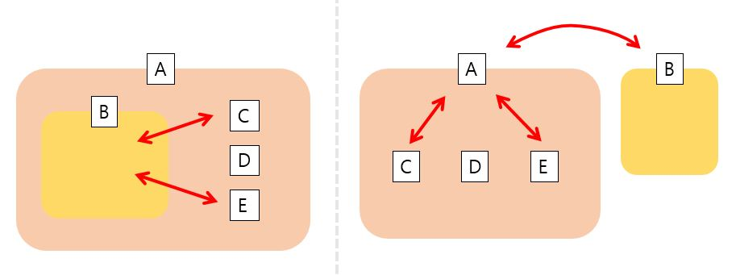

# React \_ API를 사용하여 외부 데이터 받아오기

## 1. DI (Dependency Injection)



#### DI란?

의존성 주입이라고 불리며, 의존하는 객체를 분리하여 주입한다.  
a의 내부에 있는 b는 c,e 등에 관계 의존성을 가지고 있다.  
b를 a로 부터 분리하여 주입하면(의존관계 역전, 의존성의 분리) c,e는 a에 주입된 b와 관계성이 형성되므로 b자체 보다는 a와의 관계에 신경쓰면 된다.

#### Di의 장점

**기능 단위로 분리된다**

1. 테스트가 용이하다
2. 코드의 재사용성을 높여준다
3. 객체 간 결합도를 줄여준다
4. 가독성이 좋아진다

## 2. Comparison - Fetch & Axios

#### Fetch

자바스크립트의 내장함수로 서버에 데이터를 호출, 요청하는 함수
비동기적으로 promise로 반환

src/service/youtube.js

```javascript
class Youtube {
  constructor(key) {
    this.key = key;
    this.getRequestOptions = {
      method: "GET",
      redirect: "follow",
    };
  }
  //youtube Class 내부에 비동기 메서드를 생성
  //가장 유명한 동영상을 받아오는 url
  async mostPopular() {
    const response = await fetch(
      `https://www.googleapis.com/youtube/v3/videos?part=snippet&chart=mostPopular&maxResults=25&key=${this.key}`,
      this.getRequestOptions
    );
    //response를 json으로 변환
    const result = await response.json();
    return result.items;
  }
  //검색한 동영상을 받아오는 url
  async search(query) {
    const response = await fetch(
      `https://www.googleapis.com/youtube/v3/search?part=snippet&maxResults=25&q=${query}&type=video&key=${this.key}`,
      this.getRequestOptions
    );
    const result = await response.json();
    return result.items.map((item) => ({ ...item, id: item.id.videoId }));
  }
}
export default Youtube;
```

src/index.js

```javascript
//youtube 객체 생성하여 App 컴포넌트에 youtube prop으로 전달
//App의 컴포넌트에서 메서드를 사용하여 youtube url을 받아올 수 있다.
const youtube = new Youtube(process.env.REACT_APP_YOUTUBE_API_KEY);
ReactDOM.render(
  <React.StrictMode>
    <App youtube={youtube} />
  </React.StrictMode>,
  document.getElementById("root")
);
```

#### Axios

API를 불러올 수 있는 라이브러리로 params 단위로 분리하여 key : value의 형태로 작성할 수 있어 코드 가독성이 좋다.

src/service/youtube.js

```javascript
class Youtube {
  //httpClient에서 공통적으로 사용되는 baseUrl, key정보를 주입
  constructor(httpClient) {
    this.youtube = httpClient;
  }

  async mostPopular() {
    //비교 https://www.googleapis.com/youtube/v3/videos?part=snippet&chart=mostPopular&maxResults=25&key=${this.key}
    const response = await this.youtube.get("videos", {
      params: {
        part: "snippet",
        chart: "mostPopular",
        maxResults: 25,
      },
    });
    return response.data.items;
  }
  async search(query) {
    //비교 https://www.googleapis.com/youtube/v3/search?part=snippet&maxResults=25&q=${query}&type=video&key=${this.key}
    const response = await this.youtube.get("search", {
      params: {
        part: "snippet",
        maxResults: 25,
        q: query,
        type: "video",
      },
    });
    return response.data.items.map((item) => ({
      ...item,
      id: item.id.videoId,
    }));
  }
}
export default Youtube;
```

src/index.js

```javascript
const httpClient = axios.create({
  baseURL: "https://www.googleapis.com/youtube/v3",
  params: { key: process.env.REACT_APP_YOUTUBE_API_KEY },
});
const youtube = new Youtube(httpClient);
ReactDOM.render(
  <React.StrictMode>
    <App youtube={youtube} />
  </React.StrictMode>,
  document.getElementById("root")
);
```

###### References

드림코딩 강의 내용을 바탕으로 작성하였습니다.  
[참고한 글](https://medium.com/@jang.wangsu/di-dependency-injection-%EC%9D%B4%EB%9E%80-1b12fdefec4f)
