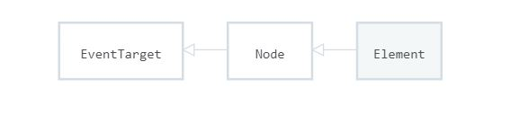
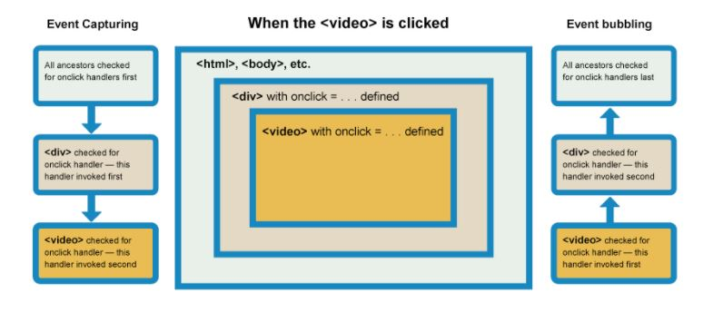
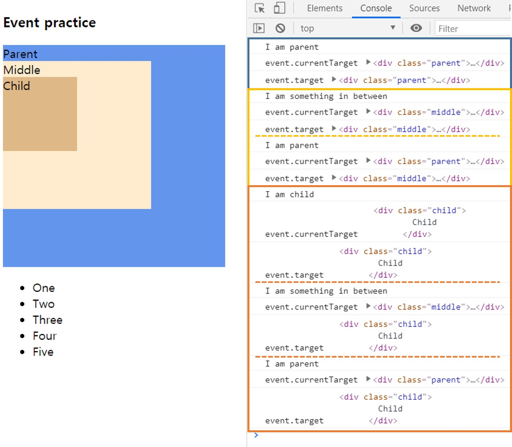

# JavaScript Event 정리와 조건적 CSS 적용 예시

## 1. JS Event

#### Event

  
모든 element는 node를 상속하고 모든 node는 Event를 상속한다. 즉, 모든 엘리먼트는 eventTarget이다.

1. 자주 사용되는 이벤트

   mouse : click, mousemove, contextmenu  
   window : resize, scroll  
   form : submit, reset, change, focus, blur  
   [다양한 이벤트 종류들 MDN](https://developer.mozilla.org/ko/docs/Web/Events)

   `event.preventDefault()` : 이벤트가 가지고 있는 기본기능 취소 (자주 사용되는 예시 : submit의 reload되는 것을 방지함)

2. 3가지 event Methods

   `EventTarget.addEventListener()` : EventTarget에 특정 이벤트 처리기(handler)를 등록  
   `EventTarget.removeEventListener()` : EventTarget에 주어진 수신기 제거  
   `EventTarget.dispatchEvent()` : EventTarget에 특정 이벤트를 보냄  
   (dispatchEvent는 이벤트 핸들러를 동기적으로 호출할 수 있다. 예를 들어 클릭하지 않아도 dispatchEvent에 클릭이벤트를 등록하면, 클릭이벤트가 실행되는 것과 같은 효과를 낼 수 있다.)

   [EventTarget Method MDN](https://developer.mozilla.org/ko/docs/Web/API/EventTarget)

3. Bubbling And Capturing

     
    [버블링, 캡처링 MDN](https://developer.mozilla.org/en-US/docs/Learn/JavaScript/Building_blocks/Events#Event_bubbling_and_capture)  
    이벤트 캡처링 : 바인딩 되어있는 부모부터 이벤트 처리기가 불러와 내려져 오는 것 (캡처링 단계에서 무언가 이벤트를 처리하는 일은 거의 없다고 합니다.)  
    이벤트 버블링 : 캡처링과 반대로 이벤트가 일어난 대상부터 이벤트가 바인딩 되어있는 부모까지 올라가는 것 (상위 부모의 이벤트를 호출합니다.)

```javascript
//sample code - 각 div에 클릭이벤트를 등록하고, 이벤트 발생시, currentTarget과 target을 콘솔에 출력
<body>
  <div class="parent">
    Parent
    <div class="middle">
      Middle
      <div class="child">
        Child
      </div>
    </div>
  </div>
  <script>
  const parent = document.querySelector(".parent");
  const middle = document.querySelector(".middle");
  const child = document.querySelector(".child");

  parent.addEventListener("click", ()=>{console.log("I am parent");console.log("event.currentTarget",event.currentTarget); console.log("event.target",event.target)})
  middle.addEventListener("click",  ()=>{console.log("I am something in between");console.log("event.currentTarget",event.currentTarget); console.log("event.target",event.target)})
  child.addEventListener("click", ()=>{console.log("I am child");console.log("event.currentTarget",event.currentTarget); console.log("event.target",event.target)})
  </script>
</body>
```

4. Comparison - event.target & event.currentTarget

     
    event.target :실제 이벤트가 발생하는 위치. 즉, 내가 클릭한 요소  
    event.currentTarget : 이벤트가 바인딩 되어있는 위치(this가 가리키는 것). 예를 들면 자식의 부모 요소가 될 수도 있다.

버블링 단계에서 상위 부모의 이벤트를 호출하지 않기 위해서는 `stopPropagation()`를 사용한다. 하지만, 이것은 이벤트 자체를 무시하는 것이므로 추후 프로젝트가 복잡해질 경우 문제가 될 수 있으니 아래와 같이 처리해주는 방법이 더 좋다.

```js
(event) => {
  if (event.target !== event.currentTarget) {
    return;
  }
};
```

5. 이벤트 위임 (Delegation)

이벤트 위임은 비슷한 방식으로 여러 요소를 다룰때 사용된다. 요소에 할당할 이벤트를 부모에게 위임하여 자식요소 각각에 이벤트가 적용된 효과를 얻는다.  
아래의 예시는 ul태그 아래 각 li태그를 선택시 배경색이 바뀌게 하는 경우이다.

```html
<style>
  .selected {
    background-color: darkgreen;
  }
</style>
```

```html
<ul class="ul">
  <li>One</li>
  <li>Two</li>
  <li>Three</li>
  <li>Four</li>
  <li>Five</li>
</ul>
```

```js
const ul = document.querySelector("ul");
ul.addEventListener("click", (event) => {
  if (event.target.tagName == "LI") {
    event.target.classList.add("selected");
  }
});
```

currentTarget과 target을 이용하여 각 엘리먼트의 정보를 받아올 수 있다. 이를 활용하여 각 개별 리스트에게 이벤트리스너를 등록한 것과 같은 효과를 낼 수 있게 되는 것이다.

## 2. 조건적 CSS 사용 예시

아래 예시들은 React와 postCSS를 사용한 예시입니다.  
(postCSS 사용시, 장점은 모듈화가 가능합니다. `app.jsx`의 css파일로 `app.module.css`를 만들고 `app.jsx`에서 `import styles from "./app.module.css"` 하여 `className={styles.클래스이름}`의 형식으로 작성합니다. postCSS를 사용하면 실행될 때, 각 파일 단위로 BEM 형식의 클래스 이름이 알아서 작성이 되기 때문에 클래스 이름이 겹치는 고려를 하지 않아도 됩니다. 즉, 개별 파일에서만 클래스 이름이 겹치지 않게 해주면 되기 때문에 클래스 이름에 대한 고민이 줄어들 수 있습니다~!)

1. 선택 요소에 따른 전체적인 레이아웃 변경

리액트에서 state의 상태에 따라 조건문을 사용해 컴포넌트를 보여줄 수 있다. 아래의 예시는 selectedVideo가 있을 경우 VideoDetail 컴포넌트를 보여준다. 또한, VideoList에 `prop`으로 display에 어떤 정보를 내려줄 지 조정할 수 있다.

```js
return (
  //...
  <section>
    {selectedVideo && (
      <div className={styles.detail}>
        <VideoDetail video={selectedVideo} />
      </div>
    )}
    <div className={styles.list}>
      <VideoList
        videos={videos}
        onVideoClick={selectVideo}
        display={selectedVideo ? "list" : "grid"}
      />
    </div>
  </section>
);
```

내려온 display 정보에 따라 클래스이름을 선택할 수 있다. 클래스 이름을 container와 displayType을 다중으로 넣어주어 추후 어떤 CSS를 보여줄 지 설정할 수 있다.

```js

const Video = memo(({ ... , display }) => {
  const displayType = display === "list" ? styles.list : styles.grid;
  return (
    <li
      className={`${styles.container} ${displayType}`}
      onClick={() => onVideoClick(video)}>)})
```

```css
.container.grid {
  width: 50%;
}
.container.list {
  width: 100%;
}
```

2. 조건(loading) 여부에 따라 요소의 뷰상태 변경

loading을 state로 관리하여 loading 여부에 따라 버튼이 보여거나, 로딩스피너가 보여지는 것을 관리할 수 있다.  
!loading인 경우 설정한 name 요소에 따라 버튼 색을 pink, grey 중 설정이 가능하다.

```js
{
  !loading && (
    <button
      className={`${styles.button} ${name ? styles.pink : styles.grey}`}
      onClick={onButtonClick}
    >
      {name || "No File"}
    </button>
  );
}
{
  loading && <div className={styles.loading}></div>;
}
```

3. 선택 요소에 따라 개별 디자인 변경

`<select name="theme">` 자식태그인 `<option>`에서 dark, light, colorful으로 theme별로 선택이 가능하게 하였다.  
이때, 선택된 theme별로 switch문을 사용하여 클래스 이름을 반환할 수 있도록 설정하였다.  
설정된 값에 따라 클래스 이름에 추가되며 각 이름에 맞는 css 설정에 따라 디자인 조정이 가능하다. 선택의 경우가 2가지인 경우 위의 예시와 같이 삼항연산자를 이용하여 간단한 if문을 구성하였다면, 선택의 요소가 3가지 이상이 되는 경우 switch문으로 구성해주면 된다.

```js
return (
    <li className={`${styles.card} ${getStyles(theme)} `}>
      
    </li>
  );
})
function getStyles(theme) {
  switch (theme) {
    case "dark":
      return styles.dark;
    case "light":
      return styles.light;
    case "colorful":
      return styles.colorful;
    default:
      throw new Error(`unknown theme: ${theme}`);
  }
}
```

###### References

[element MDN](https://developer.mozilla.org/ko/docs/Web/API/Element)  
[다양한 이벤트 종류들 MDN](https://developer.mozilla.org/ko/docs/Web/Events)  
[EventTarget Method MDN](https://developer.mozilla.org/ko/docs/Web/API/EventTarget)  
[이벤트 버블링, 캡처링](https://developer.mozilla.org/en-US/docs/Learn/JavaScript/Building_blocks/Events#Event_bubbling_and_capture)  
드림코딩 강의내용을 바탕으로 작성하였습니다.
