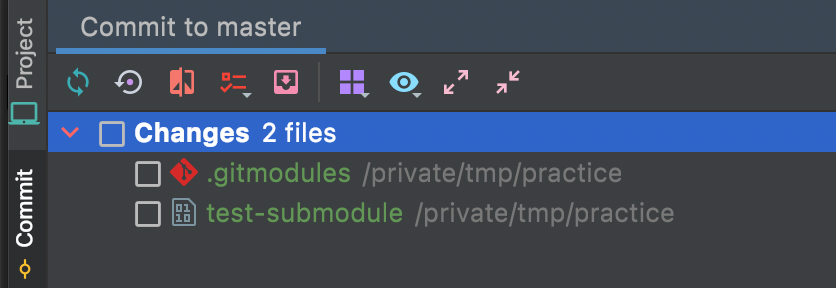
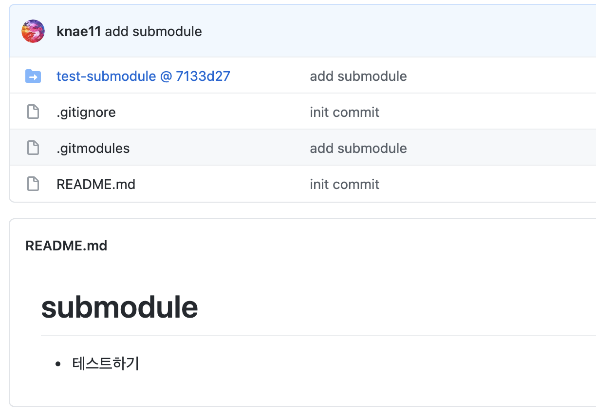

# 프로젝트를 하면서 새롭게 배운 내용들

## 서브모듈

- 서브모듈은 Git 의 기능
- "Git 저장소 안에 다른 Git 저장소를 디렉토리로 분리해 넣는 것"
### 시작하기
```bash
  $ git submodule add 서브모듈경로
```
- 시작하면 `.gitsubmodule`이 생기며 설정정보가 들어간다.
```text
[submodule "test-submodule"]
	path = test-submodule
	url = https://github.com/knae11/test-submodule.git
```
- 서브모듈에 새로운 내용을 추가하고 싶다면 서브모듈에 파일을 추가하고, 해당 경로로 가서 commit, push 를 한다.
  - 서브모듈에서 git 관리는 따로 관리된다.
- 서브모듈에 새로운 내용이 반영되었다면, 본 프로젝트 커밋 목록에 서브모듈이 나타난다.
  

- 해당 파일을 commit, push 해야 원격 저장소에도 서브모듈이 적용된다.
- 서브모듈은 커밋의 해시값을 가리킨다.
  
### 서브모듈 추가
- `git clone --recurse-submodules 서브모듈주소` 로 내부 값 전체를 클론해 추가할 수 있다.
### 서브모듈 내용 업데이트
- 원격 서브모듈에 새로운 내용을 반영했다고해서 본 프로젝트에 바로 반영되거나, 리모트 브랜치에 바로 반영되지 않는다.
  그 이유는 서브모듈은 브랜치를 가리키는 것이 아니라 커밋의 해시값을 가리키고 있기 때문이다.
- 방법1: **서브모듈 디렉토리로 가서** 원격 내용을 pull 하여 반영하면 된다. (원래 깃을 사용하듯이 반영하면 된다.)
- 방법2: **본 프로젝트에서** `git submodule update --remote 서브모듈이름` 로 서브모듈을 업데이트 시킨다.
  - 해당 명령어는 기본적으로 서브모듈의 `master` 브랜치에 checkout 후에 가져오는 방식이다.
  - update 할 때, 설정된 브랜치를 바꾸고 싶다면 `git config -f .gitmodules submodule.서브모듈이름.branch 서브모듈의브랜치` 명령어로 바꿔줄 수 있다.
    - submodule 의 브랜치가 `main`으로 되어 있어서 초기에 `git submodule update` 가 되지 않았었다.
- update 후 본 프로젝트에도 commit, push 를 해야 본 프로젝트 원격레포에서도 업데이트한 서브모듈의 커밋 해시값을 가리키게 된다.

### 활용
- 프로젝트에서 private 레포짓토리를 서브모듈로 관리하여 설정정보나 비밀번호 등을 관리하고 있다.
## 참고자료
- [GIT 서브모듈 문서](https://git-scm.com/book/ko/v2/Git-%EB%8F%84%EA%B5%AC-%EC%84%9C%EB%B8%8C%EB%AA%A8%EB%93%88)

## ELK

## Flyway