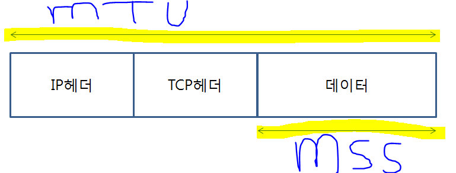
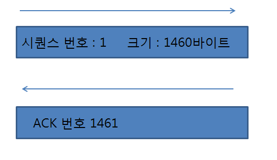

# CHAPTER 02 TCP/IP의 데이터를 전기 신호로 만들어 보낸다. - 中

## 프로토콜 스택과 LAN 어댑터의 탐험

---

CHAPTER 01 웹브라우저 -> `CHAPTER 02 프로토콜 스택 & LAN 어댑터`

---
1\. 소켓을 작성한다

2\. 서버에 접속한다

`3. 데이터를 송 · 수신한다`

4\. 서버에서 연결을 끊어 소켓을 말소한다

5\. IP와 이더넷의 패킷 송 · 수신 동작

6\. UDP 프로토콜을 이용한 송 · 수신 동작

---

## 3. 데이터를 송 · 수신한다

### (1). 프로토콜 스택에 HTTP 리퀘스트 메시지를 넘긴다.

* 프로토콜 스택은 전달 받은 데이터를 바로 송신하지 않고, `송신용 버퍼 메모리에 저장`한다.
* 그 이유는 어플리케이션에서 프로토콜 스택에 데이터를 전달할 때 데이터를 한꺼번에 전달하는 경우도 있지만, **분할하여 전달하는 경우도 있기 때문**이다.
* 프로토콜 스택에 데이터를 전달하는 방식은 어플리케이션에 의해 결정된다.

* 버퍼 메모리에 언제까지 저장하는지는 MTU와 MSS에 따라 결정 된다.
* MTU : 패킷 한 개로 운반할 수 있는 디지털 데이터의 최대 길이. 이더넷에서는 보통 1500바이트
* MSS : 헤더를 제외하고 한 개의 패킷으로 운반할 수 있는 TCP의 데이터의 최대 길이
* 일반적으로 저장된 데이터가 MSS에 가까워지면 데이터를 송신한다.
* 그러나 송신한 이후로 오랜 시간동안 MSS에 가까워지지 못했다면 프로토콜 스택 내부의 타이머에 따라 패킷을 송신하게 된다.

### (2). 데이터가 클 때는 분할하여 보낸다.
* 일반적으로 HTTP 리퀘스트 메시지는 한개의 패킷에 들어가지만, 그렇지 않은 경우도 있다.(블로그의 글, 홈페이지 게시판 등)
* 이 경우 송신 버퍼에 저장된 데이터는 MSS의 길이를 초과하게 된다.
* 따라서 송신 버퍼에 들어있는 데이터를 MSS의 크기에 맞게 분할하여 분할한 조각을 한 개씩 패킷에 넣어 송신한다.

### (3). ACK 번호를 사용하여 패킷이 도착했는지 확인한다.
* 데이터를 입력한 패킷이 서버를 향해 송신되고 나면, 올바르게 송신되었는지 확인하는 확인 동작으로 넘어간다.
* 확인 동작은 다음과 같은 방법으로 이루어 진다.

* * 1). 데이터를 조각으로 분할할 때 조각이 몇 번째 바이트에 해당하는지 세어 TCP 헤더에 기록한다. 이를 `시퀀스 번호`라고 한다.
* * 2). 수신 측에서 받은 데이터의 크기를 센다. 
* * 3). 1번과 2번을 통해 수신 측에서는 몇번 째 데이터부터 몇번 째 데이터까지 수신했는지 알 수 있다. 수신측에서는 몇 번째 데이터까지 수신했는지를 TCP 헤더에 기록하여 송신측에 알려준다. 이를 `ACK 번호`라고 한다.
* 위의 과정은 클라이언트에서 서버로 뿐만 아니라, 서버에서 클라이언트로 양방향으로 진행된다.
* 따라서 서버와 클라이언트는 데이터를 송수신할 때 TCP를 계속 확인하며 패킷이 올바르게 송수신되고 있는지 지속적으로  확인한다.
