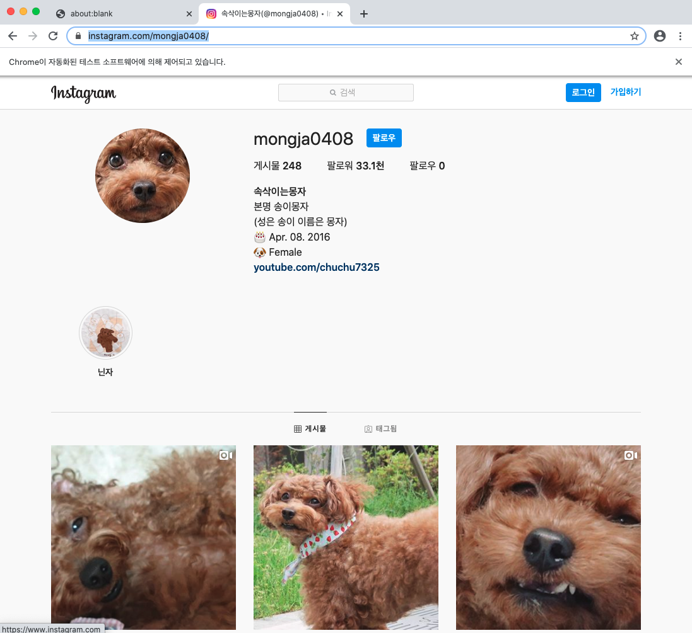
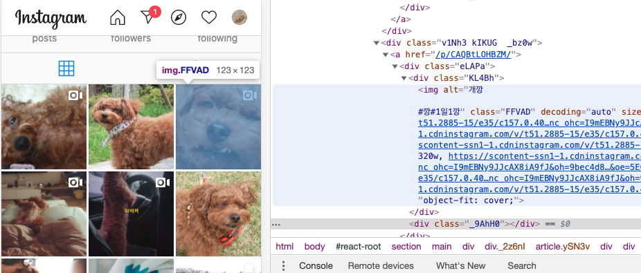
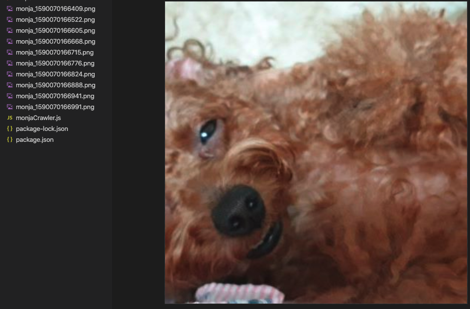

# Node.js로 자동화 도구 개발하기

## 서론

    노드js를 활용해서 컴퓨터에서 이루어 지는 반복되는 작업들을 자동화 하는 방법을 소개시켜드립니다!!

## 소개 도구
    - puppeteer
    - cron
    - robotjs

## Puppeteer

`puppeteer`는 구글 크롬 브라우저 개발 팀에서 공개한 오픈소스 프로젝트입니다. 프로젝트 소개를 설명 드리면

`puppeteer`는 고수준의 api를 통해 크롬 브라우저를 조종 할 수 있는 노드제이에스 라이브러리 입니다. `puppeteer`는 기본적으로 `headless`로 동작합니다. 하지만 `headless` 옵션은 설정이 가능합니다.

자바스크립트를 활용해 웹 브라우저를 원하는 대로 조종 할 수 있고, `고수준의 api`는 브라우저를 조종하기 위해 필요한 과정들을 매우 단순화 시켜 쓰기 쉽게 해 놓았다는 것을 의미합니다.

또한 `headless` 옵션은 화면이 보이지 않는 상태로 동작하는 것을 의미합니다.

귀여운 푸들이 나오는 속삭이는 몽자 채널의 인스타그램을 크롤링하여 보겠습니다.

우선 폴더 생성 후 

```json
npm init -y

npm install puppeteer
```

위의 스크립트를 통하여 puppeteer를 설치하여 줍니다.

`mongjaCrawler.js` 파일을 만든 후 다음과 같이 작성합니다.

```jsx
const puppeteer = require("puppeteer");

const monjaCrawler = async () => {
  const browser = await puppeteer.launch({
    headless: false,
    defaultViewport: { width: 1100, height: 1500 },
  });
  const page = await browser.newPage();
  await page.goto("https://www.instagram.com/mongja0408/", {
    waitUntil: "networkidle2",
  });
}

mongjaCrawler()
```

`puppeteer.launch` 브라우저 객체를 반환 하는 함수 입니다. 인자로 설정값을 넣어 줄 수 있습니다. `headless`는 옵션은 `false`로 지정하고 `viewport` 사이즈를 지정하는 등 여러가지 옵션을 지정 할 수 있습니다. 

반환된 `browser.newPage`메서드를 실행하면 `page`객체가 반환됩니다.  `page.goto` 메서드를 실행하면 해당 url로 이동 합니다. 



간단한 코드 예제를 통해 볼 수 있듯이 api가 매우 직관적이고 사용하기 쉬운 것을 볼 수 있습니다. 

우선 우리의 목표인 사진들을 모으기 위해 어떠한 DOM을 선택해서 어떤 속성을 빼내야 하는지 확인을 해야 합니다.  크롬의 브라우저 개발자 도구를 활용해 데이터를 갖고 있는 DOM을 찾고 선택자는 무엇을 사용하면 좋을지 찾습니다.



img태그에 src속성에 이미지 리소스 URL이 있고 이미지 태그들은 FFVAD라는 class를 갖고 있음을 확인 했습니다.

```jsx
const puppeteer = require("puppeteer");

(async () => {
  const browser = await puppeteer.launch({
    headless: false,
    defaultViewport: { width: 1100, height: 1500 },
  });
  const page = await browser.newPage();
  await page.goto("https://www.instagram.com/mongja0408/", {
    waitUntil: "networkidle2",
  });

  const urls = await page.$$eval(".FFVAD", (nodes) =>
    nodes.slice(0, 10).map((n) => n.src)
  );

  console.log(urls);
})();
```

DOM을 선택후 url만 빼내는 코드를 추가하였습니다

 css 선택자와 동일한 문법을 사용하는  `.FFVAD` 선택자를 `page.$$eval`메서드의 첫번째 인자에 넘겨주면 두 번째 콜백 함수에 인자로 선택된 DOM들이 들어 오게 되고 두번째 콜백 함수에서 반환 하는 값이 `$$eval` 메서드의 반환 값이 됩니다.

```jsx
[
  'https://scontent-ssn1-1.cdninstagram.com/v/t51.2885-15/e35/c157.0.406.406a/100780387_538225043533865_1141461728449637572_n.jpg?_nc_ht=scontent-ssn1-1.cdninstagram.com&_nc_cat=105&_nc_ohc=SCgTG3WEv6MAX_X4--8&oh=45a02630d959943a8188efd0ea27a5b0&oe=5EC8D083',
  'https://scontent-ssn1-1.cdninstagram.com/v/t51.2885-15/sh0.08/e35/c139.0.1141.1141a/s640x640/97329899_245083166907046_5921270380307784808_n.jpg?_nc_ht=scontent-ssn1-1.cdninstagram.com&_nc_cat=110&_nc_ohc=tJVvRxHuzboAX8w_8xK&oh=e9156626676a307c2a9ff2d4ab74355b&oe=5EF1B716',
  'https://scontent-ssn1-1.cdninstagram.com/v/t51.2885-15/e35/c157.0.406.406a/98128777_748591085677611_7367576600878074121_n.jpg?_nc_ht=scontent-ssn1-1.cdninstagram.com&_nc_cat=103&_nc_ohc=I9mEBNy9JJcAX8iA9fJ&oh=9bec4d81de469d5d17987fa6160a47cf&oe=5EC8B12A',
  'https://scontent-ssn1-1.cdninstagram.com/v/t51.2885-15/sh0.08/e35/s640x640/98067432_893496684395813_3743038928871117095_n.jpg?_nc_ht=scontent-ssn1-1.cdninstagram.com&_nc_cat=105&_nc_ohc=12-cKCJqZhwAX9G_yz7&oh=8facbdb6092707293e02693094f5e539&oe=5EC8D83F',
  'https://scontent-ssn1-1.cdninstagram.com/v/t51.2885-15/e35/c0.72.576.576a/95402961_545843999660566_2419924171363022047_n.jpg?_nc_ht=scontent-ssn1-1.cdninstagram.com&_nc_cat=110&_nc_ohc=7JC8YKCMa98AX-6cIE2&oh=eb6bd1af4db95dc4f0b55d07ab07a877&oe=5EC8EB7E',
  'https://scontent-ssn1-1.cdninstagram.com/v/t51.2885-15/sh0.08/e35/c98.0.932.932a/s640x640/95536800_160785702037337_2195948001214294410_n.jpg?_nc_ht=scontent-ssn1-1.cdninstagram.com&_nc_cat=105&_nc_ohc=fQ2EmGXYYAIAX-D7gla&oh=7c8e7f5f3489d00ed7bee5145f495d28&oe=5EF1CFBC',
  'https://scontent-ssn1-1.cdninstagram.com/v/t51.2885-15/sh0.08/e35/s640x640/92996782_1406652616189550_987242186853983982_n.jpg?_nc_ht=scontent-ssn1-1.cdninstagram.com&_nc_cat=102&_nc_ohc=g9qSRi4z6d0AX9ebG8D&oh=8aa64677f7c99c82307f278450f06005&oe=5EF039AD',
  'https://scontent-ssn1-1.cdninstagram.com/v/t51.2885-15/sh0.08/e35/c289.0.861.861a/s640x640/92440014_144216320447654_154732358589383566_n.jpg?_nc_ht=scontent-ssn1-1.cdninstagram.com&_nc_cat=102&_nc_ohc=5tiX3Aeq8RUAX81TM2e&oh=9226a334cf1aeb103d51da21274c29b1&oe=5EEE9F26',
  'https://scontent-ssn1-1.cdninstagram.com/v/t51.2885-15/sh0.08/e35/c89.0.650.650a/s640x640/91900813_537193440317387_1012404356069529776_n.jpg?_nc_ht=scontent-ssn1-1.cdninstagram.com&_nc_cat=111&_nc_ohc=oKPaurr0Ij0AX99OLZj&oh=b308ee33996f1b42953c5e5d4b6ecfd0&oe=5EEFB23B',
  'https://scontent-ssn1-1.cdninstagram.com/v/t51.2885-15/e35/c38.0.595.595a/89476745_589290511659971_7084185486414223324_n.jpg?_nc_ht=scontent-ssn1-1.cdninstagram.com&_nc_cat=111&_nc_ohc=mVNICxr2crIAX-TXRtH&oh=80fd868b4d7531514b6b70e22cf7fff2&oe=5EEE4871'
]
```

하단의 함수를 추가하여 url로 해당 사진을 내 컴퓨터로 다운 받을 수 있습니다.

```jsx
for (const url of urls) {
    const viewSource = await page.goto(url);
    const buffer = await viewSource.buffer();
    fs.writeFileSync(`./monja_${new Date().getTime()}.png`, buffer);
}
```



간단하게 `puppeteer`를 활용하여 뭉자의 사진을 다운로드 해보았습니다. 

## Cron

만약 위처럼 일련의 작업을 자동화 시킨 후 내가 원하는 시간에 주기적으로 실행하고 싶다면 

[cron](https://www.npmjs.com/package/cron) 라이브러리를 사용해 쉽게 내가 원하는 시간에 실행 시킬 수 있습니다.

Cron은 일정에 따라 무언가를 실행할 수있는 도구입니다.

cron syntax를 통해 주기나 실행시킬 시간을 지정 할 수 있습니다.

```jsx
// * * * * * *
// | | | | | |
// | | | | | +-- Day of Week     (range: 0-6 (Sun-Sat))
// | | | | +---- Months          (range: 0-11 (Jan-Dec))
// | | | +------ Day of Month    (range: 1-31)
// | | +-------- Hours           (range: 0-23)
// | +---------- Minutes         (range: 0-59)
// +------------ Seconds         (range: 0-59)

// Asterisk. E.g. *
// Ranges. E.g. 1-3,5
// Steps. E.g. */2r
```

cron syntax의 설명입니다. cron syntax는 6자리 또는 5자리(초가 제외되는 겨우) 속성으로 나타내고 띄어쓰기로 구분됩니다.

- 매 초 실행

```jsx
* * * * * * 
```

- 매일 13시에 실행

```jsx
0 0 13 * * *
```

- 12월 중 13,14,15일만 15시에 실행

```jsx
0 0 15 13-15 12 0
```

cron syntax를 알았다면 `cron` 라이브러리를 사용 할 준비가 끝났습니다.

```jsx
const CronJob = require('cron').CronJob;

const job = new CronJob('* * * * * *', () => {
  console.log('You will see this message every second');
});

job.start();
```

CronJob 생성자 함수에 첫번째 인자는 앞서 설명 드렸던 크론 문구를 넣어 줍니다. 그리고 크론이 나타내는 주기마다 실행될 함수를 두번째 인자에 넣어 줍니다.

끝입니다

cron까지 활용하여 앞선 몽자크롤러를 매일 하루에 한 번씩 동작하게 해보도록 하겠습니다.

```jsx
const puppeteer = require("puppeteer");
const fs = require("fs");
const CronJob = require("cron").CronJob;

const mongjaCrawler = async () => {
  const browser = await puppeteer.launch({
    headless: false,
    defaultViewport: { width: 1100, height: 1500 },
  });
  const page = await browser.newPage();
  await page.goto("https://www.instagram.com/mongja0408/", {
    waitUntil: "networkidle2",
  });

  const urls = await page.$$eval(".FFVAD", (nodes) =>
    nodes.slice(0, 10).map((n) => n.src)
  );

  for (const url of urls) {
    const viewSource = await page.goto(url);
    const buffer = await viewSource.buffer();
    fs.writeFileSync(`./monja_${new Date().getTime()}.png`, buffer);
  }
};

const job = new CronJob("0 0 0 * * *", mongjaCrawler);
job.start();
```

 자 하루에 한번씩 귀여운 몽자의 최신 사진들을 피씨에 저장 할 수 있는 프로그램을 개발하였습니다.


## 결론

파이썬, 자바 기타 다른 언어에서도 충분히 구현 가능한 프로그램이지만 NodeJS를 이용해 구현하는데는 다음과 같은 장점이 있습니다

- npm 에는 기타 이외에도 편리하게 이용 할 수 있는 수많은 라이브러리들이 있습니다.
- JavaScript is Everywhere, 배워 두면 다른 곳에서도 써먹을 일이 많은 자바스크립트로 작성 가능합니다. 
