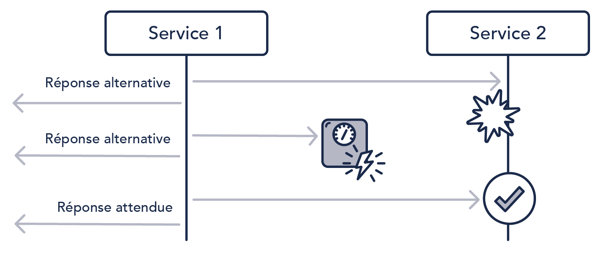

# MSA Circuit Breaker와 resilience4j

MSA Circuit Breaker: [https://microservices.io/patterns/reliability/circuit-breaker.html](https://microservices.io/patterns/reliability/circuit-breaker.html)

Circuit Breaker는 마이크로서비스 아키텍처에서 연관된 타 서비스의 장애전파를 방지하기 위한 패턴이다.

MSA에서 사용되기 때문에 먼저 MSA에 대해 알아야한다.

## MSA

Microservice Architecture: [https://microservices.io/patterns/microservices.html](https://microservices.io/patterns/microservices.html)

redhat MSA: [https://www.redhat.com/ko/topics/microservices/what-are-microservices](https://www.redhat.com/ko/topics/microservices/what-are-microservices)

MSA는 모놀리틱 아키텍처와 대조되는 개념으로 애플리케이션을 핵심 기능으로 세분화하는 방식이다. 이때 각 기능을 서비스라고 하며 독립적으로 구축, 배포가능하다.


회원, 검색, 주문, 리뷰 기능이 있는 쇼핑몰을 예로 들면 모놀리틱에서는 이 기능들이 하나의 시스템으로 배포가 된다. 반면 MSA는 회원, 검색, 주문, 리뷰가 각각의 시스템으로 존재하여 각각의 기능을 담당한다. 단, 모놀리틱의 경우 하나의 시스템으로 묶여있기 때문에 서로의 기능에서 필요한 데이터를 그대로 가져와 사용할 수 있다.

반면, MSA에서는 각 서비스로 나눠져 있기 때문에 해당 기능에서 필요한 다른 서비스의 데이터를 API 형태로 주고 받아야한다. 이런 이유로 MSA에서는 타 기능(서비스)이 담당하는 데이터를 주고 받을 때 네트워크 비용이 발생하게 된다.

만약 데이터를 요청해서 받아야하는 서비스에 장애가 발생하여 제대로 된 응답이 불가능하거나 장애수준으로 매우 느린 경우에 이를 기다리는 다른 서비스들도 지연이 된다. 즉, 한 서비스의 장애가 다른 서비스로의 장애로 전파된다.

이를 해결하는 패턴이 바로 **Circuit Breaker**이다.

## Circuit Breaker 기본 원리

서비스 1와 2가 있고 Service 1에서 데이터를 얻기위해 Service 2를 호출한다고 가정한다. 이때 Circuit Breaker는 Service 1와 Service 2 사이에 위치하게 된다. 즉, Service 1의 요청은 무조건 Circuit Breaker를 거치게 된다. 만약 정상상황이라면 그대로 바이패스하여 Service 2의 응답을 전달하고 비정상상황에서는 요청을 전달하지 않고 대체 응답을 하게 된다.



# resilience4j

> java 진영에서 circuit breaker 라이브러리를 검색하면 resilience4j와 함께 많이 등장하는 라이브러리가 바로 Hystrix이다. resilience4j 또한 Hystrix에 영감을 받아 탄생한 라이브러리이다. 단, Hystrix는 현재 유지보수가 되지 않는 라이브러리이며 Hystrix에서도 resilience4j를 사용하라고 권고한다.

resilience4j의 Circuit Breaker는 `CLOSED`, `OPEN`, `HALF_OPEN`라는 3가지 일반 상태와 `DISABLED`와 `FORCED_OPEN`이라는 2가지 특수한 상태를 가진 상태 머신을 통해 구현되었다.


resilience4j는 호출의 결과를 저장하고 종합하기 위해 silding window를 사용한다. 여기서 count-based나 time-based를 선택할 수 있다.

## 카운트 기반의 Sliding Window

카운트 기반의 슬라이딩 윈도우는 N개의 크기를 가지는 원형 배열로 구현되어있다. 슬라이딩 윈도우는 점진적으로 총 결과를 업데이트한다. 업데이트하는 시점은 새로운 요청 결과가 기록될 때이다. 가장 오래전에 측정된 결과가 사라지면 해당 측정 결과는 종합 결과에서 제거 되며 버킷을 재설정한다.

위 경우 시간 복잡도는 상수 `O(1)`만큼의 복잡도를 가지는 반면, 공간 복잡도는 배열의 크기만큼 `O(n)`가진다.

## 시간 기반의 Sliding Window

시간 기반의 슬라이딩 윈도우는 N개의 부분 버킷을 가지는 원형 배열로 구현된다. 만약 time window size가 10초라면 원형 배열은 항상 10개의 부분 버킷을 가진다.

head 버킷에는 현재 시간의 호출 결과를 저장한다. `유닉스 시간 기반`
다른 버킷들은 이전 시간의 호출 결과를 저장하고 있다. 이때 개별 결과들을 저장하는 것이 아닌 종합 결과를 저장하게 된다.

## CircuitBreakerRegistry

CircuitBreakerRegistry는 ConcurrentHashMap을 기반으로 구현하고 있다. `in-memory`
resilience4j의 Circuit Breaker는 설정하기 위한 property들을 제공한다.

- failureRateThreshold

  > failure rate은 아마 요청이 실패하는 확률을 의미하는 것으로 보임

  failure rate의 임계치를 설정하는 값. 기본적으로 `50`이 설정되어있다.

- slowCallRateThreshold

  요청 시간이 slowCallDurationThreshold로 설정한 시간보다 더 큰 경우 slow Call이라고 정의한다. slow Call의 임계치를 설정하는 값으로 기본적으로 `100`이 설정되어있다.

- slowCallDurationThreshold

  slow call을 정의하기 위한 임계치 값. 기본적으로 60초`60000ms`이다.

- permittedNumberOfCallsInHalfOpenState

  Circuit Breaker가 절반 열렸을 때 요청을 얼마나 허용할지를 설정하는 값. 기본적으로 `10`이다.

- slidingWindowType

  카운트 기반의 슬라이딩 윈도우를 사용하는지 시간 기반의 슬라이딩 윈도우를 사용하는지 설정하는 값. 기본적으로 카운드 기반 `COUNT_BASED`를 사용한다. 시간 기반을 사용하고자 하면 `TIME_BASED`를 설정한다.

- slidingWindowSize

  Circuit Breaker가 닫혀있을 때 호출 결과를 기록할 슬라이딩 윈도우의 크기를 설정하는 값. 기본적으로 `100`이다. `TIME_BASED`인 경우 초로 설정된다.

- minimumNumberOfCalls

  Circuit Breaker가 에러 확률을 계산하기 전에 필요한 호출의 최소 갯수를 설정하는 값. 기본적으로 `10`이다. 만약 기본값으로 설정된 경우 9개의 요청이 모두 실패하더라도 Circuit이 열리지 않는다. 최소 계산 갯수인 10에 못 미치기 때문이다.

- waitDurationInOpenState

  Circuit Breaker가 OPEN에서 HALF_OPEN으로 상태가 변경하기 전에 기다리는 시간을 설정하는 값. 기본적으로 60초 `60000ms`이다.

- automaticTransitionFromOpenToHalfOpenEnabled

  자동으로 OPEN에서 HALF_OPEN 상태로 변경하는 옵션. 기본적으로 `false`이다.

위 값들을 다음과 같이 설정할 수 있다.

```java
// Create a custom configuration for a CircuitBreaker
CircuitBreakerConfig circuitBreakerConfig = CircuitBreakerConfig.custom()
  .failureRateThreshold(50)
  .slowCallRateThreshold(50)
  .waitDurationInOpenState(Duration.ofMillis(1000))
  .slowCallDurationThreshold(Duration.ofSeconds(2))
  .permittedNumberOfCallsInHalfOpenState(3)
  .minimumNumberOfCalls(10)
  .slidingWindowType(SlidingWindowType.TIME_BASED)
  .slidingWindowSize(5)
  .recordException(e -> INTERNAL_SERVER_ERROR
                 .equals(getResponse().getStatus()))
  .recordExceptions(IOException.class, TimeoutException.class)
  .ignoreExceptions(BusinessException.class, OtherBusinessException.class)
  .build();

// Create a CircuitBreakerRegistry with a custom global configuration
CircuitBreakerRegistry circuitBreakerRegistry =
  CircuitBreakerRegistry.of(circuitBreakerConfig);

// Get or create a CircuitBreaker from the CircuitBreakerRegistry
// with the global default configuration
CircuitBreaker circuitBreakerWithDefaultConfig =
  circuitBreakerRegistry.circuitBreaker("name1");

// Get or create a CircuitBreaker from the CircuitBreakerRegistry
// with a custom configuration
CircuitBreaker circuitBreakerWithCustomConfig = circuitBreakerRegistry
  .circuitBreaker("name2", circuitBreakerConfig);
```

## Spring boot에서 resilience4j

### 의존성 추가

```groovy
repositories {
    jCenter()
}

dependencies {
  compile "io.github.resilience4j:resilience4j-spring-boot2:${resilience4jVersion}"
  compile('org.springframework.boot:spring-boot-starter-actuator')
  compile('org.springframework.boot:spring-boot-starter-aop')
}
```

만약 webflux를 사용하고 있다면 `io.github.resilience4j:resilience4j-reactor`도 필요하다.

### 설정

spring boot에서는 application.yml을 통해 손쉽게 Circuit Breaker 설정이 가능하다.

```yaml
resilience4j.circuitbreaker:
  instances:
    backendA:
      registerHealthIndicator: true
      slidingWindowSize: 100
    backendB:
      registerHealthIndicator: true
      slidingWindowSize: 10
      permittedNumberOfCallsInHalfOpenState: 3
      slidingWindowType: TIME_BASED
      minimumNumberOfCalls: 20
      waitDurationInOpenState: 50s
      failureRateThreshold: 50
      eventConsumerBufferSize: 10
      recordFailurePredicate: io.github.robwin.exception.RecordFailurePredicate
```

이때 요청시 발생하는 Exception을 실패율 계산에 포함시키지 않을 수 있다. 단, http status code로는 이를 적용할 수 없음
