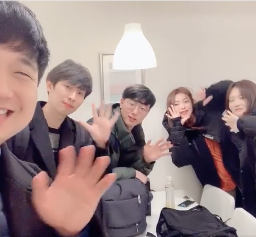
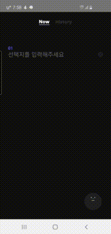
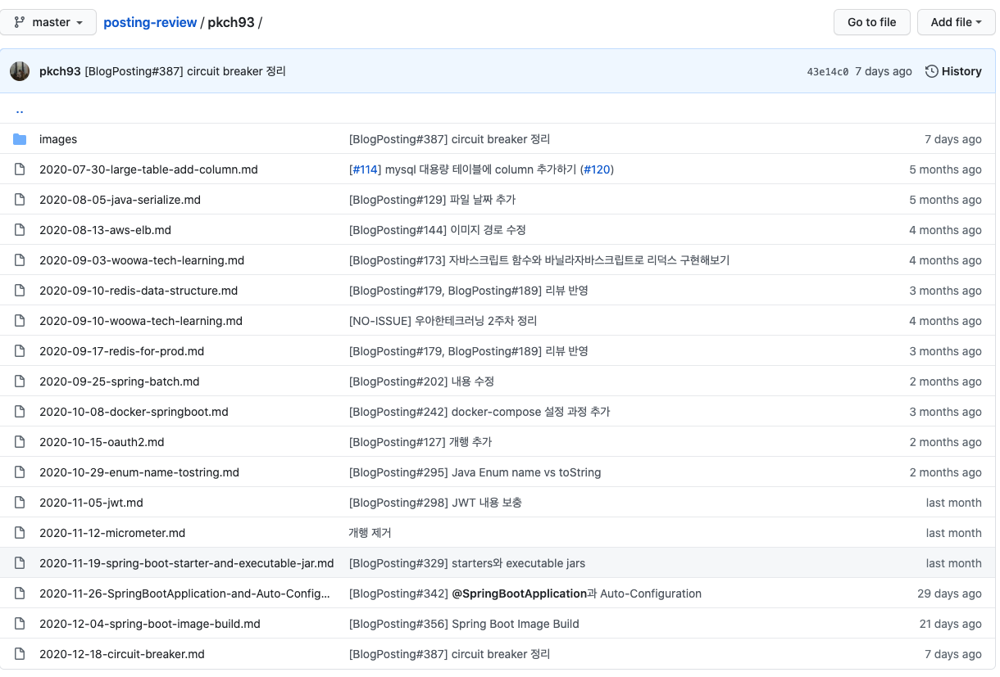
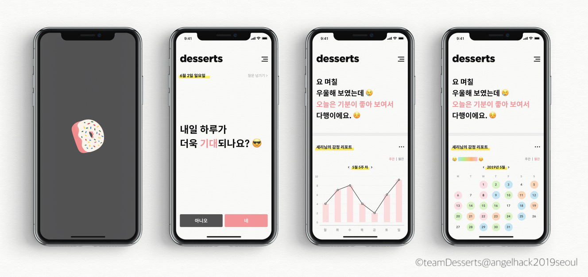
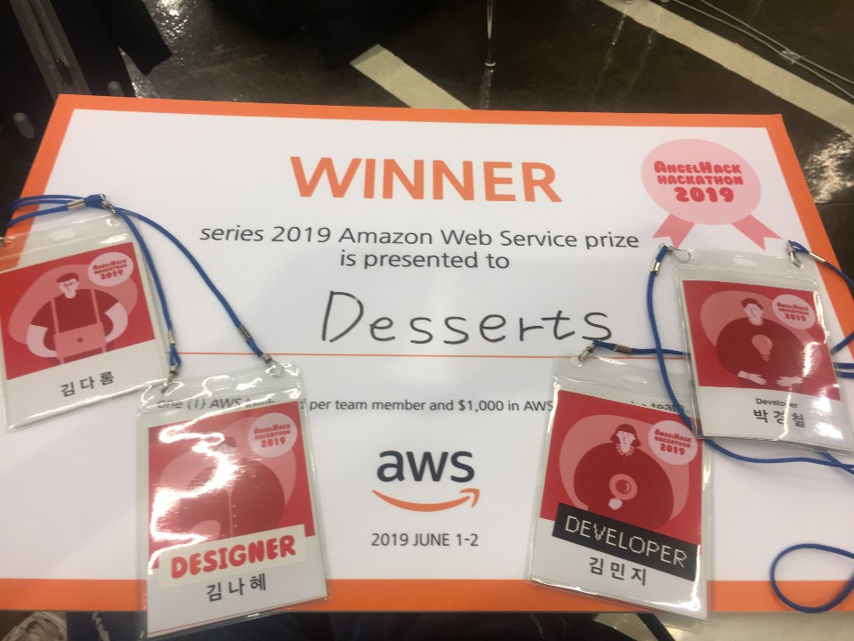

# 2020년 회고

2020년은 나에게 있어 꽤 의미 있는 해이다.

2018년 소프트웨어 개발자가 되겠다고 마음 먹은 이래로 커리어를 시작한 첫 해이다. 입사하고 적응하랴 일하랴 공부하랴 너무 정신없이 보내다보니 20년이 후딱 가버렸다. 나의 개발자 1년차가...

## 회사

작년에도 우아한테크코스를 통해서 많은걸 고민하고 학습할 수 있었지만 업무를 처음 시작하면서 얻는 경험, 지식도 많이 늘었다. 특히 교육만으로는 얻을 수 없는 경험들이 많았다.

내가 담당한 시스템은 최전방에서 트래픽을 그대로 받는 메인 시스템이기 때문에 트래픽 관련해서 많은 것을 느낄 수 있었다. 특히 DB 조회를 하는 부분에서 수정이 되는 경우 특히 주의해야함을 직접 느낄 수 있었다.

한 일화로 메인에 기능을 추가한 뒤로 몇일 후 이상한 알림을 받았다. 바로 DB CPU가 50% 가까이 사용하고 있다는 알림이었다. 기존에는 5~10% 정도 사용하고 있었고 기능을 패치한 후에 현상이 나타났다. 기존에도 DB를 조회하던 기능이라 큰 문제가 없다고 생각했지만 달라진게 딱 하나 있었다. 바로 DB에서 조회하는 row의 수가 달라진 것이다.

기존에는 row가 2~3개였던 반면 기능 패치 이후 row가 80개로 증가했던 것이 원인으로 보였다. 한번의 트래픽마다 조회가 이뤄지기 때문에 트래픽이 늘어날수록 CPU 소모가 증가하게 되는데 기존보다 훨씬 row수가 많아져서 생긴 이슈였던 것이다. 때문에 캐시를 통해 이 문제를 보완하고 이후 DB 관련 쿼리가 변경되거나 외부 API 연동이 추가되는 경우 성능테스트를 하여 미리 문제를 감지하도록 파트 내에서도 규칙이 정해졌다.

또한 파트에서는 트래픽을 다루기 위해서 비동기 기술들을 많이 사용하고 있다.
주로 Spring 환경을 사용하므로 Spring Async, Webflux 등 Spring에서 지원하는 비동기 처리 기술과 Java의 Future, CompletableFuture 등을 학습하고 사용해볼 수 있었다.

트래픽 이외도 레거시 코드를 리팩토링하는 방법에 대해서도 고민해볼 수 있었다. 사실 우아한테크코스에서 학습한 유지보수하기 좋은 코드를 짜는 방법대로 코드를 작성하면 된다. 하지만 기존 레거시 코드에 녹여있는 복잡한 도메인 지식도 이해해야 리펙토링을 안정적으로 진행할 수 있다. 기존에 작성된 것과 동일하게 동작해야하기 때문에 지금은 사용하지 않는 필드도 확인하고 그에 따른 영향도도 파악하면서 리펙토링 하는 것은 쉽지 않다. 이런 문제 때문에 처음 지독한 레거시 코드를 경험했을 때 두려워서, 파악하기 힘들어서 리펙토링을 조금 주저했던 거 같다.

지금 생각하면 한편으로는 이해하면서도 후회되기도 한다. 왜냐하면 업무를 진행하면서 따로 리팩토링을 할 시간이 거의 주어지지 않는다. 때문에 해당 업무를 진행하면서 코드 개선이 함께 이뤄져야하는데 그 시간을 그대로 날린 것 같다는 생각이 들어서이다. 1년동안 업무하면서 늘어난 도메인 지식만큼 지금부터는 업무하면서 주어지는 리팩토링 기회를 최대한 놓치지 않을 생각이다.

트래픽과 코드 리팩토링 말고도 AWS, 인프라, 모니터링 툴 등 이전에 접하지 못했던 것들을 경험할 수 있었다.

## 학습

올해는 업무에서 사용되는 기술들 중 내가 모르는 기술들을 위주로 학습을 했다.
Spring, Spring Webflux, Spring Batch, Spring Cloud, JPA, QueryDsl, Reactive Programming, redis, mysql, AWS, circuit breaker 등을 학습했던거 같다.

주로 Java, Spring과 같은 프로그래밍 언어와 프레임워크 기술을 보다 깊게 학습하는 시간을 올해 가졌던 거 같다. 내년에는 위 기술들에 대한 추가학습과 더불어 인프라`linux, network, rdbms`단을 기초 정도만 알고 있어서 좀 더 깊게 학습하는 시간을 가질 예정이다.

## 외부 활동

### 동아리와 해커톤

작년에는 Angelhack 해커톤과 신입회원으로 Nexters 동아리 활동을 했었다.
올해는 코로나19 때문에 대부분의 기술 컨퍼런스들이 언택트로 이뤄졌고 해커톤은 거의 없었던거 같다. 때문에 기존에 예정된 Nexters 준회원 활동 외에는 하지 않았다.

16기 이사님과 아이들

우리팀의 주제는 간단히 요약하면 여러 선택지 중 하나를 선택해주는 Shake It 서비스이다. 여기서 인터렉션과 UI/UX가 중요 요소였고 이를 구현해 줄 클라이언트 `AOS/IOS` 개발자가 필요한 상황이었다.

서버가 사실상 필요없는 서비스였기 때문에 고민했지만 프로젝트 자체는 간단한 작업이었고 리엑트 네이티브를 사용하면 어느정도는 구현할 수 있다는 생각에 이사님과 아이들 팀으로 참여하였다.

단, Nexters 16기를 할때 당시는 입사한지 얼마 지나지 않은 시간이었고 진행하고 있었던 파일럿 프로젝트 때문에 많은 시간을 쏟지 못했다. 이 부분은 같은 팀원들에게 너무 미안했다.

결국 최종 데모까지 위와 같은 결과물로 구현이 되었다. 나는 위 history 기능 구현을 담당했지만 history 탭에서 메인 탭으로 돌아올 때 생기는 앱 크래시 때문에 최종 데모에서는 보여주지 못했다.

Nexters 16기는 참 아쉬웠던 기수였다고 생각한다. 내상황과 더불어 코로나가 점점 퍼지기 시작한 시기라 거의 대부분의 회식에 참여를 하지 않았던거 같다. 또한 6주차부터는 코로나19 상황 때문에 오프라인으로 모이기 힘들었어서 더 아쉬었던거 같다.

### 스터디

올해 7월 경에 [블로그 포스팅 스터디](https://github.com/Blog-Posting/posting-review)를 시작했다. 7월달에 시작해서 지금까지 스터디를 진행하고 있다.
처음에는 공부도 하면서 올리는 글들을 내 블로그에도 올리려는 생각을 하면서 스터디를 진행했는데 노션에만 정리하고 블로그에는 작성하지 못하고 있다.. `작년에도 이랬는데 ㅜ`

사실 이 스터디는 큰 부담이 없다. 내가 공부한 것을 적고 공유하면 되는 스터디이기 때문이다. 또 내가 관심있는 백엔드, 프론트엔드 개발자들이 모인 스터디이기 때문에 모르는 내용이라면 얻어 갈수도 있고 내가 알고 있는 내용은 다른 스터디원께서 작성해주신 글에 코드리뷰로 공유하면서 다시한번 그 지식을 내 것으로 곱씹을 수 있었다.

그렇게 7월 30일부터 거의 매주 작성한 글이 17개가 되었다.

매주 토요일에 오프라인 `최근에는 코로나19 때문에 온라인`으로 작성한 글에 대해 설명해주는 시간이 있다. 최근에 느끼는 건 내가 너무 설명을 못하는거 같다는 생각이 많이 든다. 글을 작성하는 것과 함께 좀 더 설명을 잘할 수 있도록 고민해보려고 한다.

## 토이 프로젝트

올해 2020년 7월경부터 학습용으로 몇가지 토이 프로젝트를 진행하고 있다.

### Desserts

사실 `Desserts`는 Angelhack Seoul 2019에 참가했던 아이디어이다. 당시 개발은 서버없이 React를 사용해서 딱 프로토타입 형태로 보여줄 정도만 개발을 진행했다. Angelhack의 여러 기업 챌린지 중 AWS 챌린지를 참여했었다. AWS 챌린지의 참가 조건은 AWS amplify를 사용하는 것 이었기 때문에 참여 조건이 까다롭지 않았고 참여만해도 AWS 100$ 크래딧을 제공해주었다. 사실 AWS 100$ 크래딧이 목표였는데 운좋게 AWS 챌린지 Winner가 되었었다.

그 이후로는 팀원들은 각자의 삶에 충실히 살았다. 그 와중에 7월 경 같은 팀원 중 한 명이 IOS 개발을 준비하는데 학습하면서 실제로 프로젝트를 진행해보고 싶다는 의지가 있었고 나 또한 내가 학습한 것을 마음껏 써볼 수 있고 Desserts 아이디어를 실제로 구현해보고자 하는 욕망이 있었기 때문에 함께 프로젝트를 진행하기로 결정했다.

Desserts는 사실 서버 단에서는 크게 작업할 내용이 많지 않았다. 질문 리스트를 랜덤으로 내려주고 기분 상태를 점수화하여 보여주는게 전부이다. 다만, 기술적으로 Spring MVC에 Async를 붙여서 사용하였다. Spring MVC는 워낙 많이 써봤고 Spring Webflux도 추가 학습이 필요하지만 회사에서 사용해보았었다. 하지만 Spring MVC + Async를 한번도 해보지 않았기 때문에 한번 토이프로젝트에서 사용해보고 싶었다. 사실 코드를 짜는데는 큰 어려움이 없었지만 `Spring 짱` 트래픽을 아직 받아보지 않았기 때문에 얼마나 효과가 있는지는 아직 확인해보지 못했다.

애플리케이션 단 말고도 인프라 단을 Desserts로 많이 다뤄보면서 학습하고 있다. 특히 Docker를 이전에는 학습만 해보고 애플리케이션 배포에서는 한번도 사용해보지 못했었는데 토이프로젝트를 통해 마음대로 옵션을 변경해보면서 많은걸 학습할 수 있었다.

같이 프로젝트를 진행하는 친구가 IOS를 담당하기 때문에 Android를 사용하는 나는 개발이 완료되더라도 사용해볼 수 없다. 이 부분이 아쉬워서 Android는 React Native로 내가 개발해 보려고 생각하고 있다. 이 과정에서 앱 개발을 할때 생각해야 할 점등을 학습할 수 있을 것으로 기대한다.

서버는 거의 대부분 개발이 완료되었지만 클라이언트 단이 아직 개발중이다. 내년에는 Desserts를 구글 플레이 스토어와 앱 스토어에서 만날 수 있으면 좋겠다.

### bidbird `비드버드`

추석 이후에 친구한테 토이 프로젝트 제의를 받고 시작한 프로젝트이다. 사실 기존에 Desserts를 진행하고 있었기 때문에 고민이 있었지만 학습용이기 때문에 완성에 큰 부담을 둘 필요는 없다고 설득 당하는 바람에 진행하였다.

비드버드를 간단하게 소개하면 한국 자산관리공사 `KEMCO`에서 관리하는 공매 매물 정보를 보여주고 더 나아가서는 경매까지 참가할 수 있게 만드는 프로젝트이다. 1단계는 매물을 조회하는 단계까지만 진행하기로 했다.

현재 비드버드는 거의 시작단계이다. 나도 작업을 많이 하지 못한 상태지만 같이 작업하는 친구도 너무 바빠서 아직 엔티티 설계조차 되지 않았다. 하지만 엔티티 설계만 어느정도 된다면 다음부터는 CRUD라 빠르게 진행할 수 있지 않을까 기대한다.

## 그 외

작년 회고를 봤을때 블로그와 운동에 대한 이야기를 하면서 내년에는 더 노력해야겠다라고 작성했었는데... 지금 둘다 이루지 못했다.

블로그는 2019년 회고를 작성할 때 그 상태이고 운동은 코로나19 여파로 ~~핑계~~ 거의 하지 않다가 최근에는 홈트를 하기 시작했다.

재택근무와 함께 너무 많은 칼로리를 섭취하는 반면 운동을 하지 않아 몸이 많이 망가진 상태이다. 내년에는 정상적인 몸을 가질 수 있도록 꾸준히 운동하려고 한다.

그리고 올해도 블로그 글을 쓰지 못했는데 내년에는 노션에 작성한 그대로 일단 블로그에도 올려두려고 한다. 노션의 글을 한번 더 정제한다는 생각을 하니 결국은 블로그에 작성하지 못하는 거 같아 바로 블로그에 올리려고 한다.
