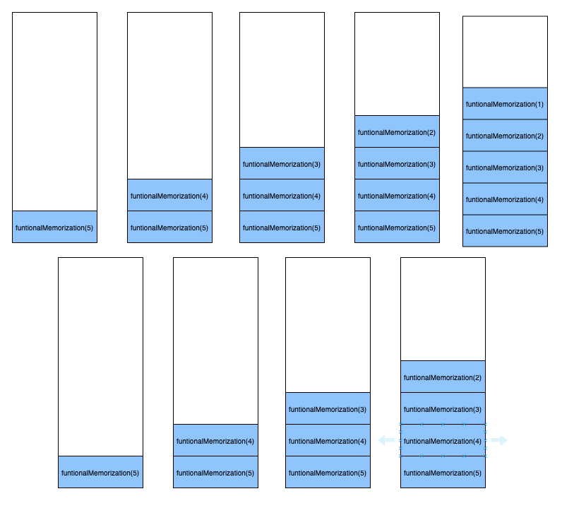

# 함수형 프로그래밍과 재귀

함수형 프로그래밍에서는 반복 `loop`을 할 때 명령형 프로그래밍에서 사용하는 반복문 `for, while`을 사용하는 것이 아닌 재귀를 사용한다.

## 재귀란?

재귀는 어떤 함수의 구현 내부에서 자기 자신을 호출하는 함수를 의미한다. 특히 수학에서 재귀는 흔히 사용되는 개념이다.

```
f(0) = 0
f(1) = 1
f(n) = f(n-1) + f(n-2)
```

위는 피보나치 수열의 점화식이다. 여기서 `f(n) = f(n-1) + f(n-2)`를 보면 `f(n)`의 내부에서 `f(n-1)`과 `f(n-2)`를 호출했기 때문에 이는 재귀를 표현한 것이다.

위 점화식을 명령형 프로그래밍의 반복문으로 구현하면 다음과 같다.

```java
@Test
@DisplayName("명령형 프로그래밍으로 피보나치 구현")
void fibonacci() {
    // given & when
    int actual = fibonacci(7);

    // then
    assertThat(actual).isEqualTo(13);
}

private static int fibonacci(int n) {
    int[] temp = new int[n + 1];
    temp[0] = 0;
    temp[1] = 1;

    for (int i = 2; i <= n; i++) {
        temp[i] = temp[i - 1] + temp[i - 2];
    }

    return temp[n];
}
```

위와 같이 반복문으로 구현한 것을 재귀로 바꾸면 다음과 같다.

```java
@Test
@DisplayName("재귀로 피보나치 구현")
void recursionFibonacci() {
    // given & when
    int actual = recursionFibonacci(7);

    // then
    assertThat(actual).isEqualTo(13);
}

private static int recursionFibonacci(int n) {
    if (n == 0) {
        return 0;
    } else if (n == 1) {
        return 1;
    } else {
        return recursionFibonacci(n - 1) + recursionFibonacci(n - 2);
    }
}
```

단, 재귀는 콜 스택을 활용한다. 따라서 함수 호출에 대한 기록을 스택에 기록하여 관리한다. 이 경우 스택에 할당된 메모리가 컴퓨터의 메모리를 초과하는 경우 stackoverflow 에러가 발생할 수 있다.

만약 `recursionFibonacci`에 인자 6을 넣어서 실행하면 다음과 같이 실행된다.

```
recursionFibonacci(7)
recursionFibonacci(6)
recursionFibonacci(5)
recursionFibonacci(4)
recursionFibonacci(3)
recursionFibonacci(2)
recursionFibonacci(2)
recursionFibonacci(3)
recursionFibonacci(2)
recursionFibonacci(4)
recursionFibonacci(3)
recursionFibonacci(2)
recursionFibonacci(2)
recursionFibonacci(5)
recursionFibonacci(4)
recursionFibonacci(3)
recursionFibonacci(2)
recursionFibonacci(2)
recursionFibonacci(3)
recursionFibonacci(2)
```

여기서 재귀를 실행하면서 2, 3 등 같은 인자로 실행된 `recursionFibonacci`가 다수 존재함을 알 수 있다. 명령형 프로그래밍에서는 이를 메모이제이션 기법을 통해 최적화할 수 있다.

```java
private static int[] cache = new int[5000];

private static int memoizationFibonacci(int n) {
    if (n == 0) {
        return 0;
    } else if (n == 1) {
        return 1;
    } else if (cache[n] != 0) {
        return cache[n];
    } else {
        cache[n] = memoizationFibonacci(n - 1) + memoizationFibonacci(n - 2);
        return cache[n];
    }
}
```

다음과 같이 외부에 피보나치 계산결과를 저장할 캐시를 두고 캐시에 저장하여 함수 호출 수를 최적화할 수 있다.

위와 같이 메모이제이션을 한 상태에서 `memoizationFibonacci(7)`을 호출하면 다음과 같이 실행된다.

```
memoizationFibonacci(7)
memoizationFibonacci(6)
memoizationFibonacci(5)
memoizationFibonacci(4)
memoizationFibonacci(3)
memoizationFibonacci(2)
```

이렇게 메모이제이션을 통해 재귀호출을 최적화할 수 있다. 다만, 이 방법은 함수적인 방법은 아니다.

## 함수형 프로그래밍과 재귀

메모이제이션은 함수적인 해법은 아니다. 먼저 함수형 프로그래밍에서 정의하는 순수 함수에 대해 알아야한다.

### 순수 함수

함수형 프로그래밍의 순수 함수는 아래 2가지 조건을 만족해야한다.

1. 입력 `input`이 같으면 항상 출력 `output`이 같다.

   ```kotlin
   fun pow(n: Int) = n * n
   ```

   위는 숫자 `n`을 입력받으면 `n`의 제곱을 반환하는 함수이다. 1을 입력하면 항상 1이 나타나고 2를 입력하면 항상 4가 나타나므로 순수함수이다.

   ```kotlin
   fun random(seed: Int): Int {
   	return Random(seed).nextInt()
   }
   ```

   위 `random`은 순수하지 않다. 호출할 때마다 다른 출력이 나타나기 때문이다.

2. 부수효과 `side effect`가 없어야한다.

   앞선 예시 `pow`는 함수 내부환경 외의 것들은 변경하지 않는다. 즉, 부수효과가 없는 함수라고 할 수 있다.

   단, 재귀 예시 중 메모이제이션의 예시를 보면 함수 `memoizationFibonacci`에서 외부 변수인 `cache`를 변경하고 있다. 이는 `memoizationFibonacci`가 부수효과가 있다고 말할 수 있다.

   ```kotlin
   private static int[] cache = new int[5000];

   private static int memoizationFibonacci(int n) {
   	if (n == 0) {
   		return 0;
   	} else if (n == 1) {
   		return 1;
   	} else if (cache[n] != 0) {
   		return cache[n];
   	} else {
   		cache[n] = memoizationFibonacci(n - 1) + memoizationFibonacci(n - 2);
   		return cache[n];
   	}
   }
   ```

이런 순수 함수의 특징을 기준으로 메모이제이션 재귀를 살펴보면 함수적인 접근이 아니라는 것을 알 수 있다. 함수적으로 메모이제이션을 구현하고 싶다면 재귀의 서브 호출 결과를 인자로 전달함으로써 해결할 수 있다.

```kotlin
fun functionalMemoization(n: Int, first: Int = 0, second: Int = 1): Int = when(n) {
    0 -> first
    1 -> second
    else -> functionalMemoization(n - 1, second, first + second)
}
```

다음과 같이 `first`와 `second` 인자를 추가하여 메모이제이션을 구현할 수 있다. 피보나치의 점화식 `f(n) = f(n-1) + f(n-2)`에서 first는 첫번째 `f(n-1)`의 결과를 캐싱하는 반면 second는 `f(n-2)`의 결과를 캐싱한다.

이렇게 인자로 캐싱 값을 전달하면 메모이제이션으로 처리했던 것과 같이 call 수를 최적화할 수 있다.

```
functionalMemoization (7)
functionalMemoization (6)
functionalMemoization (5)
functionalMemoization (4)
functionalMemoization (3)
functionalMemoization (2)
```

이렇게 기존의 명령형 프로그래밍에서 사용하는 반복문, 재귀를 함수형 프로그래밍에서도 동일하게 사용할 수 있다. 다만, 한가지 우려스러운 점은 재귀를 잘못 사용하는 경우 stackoverflow 에러가 발생할 가능성이 있다.
이를 위해서 보통의 함수형 프로그래밍들은 꼬리 재귀 최적화`tail call optimization`을 지원한다.

## 꼬리 재귀 `tail recursion`

꼬리 재귀란 함수의 모든 처리가 완료된 후 마지막에 재귀를 호출하는 것을 의미한다.
앞선 `funcationalMemoization`도 꼬리재귀에 속한다.

```kotlin
fun functionalMemoization(n: Int, first: Int = 0, second: Int = 1): Int = when(n) {
    0 -> first
    1 -> second
    else -> functionalMemoization(n - 1, second, first + second)
}
```

반면 함수의 처리가 완료되지 않은 상태에서 재귀를 호출하는 경우를 머리 재귀 `head recursion`이라고 한다.

```java
private static int[] cache = new int[5000];

private static int memoizationFibonacci(int n) {
	if (n == 0) {
		return 0;
	} else if (n == 1) {
		return 1;
	} else if (cache[n] != 0) {
		return cache[n];
	} else {
		cache[n] = memoizationFibonacci(n - 1) + memoizationFibonacci(n - 2);
		return cache[n];
	}
}
```

반면 위 코드는 함수의 처리가 완료되지 않은 상태에서 재귀를 호출하고 있다. 때문에 위 코드는 머리 재귀에 속한다.

코드만봐서는 큰 차이가 없어보이지만 컴파일러 단으로 들어가보면 차이가 확연히 드러난다. 컴파일러가 꼬리 재귀 최적화를 해주기 때문이다.

### 꼬리 재귀 최적화

만약 꼬리재귀가 없다면 어떻게 호출될까?

```kotlin
fun functionalMemoization(n: Int, first: Int = 0, second: Int = 1): Int {
    val result = when (n) {
        0 -> first
        1 -> second
        else -> functionalMemoization(n - 1, second, first + second)
    }

    return result
}
```

위 코드는 꼬리 재귀로 구현하지 않았다. 재귀 호출 뒤에 추가 로직이 있기 때문이다. 이경우 콜 스택은 다음과 같이 쌓인다.



즉, 이전에 호출된 함수가 그대로 쌓여있는 채로 그 다음 스택 프레임을 쌓아 호출한다. 이 때문에 컴퓨터의 메모리 이상으로 스택 프레임이 쌓이게 되면 stackoverflow 에러가 발생하는 것이다.

```kotlin
tailrec fun functionalMemoization(n: Int, first: Int = 0, second: Int = 1): Int = when (n) {
    0 -> first
    1 -> second
    else -> functionalMemoization(n - 1, second, first + second)
}
```

다음 코드는 꼬리 재귀로 구현하였다. 이 경우 다음과 같이 함수가 호출된다.


즉, 꼬리 재귀를 사용할 경우 컴파일러가 새로운 스택 프레임을 생성하여 재귀 호출을 하는 것이 아니라 현재 스택 프레임에서 함수 시작 지점으로 점프하여 재귀 호출을 최적화한다. 이를 통해 성능을 향상시키고 stackoverflow 에러를 방지할 수 있다.

> 참고로 Kotlin에서는 tailrec 키워드로 해당 함수가 꼬리 재귀 함수임을 드러낼 수 있다. 이를 통해 IDE에서 꼬리 재귀로 구현되어있지 않으면 경고를 해준다.

이처럼 꼬리 재귀 최적화는 Haskell, Scala 같은 함수형 패러다임을 접목한 프로그래밍 언어에서는 언어 표준으로 대부분 지원한다. Kotlin이나 Javascript `ES6 이상`도 꼬리 재귀 최적화를 지원한다. 다만, Java 컴파일러는 아직 꼬리 재귀 최적화를 지원하지 않고 있다.

### Java는 왜?

JDK 클래스에는 보안에 민감한 메서드들이 존재한다. 이때 이 메서드들은 누가 메서드 호출을 했는지 알아내기 위해 JDK의 라이브러리 코드와 코드 간 스택 프레임 갯수에 의존한다. 때문에 스택 프레임의 수를 변경하게 되면 이 의존관계가 망가지게 되고 결국 에러가 발생한다. 때문에 아직까지 꼬리 재귀 최적화를 지원하지 않는 이유이다.

다만, JDK 개발자들이 이런 메커니즘을 개선하고 결국은 지원할 예정이라고 한다.

### 참고

[tail call wiki](https://en.wikipedia.org/wiki/Tail_call)

[코틀린으로 배우는 함수형 프로그래밍](http://www.kyobobook.co.kr/product/detailViewKor.laf?ejkGb=KOR&mallGb=KOR&barcode=9788966262557&orderClick=LAG&Kc=)

[Tail call Optimization](http://wiki.sys4u.co.kr/display/SOWIKI/Tail+call+Optimization)

[Why does the JVM still not support tail-call optimization?](https://stackoverflow.com/questions/3616483/why-does-the-jvm-still-not-support-tail-call-optimization)
