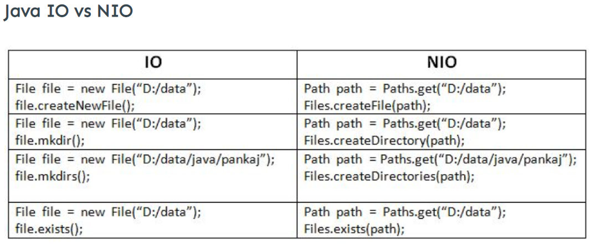
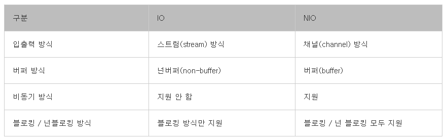

# Java의 File 객체
---
1. 개요
2. File 객체
3. 용도
4. IO vs NIO
5. 요약
---
## 1. 개요

* 자바에서 프로그래밍적으로 파일을 정의하는 법을 알아보도록 한다.
* 이 글에서 언급되는 File 객체는 **단순히 io의 java.io.File 클래스만을 의미하는 것이 아니라**, **파일에 대응하는 모든 개념**을 함께 아우르는 것이다.

(위의 그림처럼 논리적으로 같은 역할을 하지만 명칭이나 체계가 조금씩 다르다.)

---
## 2. File 객체
* File 객체는 하드디스크에 존재하는 파일에 대한 **경로(Pathname)** 또는 **참조(Reference)** 를 추상화한 객체
* File객체는 실제 하드디스크에 존재하는 파일을 가리키는 것이 **아니다**.
* File 객체의 인스턴스는 **파일 또는 디렉토리** 가 될 수 있다.
---
## 3. 용도
* 물리적 파일 시스템에 대해 캡슐화한 인스턴스를 실제 파일과 대응시킬 때. (즉, 실제 디스크에 있는 파일을 프로그래밍 상에서 조작할 때)
* File의 정보를 확인 (파일의 크기, 이름, 최종 수정 일자, 권한 등..)
* File의 생성 및 삭제
* File의 읽기 및 쓰기의 대상
(다만 읽기와 쓰기를 자체적으로 직접 수행하는 것은 아니다)
---
## 4. IO vs NIO

### (1). IO와 NIO
File의 읽기와 쓰기에 있어서 자바에서는 크게 `IO`와 `NIO` 이렇게 2가지 패키지가 존재한다. **IO는 기존에 자바에서 파일 읽기/쓰기를 지원하던 방식**이고 NIO는 New Input/Output의 약자로 **자바에서 새롭게 지원하는** 패키지이다.   

1). 스트림 vs 채널
* IO의 `스트림은 단방향`이기 때문에 입력을 위한 FileInputStream, 출력을 위한 FileOutputStream을 각각 따로 생성해야 한다.
* NIO의 경우 `채널은 양방향 입출력`이기 때문에 FileChannel만 생성한다.

2). 넌버퍼 vs 버퍼
* IO의 경우 `넌버퍼`이기 때문에 순차적으로 1바이트의 데이터를 보내면 1바이트의 데이터를 수신한다. 
* NIO의 경우 `버퍼`를 사용하기 때문에 입출력시 메모리(버퍼)에 데이터를 저장하기 때문에 더 빠른 성능을 낼 수 있다. 

3). 블로킹 vs 논블로킹
* IO의 경우 `블로킹`으로 작동하기 때문에 입출력시 스트림이 닫히기 전까지는 블로킹 상태가 유지된다.
* NIO의 경우 `넌블로킹` 방식으로 작동하기 때문에 입출력시 작업스레드가 블로킹되지 않는다.

4) IO vs NIO
* NIO는 넌블러킹에 버퍼를 이용한 입출력이 가능하기 때문에 작업의 수가 많고, 하나의 작업이 오래 걸리지 않는 경우 유리하다.
* 그러나 큰 작업을 처리하는 경우에는 버퍼의 사용이 오히려 독이 될 수 있기 때문에 동시에 처리하는 작업 수가 적고, 대용량의 작업인 경우에는 IO가 유리하다고 할 수 있다.

---
## 5. 요약
* 자바에서 File 객체는 **실제 파일이 아닌 파일에 대한 경로 또는 참조를 추상화한 객체**이다.
* File 객체는 프로그램 상에서 파일을 다루기 위해 논리적으로 객체화 시킬 때 사용한다.
* IO는 **스트림, 넌버퍼, 블로킹**의 특징을 가지고 있다.
* NIO는 **채널, 버퍼, 넌블로킹**의 특징을 가지고 있다.
* IO와 NIO를 비교했을 때 많은 경우 NIO가 더 우수하다.
* 그러나 실질적으로 지금은 IO도 버퍼를 지원하기도 하고, NIO가 어떤 조건에서는 생각만큼 속도가 뛰어나지 않은 등의 이유로 '무조건 NIO가 더 좋다'라는데는 여러 이견이 존재한다.