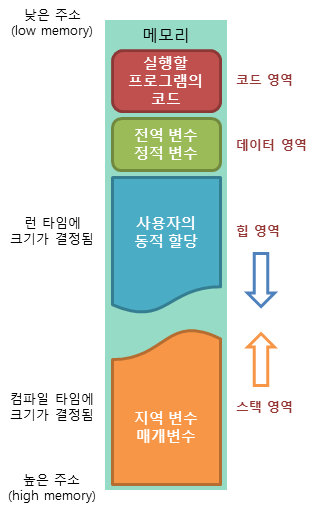

# Java의 Static 언제 사용하고 언제 사용하지 말아야 할까?
---
1. 자바 static 이해하기
2. static을 사용하는 경우
3. static 사용시 주의점

---

## 1. 자바 static 이해하기
자바의 static을 알아보기 위해서는 우선 자바의 메모리에 대해 이해할 필요가 있다.

자바의 메모리는 크게 stack, heap, static 이렇게 3가지 영역이 있는데, 스태틱 변수와 메소드는 static 메모리 영역에 할당된다. 

   
(그림의 데이터 영역이 static 메모리 영역에 해당된다.)

[ static 메모리 특징 ]   
1. 프로그램이 시작될 때 할당되고 종료될 때 해제된다.
2. Garbage Collector의 영향을 받지 않는다.

따라서 자바에서 메소드나 변수에 static 키워드를 붙이면 `해당 변수와 메소드는 프로그램이 시작될 때 메모리에 할당되어 프로그램이 종료될 때 해제`된다.

프로그램 시작할 때 메모리에 할당되므로 new를 통한 객체 생성 과정을 거치지 않고도 해당 변수나 메소드를 사용할 수 있다.

---

## 2. static을 사용하는 경우

### (1). 객체마다 고정된 변수를 사용하는 경우
다음과 같은 Macbook 클래스가 있다고 가정해 보자.
```java
public class Macbook {
    String maker = "apple";

    public static void main(String[] args){
        Macbook mac1 = new Macbook();
        Macbook mac2 = new Macbook();
    }
}
```
위의 클래스의 maker 변수는 항상 "apple"이다. 이는 객체가 100개가 만들어 져도 항상 같다. 같은 값을 위해 100개의 메모리를 할당하는 것은 낭비가 될 수 있다.

따라서 이런 경우 **maker를 static변수로 선언하면, 최초에 한번만 메모리에 할당되므로 메모리 효율성을 높일 수 있다.**

### (2). 여러 객체에서 값을 공유
다음과 같이 카운트를 올리는 클래스가 있다고 하자.
```java
public class Counter {
	
	int count = 0;
	
	public void addCount() {
		this.count++;
	}
	
	public static void main(String[] args) {
		Counter c1 = new Counter();
		c1.addCount();
		Counter c2 = new Counter();
		c2.addCount();
	}
}
```
위의 예에서 c1과 c2의 addCount() 메소드를 호출하고 난 뒤 count의 값은 각각 1일 것이다.

이 경우 count에 `static을 붙이면, 여러 객체에서 값을 공유할 수 있고`, 각각의 객체에서 addCount가 호출될 때마다 count값이 더해질 것이다.

---
## 3. static 사용시 주의점

### (1). 메모리 낭비

static은 잘 사용하면 앞서 언급한 것처럼 메모리 효율성을 높일 수 있지만, **잘못 사용하면 메모리 낭비가 될 수 있다.** 그 이유는 다시 static 메모리 영역의 특성에서 기인하는데, `프로그램 시작시 할당되면 종료될 때까지 메모리에 남아있기 때문이다.`

heap 메모리의 경우 사용하지 않을 때 Garbage Collector가 알아서 수거해 가지만, static 메모리는의 데이터는 그렇지 않다. [참조: When-do-Static-Variables-get-Garbage-Collected-in-Java](https://www.quora.com/When-do-Static-Variables-get-Garbage-Collected-in-Java)

따라서, 무분별한 static 키워드의 사용은 오히려 메모리 낭비가 될 수 있다.

### (2). 디버깅의 어려움

static의 장점 중 "여러 객체에서 값을 공유"한다는 것은 `"언제 어디에서 값이 변경될지 모른다"는 단점이 되기도 한다.` 이는 디버깅을 어렵게 만드는 요인이 되기도 한다. 

그래서 많은 경우 static과 final을 함께 사용하여, static변수가 변경되지 않도록 하기도 한다.

하지만 final을 함께 사용할 수 없는 경우에는 결국 해당 static 변수를 주의깊게 관리해야 할 필요가 있다.

### (3). static 메소드에는 static 변수만 사용 가능
당연한 얘기지만 **프로그램이 시작될 때 할당되는 static 메소드에 객체가 생성한 뒤에야 할당되는 일반 변수가 올 수 없기 때문**이다.   
이는 개인적으로 개발할때 은근히 신경쓰이는 단점으로, static 메소드를 유연하게 개발하는데 방해가 된다. 말 그대로 정적(?)이다.

---
참고한 자료   
* https://wikidocs.net/228
* https://yaboong.github.io/java/2018/05/26/java-memory-management/
* https://mangkyu.tistory.com/47
* https://itpangpang.xyz/71
