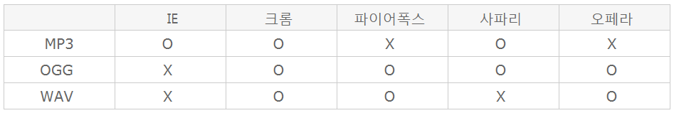

# Html5의 Audio 태그를 사용해보자.
---

얼마전에 회사에서 웹에서 음성파일을 재생하는 것을 개발하게 되었다. 한번도 해보지 않아 어떻게 해야 할지 막연했는데
`우리의 갓 HTML5는 역시 기대를 저버리지 않고 audio 태그를 제공`하여 손쉽게 오디오 파일 재생이 가능했다.   

html5 이전에는 웹에서 오디오를 재생하기 위해 flash와 같은 외부 프로그램을 연동해야 했다고 하니, 새삼 기술 발전의 위대함을 느끼게 되었다.


---

## 1. html5 auido 기본 구성요소

<audio controls autoplay loop="false" mutes="false">
  <source src="https://www.soundhelix.com/examples/mp3/SoundHelix-Song-2.mp3" 
  type="audio/mp3">  
</audio>

```html
<audio controls autoplay loop>
  <source src="/source/to/music.mp3" type="audio/mp3">  
</audio>
```
- 기본적으로 html audio는 **aduio태그와 source태그**로 이루어진다.
- audio 태그에는 **audio에 대한 각종 설정**을, **source태그에서는 재생할 음악소스에 대한 내용**이 담긴다.
- [오디오 태그 직접 해보기](https://jsfiddle.net/geo0ba1u/1/)

## 2. audio 태그의 속성들

- `controls` : 지정시 오디오 재생 UI 제공
- `autoplay` : 지정시 음악 파일 다운로드가 완료될 때 까지 기다리지 않고 바로 재생
- `loop` : true시 반복 재생
- `mute` : true시 음소거, 디폴트는 false

## 3. source 태그의 속성들
- `src` : 재생할 오디오 파일의 소스를 지정
- `type` : 재생할 오디오 파일의 형식 지정
- 재생가능한 파일 형식



## 4. 기타

- audio태그에 src속성을 추가하여 단독으로 사용할 수 있다. 다만 이럴 경우 *웹브라우저가 음악 파일을 전부 내려 받은 후에 재생가능 여부를 판단하기 때문에 좋지 않다*고 한다.
- source 태그를 여러개 추가해도 이어서 재생 되지 않는다. 이건 좀 아쉽다. *이 경우 가장 적절한 소스를 브라우저가 고른다*고 한다.