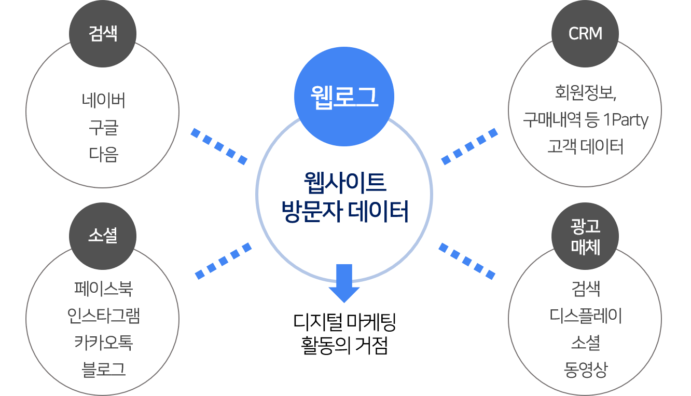
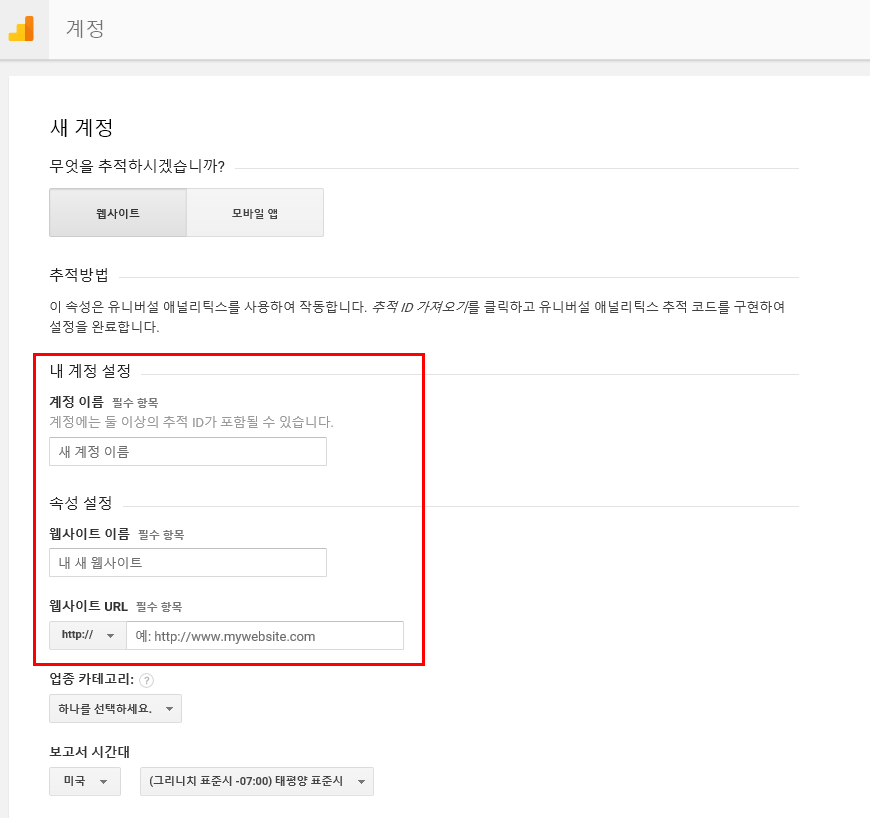
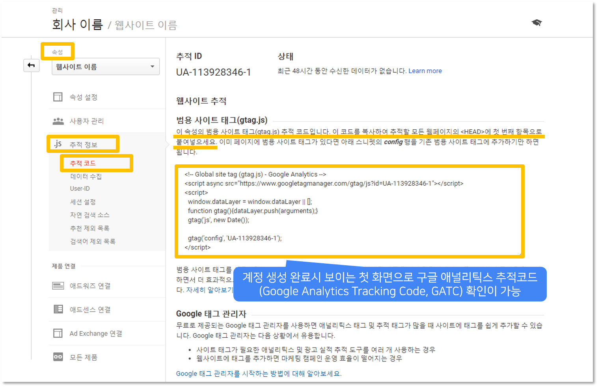
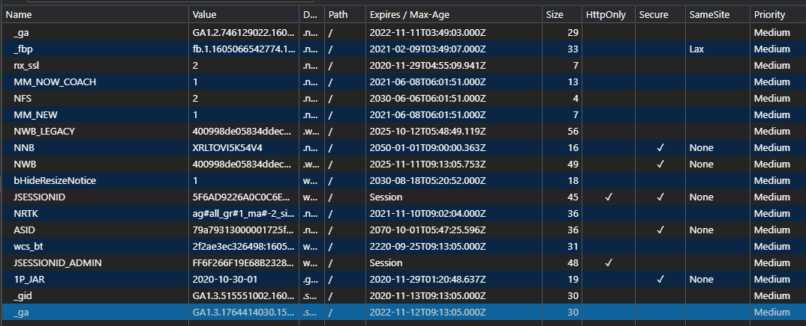
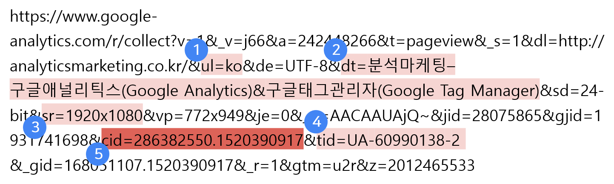

# Google Analytics

---

1. 구글 애널리틱스란?
2. 적용 방법
3. 데이터 수집

---


## 1. 구글 애널리틱스란?

* 현재 지구상에서 가장 많은 사용자들이 이용 중인 `웹 로그 분석 도구`
* `웹 로그`는 웹사이트 방문자들의 사용 내역을 기록하는 것으로, 이를 분석한 데이터를 통해 효율적인 의사결정이 가능 하다.




```
* 접속한 사람들의 나이, 성별, 지역 등의 정보
* 어느 페이지에 가장 많이 머물렀는가
* 접속한 기기/운영체제/브라우저 정보
* 특정 링크의 도달률
* 몇 시에 사람들이 접속하는가
* 이 외에도 수많은 웹사이트 사용자 데이터
```


---

## 2. 적용 방법

### (1). 구글 계정에 웹사이트 등록
구글 계정을 생성하고 GA를 위한 사이트 등록을 한다.



### (2). 추적ID와 추적태그 확인
사이트 등록 후 계정 생성을 마치면 다음과 같이 `추적ID`와 `추적 태그`를 확인할 수 있다.      
이는 이후 웹사이트에 적용시 사용된다.



### (3). 웹사이트 적용
다음과 같이 웹 html에 추적태그를 적용한다.

---

## 3. 데이터 수집

### (1) 클라이언트의 쿠키에 추적 ID를 적용
추적 태그가 적용된 페이지 접속 시 클라이언트에 쿠키가 생성되고, 이는 **사이트를 식별하고 사용자를 추적**하는데 사용된다.



### (2) 접속한 페이지의 추적 코드 실행
위에서 적용했던 추적태그 스크립트가 실행된다.

### (3) '히트'정보 전송

* `히트`란 웹사이트에서 사용자가 상호작용 할 때 해당 정보를 표현하는 URL 정보를 뜻한다.
* `히트`는 구글 애널리틱스 서버에 전송된다.
* 다음은 `히트` 정보의 예이다.


```
1. 사용자의 브라우저에서 설정된 언어
2. 사용자가 조회 중인 페이지의 이름
3. 사용자가 사용하는 기기의 화면 해상도
4. 히트를 올바른 애널리틱스 계정과 연결하는 애널리틱스 ID
5. 임의로 생성된 사용자 식별자 (고객ID 값으로 쿠키를 삭제하기 전까지는 동일한 값을 유지함)```
```
* 히트는 단순 **접속 히트** 뿐만 아니라, 버튼 클릭/동영상 재생 등의 **이벤트 히트**와, 사용자의 구매를 추적하는 **거래 히트** 등 다양한 종류가 있다.
* 이벤트나 거래 히트 수집을 위해서는 별도의 태깅 설정이 필요하다.