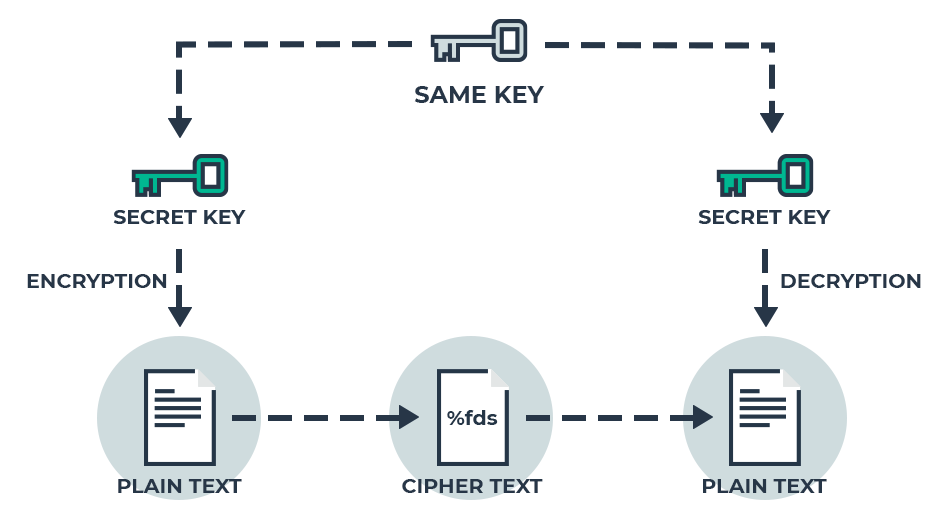
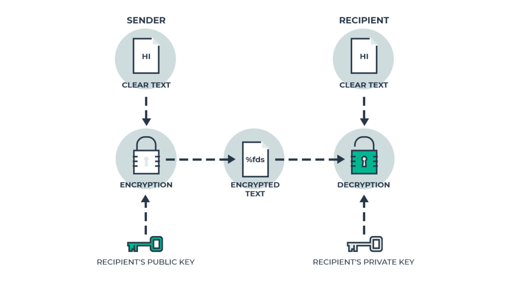

# 암호화 기술 - 대칭키와 공개키

네트워크 상에서 주고 받는 데이터는 중간에 누군가가 가로챌 위험이 있다.
때문에 데이터를 암호화 하여 외부에서 식별하지 못하도록 할 필요가 있다.

이러한 암호화(또는 복호화)에는 `키`가 사용된다.
그리고 키의 사용 방법에 따라 크게 `대칭키`과 `공개키` 알고리즘으로 나눌 수 있다.

이번 글에서 가장 대표적인 암호화 알고리즘인 이 두가지에 대해 알아보도록 하자.

## 1. 대칭키

대칭키란 암호화와 복호화에 동일한 키를 사용하는 방식이다. (공통키라고도 부른다.)

* 흐름
    - A가 B에게 데이터를 보낸다고 가정하면
    - A가 대칭키를 이용하여 데이터를 암호화 한다.
    - A는 **암호화한 데이터와 대칭키를** B에게 보낸다.
    - B는 A에게 받은 데이터를 대칭키를 이용해 복호화한다.

* 장점 
    - 암호화/복호화 속도가 빠르다.
* 단점 
    - 키 또한 네트워크를 통해 전달되므로 중간에 키를 가로챌 수 있다. 이를 `키 분배 문제`라 한다.
* 알고리즘 종류
    - DES, AES, OTP 등이 있으며 현재는 대부분 AES가 사용된다.

## 2. 공개키

공개키란 암호화와 복호화에 서로 다른 키를 사용하는 방식이다.

이 때, 암호화에 사용되는 키를 `공개키`라 하고 복호화에 사용되는 키를 `비밀키`라고 한다.

* 흐름
    - A가 B에게 데이터를 전달한다고 가정하면
    - 데이터를 전달받는 **B가 비밀키와 공개키를 만든다.**
    - B는 비밀키는 그대로 두고, **공개키를 A에게 전달**한다.
    - A는 전달받은 **공개키를 이용하여 데이터를 암호화** 한다.
    - A는 암호화한 데이터를 B에게 전달한다.
    - B는 A에게 받은 데이터를 가지고 있던 **비밀키를 이용하여 복호화**한다.

* 장점  
  - 키 분배 문제가 발생하지 않느다.    
  - 공개키는 어디든 공개될 수 있기 때문에 불특정 다수간의 데이터 교환에 유리하다.

* 단점 
    - 암호화 및 복호화의 속도가 느리다.
    - 중간에 공개키를 가로채 위조할 수 있다. (이는 `전자 인증서`로 해결한다.)
* 알고리즘 종류
    - 현재 사용되는 공개키 알고리즘은 대부분 RSA방식이다.