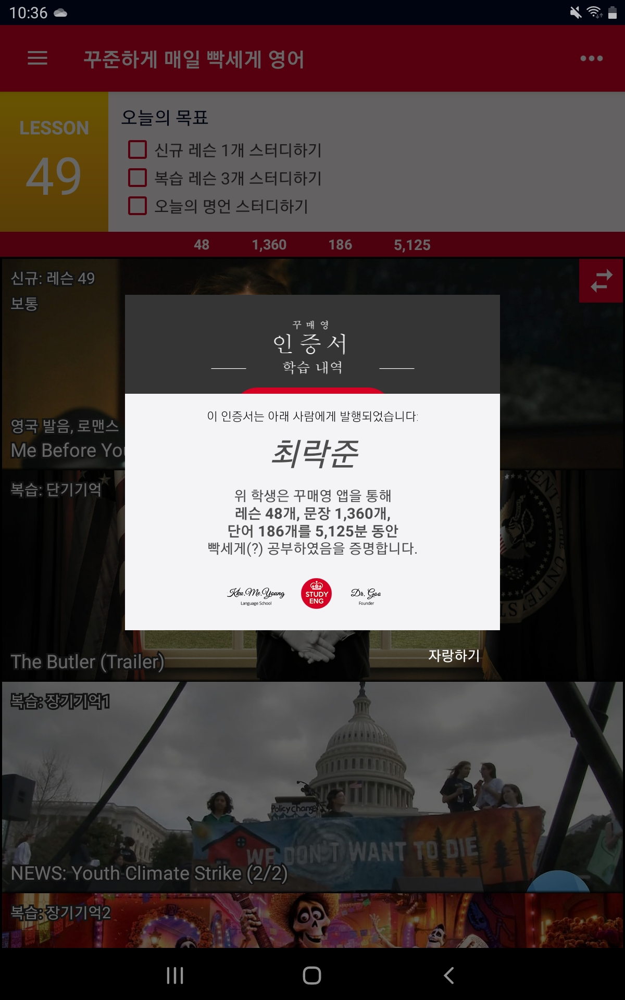

# 2020년 회고

# 코로나

올 한 해는 코로나를 빼놓고는 얘기할 수 가 없을 것 같다. 다행히 IT업종은 코로나의 영향이 적은 편이다. 나도 일하는 측면에서는 코로나를 크게 체감하지 못했다. (심지어 우리 회사는 재택근무도 하지 않는다.)

내가 아무리 집돌이라지만, 사람들과 어울릴 기회가 많이 줄어든 것은 아쉽다. 올해 해외 여행도 계획했는데 먼나라 얘기가 되버렸다. 그리고 소소하게는 카페에서 노트북 키고 코딩하는 시간이 그립기도 하다.

# 영어 공부
  
사람들마다 영어 공부를 하는 이유는 다양하다.  그 중 개발자에게 영어 공부를 해야 하는 이유는 명확하다고 생각한다. 구글링 결과와 기술 문서들의 절반 이상이 영어이다. 때문에 개발자에게 영어 실력은 훌륭한 무기이다.
또한 가끔 중국 유학시절 외국친구들과 메일을 주고 받는데, 답장하려고 메일 한 통 쓸 때마다 구글링을 수십번씩 하느라 한두시간씩 걸리곤 한다. 이런 점들 때문에 올해에 영어 공부를 다시 시작했다.

내가 했던 영어 공부 방법 중에 `꾸매영`이라는 안드로이드 어플이 있다. 레슨 별로 짧은 동영상(미드, 영화)이 준비 되어있고, 이를 반복해서 공부할 수 있는 어플이다. 개인적으로 사용하면서 매우 매우 만족하고 있고 때문에 주변사람에게 많이 추천하고 있다. 심지어 이 어플은 무료이다! *극한의 가성비충인 내가 처음으로 어플 개발자에게 후원을 했던 어플이다.*

# 회사

회사에서는 참 많은 일이 일어났다. 올해 중순부터 회사 사람들이 하나 둘 씩 퇴사하기 시작했다. (심지어 개발부 이사님까지 퇴사했다.) 내가 2년 동안 개발부 막내였는데 내 위 사람들이 다 나가버렸고 어느새 내가 파트장을 하고 있었다. 

이로 인해 내 업무의 절반 이상이 개발이 아닌 회의, 지원, 문서작성 등의 업무로 채워지게 되었다. 아직 나는 한창 개발할 시기인데, 중소기업의 기이한(?) 인원구조로 인해 어쩌다 보니 이렇게 되었다. 그리고 이것이 내가 이직을 준비하는 이유 중 하나가 되었다.ㅋㅋ

# 개발 공부
돌이켜 보면 올해 공부 했던 내용들은 주로 부족한 기초들을 조금씩 채워나가는 방향이었던 것 같다. 
그리고 잡학다식하게 여러 분야를 봤었다. 그 중 생각나는 몇가지를 적어 보자면,
1. 네트워크
* 나에게는 까맣게 구름이 쌓여있던 분야 중 하나였다. 서점에서 몇번 네트워크 책을 훑어 봤는데, 네트워크 책들의 특징 - 두껍고 지루함 - 때문에 항상 손이 가지 않았다. 그러 던 중 인터넷에서 사람들이 많이 추천하던  [책](http://www.yes24.com/Product/Goods/3246410)을 읽었는데 다행히 두껍지는 않고 지루하기만 했다. 이 책은 여느 다른 네트워크 책처럼 OSI 계층, 프로토콜 등등의 이론적인 것에 집중하는 것이 아니라 실제로 네트워크에서 일어 나는 흐름을 순서대로 따라가면서 설명해서 좋았다.

2. 알고리즘
* 나는 올해 처음 알고리즘 공부를 시작한 알린이다.
* 내가 공부했던 기본서는 [알고리즘 도감](http://www.yes24.com/Product/Goods/58290453), [Hello Coding 그림으로 이해하는 알고리즘](http://www.yes24.com/Product/Goods/37885448) 이렇게 2개 이다.
* 특히 이 중 알고리즘 도감은 블로그 스터디의 박창원님이 추천해 줬는데 정말 만족했던 책이다. 기본 알고리즘들을 이해하는데 큰 도움이 되었다.

3. 자바
* 자바 1.8 - 스트림/람다 : 스트림/람다는 한번 맛보면 헤어나올 수 없다. 올해 공부한 것 중에 실제 개발에 가장 많이 활용하는 것이 아닌가 싶다.
* 멀티쓰레드 : 기본적인 Thread/Runnable과 더불어 ExecutorService를 공부하며 멀티쓰레드에 발을 담갔다.
* junit5와 assertJ : 좀 더 꼼꼼하고 창의적(?)으로 테스트 할 수 있도록 도와주었다.
* 이펙티브자바 : 이펙티브 자바를 읽는 것은 무거운 바벨을 드는 것과 같다. 책의 한줄을 이해하기 위해 구글에 수십번을 검색해야 한다. 하지만 해당 아이템을 이해했을 때 다가오는 쾌감이 있다. 현재는 진도가 멈춰있지만 내년에는 완독을 목표로 하고 있다.

4. 파이썬
* 파이썬을 공부한 계기는 코딩테스트 때 사용하기 위해서 이다. 기본 문법은 [점프 투 파이썬](https://wikidocs.net/book/1)의 인터넷판으로 공부했고 실제로 알고리즘 문제를 일부러 파이썬으로 많이 풀었다.
* 하지만 여전히 자바가 더 편하다.ㅎㅎ

5. 블로그 포스팅
* 올해 한 일 중에 가장 잘 한 일이라고 생각한다. 
* 주기적으로 기술 블로그를 작성하는 것과 더불어, 개발에 열정을 가진 사람들을 만나고 교류하는 일 자체가 즐거웠다.
* 그나저나 내년에는 죽어있는 블로그를 꼭 다시 살려야지...

# 내년 목표
내년 목표는 베이스를 좀 더 단단히 쌓는 것이다. 단순히 어떤 언어의 어떤 문법을 익히고 이런 것 보다는, 개발 전반을 관통하는 지식을 쌓고 싶다. 

그 리스트에는 `운영체제`와 `보안`이 있다.
운영체제는 얼마전 블로그 글을 보고 관심이 생겼는데, 이것도 네트워크 처럼 나에게 미지의 영역 중 하나이기 때문에 그 안개를 걷어내고 싶다는 생각이 들었다.

보안은 내가 하고 싶은 `핀테크/블록체인` 분야에서 도움이 될 것같아서 더 깊게 공부하고 싶다.

가장 중요한 것은 내년에는 `이직`을 할 예정이다. 내가 어떤 곳에 **(얼마를 받고)** 가게 될지, 내년 회고에는 이직에 대해 어떻게 회고할지 궁금해진다.
