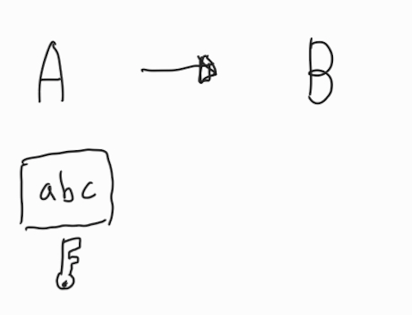
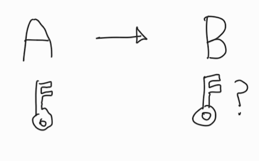
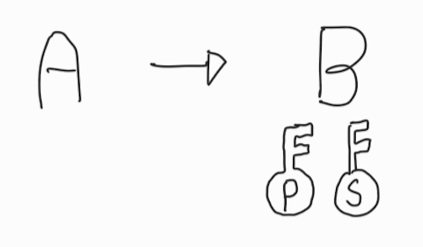
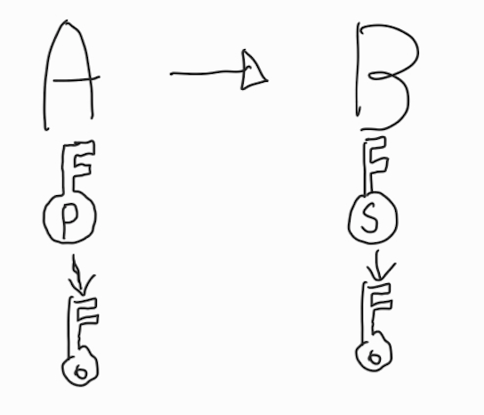

# 하이브리드 암호화 방식

# 개요

하이브리드 암호화 방식이란 `대칭키 암호 방식`과 `공개키 암호 방식` 각각의 단점을 극복하기 위해 고안된 암호화 방식이다.

* `대칭키 방식`에서는 암호화, 복호화에 같은 키가 사용되기 때문에 필연적으로 키가 네트워크에 노출되는 **키 분배 문제**의 단점이 있었다.

* `반면 공개키 방식`은 암호화와 복호화의 과정이 복잡하여 **처리 속도가 느리다는 문제**가 있었다.

`반면 하이브리드 방식`에서는 **데이터는 대칭키 방식으로 암호화** 하고, 여기에 **사용된 키를 공개키 방식으로 전달**하여, 안전하게 데이터를 전달함과 동시에, 빠르게 처리할 수 있다.

그렇다면 하이브리드 암호화 방식이 어떻게 진행되는지 알아 보자.

---

# 하이브리드 암호화의 진행

* 다음과 같이 A가 B에게 데이터를 전달한다고 가정했을 때,
* 먼저 **데이터는 대칭키 방식으로 암호화** 한다.

* 대칭키 방식은 암호화와 복호화에 같은 키를 사용하므로
* 데이터를 복호화 하기 위해서는 **대칭키를 B에게게 전달해야 한다.**

* 따라서 대칭키를 암호화하여 전달한다.
* 이 때 **대칭키는 공개키 방식으로 암호화**를 하여 전달하게 된다.
* 공개키 방식에서는 데이터를 전달 받는 B가 퍼블릭키(P)와 시크릿키(S)를 생성한다.

* **퍼블릭키는 암호화에 사용**되고, **시크릿키는 복호화**에 사용된다.
* B는 A에게 퍼블릭키를 전달한다.

* A는 전달받은 퍼블릭키를 이용하여 **대칭키를 암호화 하여 B에게 전달**한다.
* B는 암호화된 **대칭키를 시크릿키를 이용하여 복호화** 한다.

* 대칭키가 복호화 되었으므로, 이를 이용하여 가장 처음에 **A가 전달한 데이터를 복호화** 한다.

---

# SSL/TLS

* 이러한 하이브리드 방식은 현재 인터넷상에서 데이터를 안전하게 교환하기 위한 SSL 프로토콜에서 사용된다.
* 오늘날 쓰이는 것은 SSL의 업그레이드 버전인 TLS이지만, SSL이라는 용어가 통용된다.
* 현재 널리 사용되는 https는 이 SSL/TLS 프로토콜을 이용한 통신 방법이다.

---

# 세줄 요약
* 대칭키는 속도는 빠르지만 키 분배의 문제가 발생한다.
* 공개키는 키 분배의 문제는 없지만 속도가 느리다.
* 하이브리드 방식은 빠르고, 안전하게 데이터를 전달할 수 있다.