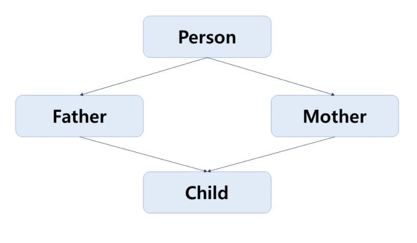

# 인터페이스와 클래스

## 1. 인터페이스의 문제점
다음은 암/복호화 작업을 처리하는 인터페이스의 모습이다.
```java
public interface CompanyEncryption {

    /**
     * 파라미터 값을 암호화 한다.
     */
    public byte[] encrypt(byte[] bytes) throws Exception;

    /**
     * 파라미터 값을 복호화 한다.
     */
    public byte[] decrypt(byte[] bytes) throws Exception;
    
}
```
평범한 인터페이스의 모습이지만 다음과 같이 암호화 여부를 확인하는 함수가 추가 된다면 어떻게 될까?
```java
    /**
     *  파라미터 값이 암호화 되었는지 확인
     */
    public boolean isEncoded(byte[] bytes) throws Exception;
```
단순한 기능을 추가했을 뿐인데 다음과 같은 문제가 발생하였다.
* 해당 인터페이스를 구현한 모든 클래스에서 컴파일 에러
* 인터페이스만 배포할 시 NoSuchMethod에러 발생
* 해당 인터페이스를 사용 중인 외부 클라이언트에도 영향

이러한 문제를 해결하기 위해 추가된 기능만을 위한 인터페이스만를 따로 만들 수도 있다.    
하지만 그렇다 하더라도 다른 문제가 발생한다.  
변경이 있을 때마다 인터페이스를 새로 만들어야 하기 때문이다.

> 전통적인 인터페이스의 문제점 : 한번 배포되면 수정이 어렵다.

## 2. 인터페이스의 진화

### 2-1. 최초의 인터페이스
최초의 자바에서는 다음의 형태만 인터페이스에 선언할 수 있었다.
* 상수(final)
* 반드시 추상 메서드
* 구현클래스에서 인터페이스의 추상 메소드를 구현하지 않았다면 추상 클래스로 선언해야 함.
* public으로 선언하지 않았더라도 public으로 인식

### 2-2. 자바 1.2
이후 1.2 버전에서는 다음이 추가되었다.
* 중첩 클래스 선언 가능
* 중첩 인터페이스 선언 가능
* 중첩 클래스와 중첩 인터페이스는 모두 public static이어야 하며, 생략 가능

```java
public interface Input {
    
    public static class KeyEvent {
        public static final int KEY_DOWN = 0;
        public static final int KEY_UP = 1;
    }
    
    public static class TouchEvent {
        public static final int TOUCH_DOWN = 0;
        public static final int TOUCH_UP = 1;
    }
    
    public boolean isKeyUp(int key);
    
    public boolean isTouchDown(int touch);
}
```

> 다음과 같이 Input인터페이스에 중첩 클래스를 선언함으로써, `인터페이스의 동작을 더 상세히 규정`할 수 있고 개발자가 별도로 구현할 필요 없이 `인터페이스 차원에서 제어`할 수 있다.

### 2-3. 자바 1.8
자바 1.8에서는 인터페이스에 가장 큰 변화가 생겼다.    
바로 `구현 된 메서드`를 선언할 수 있게 된 것이다.

* 구현 된 static 메서드를 선언 가능
* 구현 된 default 메서드를 선언 가능

```java
public interface CompanyEncryption {

    public byte[] encrypt(byte[] bytes) throws Exception;

    public byte[] decrypt(byte[] bytes) throws Exception;

    /**
    *   맨 앞에 default 키워드를 붙이면 구현된 메서드를 선언할 수 있다.
    */
    default public boolean isEncoded(byte[] bytes) throws Exception{
        ...isEncoded 구현부
    }

    /**
    *   구현된 static 메서드를 선언할 수 있다.
    */
    public static void isDecrypted(byte[] bytes) throws Exception{
        ...isDecrypted 구현부
    }
}
```
static 메서드와 default 메서드를 통해 `인터페이스를 추가하거나 구현 클래스를 수정할 필요 없이 기능을 추가할수 있게 되었다.`

### 2-4. 자바 9

* private 메서드 선언 가능

> private 메서드가 외부에는 공개되지 않더라도, 인터페이스 내부의 static 메서드와 default 메서드의 로직을 공통화하고 재사용하는데 사용될 수 있다.  

***


## 3. 클래스와의 차이점

추상 클래스와의 차이점

* 인터페이스는 멤버 변수가 존재하지 않고, 인터페이스 자체를 객체화 시킬 수 없다.
* 클래스는 오직 하나의 클래스만을 사속받을 수 있는 반면에, 인터페이스는 여러 개를 상속받거나 구현할 수 있다.
-> 이를 통해 다중 상속과 유사한 형태를 만들 수 있다.

## 4. 다중 상속 관계

인터페이스에 default메서드라는 구현된 메서드가 추가되고, 인터페이스는 여러개를 구현할 수 있기 때문에 결과적으로 다중 상속의 형태를 가질 수 있게 되었다.

다중 상속 중 다이아몬드 상속의 경우 문제가 발생할 수 있다.
> 다이아몬드 상속의 문제 : 동일한 이름과 형태를 가진 메서드가 상위 클래스에 정의 되어 있을 경우 해당 메서드를 호출했을 때 어느 쪽의 메서드가 실행될지 알 수 없음.

다음과 같이 최상위에 Human 인터페이스가 존재하고, 이를 상속 받는 인터페이스 Father와 Mother이 있다.
```java
public interface Human {
    String getName();
}
```
Father와 Mother에서는 각각 상위의 getName()메서드를 구현하였다.
```java
public interface Father extends Human{
    String NAME = "father";

    @Override
    default String getName(){
        return Father.NAME;
    }
}
```

```java
public interface Mother extends Human{
    String NAME = "mother";

    @Override
    default String getName(){
        return NAME;
    }
}
```
이 때, Father와 Mother를 구현한 **Child 클래스에서는 getName메서드를 반드시 구현해야 한다.**    
그렇지 않으면 Father와 Mother 중 어떤 클래스의 메서드를 사용할지 컴파일러 입장에서는 모르기 때문이다.

```java
public class Child implements Father, Mother {
    String NAME = "child";

    // Father와 Mother에 둘다 존재하는 메서드 getName()
    // 이를 구현하지 않으면 컴파일 에러가 난다.
    @Override
    public String getName() {
        return NAME;
    }
}
```

이렇듯, 인터페이스에서 default 메서드를 제공하면서 자바에서도 다중 상속의 형태를 구현할 수 있게 되었다.
이에 비롯되는 문제를 피하기 위해서는 상속 관계에서의 호출에 대한 기본적인 원리 3가지를 이해해야 한다.

* 첫째, 클래스가 인터페이스보다 우선한다. 동일한 메서드가 인터페이스와 클래스에 둘 다 있을 경우 클래스가 호출된다.
* 둘째, 위의 조건을 제외하고 하위 클래스/인터페이스가 상위 클래스/인터페이스보다 우선한다.
* 위의 두 가지를 제외하면 컴파일러는 어떤 메서드를 호출해야 할지 모르기 때문에 컴파일 에러가 발생한다.

---

참고

practical 모던 자바 - 장윤기