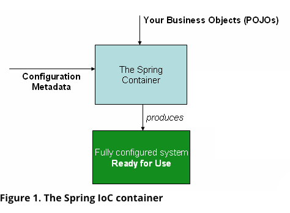

# SpringApplication

## 1. Spring Ioc Container

* 스프링 프레임워크의 핵심이라 할 수 있는 Ioc Container 자체는 실체가 있는 무언가가 아니다. 좀 더 **추상적이고 관념적이 용어**에 가깝다.  
* `Ioc Container`란 스프링 빈들을 관리하고 프레임 워크로서 여러가지 부가 기능을 해주는 **스프링 코어를 통틀어 지칭**하는 표현이다.  
* 그런 의미에서 스프링-Ioc Container의 관계를 리눅스-커널의 관계와 비슷하다고 할 수 있다.

* 실제로 Ioc Container의 근간이 되는 것은 `org.springframework.beans` 와 `org.springframework.context` 이 두 패키지이다.  
* 특히 이 중 **BeanFactory**와 **ApplicationContext**인터페이스가 Ioc container의 실질적인 구현체라고 볼 수 있다.  

이중 `BeanFactory`는 가장 기본적인 기능인 Bean을 관리하는 역할을 한다.  
`ApplicationContext`는 BeanFactory의 확장된 형태(superset)이다. BeanFactory의 기능과 더불어 비지니스에 특화된 여러 부가 기능을 추가로 제공한다.  




## 2. BeanFactory

* `BeanFactory`는 스프링에서 가장 기본이 되는 기능을 담당한다.
* 바로 Bean의 생성과 바인딩이다. 즉, BeanFactory는 빈의 생성부터 소멸까지의 생성주기를 관리하고 의존성을 관리(DI)해준다.
* 여기서 `Bean`이라는 것은 **어플리케이션을 구성하고 있는 객체 중 Ioc Container에 의해 관리되는 것**을 뜻한다.

## 3. ApplicationContext

* ApplicationContext는BeanFactory의 확장된 형태(superset)이다. 따라서 BeanFactory의 기본 기능인 Bean관리를 기본적으로 제공한다.  
거기에 더불어 다음과 같은 기능들이 추가된다.

```
* Spring AOP 와 통합하기 용이함.

* Message resource를 핸들링(다국어 지원)
  * 같은 메시지를 언어 별로 따로 설정하여 원하는 언어의 메시지를 불러 올 수 있다.
  
* Event 등록 및 관리
  * ApplicationContext의 다양한 이벤트를 등록하고 핸들링 할 수 있다.
  * 예를 들어 ApplicationContext가 로드 되었을 떄 이를 이벤트로 등록하고 이에 대한 핸들링을 할 수 있다.
  
* 특정 기능을 용도에 맞춘 ApplicationContext 지원
  * 예를 들어 web application의 경우는 web 환경에 더 적합한 WebApplicationContext를 제공한다.
```

## 4. BeanFactory vs ApplicationContext

* AppplicationContext 가 더 다양한 기능을 제공한다는 것 외에도 이 둘에는 큰 차이가 하나 있다.  
* BeanFactory는 bean을 `lazy loading`방식을 사용하여 관리한다. 즉, 해당 빈이 필요할 때 인스턴스화 하여 사용하는 방식이다.
* 반면 ApplicationContext는 `eager loading`방식이다. 어플리케이션이 시작될 때 모든 빈을 등록한다.

* `lazy loading` 방식은 메모리를 좀 더 효율적으로 사용할 수 있다. 하지만 빈이 사용될 때 불러 오기 때문에 런타임 시에 에러가 발생할 수 있다.
* `eager loading` 방식은 사용여부와 관계없이 모든 빈을 등록하기 때문에 일반적으로 메모리를 더 많이 차지한다. 하지만 문제가 있을 경우
어플리케이션 시작 시점에 에러가 발생하므로 더 안전하다고 볼 수 있다.

* 스프링 공식 문서에서는 이 둘 중에 **ApplicationContext 방식을 더 추천**하고 있다.
* BeanFactory 방식은 안정성이 떨어지고, 같은 빈을 사용한다고 했을 때 메모리 효율성이 크게 좋다고 볼 수 없으며,
무엇보다 ApplicationContext가 제공 하는 기능이 더 다양하다.
