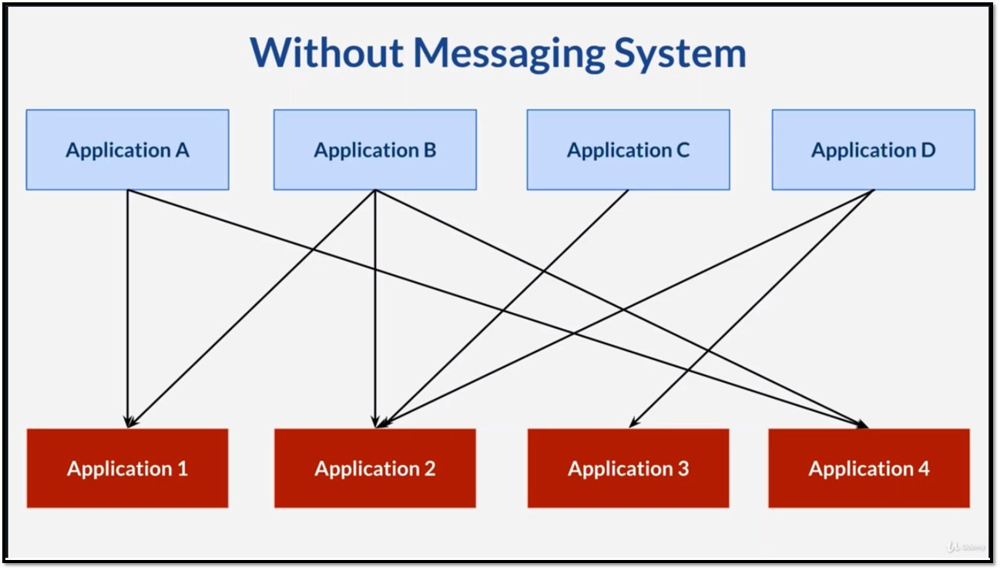
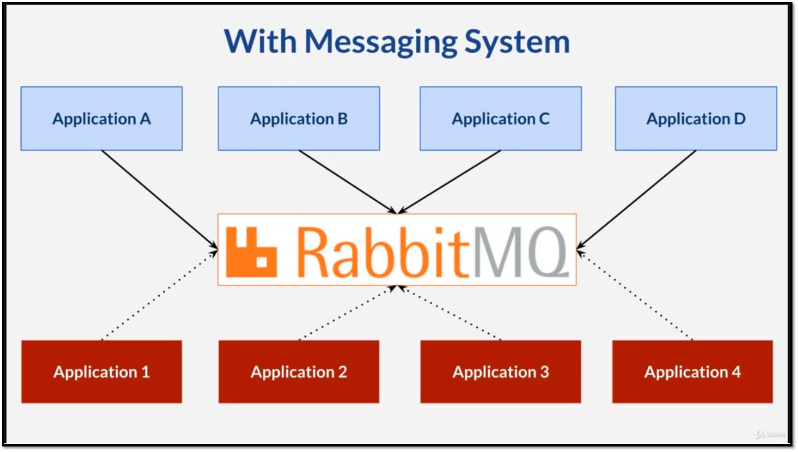

# Messaging System

## 1. 메시징 시스템이란 ?

* 어플리케이션 간의 데이터를 주고 받을 수 있도록 하는 시스템

```
---------------------            ----------------
Human Resource System   <---->   Marketing System
---------------------            ----------------
```
* HR시스템에 새로운 인원이 추가 되었는데 Marketing시스템에서 이를 알지 못한다면 데이터 불일치가 생길 것이다.
* 이처럼 시스템 간에 데이터를 주고 받으며 시스템을 연결하는 역할을 하는 것이 메시징 시스템이다.

## 2. 왜 메시징 시스템일까?

메시징 시스템 없이 개별적으로 어플리케이션 간의 데이터 전송을 구축한다면
* 어플리케이션 마다 필요한 프로토콜과 메시지 포맷이 우후죽순으로 늘어난다.
* 어플리케이션을 확장하기 힘들다.



이러한 문제를 해결하는 것이 메시징 시스템이다  
아래 그림과 같이 어플리케이션은 중간에 메시징큐에 메시지 전달을 위임한다.  
어플리케이션은 누구에게 어떤 형식으로 데이터를 보낼 지 신경쓸 필요가 없다.


## 3. vs RESTful api
일반적으로 시스템 간에 데이터를 주고 받는 방법에는 크게 3가지가 있다.
* RESTful api
* Messaging
* RPC

특히 이 중 REST api와의 차이점에 대해 알아보자.

### REST
* REST는 http를 사용하기 때문에 syncronous 에 더 적합하다.  
* REST는 클라이언트와 서버가 항상 online이어야 한다.  
* REST는 범용성이 좋다. http를 만족시키는 모든 시스템에서 사용할 수 있다.  

### Messaging
* 반면 메시징은 큐를 사용하기 때문에 비동기 처리 형태로 사용된다.
* 메시징은 전송자(publisher)와 수신자(subscriber)가 반드시 동시에 online일 필요가 없다.
* 메시징 시스템은 주로 엔터프라이즈 내부의 약속된 시스템 간의 데이터 전송을 담당한다.
* 일반적으로 Messaging 시스템의 처리 속도가 더 빠르다.


