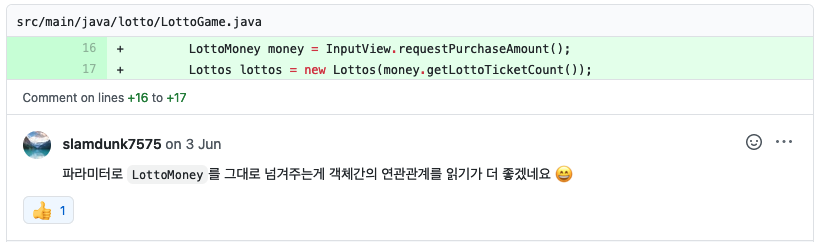

# 객체 생성을 더 스마트하게 하는 법

```
클래스 설계의 핵심 과제는 일단 객체를 명확하게 정의된 상태에 두고(초기화/생성),
그 객체의 연산이 수행되는 도중에도 그 상태를 일정하게 유지하며, 
마지막에 그 객체를 소멸시킬 때도 우아하게 마무리 짓는 것이다.

출처 - The C++ Programming Language
```
*객체지향 프로그래밍에서 그 시작점이 되는 객체 생성을 좀 더 스마트하게 하는 방법에 대해 개인적인 경험을 공유합니다. 
이 포스팅에서는 인스턴스 통제나 객체의 불변(immutable)같은 내용보다는 객체 생성 자체에 중점을 뒀습니다.*

## 1. 역할을 표시한다.

`정적 팩터리 메서드`는 생성자에 비해 여러 장점이 있다. 
[(이펙티브 자바 아이템1 - 생성자 대신 정적 팩터리 메서드를 고려하라)](https://github.com/Meet-Coder-Study/book-effective-java/blob/main/2%EC%9E%A5/1_%EC%83%9D%EC%84%B1%EC%9E%90_%EB%8C%80%EC%8B%A0_%EC%A0%95%EC%A0%81%20%ED%8C%A9%ED%84%B0%EB%A6%AC_%EB%A9%94%EC%84%9C%EB%93%9C%EB%A5%BC_%EA%B3%A0%EB%A0%A4%ED%95%98%EB%9D%BC_%EC%B5%9C%EB%9D%BD%EC%A4%80.md)  
그 중 가장 눈에 띄는 것은 이름을 가질 수 있다는 점이다.
정적 팩터리 메서드도 **메서드**이기 때문이다.  
때문에 정적 팩터리 메서드로 객체를 생성하면 해당 코드가 **어떤 역할을 하는지 명시적으로 표현**할 수 있다.

```java
// 단순히 생성자를 사용했을 떄 보다
PayHistory payHistory = new PayHistory(orders);

// 정적 팩터리 메서드를 통해 이름을 지정하면 역할을 더 명확히 알 수 있다.
PayHistory payHistory = PayHistory.fromOrders(orders);
```

## 2. 객체가 생성되는 시점에 객체의 불변식(invariant)을 보장한다.

**불변식(invariant)** 이란 객체가 해당 객체가 개발자의 의도에 맞는 역할을 하기 위한 논리적 기준을 뜻한다.  

예를 들어 로또 숫자를 표현하는 `LottoNumber`라는 객체가 있다고 가정한다면,  
이 `LottoNumber`에 60이라는 숫자가 들어가게 된다면 해당 객체의 불변식이 깨지는 것이다.  
이러한 객체가 유효하게 로직을 수행한다면 결과를 예측하기 힘들어 진다.
```java

public LottoNumber(int number) {
    // 생성자에서 불변식을 보장함으로써 예상치 못한 오작동을 방지할 수 있다.
    if (number > 45) {
        throw new IllegalStateException("로또 숫자가 올바르지 않습니다.");
    }
    ...
}
```

## 3. 객체가 생성되는 시점에 상태를 결정한다.

객체가 생성되는 시점에 상태가 결정되는 것의 장점은 간단하다.  
**도중에 상태가 변경되지 않는다**는 것이다. 이로 인해 사이드 이펙트를 방지할 수 있다.  

하지만 실무에서는 항상 객체가 생성되는 시점에 완벽히 상태가 결정되기가 쉽지 않다.  
따라서 나의 경우에는 객체가 생성되는 시점에 가능한 많이 상태를 결정하고,  
가능한한 적게 상태가 변경시키는 것으로 타협점을 삼고 있다.

```java
// 생성 시점에는 상태가 없고, 이후에 상태값이 변한다.
User user = new User();
user.setName("rock");
user.setJob("developer");

// 생성 시점에 상태가 결정된다.
User user = new User("rock", "developer");
```

## 4. 파라미터는 가능한 적게

```
The ideal number of arguments for a function is zero.
Next comes one, followed closely by two.
Three arguments should be avoided where possible.

- Clean Code
```
클린 코드에서는 파라미터를 가능한 3개 미만으로 유지하라고 한다. 생성자(혹은 정적 팩토리 메서드)에도 이 말은 적용된다고 생각한다.  
너무 많은 파라미터를 갖는 생성자는 실수를 범하기 쉽고, 이해하기 어려우며, 다시 사용하기 힘들어 진다.

## 5. 객체간의 관계 설정

얼마전에 우테캠프로에서 코드 리뷰 받았던 내용 중 하나이다.  
  
Lottos라는 객체를 생성할 때 LottoMoney 객체의 lottoTicketCount를 넘겨주는 방식을 사용했는데,  
LottoMoney 객체를 그대로 넘겨주면 객체간의 연관관계를 읽기 더 좋겠다는 의견이었다.

내가 생성자에 lottoTicketCount를 넘긴 이유는 단순하게 int를 받는 생성자가 더 자유롭게 사용될 수 있다고 생각했기 때문이다.  
하지만 리뷰어님의 말씀처럼, 객체를 그대로 넘기면 객체 생성시 두 객체간의 관계를 쉽게 파악할 수 있게 된다.

무엇이 맞는지는 정답은 없다고 생각한다.  
특정한 값을 생성자에 넘기는 방법은 **좀더 범용적으로 사용할 수 있지만 다른 객체와의 관계를 파악할 수 없다.**  
객체를 전달하는 방법은 **특정 객체와의 관계를 파악하기 쉽지만, 해당 객체와만 상호작용할 수 있다.**

## 6. 객체를 다양하게 사용할 수 있게 한다.

사실 위의 문제는 정답이 있다.(띠용?) 바로 두 생성자를 모두 만드는 것이다!  

예전에는 하나의 객체에 생성자가 많은 것이 안좋은 것이라고 생각했다.  
그 이유는 객체의 일관성을 유지하기 힘들어지고, 객체의 관리가 힘들어 진다고 생각했기 때문이다.  

그런데 생각해보면 객체를 특정한 방법으로만 생성해서 일관성을 유지하는게 의미가 있을까?  
또한 생성자가 추가됨으로 객체의 관리가 힘들어 진다는 것은, 객체의 복잡도가 지나치게 높거나 잘못된 설계임을 반증하는 것이 아닐까?
라는 생각이 들었다.

특히 자바지기님께서 **다양한 생성자는 객체를 폭넓게 활용할 수 있게 한다** 라고 말씀하시는 걸 듣고는 생각이 완전히 바뀌게 되었다.  
심지어 자바지기님은 테스트만을 위한 생성자나 객체의 특정한 상태만을 위한 생성자도 만들 수 있다고 하셨다.
