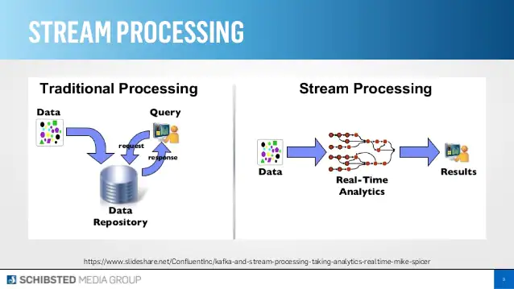

# 카프카의 등장 배경과 특징


## 1. 배경

### (1). 바뀌어 가는 비지니스 요구 사항
* 현대의 비지니스에서는 점점 더 즉각적이고 고가용성(always-on)인 시스템을 요구한다.
* 뿐만 아니라 처리해야 하는 데이터도 폭발적으로 늘어났다.

### (2). 기존 방법의 한계
* 때문에 단순히 한 곳에서 데이터를 저장하고, 다른 곳에서 그 데이터를 사용하는 시스템으로는 이러한 요구사항을 만족 시키기 힘들다.
* 이러한 환경에서 필요한 것은 `폭발적인 데이터를 수용`하면서도, `데이터 생성과 동시에 이를 처리`할 수 있어야 하며,
동시에 `안정성을 보장`할 수 있어야 한다.

---

그렇다면 카프카는 어떻게 이러한 요구사항을 만족시키고 있을까?

카프카 공식 페이지에는 카프카에 대해 위와 같이 설명하고 있다.
```
Apache Kafka is a community distributed event streaming platform
capable of handling trillions of events a day. 
...
Kafka is based on an abstraction of a distributed commit log.
```
요약하자면 카프카는 수 조의 이벤트를 처리할 수 있는 `이벤트 스트리밍` 플랫폼이며, `분산 커밋 로그`를 추상화하였다.  
그렇다면 이벤트 스트리밍과 분산 커밋 로그란 무엇일까?

## 2. 이벤트 스트림 프로세스 (event stream process)

이벤트 스트림 프로세스란 끊임없이 생산되는 데이터를 처리하는 기술이다.  


이를 좀 더 단계별로 알아보자면 
1. 실시간으로 생성되는 데이터를 **캡처**하고,
2. 이를 추후의 사용/집계처리/검증 등을 위해 **저장**하며,
3. 데이터를 적절한 곳으로 흐르게 한다.(**전달**한다)

예를 들어 대형 쇼핑몰의 주문 정보를 처리한다고 가정한다면


## 3. 분산 커밋 로그 (distributed commit log)

카프카도 db와 비슷한 일종의 스토리지 시스템이다. 따라서 db와 마찬가지로 commit log 를 지원한다.  

> commit log : 변경된 사항을 저장하여 잘못되었을 때 이를 다시 복원할 수 있게 함

여기서 **분산형** 커밋 로그라는 것은 여러개의 노드(브로커)로 구성된 커밋 로그를 뜻한다.  
카프카에서는 여러개의 노드가 데이터 사본을 가지고 있고 문제 발생시 싱크를 맞추는 작업을 한다.

이를 통해 카프카는 안정적이면서도 확장이 용이한 구조를 갖게 된다.

## 4. 요약

결과적으로 카프카는 `이벤트 스트리밍` 방식을 통해 **대량의 데이터**를 **실시간**으로 처리하며,  
`분산 커밋 로그`를 통해 **안정적**이고 **확장이 용이**한 시스템을 제공한다. 

## 참고

[what is kafka?](https://www.confluent.io/what-is-apache-kafka/?utm_medium=sem&utm_source=google&utm_campaign=ch.sem_br.nonbrand_tp.prs_tgt.kafka_mt.xct_rgn.apac_lng.eng_dv.all_con.kafka-general&utm_term=apache%20kafka&creative=&device=c&placement=&gclid=Cj0KCQjwpreJBhDvARIsAF1_BU3r6dLLSmJzzzay99zmdi8sJ_rYjEgl3m3m6FC9c8PN-SoMjqofNpQaAoqdEALw_wcB)  
[kafka introduction](https://kafka.apache.org/intro)  
[what does commit log mean in kafka](https://stackoverflow.com/questions/45138862/what-does-commit-log-mean-in-kafka)  
[event streaming process](https://hazelcast.com/glossary/event-stream-processing/)  
[현재 스트리밍 서비스를 이끌고 있는 기술 / 카프카](https://imspear.tistory.com/90)