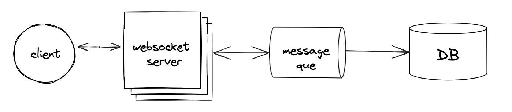
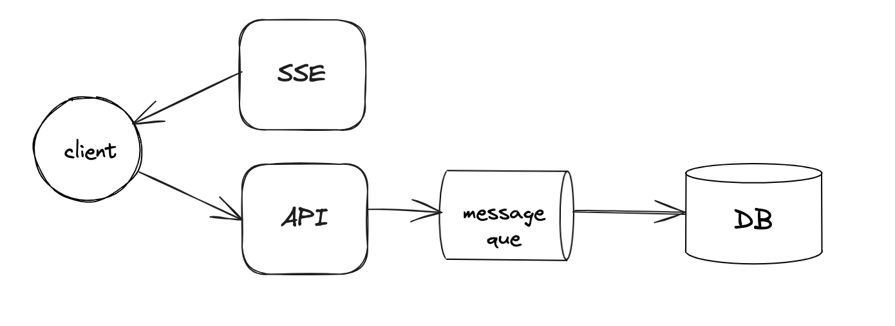

# 실시간 대시 보드 구현 (sse vs 웹소켓) - 1

## 1. 개요
회사에서 새롭게 들어갈 프로젝트 중에 다음과 같은 기능이 있다.  
* 발주자가 대시보드에 일감을 등록
* 수주자가 해당 대시보드를 보고 실시간으로 수락/거절  
(카카오 택시에서 손님이 배차 신청을 하고, 기사가 배차 수락을 하는 것과 정확히 같은 프로세스이다.)

처음에는 단순히 웹소켓 서버와 메시지 브로커를 넣고 구현하면 되겠다고 생각했는데,  
몇가지 고려 사항과 다른 아이디어가 떠올라서 검토해보게 되었다.  

## 2. 고려 사항
* 양방향 통신 필요이 필요하다.  
`대시보드 실시간 업데이트(서버 -> 클라이언트), 대시보드 응답(클라이언트 -> 서버)`
* DAU 가 높지 않다.  
`시스템 복잡도가 높으면 효율적이지 못할 것 같다.`
* latency는 중요하다.  
`실시간으로 응답할 수 있어야 한다.`
* 일부 유저에게만 이벤트가 전달 되야 하는 경우가 많다.(유니캐스팅)

## 3. 시스템 구성 후보

### 3-1. 폴링 방식
폴링 방식은 서버 리소스 측면을 제외하더라도 latency에서 꽝일 수 밖에 없기에 후보에서 애초에 제외되었다.  

### 3-2. 웹소켓

양방향 통신과 latency 측면에서 가장 먼저 떠올랐던 것은 웹소켓이다.  
사실 이 방법이 **가장 정답에 가깝다**고 생각한다.  
기본적으로 양방향 통신인데다,  
실시간 채팅이나 증권 시세 등에 사용되는 만큼 latency는 이미 검증 되어 있다.  

다만 웹소켓은 유니캐스팅까지 고려하면 구현하기 귀찮은 측면이 있다.  
또한 DAU가 높지 않은 서비스라 구성이 간단한 방법을 찾아 보게 되면서 아래의 방법을 떠올리게 되었다.  

### 3-3. SSE(Server Sent Events) + Rest api

(1) 서버 -> 클라이언트 통신을 SSE(Server Sent Events)로 구성하고,  
(2) 클라이언트 -> 서버를 별도의 API 를 통해 구현하는 방법이다.  

이 방법은 SSE의 단반향 통신을 별도의 API를 통해 보완하여 양방향을 구현할 수 있다.  
또한 SSE 또한 **http 방식이기 때문에 개인화된 데이터나 특정 수신자만을 대상으로 이벤트를 발생**시키기 용이하다.  

다만 아직 **검증되지 않은 것이 latency**에 대한 부분이다.  

---

다음편에서는 각각 웹소켓과, SSE방식으로 실시간 대시보드를 구현하여  
반응성이나 시스템 구성에 대한 것들,  
그리고 미처 고려 하지 못했던 변수들이 있는지 직접 테스트를 해보려 한다.  

To be Continued....

