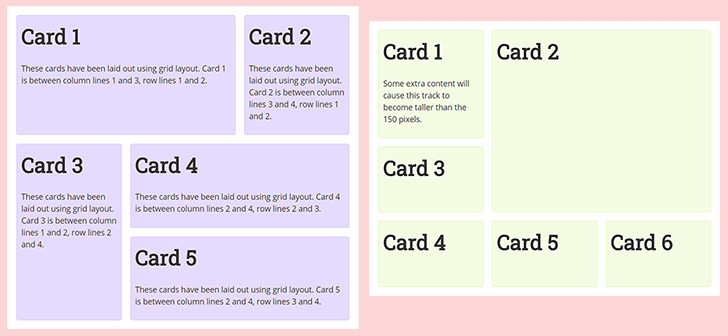
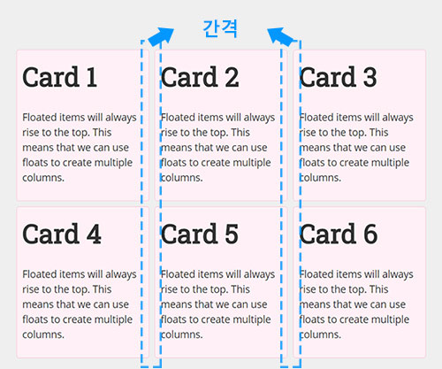
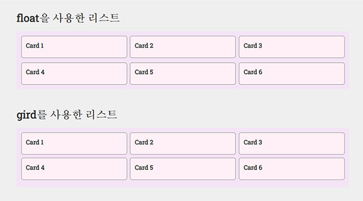
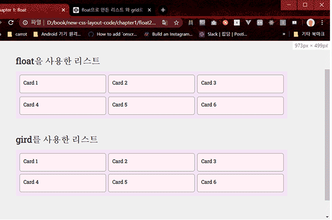

# 열과 행을 다룰 수 있는 2차원 레이아웃 display: grid

## 01.display:grid에 대해서 (grid 소개)

display: grid 라는 속성이 있습니다.

display: grid를 처음 접하는 사람들에게 쉽게 이해를 할 수 있게 좀더 직관 적으로 설명을 해보면 grid는 다음과 같은 장점들이 있습니다.

1. grid를 사용 하면 아래의 형태의 레이아웃을 고민 안하고 쉽게 만들 수 있습니다. 

2. 리스트 아이템 끼리 사이의 간격을 간단히 줄 수 있습니다. 

보충설명을 하면 일반적으로 위에 이미지처럼 간격이 있는 카드 리스트 형태의 레이아웃을 코딩을 하기 위해서는 list에 width 와 margin
값을 잰 후 입력 해죠야 합니다, 그리고 또 한번 margin에 -margin 처리를 해주어야 하는데, gird를 사용 하면 list에 width를 따로
입려 하지 않고 리스트에 간격과 width 비율만 입력 해주면 쉽고 간편히 만들 수 있습니다.

아래 css 소스에서 **float 리스트** 주석처리 부분과 **grid 리스트** 부분을 비교 해보면 **grid 리스트** 주석 처리된 css 라인이 더 짧은걸 볼 수 있습니다.

```css
<style>
  /* 스타일 공통 시작 */
  * {
    box-sizing: border-box;
    margin: 0;
    padding: 0;
  }
  body {
    background: #efefef;
  }
  ul {
    list-style: none;
  }
  .post-wrap {
    padding: 80px 100px;
  }
  .post-tit {
    font-size: 24px;
    margin-bottom: 10px;
  }
  .cards {
    padding: 0;
    list-style: none;
  }
  h2 {
    font-size: 14px;
  }
  .content-wrap {
    width: 100%;
    max-width: 754px;
    margin: 0 0 40px;
    padding: 10px;
    background: #f4e4f6;
  }
  .cards {
    overflow: hidden;
  }
  .cards li {
    background-color: #fff0f6;
    border: 1px solid #857e80;
    padding: 10px;
    border-radius: 5px;
  }
  /* 스타일 공통 끝 */
  /* float 리스트 */
  .cards--float {
    margin-top: -10px;
    margin-left: -7px;
  }
  .cards--float:after {
    content: "";
    clear: both;
    display: block;
  }
  .cards--float li {
    float: left;
    width: 240px;
    margin-left: 7px;
    margin-top: 10px;
  }

  /* grid 리스트 */
  .cards--grid {
    display: grid;
    grid-template-columns: 1fr 1fr 1fr;
    grid-gap: 7px;
  }
</style>
```

```html
<div class="post-wrap">
  <h2 class="post-tit">float을 사용한 리스트</h2>
  <div class="content-wrap">
    <ul class="cards cards--float">
      <li>
        <h2>Card 1</h2>
      </li>
      <li>
        <h2>Card 2</h2>
      </li>
      <li>
        <h2>Card 3</h2>
      </li>
      <li>
        <h2>Card 4</h2>
      </li>
      <li>
        <h2>Card 5</h2>
      </li>
      <li>
        <h2>Card 6</h2>
      </li>
    </ul>
  </div>
  <h2 class="post-tit">gird를 사용한 리스트</h2>
  <div class="content-wrap">
    <ul class="cards cards--grid">
      <li>
        <h2>Card 1</h2>
      </li>
      <li>
        <h2>Card 2</h2>
      </li>
      <li>
        <h2>Card 3</h2>
      </li>
      <li>
        <h2>Card 4</h2>
      </li>
      <li>
        <h2>Card 5</h2>
      </li>
      <li>
        <h2>Card 6</h2>
      </li>
    </ul>
  </div>
</div>
```



또 추가적으로 더 좋은 점은 아래의 이미지처럼 브라우저 창을 줄여도 자동으로
리스트의 width가 퍼센트(%)를 준것 처럼 브라우저 창에 반응 하는것을 볼 수 있습니다.  
물론 float으로 만든 리스트에 width를 퍼센트로 주면 되는데 그러면 리스트의 간격들의 값까지 포함하여 퍼센트값을 계산 해야 하기때문에 그런 번거로움이 있습니다.



<iframe height="323" style="width: 100%;" scrolling="no" title="float으로 만든 리스트 와 grid로 만드 리스트 css 비교" src="https://codepen.io/sanghwanAN/embed/BaoqGqz?height=323&theme-id=dark&default-tab=result" frameborder="no" allowtransparency="true" allowfullscreen="true">
  See the Pen <a href='https://codepen.io/sanghwanAN/pen/BaoqGqz'>float으로 만든 리스트 와 grid로 만드 리스트 css 비교</a> by sanghwanAN
  (<a href='https://codepen.io/sanghwanAN'>@sanghwanAN</a>) on <a href='https://codepen.io'>CodePen</a>.
</iframe>

아래 링크를 통해서 codepen에서도 확인 가능 합니다.  
[https://codepen.io/sanghwanAN/pen/BaoqGqz](https://codepen.io/sanghwanAN/pen/BaoqGqz)

지금 포스팅하는 내용은 그리드의 장점중 grid를 사용하면 편한 것에 중점을 두고 포스팅을 하였습니다.
좀 더 자세한 정보는 아래의 글에서 확인 할 수 있습니다.

[css-그리드-레이아웃을-지금-사용해도-정말-괜찮을까요](https://webactually.com/2017/11/css-%EA%B7%B8%EB%A6%AC%EB%93%9C-%EB%A0%88%EC%9D%B4%EC%95%84%EC%9B%83%EC%9D%84-%EC%A7%80%EA%B8%88-%EC%82%AC%EC%9A%A9%ED%95%B4%EB%8F%84-%EC%A0%95%EB%A7%90-%EA%B4%9C%EC%B0%AE%EC%9D%84%EA%B9%8C%EC%9A%94/)

저도 아직 grid의 속성 및 사용법에 대해서 다 숙지를 하지 못한 상태인데 grid에 대해서 하나씩 하나씩 포스팅을 하면서 grid를 숙달 할 계획 입니다.
