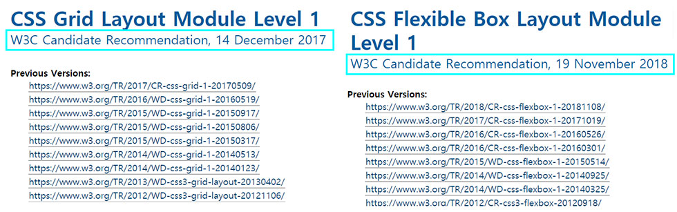
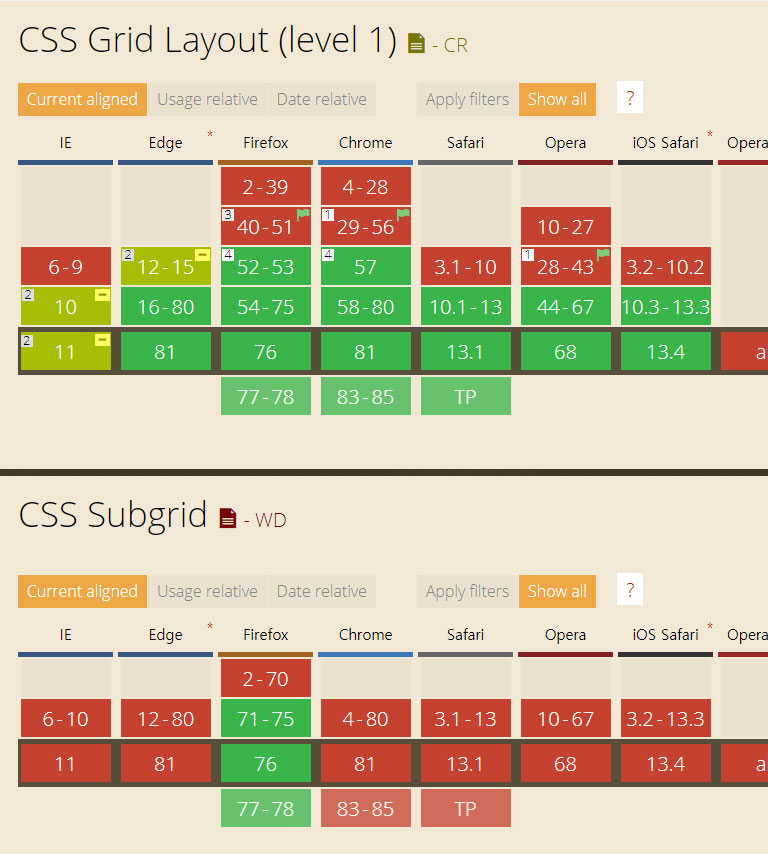

# 열과 행을 다룰 수 있는 2차원 레이아웃 display: grid

## 02.grid의 추가 정보

grid 속성에 대한 포스팅에 앞서 CSS 그리드 레이아웃은 2017년 3월에 크롬, 파이어폭스, 오페라, 사파리에 탑재되었습니다.

참고 site : <https://webactually.com/2017/11/css-그리드-레이아웃을-지금-사용해도-정말-괜찮을까요/>

그리고 번외로 **flex**와 **grid** 둘 중에 **어떤게 먼저** 나왔는지 궁금해 하시는 분들도 있을것 같아서 **w3c**에 확인을 해봤는데 자세한 내용은 아래와 같습니다.

[w3c-플렉스](https://www.w3.org/TR/css-flexbox-1/)  

[w3c-그리드](https://www.w3.org/TR/css-grid-1/)  

**grid**가 flex 보다 먼저 **Recommendation을 공개** 하였네요.

W3C 표준화 제정 단계 보는 법은 아래의 블로그를 참고 바랍니다.

[WIT블로그-W3C 표준화 제정 단계 보는 법](https://wit.nts-corp.com/2013/10/16/280)  

## 03.grid 브라우저 지원

브라우저 지원은 can i use에서 확인을 해보면 **지금 포스팅을 하는 시점**에서는
다음과 같습니다.  
(주요 브라우저만 캡쳐 하였고 더 자세히 알고 싶으시면 **can i use** : <https://caniuse.com/#search=grid/> 에서 확인 할 수 있습니다.)

css Grid Layout(level1)은 ie10, ie11 브라우저에서도 사용 가능 하다고 나오네요,

그러면 **익스플로러 10 이하를 맞추지 않는 웹 프로젝트에서는 grid를 사용 할 수 있다라는 결론을 내릴 수 있습니다.** 저의 경험상 작년 부터 참여한 신규 구축 프로젝트들은 보통 익스플로러 10 이상 부터 맞추었기 때문에 요새는 충분히 신규 웹사이트 구축시 grid를 사용 할 수 있다고 봅니다. 그래서 조금이라도 빨리 grid 사용법을 숙달 해야 할 필요성이 있다고 생각합니다.

**ie** 브라우저에서 grid를 적용 하게 하려면 **-ms-** 벤더 프리픽스(**vendor prefix**)를 사용해야 하고 grid 관련 속성중에 일부는 **-ms-** 벤더 프리픽스를 지원 안하는 속성도 있는대 이 부분에 대해서는 grid 사용법까지 포스팅이 끝나면 정리를 해 보겠습니다.

## 03.Subgrid 에대해서

윗 글에서 can i use 캡쳐 화면 중에 Subgrid 지원 브라우저 캡쳐 화면이 있는데, Subgrid가 무엇인지 몰라서 검색을 해 봤습니다. 몰랐던 분들도 이번기회에 grid 관련 용어를 알고 있어도 좋을 것 같습니다.

저는 subgrid에 대해서 직관적으로 읽으면 바로 이해 하는 것에 목적을 두고 포스팅을 하겠습니다.  
추가적으로 css 레벨(버젼)에 대한 정보나 subgrid에 대한 기능과 자세한 정보를 확인 하시려면 아래에 사이트를 추천 합니다.

[Subgrid 참고 사이트1 - CSS 그리드 레벨2: 서브그리드](https://webactually.com/2018/08/css-그리드-레벨2-서브그리드-2/)  

[Subgrid 참고 사이트2 - MDN](https://developer.mozilla.org/en-US/docs/Web/CSS/grid-column/) 

**요점**만 말하면 **Subgrid는 grid에 새로운 기능** 입니다.

현재 웹브라우저에서 사용 할 수 있는 그리드 기능은 CSS [그리드 명세 레벨1](https://www.w3.org/TR/css-grid-1/#intro)에 기반 합니다.

새로 만들어진 기능은 해당 명세의 다음 레벨에 포함됩니다.
CSS 그리드 레이아웃이 바로 이 단계에 있고, 레벨1 명세는 후보 권고안 상태이기 때문에 작업 중인 새 기능을 추가하기 위해 레벨2 명세를 만들었습니다.
Subgrid에 대한 설명을 계속 보고 있지만 예제가 브라우저에서 실행이 되지 않아서 글만 보고 이해 하기 힘든 부분이 있는대요, MDN에 나온 Subgrid 소개에는

>" grid-template-columns: subgrid중첩 그리드 를 사용 하고 부모의 세 열 트랙에 걸쳐있는 경우 중첩 그리드는 부모 그리드와 동일한 크기의 세 열 트랙을 갖습니다. 간격은 상속되지만 다른 gap값 으로 재정의 할 수도 있습니다 . 줄 이름은 부모에서 하위 표로 전달 될 수 있으며 하위 표는 자체 줄 이름을 선언 할 수도 있습니다"

이 구절이 아직 이해가 되지 않습니다.

시간이 지나서 grid에 대한 사용법 포스팅을 하고 어느정도 이해를 하게되면 그때 즘이면 다시 이해가 될거라 생각이 드는데요, 그러면 그때즘에 다시 Subgrid에 대해서 다시한번 집고 넘어가겠습니다.

다음주에는 grid에 대한 사용법과 기본적으로 알아야할 속성들을 찾아서 정리 해보겠습니다.

감사합니다..
