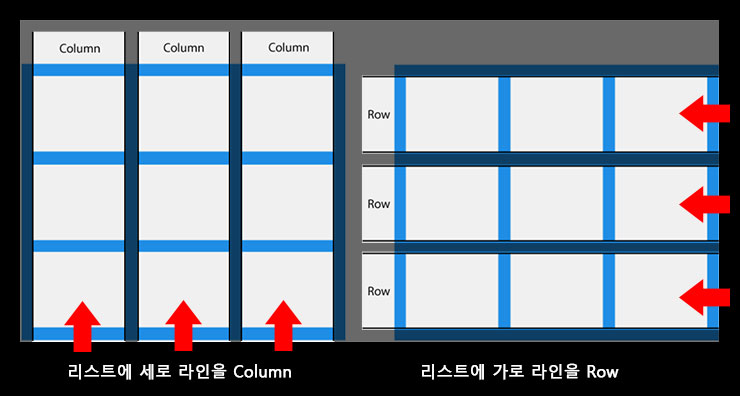
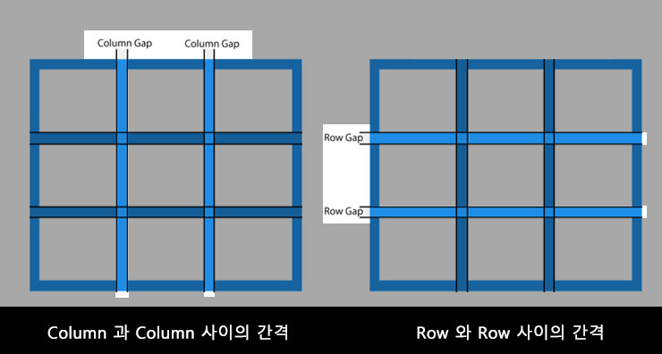
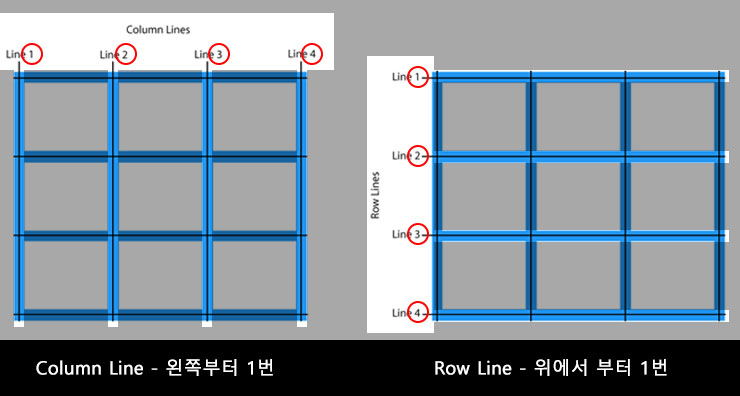

# 열과 행을 다룰 수 있는 2차원 레이아웃 display: grid
## 04.grid 용어정리 

먼저 grid 속성에 관련된 기본적인 용어부터 정리를 하겠습니다.  
[w3schools-그리드](https://www.w3schools.com/css/css_grid.asp) 의 내용 입니다.

용어를 알아야 하는 이유는 관련 용어를 컨트롤 하기 위해서는 용어에 관련된 grid 속성을 알아야 하기 때문 입니다.

### Columns & Rows
grid의 기본 Coloumn 과 Row에 대해서 알아보겠습니다.  
아래의 3행 3열의 리스트 이미지가 있습니다.
  

리스트에서 **세로로 리스트 아이템들**을 **Coloumn** 이라 하고 **가로 리스트 아이템들**을 **Row** 라고 합니다.

### Gaps
Gap 이라는 것이 있는데, 아래의 이미지를 보면 아시겠지만  
  

Coloumn 과 Coloumn 사이의 간격을 **Coloumn Gap**이라 하고 Row 와 Row 사이의 간격을 **Row Gap** 이라 합니다.
Css로  **Coloumn Gap** 과 **Row Gap**의 간격 크기를 컨트롤 할 수 있습니다.  
관련 css 속성은 **grid-column-gap**, **grid-row-gap**, **grid-gap** 이 있습니다.  
관련 예제는 아래의 링크를 확인 부탁 드립니다.  

[w3schools : grid-column-gap 예제 보기](https://www.w3schools.com/css/tryit.asp?filename=trycss_grid_grid-column-gap )  
[w3schools : grid-row-gap 예제 보기](https://www.w3schools.com/css/tryit.asp?filename=trycss_grid_grid-row-gap)  
[w3schools : grid-gap 예제 보기](https://www.w3schools.com/css/tryit.asp?filename=trycss_grid_grid-gap2)

### Lines
Grid에 **Line**이라는 것이 있는대, 각 Line에는 순서가 있습니다.
순서는 아래의 이미지를 보면 확인 할 수 있습니다.  
  

당연히 **Coloumn Line** 과 **Row Line** 이 있는대요, 위 이미지를 보면 알겠지만  **Coloumn Line** 은 **column 시작점인 왼쪽** 부터
**1번**이 되고  **Row Line**은 **Row 시작점인 위에서** 부터 **1번**이 됩니다.  
**Grid Line**을 기준으로 **그리드 아이템**을 **배치** 할 수 가 있는대,   
관련 css 속성은 **grid-column-start**, **grid-column-end**, **grid-row-start**, **grid-row-end** 이 있습니다.  
관련 예제는 아래의 링크를 확인 부탁 드립니다.  

[w3schools : grid-column-Line 예제 보기](https://www.w3schools.com/css/tryit.asp?filename=trycss_grid_lines)  
[w3schools : grid-row-Line 예제 보기](https://www.w3schools.com/css/tryit.asp?filename=trycss_grid_lines2)  

