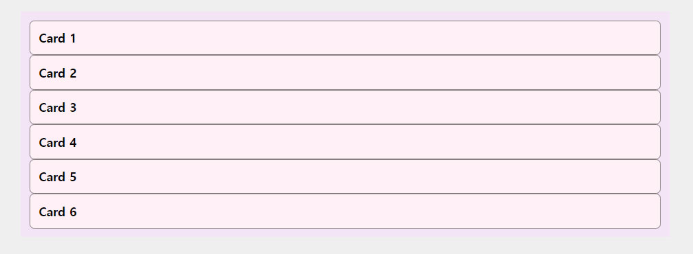

# 열과 행을 다룰 수 있는 2차원 레이아웃 display: grid

## 05.grid 로 리스트 배열 해보기

[MDN](https://developer.mozilla.org/en-US/docs/Web/CSS/grid) 과 [w3schools](https://www.w3schools.com/css/css_grid_container.asp) 에서 grid 관련 속성이랑 속성값들을 천천히 보고 있는데,
속성들이 많기도 하고 속성값들도 생소한 것들이 많아서 어떤식으로 어떻게 포스팅을 해야할지 고민을 하다가 [MDN](https://developer.mozilla.org/en-US/docs/Web/CSS/grid) 과 [w3schools](https://www.w3schools.com/css/css_grid_container.asp)에 내용을 전부는 아니고 일부를 정리를 해 보려 합니다.

먼저 마크업과 css 스타일은 아래과 같습니다.  
마크업과 css 예제 소스는 [책 - 새로운 css 레이아웃](http://www.kyobobook.co.kr/product/detailViewKor.laf?ejkGb=KOR&mallGb=KOR&barcode=9791185885223&orderClick=LEa&Kc=) 의 예제 소스를 포스팅용에 맞추어 일부 수정 하여 사용하고 있습니다.

```css
* {
  box-sizing: border-box;
  margin: 0;
  padding: 0;
}
body {
  background: #efefef;
}
ul {
  list-style: none;
}
.post-wrap {
  padding: 80px 100px;
}
.content-wrap {
  width: 100%;
  max-width: 754px;
  margin: 0 0 40px;
  padding: 10px;
  background: #f4e4f6;
}
.cards {
  overflow: hidden;
  padding: 0;
  list-style: none;
}
.cards li {
  background-color: #fff0f6;
  border: 1px solid #857e80;
  padding: 10px;
  border-radius: 5px;
}
.cards__tit {
  font-size: 14px;
}
```

```html
<div class="post-wrap">
  <div class="content-wrap">
    <!-- 그리스 리스트 시작 -->
    <ul class="cards cards--grid">
      <li>
        <h3 class="cards__tit">Card 1</h3>
      </li>
      <li>
        <h3 class="cards__tit">Card 2</h3>
      </li>
      <li>
        <h3 class="cards__tit">Card 3</h3>
      </li>
      <li>
        <h3 class="cards__tit">Card 4</h3>
      </li>
      <li>
        <h3 class="cards__tit">Card 5</h3>
      </li>
      <li>
        <h3 class="cards__tit">Card 6</h3>
      </li>
    </ul>
    <!-- //그리스 리스트 끝 -->
  </div>
</div>
```



[코드펜-gird예제(html,css)](https://codepen.io/sanghwanAN/pen/mdVwxLK)

### 1. 리스트들의 부모 요소를 Grid Container로 만든다.

먼저 리스트를 배열 하려면 리스트를 감싸고 있는 **부모 요소**에 **display: gird**를 적용하여 부모 요소를 **Grid Container**로 만듭니다.  
**Grid Container**는 grid 레이아웃을 사용 할때 display:grid를 적용하는 대상을 부르는 명칭으로 이해 하면 될 것 같은데요,
왜 이름이 **Grid Container**라고 물어보면 저는 모르겠지만 **w3.org** 에 정의 되어져 있는대요, 내용이 많은 관계로 [w3.org : grid-container](https://www.w3.org/TR/css-grid-1/#grid-container) 여기에서 관련 정의와 추가 정보를 확인 부탁 드립니다.(그리드 컨테이너 사용시 주의점?등을 알 수 있습니다.)

### 2. 몇 행 몇 열을 만들건지 정의 합니다.

몇 행 몇 열을 만들고 배치는 어떻게 하고 리스트들의 간격도 정의 하고 width, height도 정의를 할 수 있는데요,
방법이 많아서 어디서부터 어떻게 포스팅을 해야하는지 고민이 되는대요, 그래서  
이부분은 한 주간에 더 공부하고 고민 하고 포스팅을 하겠습니다.
