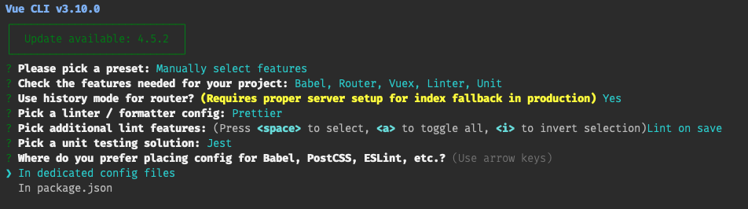

# Vue에서 Unit Test(단위테스트)를 해보자.

## 개요

- `vue`를 통해 `unit test`를 살펴보자.
- `vue-test-utils`,`jest`를 사용할 예정이다.
- 테스트를 하는 이유는 자신감 증가, 퀄리티있는 코드, 잘 정리된 문서를 꼽을 수 있다.

## 테스트를 위한 세팅

- 터미널에서 아래 명령어를 입력 후 사진과 같이 설정한다.
  
``` javascript
vue create unit-testing-vue
```



- 설치가 되고 `package.json`파일을 열면 아래 코드가 있는데 이걸로 테스트를 한다.

``` javascript
"scripts": {
  ...
  "test:unit": "vue-cli-service test:unit"
},
```

``` javascript
npm run test:unit
```

- `tests/unit` 폴더에 테스트할 파일을 넣는다.

## 첫번째 유닛 테스트(Data 업데이트 될때 UI 변경)

- 로그인 상태일때 로그아웃 버튼이 보이는지 테스트 해보자.
- 우선 `AppHeader` 컴포넌트와 `AppHeader.spec.js` 테스트 파일을 만들자.

``` javascript
// components/AppHeader.vue
<template>
  <div>
    <button v-show="loggedIn">로그아웃</button>
  </div>
</template>

<script>
export default {
  data() {
    return {
      loggedIn: false
    }
  }
}
</script>
```

``` javascript
// tests/unit/AppHeader.spec.js
import AppHeader from "@/components/AppHeader";
import { mount } from "@vue/test-utils";

describe("AppHeader", () => {
  it("로그인 상태가 아니면, 로그아웃 버튼이 보이지 않는다.", () => {
    const wrapper = mount(AppHeader);
    expect(wrapper.find("button").isVisible()).toBe(false);
  });

  test("로그인 상태면, 로그아웃 버튼이 보인다.", async () => {
    const wrapper = mount(AppHeader);
    wrapper.setData({
      loggedIn: true,
    });

    await wrapper.vm.$nextTick();
    expect(wrapper.find("button").isVisible()).toBe(true);
  });
});
```

- `describe`는 테스트를 그룹으로 묶는 역할을 하고, 테스트를 실행하게 되면 `AppHeader`를 콘솔에 보여준다.
- `test()`는 `jest` 메서드이다. 테스트할 내용을 텍스트로 적고, 그 함수안에 테스트 로직을 작성한다. `it()` 사용해도 된다.
- 우리가 기대하는 값이 테스트 잘 되는지 확인을 하기위해서 `assertion`를 사용한다.
  -`assertion` : 주장? 확인?
- 여기서는 `jest`에서 제공하는 `expect` 메서드를 사용한다. 이 메서드는 결과값이 제대로 리턴되었는지 확인할때 도움을 주는 `matchers(여기선 toBe)`에 접근이 가능하다.
- [Jest Matchers API](https://jestjs.io/docs/en/expect)

``` javascript
expect(theResult).toBe(true)
// theResult값이 true인지 확인
```

- `const wrapper = mount(AppHeader);` `AppHeader` 마운트된 컴포넌트를 `wrapper`에 할당한다.
- `wrapper`는 마운트 하는 역할뿐 아니라, 속성, 컴포넌트를 테스트하는 메서드들은 가지고 있다.
- [vue-test-utils : wrapper](https://vue-test-utils.vuejs.org/api/wrapper/)

``` javascript
wrapper.setData({
  loggedIn: true,
});
```

- `wrapper` 내장메서드는 `setData()`를 통해 테스트 시나리오에 맞게 데이터를 변경할 수 있다.
- 데이터를 변경하고 실행하면 에러가 난다. 데이터를 변경하게되면 `DOM` 업데이트가 발생하는데 이걸 기다려야 제대로 된 결과값을 얻을 수 있다.
- 그러기 위해서 테스트 비동기식으로 변경한다.


``` javascript
test("로그인 상태면, 로그아웃 버튼이 보인다.", async () => {
  ...
  await wrapper.vm.$nextTick();
  expect(wrapper.find("button").isVisible()).toBe(true);
```

- `async`, `await`, `$nextTick()` 사용
- `$nextTick()` 이란?
  - Vue는 데이터 변경시 DOM을 비동기로 업데이트한다. 따라서 DOM에 업데이트 되기전에 접근할때 에러가 발생한다.
  - `$nextTick()`을 사용하면 DOM 업데이트를 기다린 뒤 콜백함수를 실행시켜 데이터에 접근이 가능하다.
  - [Vue 공식 홈페이지 참고](https://kr.vuejs.org/v2/api/#Vue-nextTick)

## 두번째 유닛 테스트(Props와 함께 유져 인터렉션 테스트)

- 유져가 클릭했을때 이벤트가 실행되고 그 결과값을 테스트 한다.
- `min`,`max` `props` 값을 받아 최소값, 최대값을 지정하고 그 사이에 있는 임의의 수를 얻는다.

``` javascript
// components/RandomNumber.vue
<template>
  <div>
    <span>{{ randomNumber }}</span>
    <button @click="getRandomNumber">Generate Random Number</button>
  </div>
</template>

<script>
export default {
  props: {
    min: {
      type: Number,
      default: 1
    },
    max: {
      type: Number,
      default: 10
    }
  },
  data() {
    return {
      randomNumber: 0
    }
  },
  methods: {
    getRandomNumber() {
      this.randomNumber = Math.floor(Math.random() * (this.max - this.min + 1) ) + this.min;
    }
  }
}
</script>
```

- 아래와 같이 3가지를 테스트 해보자.

``` javascript
// tests/unit/RandomNumber.spec.js
import { mount } from '@vue/test-utils'
import RandomNumber from '@/components/RandomNumber'

describe('RandomNumber', () => {
  test('기본값으로, randomNumber data 값은 0이어야 한다.', () => {
    const wrapper = mount(RandomNumber)
    expect(wrapper.html()).toContain('<span>0</span>')
  })

  test('버튼을 클릭했을때, randomNumber는 1~10 사이에 위치한 숫자여야 한다.', () => {
    const wrapper = mount(RandomNumber)
    wrapper.find('button').trigger('click') // 버튼을 찾아서 이벤트를 발동
    await wrapper.vm.$nextTick() // 비동기로 DOM이 업데이트 될떄까지 기다린다.
    const randomNumber = parseInt(wrapper.find('span').element.textContent) // 랜덤값

    expect(randomNumber).toBeGreaterThanOrEqual(1) // matchers를 이용해 1보다 큰지
    expect(randomNumber).toBeLessThanOrEqual(10) // matchers를 이용해 10보다 작은지
  })

  test('버튼을 클릭했을때, randomNumber는 200~300 사이에 위치한 숫자여야 한다.', () => {
    const wrapper = mount(RandomNumber, {
      propsData: {
        min: 200,
        max: 300
      }
    })

    wrapper.find('button').trigger('click')
    await wrapper.vm.$nextTick() 

    const randomNumber = parseInt(wrapper.find('span').element.textContent)
    expect(randomNumber).toBeGreaterThanOrEqual(200)
    expect(randomNumber).toBeLessThanOrEqual(300)
  })
})
```

- 마지막 테스트에서 `propsData`가 등장했다. 첫번째 테스트에서는 데이터를 조작했지만 이번 테스트에서는 `propsData`를 사용해 `props`를 조작했다.
- `1~10`에서는 `props`를 별도로 설정하지 않아 `default`값을 설정되어 있었다.

## 결론

- 테스트를 하기위해서는 먼저 테스트할 조건을 적어놓고 통과되지 않게 `assertion`를 통해 작성한다. 무조건 실패!
- 그 다음 성공시키기 위해 테스트코드를 작성한다.
- `nextTick()`를 이용해 DOM업데이트를 기다리는것이 포인트이다.